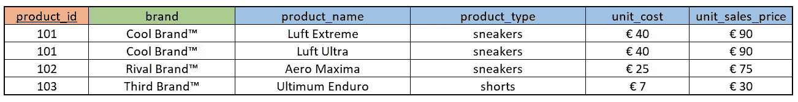
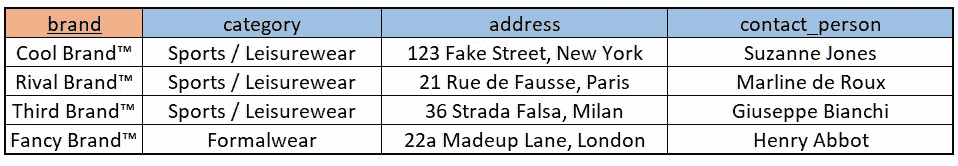
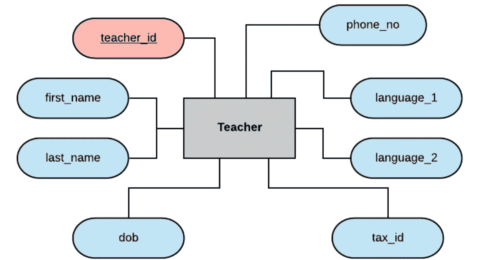
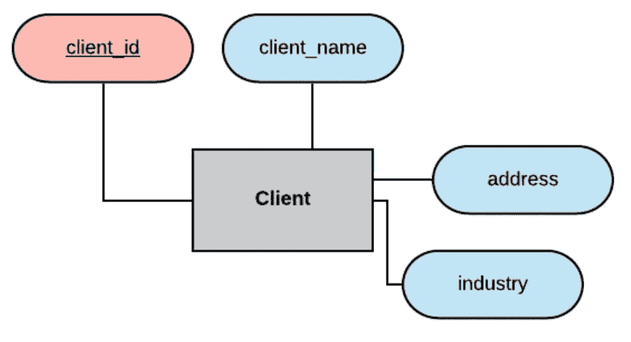
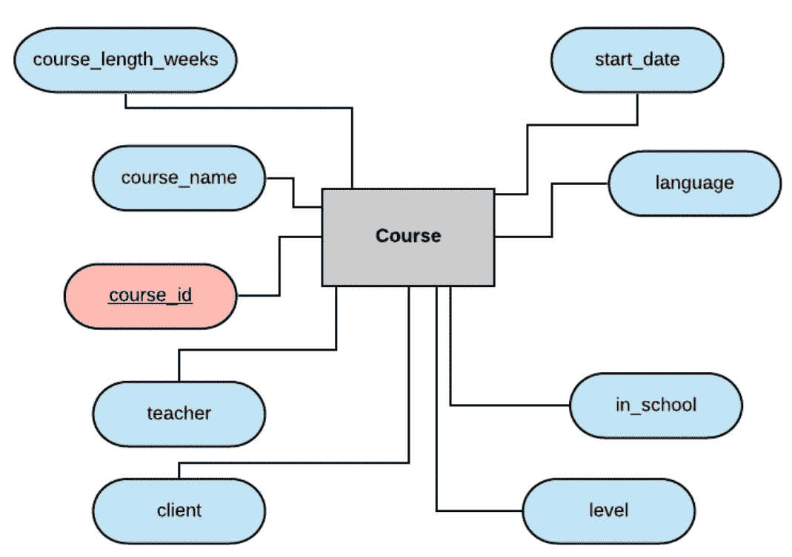
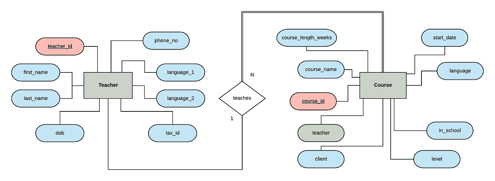
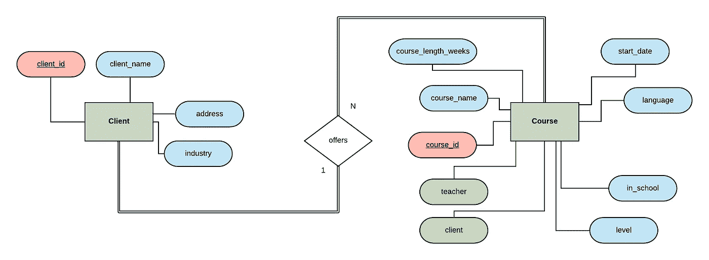
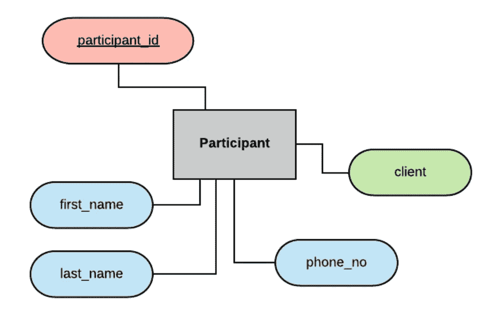

# 设计关系数据库并创建实体关系图

> 原文：<https://towardsdatascience.com/designing-a-relational-database-and-creating-an-entity-relationship-diagram-89c1c19320b2?source=collection_archive---------1----------------------->

## 【Craig Dickson 的 SQL 教程

## 学习使用 SQL 和免费开源软件创建、更新和查询您自己的全功能关系数据库—第 1 部分

图片由[麦克默里朱莉](https://pixabay.com/users/mcmurryjulie-2375405/?utm_source=link-attribution&amp;utm_medium=referral&amp;utm_campaign=image&amp;utm_content=1895779)从[皮克斯拜](https://pixabay.com/?utm_source=link-attribution&amp;utm_medium=referral&amp;utm_campaign=image&amp;utm_content=1895779) | [领证](https://pixabay.com/service/license/)

*这是由 3 部分组成的系列文章的第 1 部分，从零开始，带您了解设计、编码、实现和查询关系数据库的过程。参见第 2 部分(使用 MySQL 编码和实现关系数据库)* [*此处*](https://medium.com/@thecraigdickson/coding-and-implementing-a-relational-database-using-mysql-d9bc69be90f5) *，以及第 3 部分(MySQL 中的数据分析—关系数据库中的运算符、连接等)* [*此处*](https://medium.com/@thecraigdickson/querying-a-relational-database-joins-unions-and-more-26c0a968e61e) *。*

*本教程的所有代码和信息都可以在相关的* [*GitHub 资源库*](https://github.com/thecraigd/SQL_School_Tutorial) *中找到。我使用了*[*lucid chart*](https://www.lucidchart.com/pages/)*来制作文章中显示的图表。*

当我第一次开始在工作中使用数据库和编写 SQL 查询时，我总是有点害怕会不小心删除我公司所依赖的所有生产数据。因此，我对自己做了哪些查询和做了什么非常犹豫。随着时间的推移，我学到了更多关于如何使用不同的[风格的](/the-many-flavours-of-sql-7b7da5d56c1e)的[结构化查询语言](https://en.wikipedia.org/wiki/SQL) (SQL 对它的朋友来说)。

在这一系列文章中，我将分享我所学到的知识，从头开始讲述使用 MySQL(和 MySQL 服务器)创建关系数据库的过程，并希望在开始构建自己的数据库的过程中能够充分阐明一些事情，并确信不会意外删除所有数据！

我们首先来看看关系数据库到底是什么以及它是如何工作的，然后浏览构建一个关系数据库的过程，从思考我们希望数据库做什么(或者从同事或客户那里收到解释他们希望它做什么的需求)，到规划表及其关系，到[编写 SQL 代码](https://medium.com/@thecraigdickson/coding-and-implementing-a-relational-database-using-mysql-d9bc69be90f5)来创建和填充数据库本身。最后，我们将[在编写查询](https://medium.com/@thecraigdickson/data-analysis-in-mysql-operators-joins-and-more-in-relational-databases-26c0a968e61e)时获得一些乐趣！

## 什么是关系数据库？

根据[甲骨文](https://www.oracle.com/database/what-is-a-relational-database/)的说法，关系数据库是“一种[数据库](https://www.oracle.com/database/what-is-database.html)，它存储并提供对彼此相关的数据点的访问”。好，听起来不错！

我们可以使用关系数据库管理系统( [RDBMS](https://techterms.com/definition/rdbms) )在我们的关系数据库中[创建、读取、更新和删除](https://en.wikipedia.org/wiki/Create,_read,_update_and_delete)(任何数据库的基本功能)信息。RDBMSs 例子包括 [Oracle](https://www.oracle.com/database/) 、[微软 SQl Server](https://www.microsoft.com/en-gb/sql-server) 、 [MySQL](https://www.mysql.com/) 和 [PostgreSQL](https://www.oracle.com/database/what-is-a-relational-database/) 等等。每一种都有其优点和缺点(就像任何与编码相关的东西一样，它们的在线超级支持者)，并且 SQL 在每一种中的实现方式都不完全相同。概念是相同的，但是[语法](https://www.w3schools.com/sql/sql_syntax.asp)和[关键字](https://www.w3schools.com/sql/sql_ref_keywords.asp)可能略有不同，因此通常不太可能在不做一些修改的情况下使用为 Microsoft SQL Server 中的 PostgreSQL 编写的 SQL 代码。

我们将使用 [MySQL 社区服务器](https://dev.mysql.com/downloads/mysql/)，因为它是免费的、强大的和开源的，但是其他的也是不错的选择。

在关系数据库中，记录存储在表格中(如果你熟悉 Excel 电子表格的话，可以想一想)，其中每一列是一个属性(如产品名称、购买成本、零售价格)，每一行代表一个记录(T21)。

例如，类似这样的事情

在这个非常简单的商店示例中，“product_id”、“brand”、“product_name”、“unit_cost”和“unit_sales_price”都是属性，每一行都是特定产品的记录(“酷品牌**Luft Extreme 运动鞋”、“竞争品牌**Aero Maxima 运动鞋”等)。****

## ****主关键字****

****这里的每个产品都有一个“产品 id”字段，在上图中显示为红色。这就是所谓的“[主键](https://en.wikipedia.org/wiki/Primary_key)”。数据库中每个表中的每条记录都必须有一个唯一标识它的属性(或属性组合)，这就是所谓的主键。****

****在我们的例子中，一个任意的“product_id”被分配给每个记录。还可以使用由例如“产品名称”和“产品类型”属性组成的“[组合键](https://www.javatpoint.com/sql-composite-key)，假设这些属性唯一地标识一个产品(即，酷品牌**等从不发布另一个同名产品)。使用哪一个取决于数据的性质——重要的是每个表都有一个主键，它必须是唯一的，并且不能为空。******

****让关系数据库*成为关系数据库*的是，您可能不会惊讶地了解到，存储在表中的数据之间的*关系*。例如，连接到我们上面的产品表，我们可能有一个进一步的表，其中包含我们商店中销售的所有品牌的所有详细信息。****

********

****现在我们有两个表，每个表对应一个特定的[实体](https://en.wikipedia.org/wiki/Entity%E2%80%93relationship_model)——我们店里销售的产品，以及生产这些产品的品牌。在我们的品牌表中，品牌名称是主键——每条记录的唯一标识符。****

## ****外键****

****我们可以通过将品牌数据库中的主键作为“外键”包含在产品数据库中来表达这些实体之间的关系(在这种情况下，品牌是产品的生产者)。这意味着每个产品都可以与我们数据库中的适当品牌相关联。****

****这非常有用，因为这意味着这些表格以一种有意义的方式联系在一起，例如，我们可以很容易地找到负责“Luft Extreme 运动鞋”的联系人的姓名。在本系列的后面，我们将看看如何使用 SQL 代码[来实现这一点。](https://medium.com/@thecraigdickson/data-analysis-in-mysql-operators-joins-and-more-in-relational-databases-26c0a968e61e)****

****在我们的示例中，我们可以让 products 表中的 brand 属性作为外键来存储这两个表之间的关系。****

****在这种情况下，有可能(事实上很有可能)每个品牌都有多个相关产品。也有可能每个产品都与一个*和一个*品牌相关联(这里我们将忽略[跨品牌协作](https://www.highsnobiety.com/p/supreme-air-jordan-5-official-release/))。这意味着我们在这些实体之间有 1 对 N 的关系——一个品牌可能有 N 个产品与之相关联(N 只是表示任何数字)，一个产品可能有 1 个品牌与之相关联。****

****关系的这个属性，一个实体可以与多少个其他实体有关系，被称为关系的[基数](https://en.wikipedia.org/wiki/Cardinality_(data_modeling))。其他关系还有 [1 对 1](https://mkyong.com/mysql/how-to-define-one-to-one-relationship-in-mysql/) 和 [N 对 M](http://www.phpknowhow.com/mysql/many-to-many-relationships/) (多对多)。我们稍后将讨论这些。****

****因为每个产品可以有且只有一个品牌，所以将该品牌的唯一标识符(在我们的例子中，品牌名称)存储为该产品的属性是非常合理的。这意味着当我们想要查找存储在品牌表中与特定产品相关的信息时，我们可以很容易地使用品牌列(Cool Brand**、Rival Brand 等)的值来“查找”品牌表中的相关信息。******

******通过这种方式，product 表中的 brand 列可以说是打开其他(“foreign”)表中信息的“钥匙”。******

******如果我们试图将产品的键存储在 brand 表上，我们必须为每个产品都有一条记录——这使得数据分离毫无意义，并在数据库中产生了不必要的冗余。这就是我们将外键存储在 1 对 N 关系的 N 端的表上的原因。******

******我们的数据库可能会变得非常复杂，因为我们开始拥有多个彼此具有不同关系的表，但是这里需要关注的基本原则是:******

*   ******每个表都有一个唯一标识表中每个记录的主键，并且不能为空。******
*   ******对于表 A 与另一个表的每个关系，它需要一个外键作为表 A 中的属性来定义该关系。******

******这就是我们如何定义关系数据库中 1 对 N 关系中的数据之间的关系。******

# ******设计数据库******

******一如既往，它将帮助我们在这里浏览一个真实的例子。让我们根据自己的需求设计一个数据库吧！******

## ******定义需求******

******创建数据库时首先要考虑的是我们想要它做什么。这似乎是显而易见的，但值得明确说明。不同的需求将导致不同的信息结构、关系、设计和实现。******

******同样重要的是要注意，相同的需求可以通过不同的设计和实现来成功地满足，并且不总是有一个最佳的实现来解决特定的问题。肯定有比其他解决方案更好和更差的解决方案，但是我将把这些争论留给[堆栈溢出](https://stackoverflow.com/)上的线程！******

******那么我们的用例是什么呢？我们将为德国柏林的一所语言学校创建一个相对简单的数据库。我在柏林当了一段时间的英语教师，所以这是一个让我很感兴趣的例子。而且你知道他们说什么， [*写你知道的*](https://www.nytimes.com/2014/03/30/books/review/write-what-you-know-helpful-advice-or-idle-cliche.html) *。*******

******写下您的需求是一个好主意，或者如果您正在为客户工作或创建一个数据库供公司的另一个部门使用，请从数据库的最终用户那里获得书面形式的需求。******

******他们想存储什么信息？我们需要为哪些类型的实体创建表(客户、订单、产品、课程、网站点击、数据下载等)？正如任何利用数据的事情一样，为了使我们的工作最有效，我们需要考虑用例是什么，我们的用户在寻找什么。******

******下面是我们的示例数据库的要求:******

> ******国际语言学校是一所语言培训学校。******
> 
> ******它为公司客户提供语言课程，可以根据客户的喜好在学校或办公室进行。学校雇佣教师，每个教师可以教授多门课程。******
> 
> ******学校有客户，每个客户都可以通过学校提供多门课程。客户向他们的员工提供课程，员工可以选择参加。******
> 
> ******每个课程由一个客户提供。每门课在任何时候都有一个老师。******
> 
> ******课程的参与者是客户公司的雇员，即他们为客户公司工作。每个参与者一次只能被一家公司雇用。参与者可以注册一门以上的课程。******

******请记住，真正的需求文档可能会比这更长更复杂，但这份文档将为我们提供构建示例数据库所需的信息。******

# ******根据需求制定计划******

******首先要做的是仔细阅读需求文档，记下可能成为我们数据库中实体的东西，以及它们之间可能的关系。******

******在这个阶段，提出问题以阐明需求是很重要的。对于每天与某些东西打交道的人来说，很自然地会认为某些事情是“常识”或显而易见的，而对于来自工作领域之外的人来说，这些事情可能并不明显。此外，人们有时可能不习惯以创建数据库所必需的严谨性来考虑他们工作的这些方面。******

******这就是我们软技能的用武之地，促进技术型和非技术型员工之间清晰沟通的能力是最有价值的。我们*真的*不想花很多时间设计、编码和实现一个巨大的数据库，却发现我们假设每个参与者只能选一门课，而事实上他们可以选多门课。规划很重要！******

******在获取需求和用 SQL 实现我们的数据库之间的一个非常有用的中间步骤是创建一个[实体关系图](https://www.lucidchart.com/pages/er-diagrams) (ERD)。正如您所预料的，这是一个图表，它映射了我们将构建到数据库中的实体之间的关系。将此图表放在一起的过程可以帮助我们理顺关系，并在过程中识别重要的见解或冗余属性。******

******有些人可能会跳过这一步，直接进行编码，但是创建一个 ERD 来确保我们在构建数据库本身之前已经计划好了一切，这是最佳实践，也是强烈推荐的。******

## ******识别实体******

******让我们检查一下需求，看看我们是否能够识别我们的实体。这些通常是人、事物、事件或地点。******

******只要看一下需求文档的第一段，我们就可以看到客户、办公地点、教师和课程是我们数据库的可能实体。文件的其余部分向我们提供了关于这些实体之间关系的各种信息，还提到了参与者(客户的雇员，但从学校的角度来看，这些是语言课程的参与者)。******

******所以我们有候选实体:******

*   ******客户******
*   ******办公地点******
*   ******教师******
*   ******课程******
*   ******参与者******

******这些都很重要，我们必须在数据库中处理每一个。出于本文的考虑，我将做一个简化的假设，即每个客户有一个办公室，课程在那里进行(如果它们不在学校本身进行)。在现实生活中，一个客户可能有多个办公室，或者他们可能有一个大型设施，在多个地点开设不同的课程。我们可以使用 RDBMS 轻松地处理这个问题，但是为了降低复杂性，我们将假设每个客户端都有一个存放它们的类的位置。******

******这意味着我们将为以下实体创建表格:客户、教师、课程和参与者。好东西！******

## ******我们想要存储哪些属性？******

******我们的下一步是考虑我们希望为每个实体存储哪些属性。这可能会在我们的需求文档中详细说明，或者可能需要数据库开发人员更加谨慎。******

******先说教师实体。我们将希望存储教师的姓名，可能是他们的出生日期，他们的联系信息，税收或法律信息，以及—因为这是一所语言学校—他们教授的语言。这可能会给我们一个这样的开始。******

************

******一个简单的实体，详细描述了我们希望为 ERD 的教师存储的数据******

******在现实生活中，我们可能会存储更多的详细信息(例如，教师的地址、他们在学校的开始日期、他们的教学支付率等)，但对于我们的目的来说，这就足够了。******

******请注意，我们在这里创建了一个任意的‘teacher _ id’作为我们的主键。我们可以尝试使用名和姓的组合来获得一个[自然键](https://www.databasejournal.com/features/mssql/article.php/3922066/SQL-Server-Natural-Key-Verses-Surrogate-Key.htm)，但是如果我们的学校将来雇佣了两个同名的老师，该怎么办呢？或许不太可能，但绝对不是不可能。这些是我们在计划阶段需要考虑的事情。******

******我们对每个实体重复这个过程，考虑哪些信息是相关的。在这个过程中，我们经常会发现，我们所认为的属性可能更好地表示为它自己的表，或者我们可能会注意到相同的信息被冗余地存储在两个表中。这些都是通过在数据库构建过程中创建 ERD 而获得的见解，通过尽早发现可能的问题，为我们节省了时间。******

******让我们对剩下的实体也这样做，从客户端实体开始。******

************

******我们 ERD 所代表的客户实体******

******这里，我们存储了客户名称、地址和行业属性，以及唯一的客户 id。******

******现在对于课程实体:******

************

******我们的 ERD 所代表的课程实体******

******这里，我们再次使用 course_id 作为任意主键，同时使用一些非常重要的属性，如课程名称、语言和级别、开始日期和持续时间、课程教师、客户，以及课程是在学校还是在客户的办公室进行。******

******现在请注意，这里有一个教师字段和一个客户字段。我们也有教师和客户的实体。这就是我们的关系数据库变得相关的地方！******

******我们想要做的是将实体(以及数据库中相应的表)相互连接起来，我们可以使用这些属性作为外键来实现这一点。为了更清楚地理解这一点，让我们更详细地看看教师课程关系。******

## ******映射关系******

******在我们的需求文档中，说明了每门课程一次只能有一个老师，这在这种情况下是有意义的。还澄清了一名教师可能教授多门课程(这也是有道理的，一名教师很难支付每周只教一门课的费用)。所以我们这里有一个 1 对 N 的关系！******

******我们可以在我们的 ERD 中这样建模:******

************

******教师和课程实体之间的关系，如我们的 ERD 中所模拟的******

******在 ERD，我们通过关系将这些联系起来。这通常(但不总是)用动词来建模。在我们的例子中，我们可以说老师教一门课，或者反过来说，一门课是由老师教的。把这种关系想象成基于动词‘teachers’是有道理的。请注意，图中的“教师”字段现在是绿色的，以提醒我们该属性是一个外键，它引用教师实体中的 teacher_id 属性。******

******这里的单线和双线是指关系中实体的[参与级别](https://www.gatevidyalay.com/tag/total-participation-in-dbms-with-example/)。双线表示完全参与，这意味着表中的每个实体都必须参与到关系中——在我们的例子中，这意味着每门课程都必须有一名教师。单线表示部分参与，因此在我们的例子中，可能存在一些教师，他们还没有或目前没有教授任何课程。[这里的](https://www.ques10.com/p/9460/explain-total-participation-and-partial-particip-1/)是对这种区别的一个稍微长一点的解释，如果你想读更多的话。******

******我们可以做同样的事情来模拟客户和课程之间的关系。每个客户可以在整个学校提供多门课程，但是每门课程最多只能与一个客户相关联，所以我们还是有一对多的关系。******

************

******客户和课程实体之间的关系，在我们的 ERD 中建模******

******这种关系两边的实体有双线，表示这种关系两边的全部参与。这是有意义的，因为国际语言学校只代表客户公司向那些客户的员工提供课程。因此，每个课程必须与一个客户相关联，并且每个客户必须与至少一个课程相关联是有意义的。******

******我们要建模的最后一个实体是我们的参与者表，其中存储了参与者的姓名、电话号码、作为主键的 participant_id 以及雇佣该参与者的客户的姓名:******

************

******我们的 ERD 所代表的参与实体******

******你可以看到客户端是绿色的，希望你现在知道为什么了。如果您说“因为客户字段被用作外键来存储客户和参与者之间的关系”，那么您就赢了！(奖品是你从学习中获得的温暖感)。******

******同样，这是一个 1 对 N 的关系——客户机可能雇用多个参与者，参与者可能只为一个客户机工作——由于每个参与者只能为一个客户机工作，所以外键存储在参与者表中。******

******如果我们将所有这些放在一起，再加上一点点工作(我们将马上完成)，我们就可以创建最终的、完整的实体关系图:******

************

******凝视它！漫威！******

******请注意，参与者实体和课程实体之间的关系，这里建模为“takes”(即参与者参加课程，课程由参与者参加)，是多对多或 N 对 M 的关系。N-to-M 关系不能简单地通过使用外键来处理，而是需要我们在数据库模式中构建一个单独的表。我们将在[第 2 部分](https://medium.com/@thecraigdickson/coding-and-implementing-a-relational-database-using-mysql-d9bc69be90f5)中详细讨论这一点。******

******在本文中，我们介绍了什么是关系数据库以及它如何工作的基本概念，讨论了一些不同的可用 RDBMS 包，并经历了创建实体关系图来描述我们想要基于需求文档构建的数据库的整个过程。太多了！******

******在本系列的[下一部分](https://medium.com/@thecraigdickson/coding-and-implementing-a-relational-database-using-mysql-d9bc69be90f5)、[、*使用 MySQL 编码和实现关系数据库、*、](https://medium.com/@thecraigdickson/coding-and-implementing-a-relational-database-using-mysql-d9bc69be90f5)中，我们将更进一步，实际上使用 [MySQL 社区服务器](https://dev.mysql.com/downloads/mysql/)完全实现这个数据库。那里见！******

******非常感谢您抽出时间陪我踏上这段旅程。我随时欢迎您的反馈——请通过[我的网站](https://www.craigdoesdata.de/contact.html)与我联系，让我知道我该如何更有效地做这件事！我总是乐于接受建设性的批评，或者你的任何意见。******

******下次见！******

************

******更像这样？访问[craigdoedata . de](https://www.craigdoesdata.de/)******