# 用线性规划设计能源套利策略

> 原文：<https://towardsdatascience.com/designing-an-energy-arbitrage-strategy-with-linear-programming-f60734fe9888?source=collection_archive---------43----------------------->

## 如何利用 Python 中的真实数据和开源工具(包括 PuLP 和 pandas ),使用经典的数学优化技术来指导并网电池的运行并实现利润最大化。


电力线，照片由 Pexels 的 Pok Rie 拍摄

能源的价格每小时都在变化，这为时间套利提供了可能性:低价购买能源，储存起来，然后以更高的价格出售。要成功执行任何时间套利策略，需要对未来价格有一定的信心，才能期望获利。在能量套利的情况下，还必须考虑能量存储系统的约束。例如，电池具有有限的容量、有限的充电速率，并且不是 100%有效的，因为不是所有用于对电池充电的能量都可以在以后用于放电。

本文的目的是说明在已知未来价格的假设下，如何使用线性规划的数学优化技术，在给定一组操作约束的情况下，为并网电池设计操作策略。所有这些都将使用真实世界的能源价格数据和 Python 中的开源工具来完成。Jupyter 笔记本可在此处获得[。](https://github.com/klostest/energy_arbitrage_work_sample/blob/master/Energy%20arbitrage.ipynb)

# 问题和方法

任务是为并网电池系统制定运营策略，在纽约独立系统运营商(NYISO)日前市场进行能源套利。什么是尼索？根据他们的[网站](https://www.nyiso.com/what-we-do)，

> *ny iso 是纽约独立系统运营商，负责管理纽约电网及其竞争激烈的电力批发市场。*

纽约国际标准化组织每天上午 11 点公布第二天的每小时能源价格(纽约 ISO 2019，参考资料见下页)。我们在这里设计的电池系统将利用这些信息安排接下来 24 小时的电池工作(当天中午到第二天上午 11 点)。我们将假设在 NYISO 发布每日价格公告后，接下来 36 小时的价格信息是可用的:当天剩余 12 小时的价格，以及第二天 24 小时的价格。因此，优化时间范围将是 36 小时，以利用所有可用的未来价格信息。

由于每天都会重复运行时间表，因此 36 小时策略的最后 12 小时将始终被忽略。这是因为新的价格信息将在第二天上午 11 点提供，我们可以利用这一点。然而，这些“额外的 12 小时”的数据并没有被浪费；我在最初的实验中确定，36 小时的时间范围比更短的时间范围更有利可图。这具有直观的意义，因为我们能够纳入套利策略的未来信息越多，就应该越有利可图。您可以使用下面的代码尝试不同的时间范围，尽管这里假设时间范围至少为 24 小时。该计划可以想象如下:

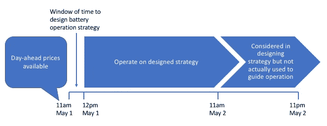

电池被称为价格接受者，这意味着它的活动不会影响能源的价格。为电池充电而支付的电力价格和放电收入是基于位置的边际价格(LBMP)，它考虑了系统边际价格、阻塞部分和边际损耗部分(PJM 互联有限责任公司)。目标是在给定日前价格和电池系统参数的情况下，实现利润最大化。

在这种情况下，未来价格已知，电池系统是价格接受者，设计运营策略的问题可以通过线性规划来解决(Salles et al. 2017，Sioshansi et al. 2009，Wang and Zhang 2018)。简而言之，[线性规划](https://en.wikipedia.org/wiki/Linear_programming)是一种众所周知的技术，用于最大化或最小化某些目标。在这种情况下，我们希望利润最大化。只要描述目标的数学函数，即所谓的**目标函数**，以及系统的**约束**，都可以描述为定义操作策略的**决策变量**的线性组合，就可以使用线性规划来优化系统。

# 纸浆中线性规划问题的建立

大致遵循 Sioshansi 等人(2009 年)的符号，这里我们将列出决策变量，并将约束添加到 PuLP 中的线性规划模型。从下一个单元格中的类定义开始，本节中的 markdown 代码片段应该放在一起定义一个类，该类描述了我们的电池系统(请参见[笔记本](https://github.com/klostest/energy_arbitrage_work_sample/blob/master/Energy%20arbitrage.ipynb)进行确认)。这种系统模型将有助于模拟电池的运行，以每天一次的增量逐步通过时间。

在继续之前，让我们导入本练习所需的包。

```
*#Load packages* import pulp
import os
import numpy **as** np
import pandas **as** pd
import matplotlib **as** mpl
import matplotlib.pyplot **as** plt
import time
**%**matplotlib inline
```

每天，在上午 11 点到下午 12 点之间需要解决一个优化问题，这将提供足够的信息来指导电池在接下来的 36 个小时内的运行。为了指导电池的运行，我们需要确定时间范围内每个离散时间步长的能量流。能量流，也称为电能，可以流入或流出电池。因此，我们将在时间 *t* 创建两个决策变量， *c_t* 和 *d_t，*分别作为充电和放电功率流(kW)，这将是一个小时的时间步长。对于所有时间步长，充电或放电速率是连续变量，并且被限制在电池的工作极限内:

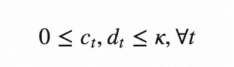

其中 *κ* (kW)是最大充电和放电功率容量，这里我们假设它们相等。

我们需要在优化的时间范围内为每个时间步长指定流量变量。PuLP 提供了一个`LpVariable`类的便捷方法`dicts`，我们可以用它来一次为所有时间步骤创建充电和放电流。我们将开始定义一个类来保存管理电池运行的所有信息。输入`time_horizon`是一个整数，指定优化范围内的小时数，这里假设至少为 24，其他输入如上所述:

```
**class** **Battery**():

    **def** **__init__**(self,
                 time_horizon,
                 max_discharge_power_capacity,
                 max_charge_power_capacity):
        *#Set up decision variables for optimization.
*        *#These are the hourly charge and discharge flows for
*        *#the optimization horizon, with their limitations.
*        self**.**time_horizon **=** time_horizon

        self**.**charge **=** \
        pulp**.**LpVariable**.**dicts(
            "charging_power",
            ('c_t_' **+** str(i) **for** i **in** range(0,time_horizon)),
            lowBound**=**0, upBound**=**max_charge_power_capacity,
            cat**=**'Continuous')

        self**.**discharge **=** \
        pulp**.**LpVariable**.**dicts(
            "discharging_power",
            ('d_t_' **+** str(i) **for** i **in** range(0,time_horizon)),
            lowBound**=**0, upBound**=**max_discharge_power_capacity,
            cat**=**'Continuous')
```

设置好所有的决策变量后，就该定义纸浆将为我们解决的优化问题了。我们的目标是在优化时间范围内最大化利润 *P* ,可使用电荷流和能源价格定义如下:

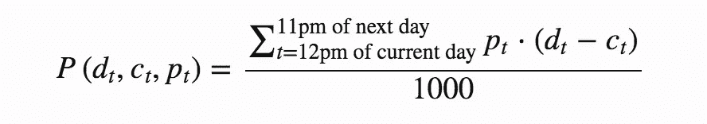

其中 *p_t* 是时间 *t* 时的 LBMP ($/MWh)。就单位而言，因为 *t* 是一个小时时间步长，它有效地取消了 LBMP 单位的每小时部分。目标函数除以 1000 以说明单位(MW/kW)的差异，因此最终利润的目标将以美元为单位。我们将在运行模拟后进行这个单元修正，所以它不会反映在这里的代码中。

目标函数是通过将决策变量添加到纸浆中的模型对象来指定的，将每个决策变量乘以适当的成本或收入，该成本或收入将来自充入或释放该量的能量。决策变量与价格的相乘是使用`LpAffineExpression`完成的。`prices`由 LBMP 决定，我们将在运行模拟时选择相关的时间段。例如，对于 36 小时的时间范围，这将是当天中午到第二天晚上 11 点。

```
 **def** **set_objective**(self, prices):
        *#Create a model and objective function.
*        *#This uses price data, which must have one price
*        *#for each point in the time horizon.
*        **try**:
            **assert** len(prices) **==** self**.**time_horizon
        **except**:
            **print**('Error: need one price for each hour in time horizon')

        *#Instantiate linear programming model to maximize the objective
*        self**.**model **=** pulp**.**LpProblem("Energy arbitrage", pulp**.**LpMaximize)

        *#Objective is profit
*        *#This formula gives the daily profit from charging/discharging
*        *#activities. Charging is a cost, discharging is a revenue
*        self**.**model **+=** \
        pulp**.**LpAffineExpression(
            [(self**.**charge['c_t_' **+** str(i)],
              **-**1*****prices[i]) **for** i **in** range(0,self**.**time_horizon)]) **+**\
        pulp**.**LpAffineExpression(
            [(self**.**discharge['d_t_' **+** str(i)],
              prices[i]) **for** i **in** range(0,self**.**time_horizon)])
```

已经定义了模型和目标，现在我们需要添加电池的操作约束。电池容量有限，因此优化受电池存储限制:

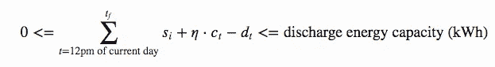

其中 *t_f* =从当天下午 1 点到第二天晚上 11 点的每个小时， *s_i* 是 36 小时优化期开始时电池的能量状态(kWh)*η*是电池的往返效率。该约束要求电池的能量状态(初始状态和每小时功率流的总和)在零(假设电池具有完全深度的放电能力)和电池在优化范围内每小时的放电能量容量之间。在此约束条件下，功率流(kW)被理解为通过乘以一小时时间步长转换为能量单位(kWh)。

在 PuLP 中，约束可以像目标函数一样添加到模型中:使用加法语法。我们可以通过使用`lpSum`将放电流量相加来表达这些约束，如果充电流量需要乘以效率，则再次使用`LpAffineExpression`。

```
 **def** **add_storage_constraints**(self,
                                efficiency,
                                min_capacity,
                                discharge_energy_capacity,
                                initial_level):
        *#Storage level constraint 1
*        *#This says the battery cannot have less than zero energy, at
*        *#any hour in the horizon
*        *#Note this is a place where round-trip efficiency is factored in.
*        *#The energy available for discharge is the round-trip efficiency
*        *#times the energy that was charged.       
*        **for** hour_of_sim **in** range(1,self**.**time_horizon**+**1):     
            self**.**model **+=** \
            initial_level \
            **+** pulp**.**LpAffineExpression(
                [(self**.**charge['c_t_' **+** str(i)], efficiency)
                 **for** i **in** range(0,hour_of_sim)]) \
            **-** pulp**.**lpSum(
                self**.**discharge[index]
                **for** index **in**('d_t_' **+** str(i)
                             **for** i **in** range(0,hour_of_sim)))\
            **>=** min_capacity

        *#Storage level constraint 2
*        *#Similar to 1
*        *#This says the battery cannot have more than the
*        *#discharge energy capacity
*        **for** hour_of_sim **in** range(1,self**.**time_horizon**+**1):
            self**.**model **+=** \
            initial_level \
            **+** pulp**.**LpAffineExpression(
                [(self**.**charge['c_t_' **+** str(i)], efficiency)
                 **for** i **in** range(0,hour_of_sim)]) \
            **-** pulp**.**lpSum(
                self**.**discharge[index]
                **for** index **in** ('d_t_' **+** str(i)
                              **for** i **in** range(0,hour_of_sim)))\
            **<=** discharge_energy_capacity
```

最大日放电吞吐量 *τ* (kWh)也受到限制，这限制了在给定的一天内可以流过电池的能量。我们对此进行了设置，以便时间范围的第一天受 24 小时约束，而超出该时间范围的任何部分都受部分约束。例如，在我们的 36 小时范围内，约束条件是:

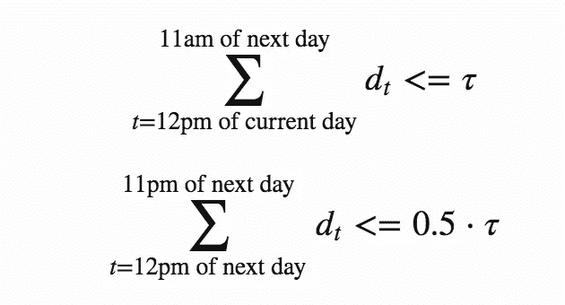

```
 **def** **add_throughput_constraints**(self,
                                   max_daily_discharged_throughput):
        *#Maximum discharge throughput constraint
*        *#The sum of all discharge flow within a day cannot exceed this
*        *#Include portion of the next day according to time horizon
*        *#Assumes the time horizon is at least 24 hours
*        
        self**.**model **+=** \
        pulp**.**lpSum(
            self**.**discharge[index] **for** index **in** (
                'd_t_' **+** str(i) **for** i **in** range(0,24))) \
        **<=** max_daily_discharged_throughput

        self**.**model **+=** \
        pulp**.**lpSum(
            self**.**discharge[index] **for** index **in** (
                'd_t_' **+** str(i) **for** i **in** range(25,self**.**time_horizon))) \
        **<=** max_daily_discharged_throughput \
        *****float(self**.**time_horizon**-**24)**/**24
```

既然我们已经建立了具有目标函数和所有约束的模型，我们包括解决问题的方法，并报告结果，即在时间范围内每小时的最佳充电和放电流量。只要我们提出的问题在我们指出的约束条件下是可行的，线性规划就应该工作，因为它会找到一个最优解，使利润最大化。然而，如果没有，我们将返回一条消息指出这一点。

```
 **def** **solve_model**(self):
        *#Solve the optimization problem
*        self**.**model**.**solve()

        *#Show a warning if an optimal solution was not found
*        **if** pulp**.**LpStatus[self**.**model**.**status] **!=** 'Optimal':
            **print**('Warning: ' **+** pulp**.**LpStatus[self**.**model**.**status])

    **def** **collect_output**(self):  
        *#Collect hourly charging and discharging rates within the
*        *#time horizon
*        hourly_charges **=**\
            np**.**array(
                [self**.**charge[index]**.**varValue **for**
                 index **in** ('c_t_' **+** str(i) **for** i **in** range(0,24))])
        hourly_discharges **=**\
            np**.**array(
                [self**.**discharge[index]**.**varValue **for**
                 index **in** ('d_t_' **+** str(i) **for** i **in** range(0,24))])

        **return** hourly_charges, hourly_discharges
```

这就完成了`Battery`课。我们现在准备接收数据，并继续模拟电池工作。

# 导入价格数据

我们获得了一年的 LBMPs 值，因此我们可以模拟电池在这段时间内的运行情况。这些数据可作为几个区域的 LBMPs，以每小时为时间步长。这里我们加载 CSV 文件(每天一个)并将它们连接到一个`DataFrame`。您可以从这篇博文附带的 [git repo](https://github.com/klostest/energy_arbitrage_work_sample) 中获得这些数据。数据于 2020 年 5 月 2 日从[这里](http://mis.nyiso.com/public/)下载，作为 CSV 文件的压缩目录(定价数据、LBMP 日前市场(DAM)、区域 P-2A)。

```
*#Directory of data* data_dir **=** './data_2019_2020_from_web/'dir_list **=** os**.**listdir(data_dir)
dir_list**.**sort()
dir_list['.DS_Store',
 '20190501damlbmp_zone_csv',
 '20190601damlbmp_zone_csv',
 '20190701damlbmp_zone_csv',
 '20190801damlbmp_zone_csv',
 '20190901damlbmp_zone_csv',
 '20191001damlbmp_zone_csv',
 '20191101damlbmp_zone_csv',
 '20191201damlbmp_zone_csv',
 '20200101damlbmp_zone_csv',
 '20200201damlbmp_zone_csv',
 '20200301damlbmp_zone_csv',
 '20200401damlbmp_zone_csv']*#Remove invisible files (i.e. .DS_Store used by Mac OS)* **for** this_item **in** dir_list:
    **if** this_item[0] **==** '.':
        dir_list**.**remove(this_item)
```

遍历所有子目录，加载所有 CSV 文件。

```
tic **=** time**.**time()
*#count loaded files* file_counter **=** 0

*#For each subdirectory in the parent directory* **for** this_sub_dir **in** dir_list:
    *#List the files
*    this_sub_dir_list **=** os**.**listdir(data_dir **+** '/' **+** this_sub_dir)
    *#Sort the list
*    this_sub_dir_list**.**sort()
    *#Delete invisible files (that start with '.')
*    **for** this_item **in** this_sub_dir_list:
        **if** this_item[0] **==** '.':
            this_sub_dir_list**.**remove(this_item)
    *#For each file in the subdirectory
*    **for** this_file **in** this_sub_dir_list:
        *#Load the contents into a DataFrame
*        this_df **=** pd**.**read_csv(data_dir **+** '/' **+** this_sub_dir **+** '/' **+** this_file)
        *#Concatenate with existing data if past first file
*        **if** file_counter **==** 0:
            all_data **=** this_df**.**copy()
        **else**:
            all_data **=** pd**.**concat([all_data, this_df])

        file_counter **+=** 1
toc **=** time**.**time()
**print**(str(toc**-**tic) **+** ' seconds run time')2.1731250286102295 seconds run time
```

检查数据

```
all_data**.**info()<class 'pandas.core.frame.DataFrame'>
Int64Index: 131760 entries, 0 to 359
Data columns (total 6 columns):
 #   Column                             Non-Null Count   Dtype  
---  ------                             --------------   -----  
 0   Time Stamp                         131760 non-null  object 
 1   Name                               131760 non-null  object 
 2   PTID                               131760 non-null  int64  
 3   LBMP ($/MWHr)                      131760 non-null  float64
 4   Marginal Cost Losses ($/MWHr)      131760 non-null  float64
 5   Marginal Cost Congestion ($/MWHr)  131760 non-null  float64
dtypes: float64(3), int64(1), object(2)
memory usage: 7.0+ MBall_data**.**head()
```

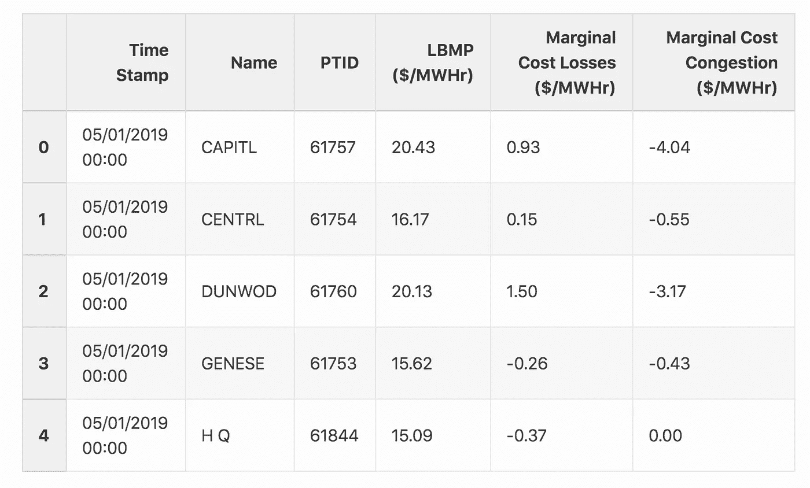

对数据进行健全性检查。考虑到我们有 12 个月的数据，包括闰年的 2 月 29 日，是否加载了 366 天的数据？

```
**assert** file_counter **==** 366
```

有多少个区域，它们是什么？

```
unique_names **=** all_data['Name']**.**unique()
**print**(len(unique_names))
unique_names15

array(['CAPITL', 'CENTRL', 'DUNWOD', 'GENESE', 'H Q', 'HUD VL', 'LONGIL',
       'MHK VL', 'MILLWD', 'N.Y.C.', 'NORTH', 'NPX', 'O H', 'PJM', 'WEST'],
      dtype=object)
```

有多少排？

```
all_data**.**shape(131760, 6)
```

检查行数=区域数乘以一天 24 小时乘以一年 366 天:

```
**assert** 15*****24*****366 **==** all_data**.**shape[0]
```

对于这个例子，我们只关心纽约市。选择感兴趣的数据(特定区域):

```
zone_of_interest **=** 'N.Y.C.'
all_data **=** all_data**.**loc[all_data['Name']**.**isin([zone_of_interest]),:]all_data**.**shape(8784, 6)
```

有了`DatetimeIndex`，`DataFrame`会更容易使用。将索引重置为时间戳:

```
all_data **=** all_data**.**set_index(['Time Stamp'])
```

扮成`datetime`:

```
all_data**.**index **=** pd**.**to_datetime(all_data**.**index, format**=**'%m/%d/%Y %H:%M')
```

让我们看看夏令时前后的数据:

```
start_time **=** pd**.**Timestamp(year**=**2019, month**=**11, day**=**2, hour**=**23)
end_time **=** pd**.**Timestamp(year**=**2019, month**=**11, day**=**3, hour**=**3)time_test_1 **=** all_data[start_time:end_time]
time_test_1
```

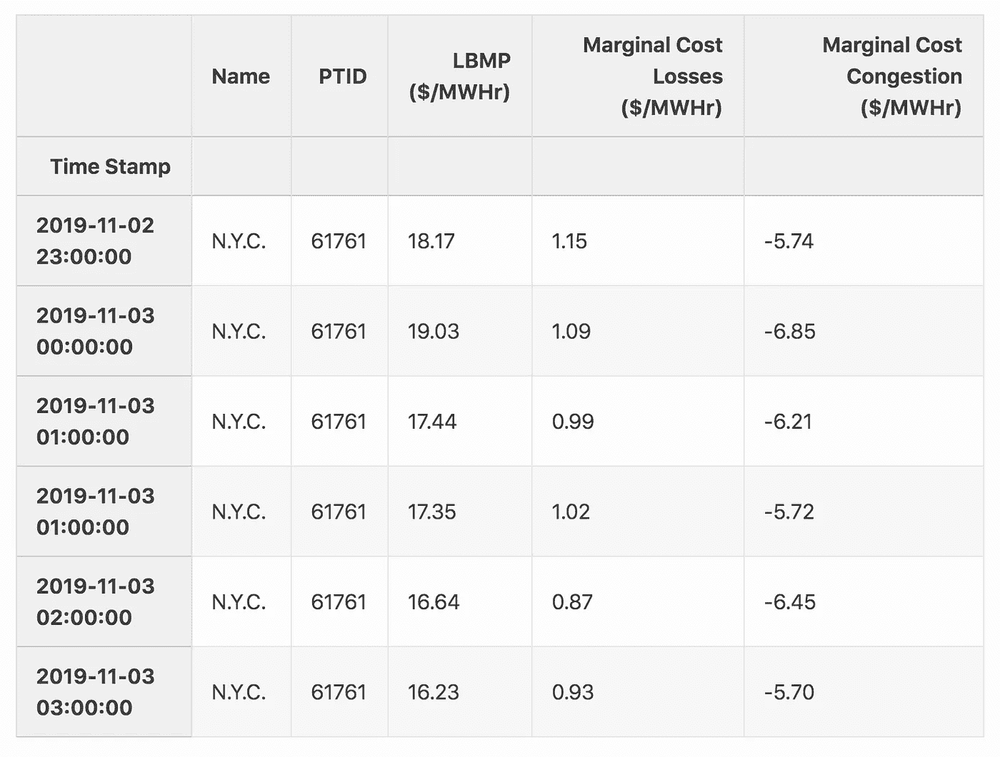

我们可以看到凌晨 1 点有两个条目，其中第二个条目是时钟“倒转”的结果。为了用这个`DatetimeIndex`做算术，我们需要让它知道时区。Pandas 简化了这一过程，并适当地处理了重复的 1am 行:

```
all_data**.**index **=** \
all_data**.**index**.**tz_localize('America/New_York', ambiguous**=**'infer')time_test_2 **=** all_data[start_time:end_time]
time_test_2
```

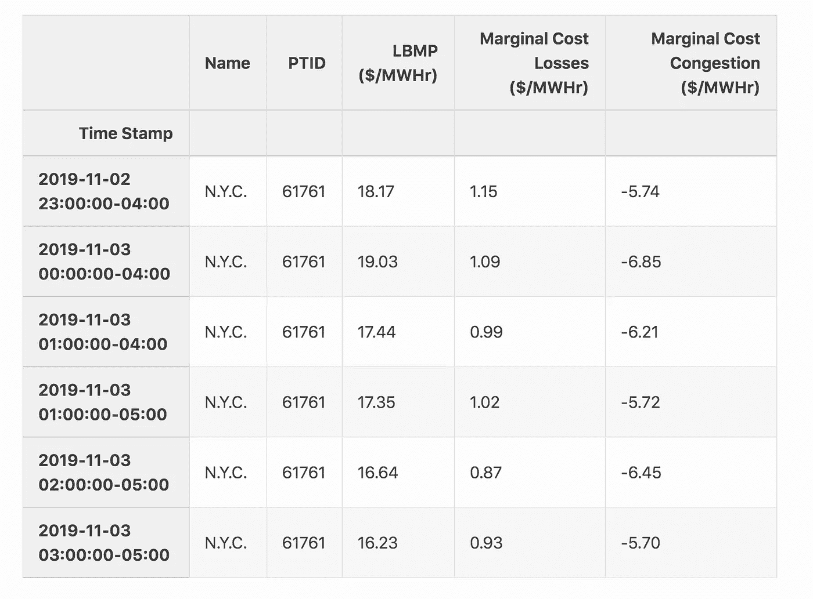

现在我们可以看到，相对于 UTC 的偏移量已显示出来。在继续之前，让我们仔细检查一下数据的开头和结尾。

```
all_data**.**head()
```

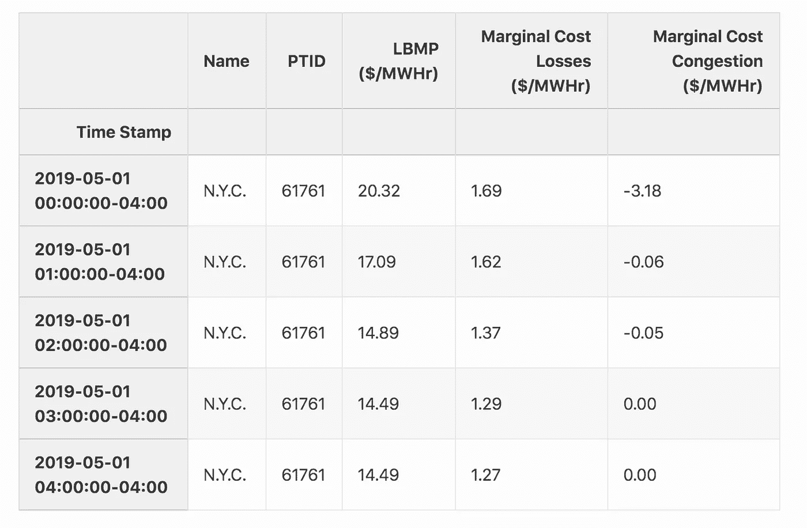

```
all_data**.**tail()
```

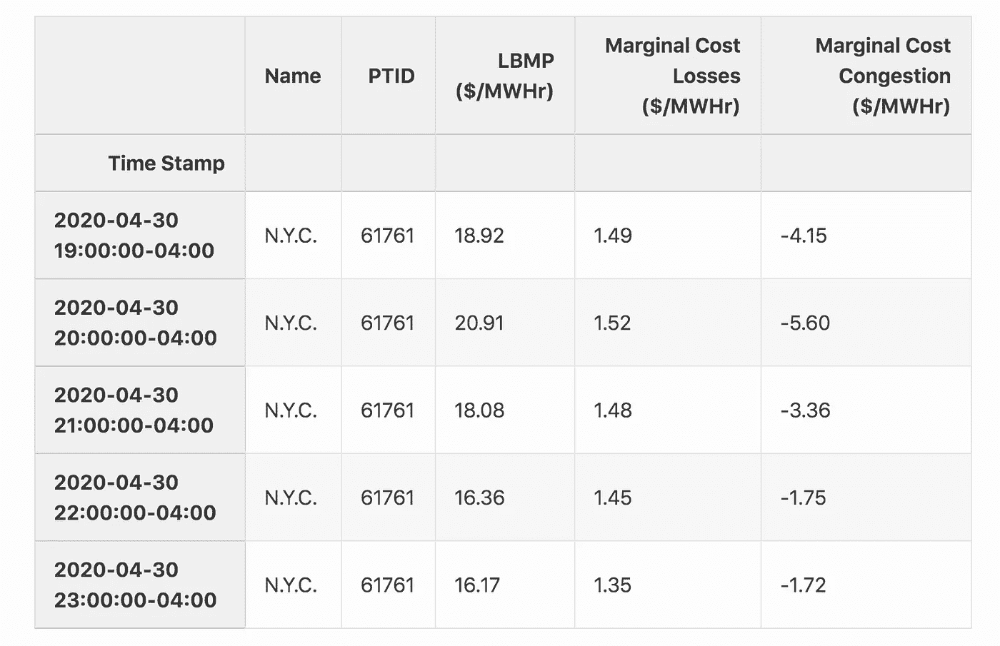

看起来数据像预期的那样，从 2019 年 5 月 1 日到 2020 年 4 月底跨越了一年。

# 运行模拟

在本节中，我们将定义一个函数`simulate_battery`，它模拟电池在一年中的能量套利操作。以下是该函数的输入:

*   `initial_level`，模拟开始时电池充电的初始水平(kWh)
*   `price_data`、每小时 LBMP 的`DataFrame`($/MWh)
*   `max_discharge_power_capacity`、 *κ* (千瓦)
*   `max_charge_power_capacity`，亦作 *κ* (kW)
*   `discharge_energy_capacity`(千瓦小时)
*   `efficiency`、交-交往返效率、*、η* (无单位)
*   `max_daily_discharged_throughput`、 *τ* (千瓦时)
*   `time_horizon`，优化时间范围(h)，这里假设大于等于 24。
*   `start_day`，一只熊猫`Timestamp`在第一个模拟日的中午

该函数返回几个可用于检查系统操作的输出:

*   `all_hourly_charges`、`all_hourly_discharges`、`all_hourly_state_of_energy`、充电和放电活动以及能量状态，以每小时为时间步长(kWh)
*   `all_daily_discharge_throughput`、每日时间步长的排放吞吐量(kWh)

```
**def** **simulate_battery**(initial_level,
                     price_data,
                     max_discharge_power_capacity,
                     max_charge_power_capacity,
                     discharge_energy_capacity,
                     efficiency,
                     max_daily_discharged_throughput,
                     time_horizon,
                     start_day):
    *#Track simulation time
*    tic **=** time**.**time()

    *#Initialize output variables
*    all_hourly_charges **=** np**.**empty(0)
    all_hourly_discharges **=** np**.**empty(0)
    all_hourly_state_of_energy **=** np**.**empty(0)
    all_daily_discharge_throughput **=** np**.**empty(0)

    *#Set up decision variables for optimization by
*    *#instantiating the Battery class
*    battery **=** Battery(
        time_horizon**=**time_horizon,
        max_discharge_power_capacity**=**max_discharge_power_capacity,
        max_charge_power_capacity**=**max_charge_power_capacity)

    *#############################################
*    *#Run the optimization for each day of the year.
*    *#############################################
*    
    *#There are 365 24-hour periods (noon to noon) in the simulation,
*    *#contained within 366 days
*    **for** day_count **in** range(365):
        *#print('Trying day {}'.format(day_count))
*        
        *#############################################
*        *### Select data and simulate daily operation
*        *#############################################
*        
        *#Set up the 36 hour optimization horizon for this day by
*        *#adding to the first day/time of the simulation
*        start_time **=** start_day \
        **+** pd**.**Timedelta(day_count, unit**=**'days')
        end_time **=** start_time **+** pd**.**Timedelta(time_horizon**-**1, unit**=**'hours')
        *#print(start_time, end_time)
*    
        *#Retrieve the price data that will be used to calculate the
*        *#objective
*        prices **=** \
        price_data[start_time:end_time]['LBMP ($/MWHr)']**.**values

        *#Create model and objective
*        battery**.**set_objective(prices)

        *#Set storage constraints
*        battery**.**add_storage_constraints(
            efficiency**=**efficiency,
            min_capacity**=**0,
            discharge_energy_capacity**=**discharge_energy_capacity,
            initial_level**=**initial_level)

        *#Set maximum discharge throughput constraint
*        battery**.**add_throughput_constraints(
            max_daily_discharged_throughput**=**
            max_daily_discharged_throughput)

        *#Solve the optimization problem and collect output
*        battery**.**solve_model()
        hourly_charges, hourly_discharges **=** battery**.**collect_output()

        *#############################################
*        *### Manipulate daily output for data analysis
*        *#############################################
*        
        *#Collect daily discharge throughput
*        daily_discharge_throughput **=** sum(hourly_discharges)
        *#Calculate net hourly power flow (kW), needed for state of energy.
*        *#Charging needs to factor in efficiency, as not all charged power
*        *#is available for discharge.
*        net_hourly_activity **=** (hourly_charges*****efficiency) \
        **-** hourly_discharges
        *#Cumulative changes in energy over time (kWh) from some baseline
*        cumulative_hourly_activity **=** np**.**cumsum(net_hourly_activity)
        *#Add the baseline for hourly state of energy during the next
*        *#time step (t2)
*        state_of_energy_from_t2 **=** initial_level \
        **+** cumulative_hourly_activity

        *#Append output
*        all_hourly_charges **=** np**.**append(all_hourly_charges, hourly_charges)
        all_hourly_discharges **=** np**.**append(
            all_hourly_discharges, hourly_discharges)
        all_hourly_state_of_energy **=** \
        np**.**append(all_hourly_state_of_energy, state_of_energy_from_t2)
        all_daily_discharge_throughput **=** \
        np**.**append(
            all_daily_discharge_throughput, daily_discharge_throughput)

        *#############################################
*        *### Set up the next day
*        *#############################################
*        
        *#Initial level for next period is the end point of current period
*        initial_level **=** state_of_energy_from_t2[**-**1]

    toc **=** time**.**time()

    **print**('Total simulation time: ' **+** str(toc**-**tic) **+** ' seconds')

    **return** all_hourly_charges, all_hourly_discharges, \
        all_hourly_state_of_energy,\
        all_daily_discharge_throughput
```

现在，我们将全年运行我们的模拟，使用以下电池参数的说明性值。

```
max_discharge_power_capacity **=** 100 *#(kW)* max_charge_power_capacity **=** 100 *#(kW)* discharge_energy_capacity **=** 200 *#(kWh)* efficiency **=** 0.85 *#unitless* max_daily_discharged_throughput **=** 200  *#(kWh)*
```

首先，我们假设电池充电到一半就可以启动。

```
initial_level **=** discharge_energy_capacity**/**2
initial_level100.0all_hourly_charges, all_hourly_discharges, all_hourly_state_of_energy,\
all_daily_discharge_throughput **=** \
simulate_battery(initial_level**=**initial_level,
                 price_data**=**all_data,
                 max_discharge_power_capacity
                     **=**max_discharge_power_capacity,
                 max_charge_power_capacity
                     **=**max_charge_power_capacity,
                 discharge_energy_capacity**=**discharge_energy_capacity,
                 efficiency**=**efficiency,
                 max_daily_discharged_throughput
                     **=**max_daily_discharged_throughput,
                 time_horizon**=**36,
                 start_day**=**pd**.**Timestamp(
                     year**=**2019, month**=**5, day**=**1, hour**=**12,
                     tz**=**'America/New_York'))Total simulation time: 20.976715087890625 seconds
```

健全性检查:模拟小时数应为:

```
**assert** 24*****365 **==** len(all_hourly_discharges)
```

# 分析电池运行

现在我们来看一组电池如何工作的指标。我们可以检查是否满足了所有的约束，并分析我们系统的财务影响。

# 功率输出

定义放电为正，充电为负的功率输出。

```
mpl**.**rcParams["figure.figsize"] **=** [5,3]
mpl**.**rcParams["figure.dpi"] **=** 100
mpl**.**rcParams**.**update({"font.size":12})plt**.**hist(all_hourly_discharges **-** all_hourly_charges)
plt**.**xlabel('kW')
plt**.**title('Hourly power output')Text(0.5, 1.0, 'Hourly power output')
```

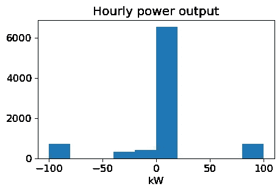

这表明在一年中的大部分时间里，电力接近于零。换句话说，电池既不充电也不放电。然而，电池在其范围[-100，100] kW 的极限下运行也是常见的。

# 能量状态

在任何时候，电池的能量状态应不小于零，且不大于放电能量容量:[0，200] kWh。

```
plt**.**hist(all_hourly_state_of_energy)
plt**.**xlabel('kWh')
plt**.**title('Hourly state of energy')Text(0.5, 1.0, 'Hourly state of energy')
```

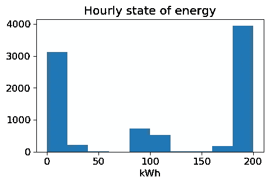

结果表明电池在规定的能量状态范围内工作。

# 收入、成本和利润

我们将分析以下财务指标:

*   年收入总额(美元)
*   年度总收费成本(美元)

稍后，我们还将了解总的年排放吞吐量(kWh)。为了检查所有这些，将数据放在一个`DataFrame`中是很方便的。

根据模拟的时间范围选择一个新的`DataFrame`，以报告进一步的结果:

```
all_data_sim_time **=** all_data[
    pd**.**Timestamp(year**=**2019, month**=**5, day**=**1, hour**=**12, tz**=**'America/New_York'):
    pd**.**Timestamp(year**=**2020, month**=**4, day**=**30, hour**=**11, tz**=**'America/New_York')]**.**copy()
```

检查行数是否正确:

```
all_data_sim_time**.**shape(8760, 5)**assert** all_data_sim_time**.**shape[0] **==** len(all_hourly_discharges)
```

附加模拟结果

```
*#These indicate flows during the hour of the datetime index* all_data_sim_time['Charging power (kW)'] **=** all_hourly_charges
all_data_sim_time['Discharging power (kW)'] **=** all_hourly_discharges
all_data_sim_time['Power output (kW)'] **=** \
    all_hourly_discharges **-** all_hourly_charges
*#This is the state of power at the beginning of the hour of the datetime index* all_data_sim_time['State of Energy (kWh)'] **=** \
    np**.**append(initial_level, all_hourly_state_of_energy[0:**-**1])
```

收入和成本的单位是

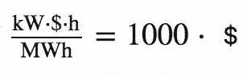

所以除以 1000 调整为美元:

```
all_data_sim_time['Revenue generation ($)'] **=** \
all_data_sim_time['Discharging power (kW)'] \
***** all_data_sim_time['LBMP ($/MWHr)'] **/** 1000all_data_sim_time['Charging cost ($)'] **=** \
all_data_sim_time['Charging power (kW)'] \
***** all_data_sim_time['LBMP ($/MWHr)'] **/** 1000all_data_sim_time['Profit ($)'] **=** all_data_sim_time['Revenue generation ($)'] \
**-** all_data_sim_time['Charging cost ($)']
```

年总收入是多少？

```
all_data_sim_time['Revenue generation ($)']**.**sum()2354.6574498602467
```

每年总充电成本？

```
all_data_sim_time['Charging cost ($)']**.**sum()1391.6754123382877
```

计算利润

```
all_data_sim_time['Profit ($)']**.**sum()962.9820375219592
```

因此，我们可以通过执行能源套利获得近 963 美元的利润。

# 总年排放吞吐量

一年中有多少能量流过这个电池？在某些情况下，每天的排放总量限制在 200 千瓦时/天。如果电池在 365 天的模拟过程中每天都释放其最大可能能量，则总放电量为:

```
365*****200
*#kWh*73000
```

事实上它是:

```
sum(all_daily_discharge_throughput)72955.00000394997
```

这意味着系统在大多数日子里达到了最大排出吞吐量限制。我们可以通过对日吞吐量的`Series`进行`value_counts()`来检查这一点。

```
pd**.**Series(all_daily_discharge_throughput**.**round(0))**.**value_counts()200.0    364
155.0      1
dtype: int64
```

除了一天之外，电池一直以最大生产能力运行。

# 找到最赚钱的一周

按周对利润列进行分组，并找到最大值:

```
max_profit_week **=** (all_data_sim_time['Profit ($)']**.**resample('W')**.**sum() **==** \
all_data_sim_time['Profit ($)']**.**resample('W')**.**sum()**.**max())**.**valuesall_data_sim_time['Profit ($)']**.**resample('W')**.**sum()[max_profit_week]Time Stamp
2019-07-21 00:00:00-04:00    51.015471
Freq: W-SUN, Name: Profit ($), dtype: float64
```

7 月的一周是能源套利最有利可图的一周。本周，让我们制作一个每小时电池能量状态和每小时 LBMP 的图表。

```
mpl**.**rcParams["figure.figsize"] **=** [8,6]
mpl**.**rcParams["figure.dpi"] **=** 150
mpl**.**rcParams**.**update({"font.size":14})most_profit_week_start **=** pd**.**Timestamp(
    year**=**2019, month**=**7, day**=**21, tz**=**'America/New_York')
ax **=** all_data_sim_time[
    most_profit_week_start:most_profit_week_start**+**pd**.**Timedelta(weeks**=**1)]\
[['State of Energy (kWh)', 'LBMP ($/MWHr)']]\
**.**plot(secondary_y**=**'LBMP ($/MWHr)', mark_right**=**False)

ax**.**set_ylabel('State of energy (kWh)')
ax**.**right_ax**.**set_ylabel('LBMP ($/MWh)')
ax**.**get_legend()**.**set_bbox_to_anchor((0.3, 1))
```

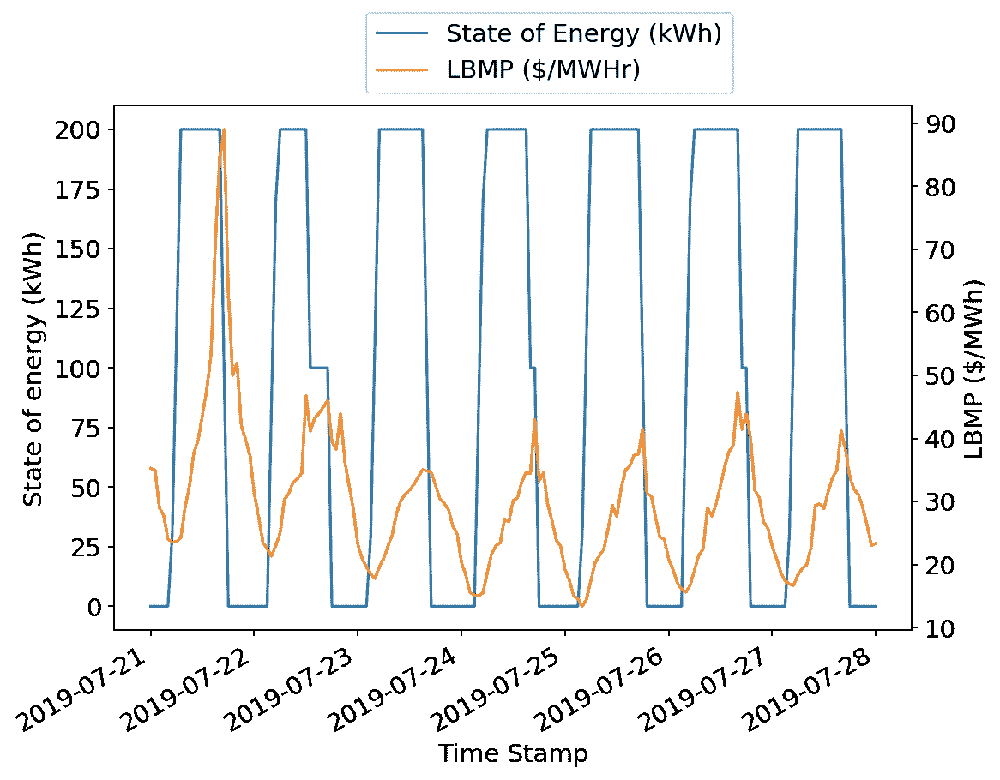

电池似乎遵循“低买高卖”的一般套利策略，或者在这种情况下，“便宜充电，谨慎放电”，以利用未来的价格变化。可能是在这一周，纽约市相当温暖，导致空调电力需求高，昼夜价格波动大，也是我们的电池系统赚钱的好机会。

# 月收入

```
mpl**.**rcParams["figure.figsize"] **=** [6,4]
mpl**.**rcParams["figure.dpi"] **=** 100
mpl**.**rcParams**.**update({"font.size":12})all_data_sim_time['Profit ($)']**.**resample('M')**.**sum()**.**plot()
plt**.**ylabel('Total monthly profit ($)')Text(0, 0.5, 'Total monthly profit ($)')
```

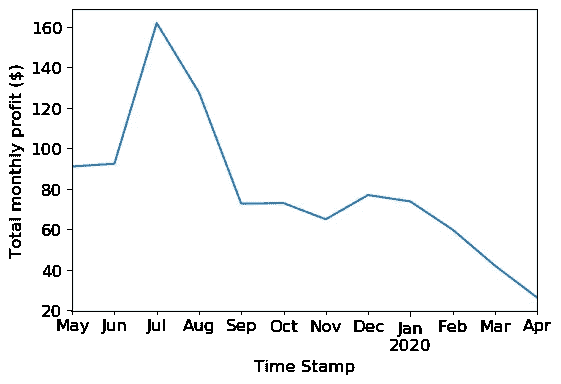

夏季的利润通常高于冬季，但 1 月和 12 月的利润也很高。LBMP 全年的一幅图对此有所启发:

```
all_data_sim_time['LBMP ($/MWHr)']**.**plot()
plt**.**ylabel('LBMP ($/MWHr)')Text(0, 0.5, 'LBMP ($/MWHr)')
```

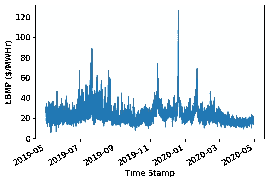

价格的变化使得套利策略能够获利。一般来说，大多数较大的价格波动发生在夏季，这可能反映了炎热夏季空调使用量的增加。但是 11 月、12 月和 1 月的价格变化很大。这可能是由于纽约市在假日期间的旅游业或寒冷的天气增加了对取暖用电的需求。

# 结论

我们发现，一个并网电池的能源套利策略可以使用线性规划来制定，假设未来价格在一定时间范围内是已知的。我们表明，当在一组说明性的系统参数下运行并使用真实世界的能源价格数据时，这样一个系统每年可以产生 963 美元的利润。

如果价格能够在这里使用的 36 小时优化范围之外准确预测，则可能会进一步优化以增加利润。NYISO 价格的确定涉及一个负荷预测模型，该模型取决于经济和天气因素。有可能在价格预测模型中包括这些因素，以估计尚未公开的未来一天的市场价格。在另一个有趣的方向上，王和张(2018)表明，使用历史价格数据的强化学习可以比最大化瞬时利润带来更高的利润，这表明了从能源套利中最大化利润的其他可能方法。

我希望这篇文章有助于你理解在未来价格已知的情况下，如何使用线性规划来制定最优套利策略。

# 参考

所有引用都是在 2020 年 5 月 2 日访问的。

尼索。[日前调度手册](https://www.nyiso.com/documents/20142/2923301/dayahd_schd_mnl.pdf/0024bc71-4dd9-fa80-a816-f9f3e26ea53a)。

PJM 互联有限责任公司。[区位边际定价成分](https://www.pjm.com/-/media/training/nerc-certifications/markets-exam-materials/mkt-optimization-wkshp/locational-marginal-pricing-components.ashx?la=en)。

Salles，Mauricio B. C .等人，2017 年。[PJM 储能系统潜在套利收益](https://www.mdpi.com/1996-1073/10/8/1100/htm)。能量 10:8。

Sioshansi，Ramteen 等人，2009 年。[估算 PJM 电力储存的价值:套利和一些福利效应](https://www.sciencedirect.com/science/article/pii/S0140988308001631)。能源经济学 31:2，269–277。

王，郝，张，2018。[通过强化学习在实时市场中进行储能套利](https://arxiv.org/abs/1711.03127)。IEEE PES 大会。

我发现这本由 Ben Alex Keen 撰写的[指南非常有帮助。](https://benalexkeen.com/linear-programming-with-python-and-pulp/)

*原载于 2020 年 5 月 3 日 https://www.steveklosterman.com*[](https://www.steveklosterman.com/energy-arbitrage/)**。**