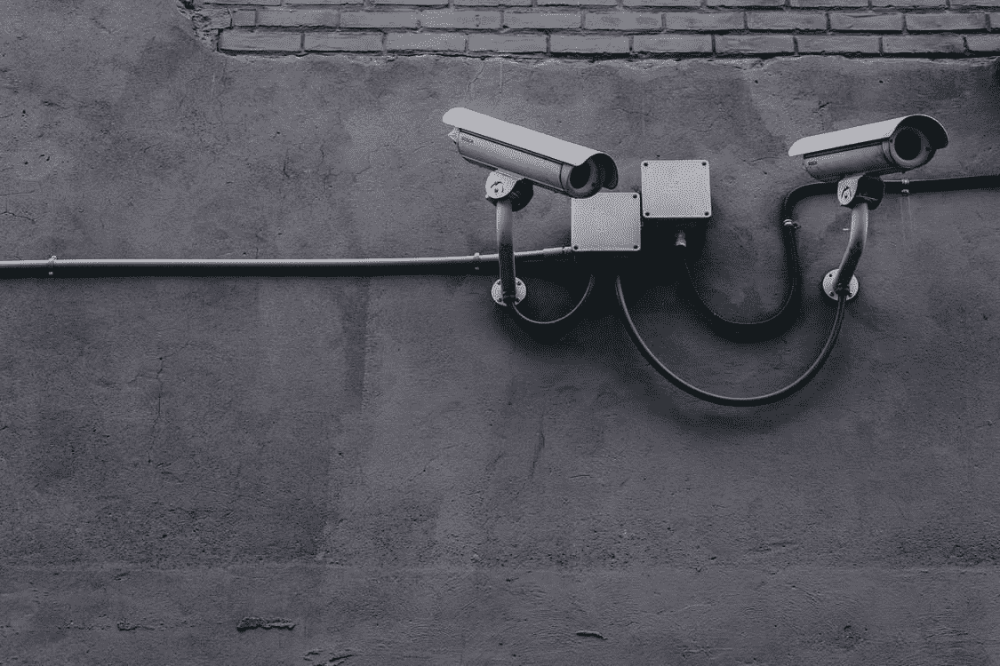

# 基于遮挡的人脸检测器的设计与开发

> 原文：<https://towardsdatascience.com/designing-and-developing-an-occlusion-based-face-detector-cc4ce8d9aff3?source=collection_archive---------60----------------------->

## “增强安全性的最佳方式是通过面部识别——它很快就会成为标准。”—凯莎·威廉姆斯

嗨，大家好，我又带来了另一篇文章，但这次它不是基于任何理论，而是关于开发一个现实世界问题的应用程序。



来源:[斯科特·韦伯拍摄的 Pexels 图片](https://images.pexels.com/photos/430208/pexels-photo-430208.jpeg?auto=compress&cs=tinysrgb&dpr=2&h=650&w=940)

所以，我希望你们都感到兴奋，因为今天我们将学习开发一个成熟的人脸检测系统，它可以处理遮挡的人脸以及其他场景。但是等等，等等…被遮挡的脸是什么意思？被遮挡的脸是指不完全可见的脸，我的意思是它的一部分被一些东西覆盖着，如面具或相机由于遮挡或其他原因无法捕捉到脸部的镜头。

我们为什么需要这个？嗯，这可以在捕捉某人进行一些邪恶的活动或其他事情时找到很多应用。

所以我们的要求是:

1.  计算机编程语言
2.  打开简历
3.  人脸识别模块。

我相信你们都非常熟悉前两个，并且随着我们的深入了解第三个。

**这是我们的文章提纲。**

1.  我们将与图像一起使用的文件
2.  正在生成编码。
3.  使用人脸检测模型检测人脸[图像+视频]
4.  结论。


来源:负空间 Pexel

## 要使用的文件和图像

我们将维护两个名为 *gen_encoding.py* 的文件，用于生成编码和检测人脸的人脸识别。

我们将使用我们想要检测其面部的人的图像。如果能给我们几张照片就更好了。我们将把这些人的图像存储在一个单独的文件夹中，该文件夹以图像所属的人的名字命名。

## 生成编码。

```
import opencv
import face_recognition
import pickle
import cv2for i,image_p in enumerate("image directory path"): 
    image =cv2.imread(image_p))
    name = image_p.split(".")[0]
```

在上面的代码片段中，我们在顶部导入所需的库，并使用 for 循环从图像目录中串行读取图像，并通过分割图像扩展名来获取图像的名称。

```
rgb = cv2.cvtColor(image,cv2.COLOR_BGR2RGB) 
boxes = face_recognition.face_locations(rgb,model="cnn")
encodings = face_recognition.face_encodings(rgb,boxes)
```

在上面的代码片段中，我们根据 face_recognition 库中的模型来转换图像的颜色。

在第二行中，我们从 face_location 函数中获取图像的位置，该函数返回维数的平方。

进一步使用这些位置，我们裁剪出面部区域，并使用 face_recognition 的 face_encodings 功能生成图像编码，该功能使用了特定的神经网络模型来完成一些工作，但我不会详细介绍它，因为它与上下文无关。

```
encodings=[], known_names= []
for encoding in encodings:
  #Processsing the encodings  known
  encodings.append(encoding)
  known_names.append(name)
```

在上面的代码中，我们将图像的编码和名称存储在一个列表中，并将它们存储在一个 pickle 文件中，如下所示。

```
data = {"encoding": known_encodings, "names":known_names}
f =open("encoding file name","wb"):
    f.write(pickle.dumps(data))
```

## 使用人脸检测模型检测人脸。

现在编码部分已经足够了。现在，我们将与检测脸的真实切片一起工作。

为了编写我们的代码，我们将使用 *face_recognition.py* 命名文件。

在下面的代码中，我们将打开如上生成的编码文件，并将其存储在数据变量中。

```
data = pickle.loads(open(args["encoding"],"rb").read())
```

> **用图像检测**

在本节中，我们将在提供的图像中进行人脸检测。因此，首先我们将加载图像，并将其转换为标准的颜色格式，我们将生成它的编码进行比较。

```
image = cv2.imread(os.path.join("image_path"))
rgb = cv2.cvtColor(image,cv2.COLOR_BGR2RGB)
boxes= face_recognition.face_locations(rgb,model= "cnn")
encodings = face_recognition.face_encodings(rgb,boxes)*Detection with vidoes*
```

现在，在下面的代码片段中，我将图像生成的编码与所有已经存储的人脸编码进行比较。如果它们之间的差异低于阈值，我们将其作为相应人脸的编码并用 imshow()函数显示。

```
for encoding in encodings:
   matches=face_recognition.compare_faces(data,encoding) 
   name = "Unknown"
   if True in matches:
      match_idx = [i for (i,b) in    enumerate(matches) if b]
      counts= {}
      for i in match_idx:
         name = data["names"][i]
         counts[name] =counts.get(name,0)+1
      name = max(counts, key= counts.get)
   names.append(name)
for ((top,right,bottom,left),name) in zip(boxes,names): 
     cv2.rectangle(image,(left,top),(right,bottom),(0,255,0),2)
     y = top-15 if top-15>15 else top+15
     cv2.putText(image,name,(left,y),cv2.FONT_HERSHEY_SIMPLEX,0.45,
     (0,255,0),2)
cv2.imshow("Image",image)
```

> **视频帧中的检测**

现在重复几乎相同的过程，现在是视频帧而不是图像。

在下面的代码中，我们正在初始化我们电脑的网络摄像头。

```
vs= VideoStream(src=0).start()
```

在下面给出的代码中，我们只是读取每一帧，并根据 face_recognition 库中的模型将其转换为标准颜色格式。

现在，我们使用 face_location 函数检测视频帧中的人脸位置，并在代码的最后一行生成其编码。

```
while True: 
    frame = vs.read()
    rgb = cv2.cvtColor(frame,cv2.COLOR_BGR2RGB)
    rgb = imutils.resize(rgb,width=750)
    r =frame.shape[1]/float(rgb.shape[1])
    boxes= face_recognition.face_locations(rgb,model="cnn") 
    encodings =face_recognition.face_encodings(rgb,boxes) 
    names=[]
```

现在，在下面的代码中，我们将帧的编码与已经存储的人脸编码进行比较，如果我们发现差异低于某个阈值，则认为该帧包含编码已经存储的人的人脸。

```
for encoding in encodings:
    matches=
    face_recognition.compare_faces("encoding.pickle",encoding)       
    name="Unknown"  print(matches)
    if True in matches:
       matchesIdx =[i for (i,b) in matches if b] 
       counts={}
       for i in matchesIdx: 
           name = data["names"][i]
           counts[name]= counts.get(name,0)+1 
       name =max(counts,key= count.get)
   names.append(name)
```

现在，在下面的代码中，我们只是在脸部周围画一些方框，并在上面显示这个人的名字。

```
for((top,right,bottom,left),name) in zip(boxes,names):  
    top=int(top*r)
    right=int(right*r) 
    bottom=int(bottom*r)  
    left=int(left*r)  
    cv2.rectangle(frame,(left, top),(right, bottom),(0,255,0),2) 
    y=top-15 if top-15>15 else top+15  
    cv2.putText(frame,name ,(left,y),cv2.FONT_HERSHEY_SIMPLEX,0.75,
    ((0,255,0),2) 
cv2.destroyAllWindows()vs.stop()
```

万岁…你做到了。恭喜你开发出第一个高级人脸识别模型。

## 结论:

虽然代码乍一看似乎很复杂，但整个代码背后的概念非常简单。好吧，让我给你简单介绍一下我们所做的一切。首先，我们为所有可用的图像生成了编码。现在，在检测时，我们只是将正在检测的人的编码与已经存储的人的编码进行比较。所以很明显同一个人会表现出较少的差异。如果差异没有超过阈值，我们会将该人脸标记为未知人。简单！！

完整代码可以访问我的 [*Github 简介*](https://github.com/shobhitsrivastava-ds/Occlusion-based-face-detection/)

如果你喜欢的内容，并希望更多这样的，跟着我一样。

谢谢你