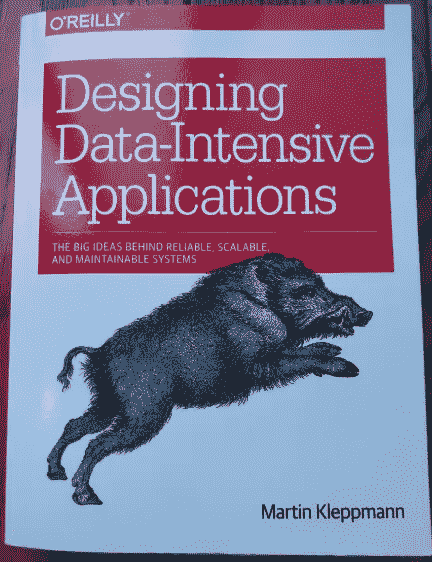
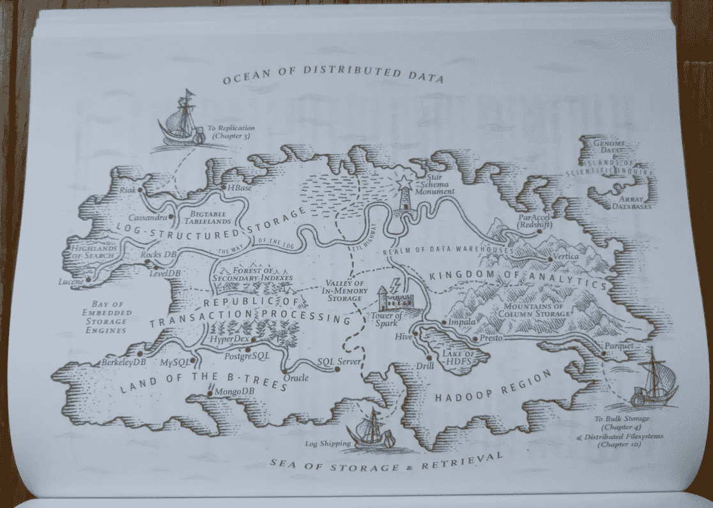

# 设计数据密集型应用程序

> 原文：<https://towardsdatascience.com/designing-data-intensive-applications-book-review-cc34ba1f90a7?source=collection_archive---------14----------------------->

## 数据库和分布式系统用户的现代经典

意识到自己对某件事知之甚少可能是一次令人沮丧的经历。然而，这本书设法使它振奋人心，引人入胜。在[设计数据密集型应用](https://www.amazon.co.uk/Designing-Data-Intensive-Applications-Reliable-Maintainable/dp/1449373321)中，Martin Kleppmann 首先解释了简单数据库的工作原理，然后介绍了分布式环境中多个系统的交互方式。在这一过程中，他采用了许多我认为我理解的概念，并展示了我从来不知道的深度和复杂性，以提供更彻底的理解。

作者图片

例如，数据库中的 [ACID](https://en.wikipedia.org/wiki/ACID) (原子性、一致性、隔离性、持久性)事务(在第七章中介绍)。我已经看过这个缩写一百万次了，我想我已经很好地理解了它。我以为数据库要么提供要么不提供，但你知道吗，它实际上是令人惊讶的模糊？克莱普曼甚至称它主要是一个营销术语。你知道一致性不属于其他人吗？这种隔离实际上可以通过许多不同的严格程度来实现？Kleppmann 在第 7 章中以清晰和吸引人的方式解释了这一切。我觉得我得到了关于数据库如何真正运行的内部消息。

# 书籍内容

这本书有 12 章，分成 3 个部分。

1.  数据系统的基础:数据库实际上如何存储数据，索引和它们如何更新，使用的文件类型。
2.  分布式数据:跨多个节点的数据复制、分区、事务的实际执行方式。
3.  派生数据:批处理(包括 MapReduce)和流处理。

这些章节是建立在彼此的基础上的，但是你可以浏览你特别感兴趣的章节。如果他提到了书中以前的主题，他会附上更多信息的页码，这样你就不会感到失落。

每一章都以像这样的古怪地图开始。图片作者。

这本书里没有练习，只有几个代码示例。它描述了问题以及如何实现解决方案，但是你不会获得任何解决这些问题的经验。只期望提高你的意识，增加你的理解。

他引用了从 20 世纪 70 年代到 2016 年的数据库和计算历史的大量资料(在某些章节中超过 100 篇)。它们来自书籍和论文，但也有博客文章，甚至黑客新闻聊天讨论(参考第 11 章的 61)。这种多样性，以及它们不都是学术参考，有助于增强你了解全貌的信心。

一路上有一些有趣的花絮。就像 MapReduce 作业中的每个子任务在每一步之间都会写入磁盘，这看起来就像最初开发它的 Google 设计人员过度担心硬件故障一样。但是，如果您知道它的初衷是在有空闲资源时在后台运行作业，这就更有意义了。显然，一个小时长的 MapReduce 任务有 50%的机会被终止，因此计算资源可以被更高优先级的作业使用。

## 不好的地方

关于这本书，我要说的唯一不好的一点是，它最初是在 2017 年初出版的，年龄开始显示出来了。VoltDB 和 Riak 是两个获得最频繁引用的数据库，但我从未听说过它们。从谷歌趋势来看，自 2015 年以来，它们的受欢迎程度一直在下降(已经是小众的了)。

这本书从 2010 年开始引用了很多关于分布式数据库、批处理和流处理的有趣内容，但这些内容在 2016 年停止了。我很想知道他在过去 4 年中会包括什么，因为这是一个发展迅速的领域。

# 谁应该读它？

我建议有一些数据库或软件开发的经验，以便看到材料的相关性。这是一本相当厚的书(550 页左右)，我花了 45 个小时才读完，所以你需要愿意花一些时间来读完它。也就是说，我相信这绝对是值得的时间投资。

# 结论

你会从阅读中受益吗？我做得很快。这篇关于 Google Spanner 分布式数据库的[中型文章](https://medium.com/google-cloud/spanners-sql-story-79bda8bb632d)最近出现在我的 feed 中。它提到了故障切换、事务、一致性、防止过时读取、跨区域复制等内容。在读这本书之前，我要么不知道这些概念是什么，要么不理解它们的复杂性。所以现在我受益于能够更好地理解和消化这样的帖子。

## 评级:🦅🦅🦅🦅🦅

5 鹰是这本书唯一合适的评级。它以全新的视角向你展示一个熟悉的世界的能力，只有 5 只老鹰把你从椅子上拉起来，带你在你的城市上空翱翔才能与之媲美。