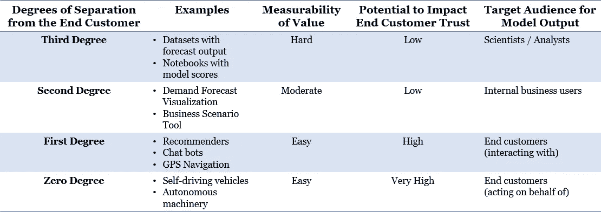

# 数据产品和客户

> 原文：<https://towardsdatascience.com/designing-data-products-from-a-customer-viewpoint-8e9f622ec27b?source=collection_archive---------30----------------------->

## 从客户的角度出发，通过逆向工作提高影响力

Mike Akeroyd(作者)在 Blender 中渲染的抽象背景图像。

在过去的 10 年里，根据谷歌趋势数据，“机器学习”和“数据科学”的搜索量增加了 12 倍。随着流行，可能会出现一种非理性的兴奋，公司可能会为了进行机器学习而想要进行机器学习。构建由机器学习驱动的产品需要一种微妙的平衡，既要提供早期的增量价值来满足业务合作伙伴，又不能通过在模型中使用太少的数据或功能来淡化影响。作为产品经理、科学经理或科学家，我们需要管理内部期望，同时保持对 ML 计划的支持势头。要做到这一点，我们应该关注客户需求，而不是只关注科学成果。

但是谁是科学产品的客户呢？如果我们正在开发一个客户流失倾向模型，那么客户可能是一个保留营销团队。如果我们正在建立一个价格弹性模型，那么客户可能是一个产品价格策略团队。在另一个例子中，如果我们推出一个网站聊天机器人，那么客户可能是一个数字支持团队。然而，在所有这些情况下，这些机器学习模型的“客户”也可能是最终的商业客户:保留促销的接收者，愿意为产品支付价格的人，或者向聊天机器人提问的用户。微妙的区别在于特定机器学习模型或数据产品与最终商业客户的直接互动水平。数据产品的早期版本可以产生建议，并且内部用户可以实施该建议。一个更高的版本可以完全自动地与最终的商业客户进行交互。然而，仅仅因为一个数据产品最初的范围是支持内部用户，未来的发展可能会产生一个直接与最终业务客户交互的数据产品。因此，我们应该始终从最终客户“向后工作”。

有几篇文章提供了如何思考**数据产品**或任何使用数据来传递其核心价值主张的产品的想法。根据这个定义，任何使用机器学习的产品都可以被认为是**数据产品**。一篇[文章](https://www.mindtheproduct.com/fundamentals-building-better-data-products/) [1]将数据产品分为三种类型:数据即服务、数据即洞察和数据增强产品。[另一个](https://www.forbes.com/sites/lutzfinger/2014/08/19/3-data-products-you-need-to-know/#33369ce66f60)【2】也将数据产品分为三种:标杆数据、预测数据、推荐系统数据。另一个[文档](/designing-data-products-b6b93edf3d23)【3】将数据产品分为:原始数据、派生数据、算法、决策支持和自动化决策。在每一种情况下，数据产品都根据产品的产出进行分类。本文将介绍一个新的基于客户的数据产品分类框架，而不是关注输出。这个框架允许我们更容易地考虑与数据产品开发相关的技术和组织约束。

> *从客户开始向后工作有助于我们考虑基于客户需求的增量开发。它还允许我们设定价值主张的期望值。*

在我们开始之前，这里有一个框架概述。

**离顾客三度…**

"*三级数据产品*"通过两层或更多层的人类互动或其他科学驱动的输入与最终客户分离。客户聚类、离线欺诈评分、产品评论情绪或保留概率模型的输出都是三级数据产品的示例。这种类型的数据产品以数据集、科学笔记本或可视化的形式存在。这是从数据中获得洞察力的核心。没有这些被科学家和分析师消费的数据产品，就不可能有任何已实现的未来价值。作为一个科学团队，第三度数据产品通常是最令人兴奋的讨论(“我们要预测 x！”)但从业务角度来看，提供支持可能会很困难。这是因为通常很难衡量这类产品带来的直接财务影响。然而，第三度数据产品提供了真正的选择价值。这种真正的选择是扩展到具有可测量价值的一级或二级数据产品的潜力。通常，实物期权的价值非常重要，因为一个三级数据产品可以支持许多领域。例如，客户终身价值模型可以支持用于市场细分、促销目标或客户支持队列优先级排序的附加数据产品。

**与顾客相距两度……**

“*二度数据产品*”与终端客户之间隔着一层人机交互。这些产品通常由内部业务团队使用，可以包括包含预测和优化的 ui。二度数据产品不仅仅是见解，而是建议。这些建议还可以包括具有敏感性分析的替代方案。有时，这些产品可以开发为原型或第一个版本，随后会产生第一级数据产品。在其他情况下，我们可能永远无法获取做出整体决策所必需的适当数据，因此始终需要对基于科学的建议施加“人为影响”。在另外一些情况下，如果产品支持的决策很少被做出，并且影响相当大，那么让产品变得更不干涉可能会有很大的风险。与二级数据产品相关的量化值可能是模糊的。这是因为人们需要回答这样一个问题:做出更明智决策的价值是什么？该值是与科学建议和人类决策相关的影响的混合。二级数据产品的主要风险是缺乏采用。如果推荐的决策无法解释，不直观，或者需要大量的人工干预，那么产品很可能会被弃用。

**离客户 1 度…**

我们可以将机器学习模型的输出直接与最终客户接触的产品分类为“*一级数据产品*”。这意味着 ML 输出与用户仅相差一度。这些数据产品的例子包括个性化用户体验、产品推荐、聊天机器人和驾驶员导航。有了这些类型的数据产品，我们可以通过 AB 测试来评估客户影响和衡量业务价值。从业务角度来看，量化价值的能力使这些类型的数据产品更容易划分优先级。然而，由于这些产品与客户互动，总会有损害客户信任的风险。例如，第一级数据产品可能提供不相关的建议、不正确的驾驶方向、极端的价格变化，或者在 IBM 的 Watson 的情况下，向医生提供错误的癌症治疗建议。推出一级数据产品需要工程支持，并且必然存在许多依赖关系。通常，需要一个适应性强的 UX 来支持实验和自动数据收集。对于这些数据产品，我们可以使用业务规则引导早期实验，收集的数据稍后用于支持模型训练和增强。随着时间的推移，随着该产品从客户那里收集直接反馈，机器学习模型可以提供更相关的输出。

**区分数据产品和科学模型……**

让我们快速浏览一个例子，看看这个框架在实践中是如何工作的。在这个例子中，我们为一家处于分析之旅早期的公司工作，我们的任务是使用机器学习来减少客户流失。最终的第一级数据产品的“最终客户”是可能流失的客户。这种产品可以是一个系统，它可以自动识别具有高流失倾向的客户，并向他们发送有针对性的促销优惠。达到这一点不仅需要科学工作，也需要工程工作。因此，实现产品的价值需要时间，如果有任何开发延迟，这可能会增加失去管理层支持的风险。当我们建立客户级别的保留概率模型来驱动这个一级数据产品时，我们也可以提供二级数据产品。这种二级数据产品可以是“防止流失目标工具”,营销人员可以使用它来识别具有高流失可能性分数的客户。有了这些信息，营销团队可以手动提供促销以降低流失风险。通过分解交付，组织可以更快地实现价值，并可能通过实验来确定客户流失预测的有效性。最后，第三度数据产品是客户流失科学模型的输出。该输出不仅可以支持我们减少客户流失的目标，还可以作为其他科学模型的输入。例如，客户流失或保留概率模型可以是客户终身价值模型的输入。

示例数据产品分类

所以，概括一下:

一级数据产品直接向客户提供基于科学的输出，供他们采取行动。

二级数据产品向企业提供基于科学的输出，供员工采取行动，然后提供给客户。

第三度数据产品向第二度数据产品提供基于科学的输出。第三级数据产品也可以向分析师或科学家提供见解，而不提供建议。

从数据产品中实现价值有时可能是一个漫长的旅程:对客户和企业都是如此。照片来自 [Pexels](https://www.pexels.com/search/climbing/) 由[flo·马德雷纳](https://www.pexels.com/photo/two-man-hiking-on-snow-mountain-869258/)拍摄

最后一点要注意的是，我们可以进一步扩展这个框架，以包括多一种数据产品类型:“*零度数据产品*”。零度数据产品使用其基于科学的输出来代表客户采取行动。这不同于第一级数据产品，第一级数据产品要求客户仍然自己行动。零度数据产品的例子包括无人驾驶汽车、无人驾驶飞机或其他自主机械。这种类型的数据产品与提到的其他三种产品之间有一个关键的技术差异。零度数据产品往往是用深度学习构建的。相比之下，我们通常使用机器学习算法来构建其他三类数据产品。

总之，当开发一个人工智能战略或建立一个 ML 项目路线图时，很容易变得过于雄心勃勃。在讨论 ML 解决方案时，组织通常会设想一级数据产品。实际上，许多数据产品需要从三级数据产品开始，并逐渐变得更加复杂。这种以客户为中心的数据框架不是保证高质量科学产品的灵丹妙药，但它可以帮助我们定义产品。它还帮助我们理解如何从敏捷开发的角度来思考。这样做，我们可以最小化范围蔓延，同时首先向内部业务合作伙伴提供价值，然后向外部客户提供增量交付。

**参考文献:**

[1][https://www . mind the product . com/fundamentals-building-better-data-products/](https://www.mindtheproduct.com/fundamentals-building-better-data-products/)

[2][https://www . Forbes . com/sites/Lutz finger/2014/08/19/3-data-products-you-need-to-know/# 498 a 770366 F6](https://www.forbes.com/sites/lutzfinger/2014/08/19/3-data-products-you-need-to-know/#498a770366f6)

[3][https://towards data science . com/designing-data-products-b 6 b 93 EDF 3d 23](/designing-data-products-b6b93edf3d23)