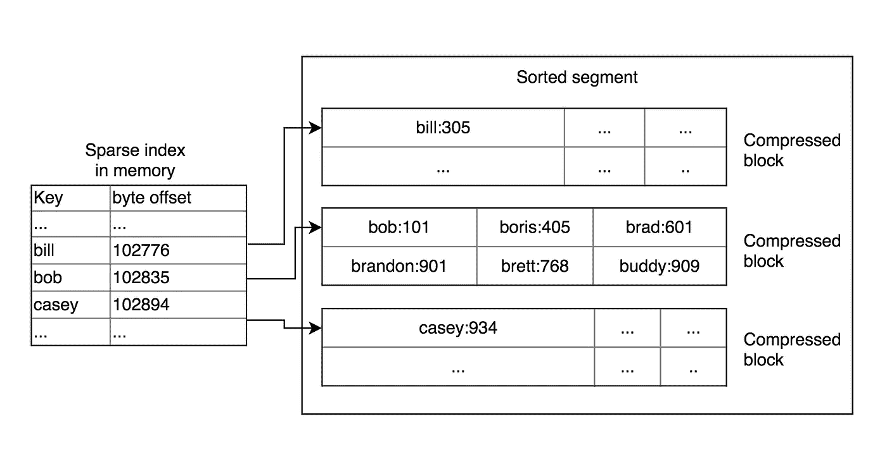
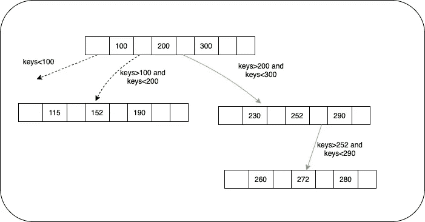

# 设计数据库存储和检索

> 原文：<https://towardsdatascience.com/designing-database-storage-and-retrieval-14cf5ab2bca?source=collection_archive---------75----------------------->

## 关于数据库存储、索引和数据检索，您需要知道的一切

照片来自[https://unsplash.com/](https://unsplash.com/)

数据库是任何应用程序设计中不可或缺的一部分，进程在其中存储和管理数据。虽然，您可能永远不需要从头开始设计数据库，但是了解其设计以及不同数据库处理数据的方式将有助于您选择最合适的数据存储，从而提供所需的可伸缩性和性能。例如，适合处理事务性数据的数据库可能不适合数据仓库。

让我们开始设计一个数据库。我们将从简单开始，然后优化它，直到它变得可怕。

最简单的方法是将键值对保存在一个文件中。写入记录只会将记录附加到文件末尾。如果某个段(或文件)的大小超过了最大可能大小，则开始写入下一个段。作为后台进程，这些段被合并以移除重复的条目并保留关键字的最新值。这个过程叫做**压实**。这种方法的唯一问题是，read 必须解析整个段才能找到用那个键写入的最后一个值。这些可能进一步涉及在多个段中搜索，导致读取时间增加。让我们试着解决这个问题。一种方法是在键上建立索引。

# 哈希索引

创建索引的一个简单方法是使用哈希映射。你可以有一个内存中的哈希表来存储键和字节偏移量，即它在该段中的位置。每个数据段都有自己的内存哈希映射。

在散列索引中查找

写操作将在哈希表中创建一个条目，并将记录追加到最新的段中。读取将涉及到遍历散列表，以找到要读取的记录的位置。

这种方法有一些缺点:
1。索引保存在内存中。当键的数量很大并且超过可用的内存时，这是没有用的。
2。它不是为范围查询而优化的。

# 桌子和 LSM 树

排序字符串表(SSTables)包含按键排序的数据，一个键在一个段中只出现一次。有了有序排列的键，就不需要在哈希表中索引每个键，只需要索引少数记录的偏移量。使用排序数据段的其他好处是，它允许在写入前压缩数据块，并且使压缩过程更容易。可以使用简单的合并排序算法来合并段。

表中的索引和压缩

下一个问题是如何在 segment 中保持键的排序顺序？使用像 AVL 这样的自平衡树，在内存中存储排序结构要容易得多。

1.  当写入到来时，将其添加到内存平衡树(称为 **memtable** )。
2.  随着内存的增长，从 memtable 中读取值并将其写入磁盘。因为它已经排序，段将有排序的关键字。
3.  在读取期间，首先检查 memtable，然后检查最近的段。

但是如果我们的系统在将 memtable 写到磁盘之前崩溃了呢？要解决这个问题，请使用日志。为磁盘中的每次写入保留一个日志。如果系统崩溃，这些可以用来构建段。

日志结构树或 LSM 树是一种数据结构，旨在为长期经历高插入(和删除)率的文件提供低成本索引。它基于在后台合并的表的思想。不同的段可能包含相同关键字的值。这些数据段在后台进行压缩，以删除重复数据并节省空间和读取时间。

# b 树

B-tree 是一种自平衡的树形数据结构，用于维护已排序的数据。在大多数其他自平衡搜索树(如 AVL 树和红黑树)中，假设所有东西都在主存中。为了理解 B 树的使用，想象一下在主存中容纳不下的大量数据。当键的数量很大时，数据以块的形式从磁盘中读取。与主内存访问时间相比，磁盘访问时间非常长。使用 B 树的主要思想是减少磁盘访问的次数。对数时间内的 b 树搜索、顺序访问、插入和删除。你可以在这里阅读更多关于 B 树的内容。

像表一样，树也保持键的顺序。唯一的区别在于设计理念。LSM 树是将数据写入不同段的日志结构索引，而 B 树是一次仅在一个页面(或磁盘块)中读取或写入的页面结构索引。它将数据存储分为固定大小的块或页面。叶节点可以包含键的实际值，或者指向存储该值的引用。下面的图片将帮助你理解 B 树是如何工作的。

在 B 树中查找 key = 272

读取时，需要遍历树，找到存储块的位置。在写入时，它首先需要找到需要写入值的页面，然后写入。如果块中没有足够的空间，可能会导致块分割和对父节点的更新。

为了使写入对崩溃具有弹性，它使用日志。在任何写操作之前，首先将它记录在磁盘中，然后将其插入到 B 树中。

# 比较

1.  *读/写性能*:像 LSM 树这样的日志结构索引允许更快的写入，而像 B 树这样的页面结构索引允许更快的读取。LSM 中的读取相对较慢，因为它们需要根据压缩级别检查多个数据结构和表。
2.  *冗余*:对于 B 树，每个键只存储在一个地方，而对于日志结构，它存储在多个段中。
3.  *存储* : B 树由于碎片化 ie 可能会留下一些磁盘空间。当前行无法放入可用页面空间时。LSM 树的压实过程减少了碎片。
4.  LSM 需要优化的压缩策略来合并数据段，以获得更好的读取性能。压缩策略不应影响正在进行的读/写操作。当写入吞吐量较高，并且正在进行的写入和执行压缩的线程之间共享有限的磁盘带宽时，这可能会导致问题。

b 树更受欢迎，用于维护索引。

所有其他索引，如二级索引、多列索引等都扩展了上述方法。唯一的区别是这些索引的键不是唯一的。每个关键字可以有多条相关记录。

# 结论

提供了关于数据库如何存储和检索数据的见解。对于存储大量数据用于分析的数据仓库，上述所有方法可能都不是最佳的。为下一篇文章保留数据仓库的存储和检索过程！

要阅读更多关于数据库和应用程序设计的内容，我强烈推荐阅读马丁·克莱曼的《[设计数据密集型应用程序](http://a-fwd.to/7qfbP5v)》。

希望你喜欢这篇文章！