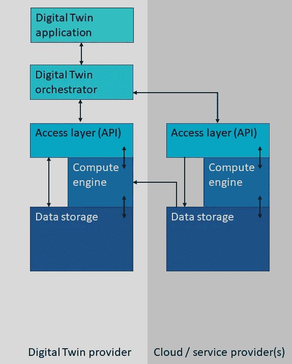
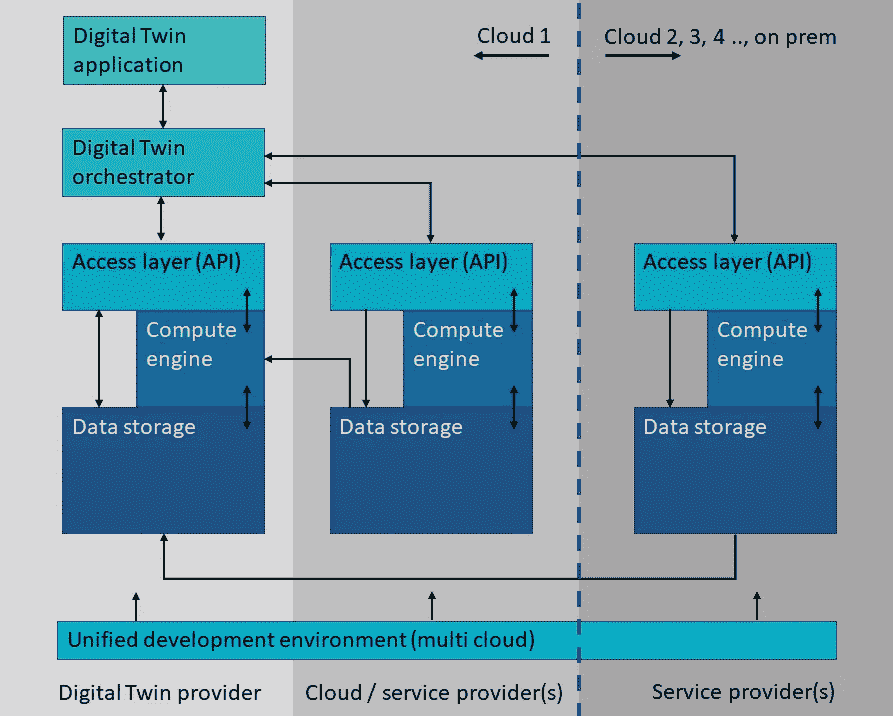

# 为数字双胞胎设计

> 原文：<https://towardsdatascience.com/designing-for-digital-twins-e2b3e07a5d1e?source=collection_archive---------31----------------------->

法耶·康尼什在 [Unsplash](https://unsplash.com?utm_source=medium&utm_medium=referral) 上的照片

数字双胞胎的未来是多样化的——在意义和设置上都是如此。忽视这一现实将阻碍数字双胞胎的成功。

这里，重点是在分散的服务和数据环境中成功实施数字双胞胎的设置和设计考虑因素(因此这里不包括物联网摄取和数据模型部分)。呈现了初始技术映射。

**数码双胞胎**

什么被视为数字孪生取决于它的目标。一个例子是现实生活中的数字孪生资产，比如一个车队。基于车队的状态，将实时做出关于路线、驾驶员刹车等的决策。这些系统还将依赖于外部数据，如交通信息和环境条件，如天气。由于决策将逐渐基于先进的算法，历史事件的模式将变得重要，并将逐渐包括更加多样和丰富的数据。数字版本变得越来越丰富，足以建立对重要角色互动的理解。有了这种理解，就可以构建模拟，并且可以根据模拟运行的结果通过选择过程做出自动决策。换句话说，一个人正在构建一个数字真相，以及围绕它所关注的资产的平行未来可能性。

怀着另一个目标，另一种类型的数字孪生将被建立。例如，如果一个人在不断变化的气候中寻求缓解措施，那么数据、算法、模拟、考虑的时间间隔会有很大的不同。导致数字双胞胎之间的决策或建议不同——即使它们部分涉及相同的对象。数字双胞胎的决策取决于他们的 KPI(关键绩效指标)是否符合他们的目标和方法。数字双胞胎将有助于优化运营，但也将有助于解决社会问题，尽管潜在的社会、经济、道德、责任和环境考虑因素应在更广泛的受众中平行进行，因为这将影响数字双胞胎设计的 KPI。

**分散风景**

数字双胞胎有三个共同的组成部分——数据、计算、算法——但每个组成部分的用途及其驻留位置在数字双胞胎之间会有很大的不同。很可能来自自有资产的数据将直接流向自有的受控计算环境(本地、公共或私有云中)。然而，在其他情况下，通过本地超级计算机生成的大量气候数据甚至可以在磁带上“锁定”多年，在这种情况下，获取和下载数据将成为一项艰巨的任务。由于没有任何组织能够或愿意将所有数据集中在一个地方，数字双胞胎的未来是一个分散的景观，原始数据驻留在许多不同的位置。类似地，算法和应用程序将被创建，并由不同的组织提供，并在有意义的地方运行，因此通常接近数据。换句话说，数字双胞胎的未来将在很大程度上基于松散耦合的类似网格计算的环境。

**适应网格计算**

数字双胞胎环境中的网格计算使得数据提取、数据转换和算法应用以复杂和地理上分散的方式链接起来。本质上，网格计算的用户对整个链的控制程度较低，网格计算的成功，以及许多数字双胞胎的成功，将依赖于这些链服务的可访问性、可靠性和透明性。因此，为数字双胞胎设计服务的使用和吸收需要考虑几个网格计算问题。设计原则需要在数字双胞胎的两个层面上考虑，即'**云'*、和'*云**间的交互。**

****云内交互****

**内部云是数字孪生提供商运营数字孪生服务或应用的云环境，它只是提供商选择的位置，因此可以位于公共云中，也可以位于私有云或内部环境中。**

**数字孪生可以纯粹基于提供商在这个(内部)云环境中收集和汇集的数据和处理能力。要让这对双胞胎正常工作，需要遵循几个原则。从存储到计算内存的数据传输应仅限于所需的数据。因此，数据应该以云优化的方式进行格式化、分区和索引。只有在主动请求时，数据才会被传输到计算内存。因此，实现了遵循懒惰计算原则的高效数据传输。数字孪生应用请求数据或激活处理服务，这些数据或服务可通过访问层(可能通过 API)获得。**

**在数字孪生提供商运行其数字孪生的相同云环境中，可以存在其他服务提供商，它们为数字孪生提供数据和有价值的数据服务。最常见的是云提供商本身，但也可能是第三方。关于可访问性和数据传输的相同原则可以适用于这些方提供的服务。云提供商可以将数据集直接“安装”到 Digital Twin 提供商的计算引擎，而无需复制活动。随着链接来自多个提供商的服务变得越来越复杂，出现了对控制链的数字孪生编排者的需求。**

****

**一个云环境中的数字孪生设置:云内交互(图片由作者提供)**

****云间交互****

**如上所述，数据所有者将使他们的数据可从各种位置和环境(本地、私有云、一个或多个公共云)访问，而许多数据集太大，无法及时传输到另一个环境。数字双胞胎必须应对跨云交互。因为需要将数据从一个云传输到另一个云，所以保持数据集尽可能小就更加重要了。因此，建议数据所有者使用一组丰富的 API，遵循云内交互中描述的关于数据访问、提取和传输效率的相同原则。如果数据所有者不遵循这些原则，Digital Twin 所有者应考虑在其他云环境中运行他们的部分计算，然后将最少的数据传输到他们自己的环境中(例如通过数据聚合或 ML 推理来整合数据)。为了降低这里的复杂性，Digital Twin 所有者可以选择对多个云环境应用相同的数据存储、计算引擎和访问层设置。从开发人员和研究人员的角度来看，如果可以建立一个开发经验来建立基础设施，以及将智能构建到计算引擎中，他们的生产力将会提高。**

**与云内交互相比，更需要一种基于服务的工作流方法来克服分布式环境特有的挑战。数据传输、工作流控制和异常处理的复杂性使得很难定义、协调和保证流程。Digital Twin orchestrator 应该适应这些工作流程协调。**

****

**多云环境中的数字孪生设置:云间相互作用(图片由作者提供)**

****初始技术映射*****

**考虑到最终用户，数字双胞胎可以用于多种责任和角色。数字孪生应用可以针对他们的特定需求进行设计，从面向决策者的仪表盘(包括地图)到面向资产运营商或政策制定者的增强现实等沉浸式体验。用于分布式环境的基于服务的编排器需要进一步关注潜在技术的映射。服务访问层的一项常见技术是使用 API。大规模分析大多以批处理方式运行，不一定是实时的，这使得分布式和并行计算引擎成为数字双胞胎的候选，这些引擎可以是基于 [Spark](https://spark.apache.org/) 的(分布式)或基于 [Dask](https://dask.org/) /python 的(并行)——这两种方法都得到大型动态开源社区的支持，这些社区在数据科学、机器学习和其他算法方法方面进展迅速。从地球/海洋/气候研究人员开始， [Pangeo](https://pangeo.io/) 项目就是一个基于 Dask 的例子。研究人员和开发人员的开发体验可以基于笔记本技术。实时处理需要通过流技术来实现，数据接收和存储应支持快速写入。为 Digital Twin 应用程序准备的数据需要符合该应用程序和用户体验的需求，如 AR 应用程序的快速查询和服务功能。数据提供者，无论是作为数字双胞胎的一部分还是作为数据所有者，都应该促进快速的数据提取和交付，可以通过使用云原生格式(如地理空间数据的 COG、Zarr)。**

****结论****

**数字双胞胎的未来是分散的:数据将可以从许多不同的环境中以许多不同的数据格式和访问方法获得。为了将所有这些整合在一起，并得出可行的见解，数字双胞胎需要针对这一现实进行设计。需要关注云间和云内环境交互的内在复杂性，并尽可能努力降低成功使用数字双胞胎的复杂性。**

*** Azure 平台和 Planetary Computer 的技术映射可在此处阅读:[与 Dask 和 Pangeo 一起走向 Azure 中的环境数字双胞胎| Remko de Lange 著| 2021 年 4 月|走向数据科学](/towards-environmental-digital-twins-in-azure-with-dask-and-pangeo-71d35414ec58)**

**这里的意见是我的。**