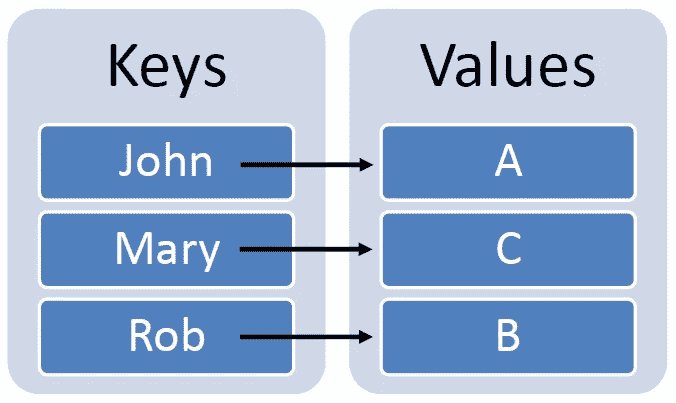
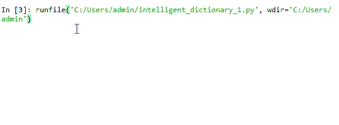
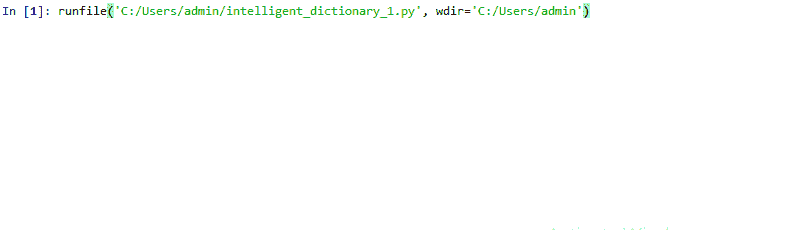

# 设计智能 Python 词典

> 原文：<https://towardsdatascience.com/designing-intelligent-python-dictionaries-cc138ac3f197?source=collection_archive---------13----------------------->

## 设计智能、用户友好的 Python 词典的快速指南


照片由 [Aaron Burden](https://unsplash.com/@aaronburden?utm_source=medium&utm_medium=referral) 在 [Unsplash](https://unsplash.com?utm_source=medium&utm_medium=referral) 上拍摄

上周在做一个业余爱好项目时，我遇到了一个非常有趣的设计问题:

> 你如何处理错误的用户输入？

让我解释一下。



Python 字典示例。来源:作者

Python 中的 [**字典**](https://www.w3schools.com/python/python_dictionaries.asp) 表示成对的**键**和**值**。例如:

```
student_grades = {'John': 'A', 'Mary': 'C', 'Rob': 'B'}# To check grade of John, we call
print(student_grades['John'])
# Output: A
```

当您试图**访问一个不存在的键**时会发生什么？

```
print(student_grades['Maple'])
# Output: 
KeyError                         Traceback (most recent call last)
<ipython-input-6-51fec14f477a> in <module>
----> print(student_grades['Maple'])

KeyError: 'Maple'
```

你收到一个 [**键错误**](https://wiki.python.org/moin/KeyError) 。

> 每当`dict()`对象被请求字典中不存在的`key`的值时，就会发生 KeyError。

当您**接受用户输入**时，这个错误变得极其常见。例如:

```
student_name = input("Please enter student name: ")
print(student_grades[student_name]) 
```

本教程提供了几种方法来处理 Python 字典中的关键错误。

我们将努力构建一个智能 python 字典，它可以处理用户输入中的各种错别字。

来源: [Imgur](https://imgur.com/gallery/ioHfqHA)

# 设置默认值

一个非常*懒惰的*方法是每当请求的键不存在时**返回一个默认值**。这可以使用`get()`方法来完成:

```
default_grade = 'Not Available'
print(student_grades.get('Maple',default_grade))# Output:
# Not Available
```

你可以在这里阅读更多关于`get()`方法[的内容。](https://www.w3schools.com/python/ref_dictionary_get.asp)

# 处理信件案件

让我们假设您有一本包含特定国家人口数据的字典。该代码将要求用户输入一个国家名称，并打印其人口。

```
# Output
Please enter Country Name: France
65
```

但是，让我们假设用户键入输入为`‘france’`。*目前，在我们的字典中，所有键的首字母都是大写的。*输出会是什么？

```
Please enter Country Name: france-----------------------------------------------------------------KeyError                         Traceback (most recent call last)
<ipython-input-6-51fec14f477a> in <module>
      2 Country_Name = input('Please enter Country Name: ')
      3 
----> 4 print(population_dict[Country_Name])

KeyError: 'france'
```

由于`‘france’`不是字典中的一个键，我们收到一个错误。

> **一个简单的变通方法:用小写字母存储所有国家的名称。**

此外，将用户输入的任何内容转换成小写。

```
Please enter Country Name: france
65
```

# 处理错别字

但是，现在假设用户输入的是`‘Frrance’`而不是`‘France’`。我们该如何处理这件事？

来源:[吉菲](https://giphy.com/gifs/hqg-effects-autocorrect-O4EChIxazzrHi)

一种方法是使用 [**条件语句**](https://realpython.com/python-conditional-statements/) 。

我们检查给定的 user_input 是否可以作为键使用。如果它不可用，那么我们打印一条消息。

最好将它放在一个循环中，并在一个特殊的标志输入(如 exit)上中断。

循环将继续运行，直到用户输入`exit`。



输出。来源:作者

# 更好的方法

虽然上述方法**‘有效’**，但它不是我们在介绍中承诺的**‘智能方法’**。

来源: [Giphy](https://giphy.com/gifs/dumb-dummy-i-feel-h8HmN0UcEKR0xWnv3R/links)

我们希望我们的程序是**健壮的**，并检测简单的错别字，如`frrance`和`chhina`(非常类似于谷歌搜索)。

经过一番研究，我找到了几个符合我们需求的库。我最喜欢的是标准 python 库: [**difflib**](https://docs.python.org/3/library/difflib.html) 。

> difflib 可用于比较文件、字符串、列表等，并产生各种格式的差异信息。

该模块提供了各种用于比较序列的类和函数。

我们将使用 difflib 中的两个特性:[**sequence matcher**](https://docs.python.org/3/library/difflib.html#difflib.SequenceMatcher)和[**get _ close _ matches**](https://docs.python.org/3/library/difflib.html#difflib.get_close_matches)。

让我们简单看一下他们两个。如果您只是对应用程序感到好奇，可以跳到下一节。

## **#序列匹配器**

**SequenceMatcher 类用于比较两个序列。**我们将其对象定义如下:

```
difflib.SequenceMatcher(isjunk=None, a='', b='', autojunk=True)
```

*   `isjunk`:用于指定`junk` 元素(空格、换行符等)。)是我们在比较两个文本块时希望忽略的。我们在这里通过`None`。
*   `a`和`b`:我们希望比较的字符串。
*   `autojunk`:自动将某些序列项目视为垃圾的启发式。

让我们用 SequenceMatcher 来比较两个字符串`chinna`和`china`:

在上面的代码中，我们使用了`ratio()`方法。

> ratio **返回序列相似性的度量，作为范围[0，1]** 中的浮点数。


里卡多·戈麦斯·安吉尔在 [Unsplash](https://unsplash.com?utm_source=medium&utm_medium=referral) 上拍摄的照片

## **#获取 _ 关闭 _ 匹配**

现在，我们有了一种**基于相似度比较两个字符串**的方法。

但是，如果我们希望**找到与特定字符串相似的所有字符串**(存储在数据库中)，会发生什么呢？

`get_close_matches()` 从可能性列表中返回包含最佳匹配的列表。

```
difflib.get_close_matches(word, possibilities, n=3, cutoff=0.6) 
```

*   `word`:需要匹配的字符串。
*   `possibilities`:与`word`匹配的字符串列表。
*   可选`n`:返回的最大相近匹配数。默认情况下，*3*；必须大于 *0* 。
*   可选`cutoff`:相似率必须大于该值。默认情况下， *0.6* 。

> 可能性中的最佳 *n* 匹配在一个列表中返回，按相似性得分排序，最相似的排在最前面。

让我们来看一个例子:

# 把所有的放在一起

现在我们已经有了 difflib，让我们把所有的东西放在一起，构建一个防输入错误的 python 字典。

我们必须关注用户给出的`Country_name`在`population_dict.keys()`中不存在的情况。在这种情况下，我们尝试**找到一个与用户输入**名称相似的国家，并输出其人口。

```
# pass country_name in word and dict keys in possibilities
maybe_country = get_close_matches(Country_Name, population_dict.keys())# Then we pick the first(most similar) string from the returned list
print(population_dict[maybe_country[0]])
```

最终的代码将需要考虑一些其他情况。例如，如果**没有相似的字符串**，或者用户确认这是否是他们需要的字符串。看一看:

输出:



Inida 被理解为印度。来源:作者

# 结论

本教程的目标是为您提供一个构建对用户输入健壮的字典的指南。

我们研究了处理各种错误的方法，比如大小写错误和小的错别字。

我们可以在此基础上进一步研究各种其他应用。示例:使用 [NLPs](/your-guide-to-natural-language-processing-nlp-48ea2511f6e1) 更好地理解用户输入，并在搜索引擎中带来附近的结果。

希望你觉得这个教程有用！

# 重要链接

*   [Python 词典介绍](https://www.w3schools.com/python/python_dictionaries.asp)
*   [difflib](https://docs.python.org/3/library/difflib.html) —计算增量的助手