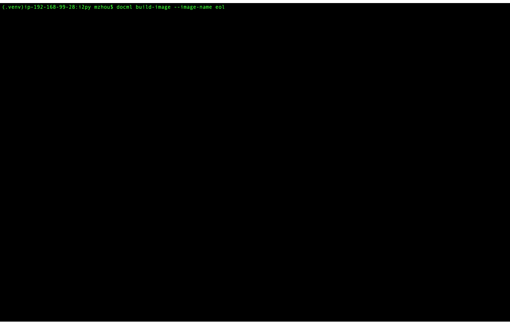
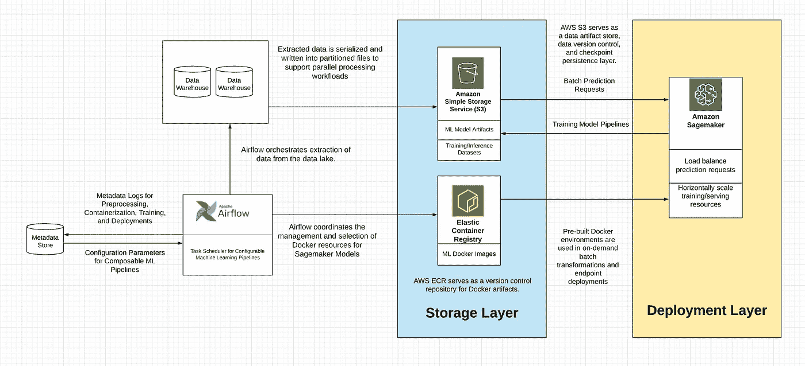

# 为初创公司设计 ML 流程编排系统

> 原文：<https://towardsdatascience.com/designing-ml-orchestration-systems-for-startups-202e527d7897?source=collection_archive---------13----------------------->

## [办公时间](https://towardsdatascience.com/tagged/office-hours)

## *构建轻量级生产级 ML 编排系统的案例研究*

照片由[艾米尔·吉耶莫](https://unsplash.com/@emilegt?utm_source=medium&utm_medium=referral)在 [Unsplash](https://unsplash.com?utm_source=medium&utm_medium=referral) 拍摄

我最近有机会在一家医疗保健初创公司建立了一个机器学习平台。

本文涵盖了架构设计之旅、技术权衡、实现细节和经验教训，作为关于**为初创公司设计机器学习编排平台的案例研究。**

随着机器学习工具生态系统的不断成熟和扩展，为生产数据科学管道构建机器学习编排层的选项并不短缺。更相关的挑战是能够确定哪些工具适合您组织的需求案例。

宝贵的经验是使用数据科学家已经熟悉的工具来构建源代码控制过程。

我们最终得到的工具集是:

*   **版本控制的 SQL 脚本**支持源数据集提取
*   预处理由 Docker 容器中执行的 **Python runner 脚本**抽象的代码，访问数据湖中的静态检查点数据。
*   在一个 **Python 模型类**中抽象的模型训练代码，该模型类自包含用于加载数据、工件序列化/反序列化、训练代码和预测逻辑的函数。
*   **样板瓶 API 端点包装器**，用于执行健康检查并返回推理请求。

端到端的构建和转换模型管道。[来源:图片由作者提供]

以下部分涵盖了最终产品所需的思考过程和实现细节。具体的系统架构可能无法推广到所有的组织，但这个案例研究可以提供一个有用的思考练习，告诉我们如何通过**选择正确的工具**和**比较架构权衡**。

> 构建该平台的设计流程始于建立正确的引导性问题，引导架构讨论。这有助于在技术构建过程中形成有利于权衡的框架。

# **指导性问题**

*   服务的目标用户是谁？他们目前使用什么技术技能，他们愿意学习什么技能？
*   用户需要什么样的数据访问模式，会产生什么类型的推论？数据 ETL 是如何在组织内部发生的？
*   数据流的新鲜度要求是什么？
*   哪些组件需要监控？哪些指标有用？
*   模型版本多久升级一次？

在提出一个[架构决策记录(ADR)提案](https://github.blog/2020-08-13-why-write-adrs/)后，该提案列出了问题范围和初始架构，团队和我就如何实现 POC 达成了一个粗略的计划。

# **关键决策**

*   我们需要一个**源代码控制过程来规范模型部署模式。**
*   **Docker 图像应作为便携性、再现性和缩放模型解决方案的常见选择**。
*   **AWS Sagemaker 将成为虚拟化资源管理的编排支柱**，用于部署 API、管理批量转换作业、身份验证、管道可观察性和负载平衡推理流量。
*   **Airflow 将充当任务编排系统**，而 Sagemaker 负责资源分配——调度和执行是分离的。
*   我们需要一个**共享状态控制器应用程序**来协调和管理 Sagemaker 操作。
*   **SQLAlchemy ORMs 可以构建数据模型，**结合了用于资源状态转换的有限状态机**，**清晰地分离了机器学习模型生命周期的步骤，并限制了重复的 Sagemaker 操作。
*   对于用户来说，管道的配置和执行应该尽可能接近**一键部署**。

确定了关于工具和关键特性的更高层次的问题后，我花了几个月的时间在这个框架上提炼一个最小可行的产品。这是我第一次从零开始构建机器学习平台，因此出现了许多意想不到的实现挑战，需要在整个编码过程中做出一些决策。

机器学习编排概念验证系统的架构设计。[来源:图片由作者提供]

# “完成”是什么样子的？

*   保持第一个模型简单，并获得正确的基础设施。
*   一个好的选择是以“中立的第一次启动”为目标，明确降低机器学习收益的优先级。

**第一步是确定我们如何知道我们什么时候完成了**。为了奠定最初的基础设施和集成测试，我们设定了一个目标，即部署一个中立的首次发布，而不考虑机器学习模型的性能。我们的想法是保持第一个模型简单，并获得正确的基础设施。[这个想法的灵感来自于谷歌将有效的机器学习框架形式化的规则。](https://developers.google.com/machine-learning/guides/rules-of-ml/)

> 最初部署的几个模型可能是高价值、易实现的成果，不需要复杂和花哨的功能来进行培训和部署。

重点应该是:

*   数据存储和计算是如何协调的？
*   确定系统的成功和失败状态。
*   将模型集成到您的框架中——如何触发离线批处理计算，以及如何部署和关闭实时 API 端点？

目标是从简单的功能开始:

*   确认训练数据被正确地接收、转换并适合模型。
*   模型重量分布看起来很合理。
*   特征数据可以正确访问离线和在线模型进行推理。

# **测试**

*   测试基础设施*独立于机器学习*。
*   在 CI/CD 中对机器学习模型进行单元测试既困难又浪费精力— *使用测试数据夹具为 docker 镜像*编写集成测试。
*   在导出模型之前检测问题*。*

确保基础设施具有单元测试和集成测试，并且系统的学习部分被封装以允许 fixtures 和 stubs 模拟运行时条件。

具体来说:

1.  测试将数据输入算法。理想情况下，通过定义数据质量的可接受性阈值来检查缺失的要素列。
2.  如果隐私政策允许，对训练算法的输入进行手动检查可能是一个很好的健全检查。
3.  关于训练数据和服务数据分布的统计数据是对抗概念漂移的一个有价值的监视器。
4.  测试算法产生的模型工件。经过训练的模型应该是可再现的，并且在相同的数据上与服务模型具有同等的性能。

# **配置**

*   配置应尽可能集中在上游*。采购配置的选项可以通过数据库表配置，也可以通过受源代码控制的 YAML 文件。*
*   *配置灵活性应根据用户变更的预期频率以及管道稳定性需求来确定。配置可以在源代码控制之外更改吗？一个 ML 服务能容忍一个坏的配置造成的中断吗？*

*启用和管理机器学习计划是一项概率性工作。很难预测哪些问题容易或难以解决，以及哪些方法和模型配置将产生最佳模型。开发一个好的模型经常需要许多次优的迭代，开发的速度是非线性的。由于不同的背景、开发风格和价值观，机器学习和工程团队之间可能存在文化差距。*

*这些项目成功的一个关键衡量标准是减少对部署到产品中的模型数量的关注，而更多地关注测试模型被执行的迭代次数。在机器学习产品领域，实现快速、轻量级的实验比构建复杂、功能繁多的研发模型更有价值。*

> *因此，简单、轻量级 ML 模型的模型可移植性和易于配置是比投资复杂、高强度的 R&D 算法支持(如 Tensorflow、Pytorch 或 Spark 框架)更有价值的初始目标。*

# ***任务编排***

*   **Dag 工作流应该在工作流开始时实例化一次运行时参数*,并将参数推送到任务。*
*   **存储成本低廉* —在数据提取、预处理和训练过程中，只要有可能，检查点和持久化数据计算会更安全。*
*   **确保你像发球一样训练的最好方法是保存发球时使用的功能集，然后将这些功能传送到日志中，以便在训练时使用。**

# ***API 端点***

*   **共享状态控制器应用程序跨部署正确地对 Sagemaker Sagemaker 型号*进行版本控制，以支持蓝绿色部署和金丝雀型号。*
*   **不同 Sagemaker API 有效负载字典的注册表*为操作调用定义默认参数，在运行时调用时注入定制配置。*
*   **S3 是我们选择的工件存储框架。*我们需要一组实用函数来标准化跨推理、训练、序列化和墓碑文件的 S3·URI 命名空间的构造。*

*将模型部署为用于实时推理的 API web 服务的关键步骤:*

*   ***调用模型:**为模型编写一个轻量级 API 来处理推理请求，并返回预测、输入数据、模型元数据属性，以及附加唯一的事务 id 来构建审计跟踪。*
*   ***虚拟化:**用适当网络覆盖、认证协议和应用程序路由将 API 对接并部署到集群。*
*   ***水平可伸缩性:**配置自动伸缩、负载平衡、日志、认证协议和任何其他需要的基础设施。*

*除了简单地建立一个 ML API 端点所需的工作之外，还需要考虑如何在构建新模型时提高开发人员的工作效率。*

*   *API 推理访问模式在部署的模型中是相当统一的吗？也许这些轻量级端点中的大多数都可以通过样板代码抽象出来。*
*   *什么类型的推理请求最常见？如果吞吐量比延迟更有价值，那么用输入文件构建批量预测功能可能比启用实时 API 点推断更优先。*
*   *用于培训和服务的数据 ETL 是主要来自几个不同的数据存储库，还是有一组高度多样化的管道输入？这些输入多久改变一次？自助式数据 ETL 可以由数据库表配置快速驱动，或者通过在源代码控制存储库中配置 YAML 文件来稳定，但灵活性较低。*

# ***监控***

*   **你们型号的性能退化率是多少？*一天中准确性指标损失的百分比是多少？一个月？四分之一？通过计算这一退化率，您可以确定模型的重新训练新鲜度要求的优先级。*
*   **在持久化工件和部署到生产之前投资测试。*鉴于 CI/CD 文化和通过测试而不是监控来捕捉错误的最佳实践，这似乎是不言而喻的，但机器学习模型除了对推理管道上的数据流进行集成测试之外，还需要对模型权重分布和推理准确性进行回归测试。*

*有三个典型的问题会降低已部署的 ML 模型的性能。*

*   ***概念漂移**:随着时间的推移，由于训练数据和真实世界服务数据之间的数据分布漂移越来越大，生产模型的准确性会降低。现有的客户偏好可能会改变。*
*   ***地区**:在给定背景(即地理、人口统计、行业)下训练的模型在外推至新群体时表现更差。随着新用户加入模型，新客户可能会对数据集引入新的偏好。*
*   ***数据质量** : ML 模型对无声数据故障特别敏感，例如，陈旧的引用表、事件流中特定列的中断、上游数据集的新词汇或模式，或者进入数据集的畸形数据。*

# *一路走来的经验教训*

*   **仅在适当的时候添加流程* —机器学习编排框架的成功不是你成功地将多少模型部署到生产中，而是启用的实验的数量。*
*   *不依赖于框架。围绕工具的决策过程应由 ML 服务需求、数据科学产品用户的规模和专业知识、云供应商和行业隐私政策等组织因素以及内部数据平台的成熟度来驱动。*
*   **向抽象方向构建*。数据科学管道中可以抽象出来的部分越多，测试每个组件和从检查点重启失败的管道就越容易。*
*   **瞄准中立的首发*。这消除了展示已部署的 ML 模型的直接价值的压力，并允许将空间集中在获得基础设施、许可和胶水上，以使架构可操作。*

*在我探索 ML 资源和框架的过程中，我遇到了这些惊人的博客、文章和演示文稿，它们帮助指导了我的旅程。我把它们列在这里，是为了方便那些希望更深入地编写和建模机器学习管道的人:*

*   *[谷歌的机器学习工程规则](https://developers.google.com/machine-learning/guides/rules-of-ml/)*
*   *[O'Reilly 在机器学习服务方面的经验教训](https://www.oreilly.com/radar/lessons-learned-turning-machine-learning-models-into-real-products-and-services/)*
*   *[ML 的工具框架和数据治理](https://www.oreilly.com/content/specialized-tools-for-machine-learning-development-and-model-governance-are-becoming-essential/)*
*   *[用于机器学习部署的 Cortex.ai 架构](https://cortexmetrics.io/docs/architecture/)*

*欢迎在 [LinkedIn](https://www.linkedin.com/in/matthew-zhou/) 、 [Twitter](https://twitter.com/matthewyzhou) 、 [Github](https://github.com/matthewzhou) 或 [Medium](https://medium.com/@mattzhou) 上与我联系！*