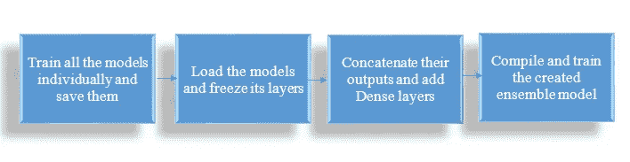
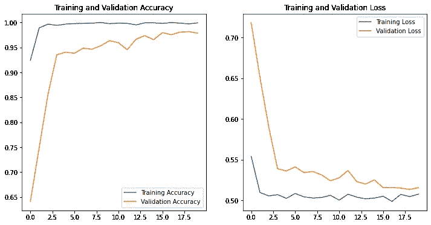
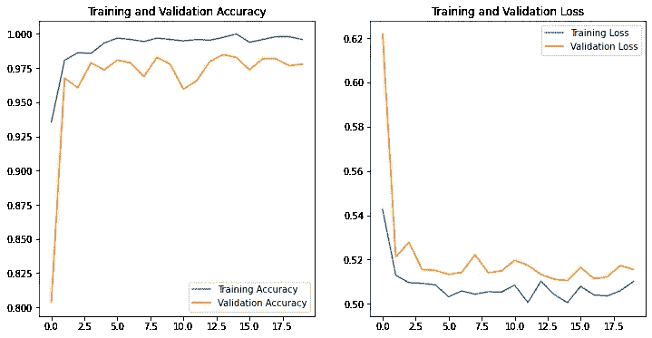
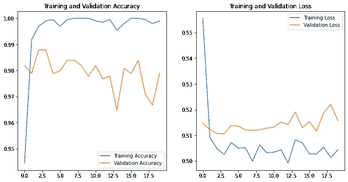
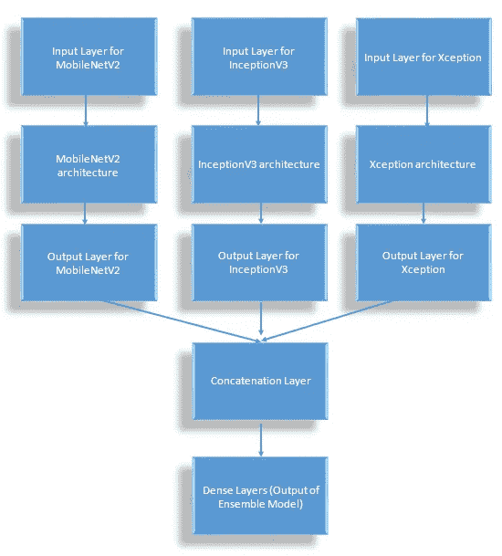
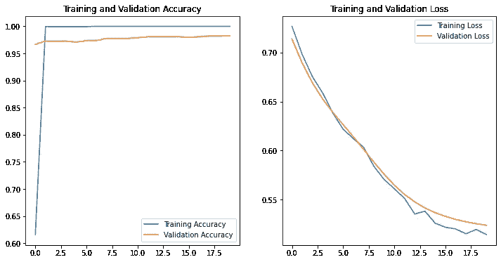

# 基于预训练模型集成的破坏性图像分类

> 原文：<https://towardsdatascience.com/destroy-image-classification-by-ensemble-of-pre-trained-models-f287513b7687?source=collection_archive---------24----------------------->

## 通过在 Tensorflow 中制作预训练网络(如 InceptionV3、MobileNetV2 和 Xception)的集成堆叠集成模型，消除图像分类任务


[杆长](https://unsplash.com/@rodlong?utm_source=medium&utm_medium=referral)在 [Unsplash](https://unsplash.com?utm_source=medium&utm_medium=referral) 上拍照

预先训练的网络非常酷。它们提供了很高的精确度，并且不需要花很多时间来训练。那么有什么能比预先训练好的网络更好呢？用其中的两个。最好用三个。或者事实上，使用多少你想要在一起作为一个系综模型和破坏图像分类任务。

# 要求

如果你想编码，你需要 Tensorflow 和 OpenCV。你也可以像我一样使用 Google Colab，它会预装我们任务所需的所有软件包，还提供免费的 GPU。

# 加载数据集

被选择消灭的数据集是经典的猫对狗数据集。由于它是一个小数据集，我们将把它完全加载到内存中，以便它训练得更快。

```
import tensorflow as tf
import os
import numpy as np
import matplotlib.pyplot as plt
import re
import random
import cv2_URL = 'https://storage.googleapis.com/mledu-datasets/cats_and_dogs_filtered.zip'
path_to_zip = tf.keras.utils.get_file('cats_and_dogs.zip', origin=_URL, extract=True)
PATH = os.path.join(os.path.dirname(path_to_zip), 'cats_and_dogs_filtered')train_dir = os.path.join(PATH, 'train')
validation_dir = os.path.join(PATH, 'validation')train_cats_dir = os.path.join(train_dir, 'cats')
train_dogs_dir = os.path.join(train_dir, 'dogs')
validation_cats_dir = os.path.join(validation_dir, 'cats')
validation_dogs_dir = os.path.join(validation_dir, 'dogs')cats_tr = os.listdir(train_cats_dir)
dogs_tr = os.listdir(train_dogs_dir)
cats_val = os.listdir(validation_cats_dir)
dogs_val = os.listdir(validation_dogs_dir)cats_tr = [os.path.join(train_cats_dir, x) for x in cats_tr]
dogs_tr = [os.path.join(train_dogs_dir, x) for x in dogs_tr]
cats_val = [os.path.join(validation_cats_dir, x) for x in cats_val]
dogs_val = [os.path.join(validation_dogs_dir, x) for x in dogs_val]total_train = cats_tr + dogs_tr
total_val = cats_val + dogs_val
```

所有训练和验证(在本例中为测试)图像的路径都存储在 total_train 和 total_val 中。我们将使用 OpenCV 来读取图像，并将它们存储在具有维度(图像数量 x 图像形状 x 通道)的 NumPy 数组中。它们对应的标签也将存储在一维 NumPy 数组中。

```
def data_to_array(total):
    random.shuffle(total)
    X = np.zeros((len(total_train), 224, 224, 3)).astype('float')
    y = []
    for i, img_path in enumerate(total):
        img = cv2.imread(img_path)
        img = cv2.resize(img, (224, 224))
        X[i] = img
        if len(re.findall('dog', img_path)) == 3:
            y.append(0)
        else:
            y.append(1)
    y = np.array(y)
    return X, yX_train, y_train = data_to_array(total_train)
X_test, y_test = data_to_array(total_val)
```

# 创建集合模型



要遵循的步骤

## 训练单个模型并保存它们

我们的第一个任务是创建所有单独的模型。我将使用 MobileNetV2、InceptionV3 和 Xception 创建三个不同的模型。在 Tensorflow 中，使用预先训练的网络创建模型非常容易。我们需要加载权重，决定是冻结还是解冻加载的权重，最后添加密集层，使输出达到我们想要的效果。我将为我的模型使用的基本结构:

```
def create_model(base_model):
    base_model.trainable = True
    global_average_layer = tf.keras.layers.GlobalAveragePooling2D()(base_model.output)
    prediction_layer = tf.keras.layers.Dense(1, activation='sigmoid')(global_average_layer)
    model = tf.keras.models.Model(inputs=base_model.input, outputs=prediction_layer)
    model.compile(optimizer=tf.keras.optimizers.Adam(lr=0.0001), loss=tf.keras.losses.BinaryCrossentropy(from_logits=True), metrics=["accuracy"])
    return model
```

在创建我们的模型之后，我们需要将它们与我们的训练数据进行一些时期的拟合。

```
batch_size = 32
epochs = 20def fit_model(model):
    history = model.fit(X_train, y_train,
                        batch_size=batch_size,
                      steps_per_epoch=len(total_train)//batch_size, 
                        epochs=epochs, 
                        validation_data=(X_test, y_test), 
                        validation_steps=len(total_val)//batch_size)
    return historyIMG_SHAPE = (224, 224, 3)
base_model1 = tf.keras.applications.MobileNetV2(input_shape=IMG_SHAPE, include_top=False, weights="imagenet")
base_model2 = tf.keras.applications.InceptionV3(input_shape=IMG_SHAPE, include_top=False, weights="imagenet")
base_model3 = tf.keras.applications.Xception(input_shape=IMG_SHAPE, include_top=False, weights="imagenet")model1 = create_model(base_model1)
model2 = create_model(base_model2)
model3 = create_model(base_model3)history1 = fit_model(model1)
model1.save('models/model1.h5')history2 = fit_model(model2)
model2.save('models/model2.h5')history3 = fit_model(model3)
model3.save('models/model3.h5')
```

让我们看看我们的模特们自己的表现。



MobileNetV2 的结果



InceptionV3 的结果



例外的结果

结果一点也不差，但我们仍将改进它们。

## 加载模型并冻结其图层

我们的下一步是加载我们刚刚在上面创建的模型，并冻结它们的层，这样当我们在它们上面安装我们的集合模型时，它们的权重不会改变。

```
def load_all_models():
    all_models = []
    model_names = ['model1.h5', 'model2.h5', 'model3.h5']
    for model_name in model_names:
        filename = os.path.join('models', model_name)
        model = tf.keras.models.load_model(filename)
        all_models.append(model)
        print('loaded:', filename)
    return all_modelsmodels = load_all_models()
for i, model in enumerate(models):
    for layer in model.layers:
        layer.trainable = False
```

## 连接它们的输出并添加密集层

将所有模型的输出放入一个连接层。然后添加具有一些单元的密集层，接着是具有单个输出和激活等于“sigmoid”的密集层，因为我们的任务是二进制分类。这可以被认为是一个人工神经网络，其中所有模型的预测作为输入，并提供一个输出。

```
ensemble_visible = [model.input for model in models]
ensemble_outputs = [model.output for model in models]
merge = tf.keras.layers.concatenate(ensemble_outputs)
merge = tf.keras.layers.Dense(10, activation='relu')(merge)
output = tf.keras.layers.Dense(1, activation='sigmoid')(merge)
model = tf.keras.models.Model(inputs=ensemble_visible, outputs=output)
```

## 编译和训练集合模型

我使用了经典的“Adam”优化器，学习率略高，为 10x-3，来编译模型。

```
model.compile(optimizer=tf.keras.optimizers.Adam(lr=0.001), loss=tf.keras.losses.BinaryCrossentropy(from_logits=True), metrics=["accuracy"])
```

让我们看看我们的模型现在是什么样子。



集合模型

我们能像训练我们的个体模型一样，通过传递数据集来训练它吗？不要！在三个地方需要输入，而只产生一个输出。所以我们需要像这样配置我们的 X 值。

```
X_train = [X_train for _ in range(len(model.input))]
X_test = [X_test for _ in range(len(model.input))]
```

现在我们可以像以前一样拟合模型了。

```
history = model.fit(X, y_train,
                    batch_size=batch_size,
                    steps_per_epoch=len(total_train) // batch_size,
                    epochs=epochs, 
                    validation_data=(X_1, y_test),
                    validation_steps=len(total_val) // batch_size)
```

# 结果

首先，让我们为系综模型绘制图表。



集合模型的结果

我只对它进行了 20 个时期的训练，但看一下损失曲线就可以看出，曲线仍在下降，模型可以再训练一些时期。让我们看看这些模型在它们最后的时代给出了什么样的验证精度。

```
MobileNetV2 acc: 0.9788306355476379
InceptionV3 acc: 0.9778226017951965
Xception acc: 0.9788306355476379
**Ensemble acc: 0.9828628897666931**
```

总体精度几乎提高了 0.5%，如果考虑到之前的精度为 97.8%，这是一个巨大的提高。

以这种方式创建集合模型是一个非常长的过程。它需要比单一模型多四倍的努力，然而，它可以帮助获得多一点的准确性，这是很难获得的，一旦我们达到 90 以上的准确性。下面你可以找到完整的代码。

在结束之前，我想对这篇[文章](https://machinelearningmastery.com/stacking-ensemble-for-deep-learning-neural-networks/)给予一些肯定，它帮助我完成了这篇文章。