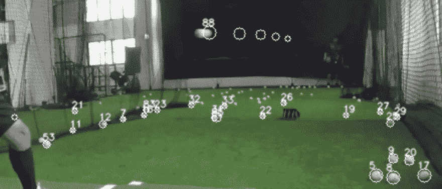
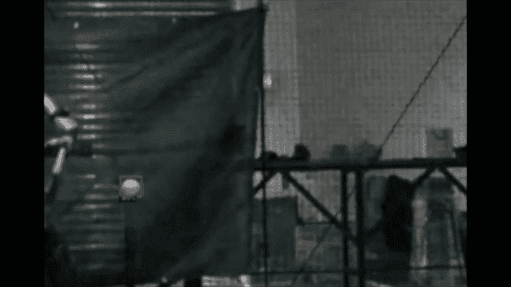
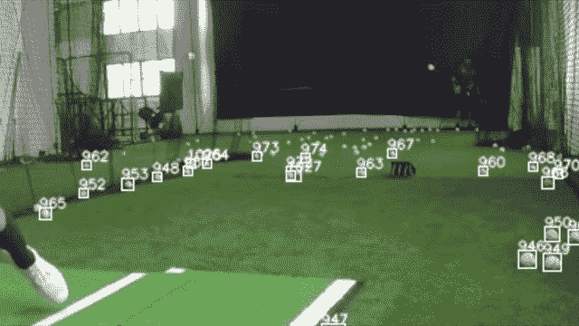
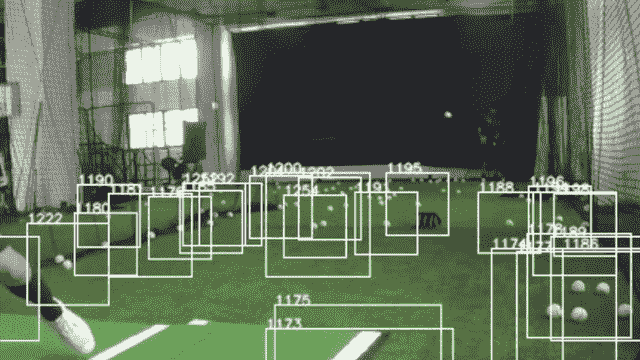
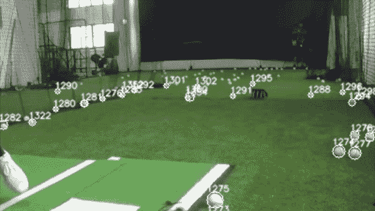
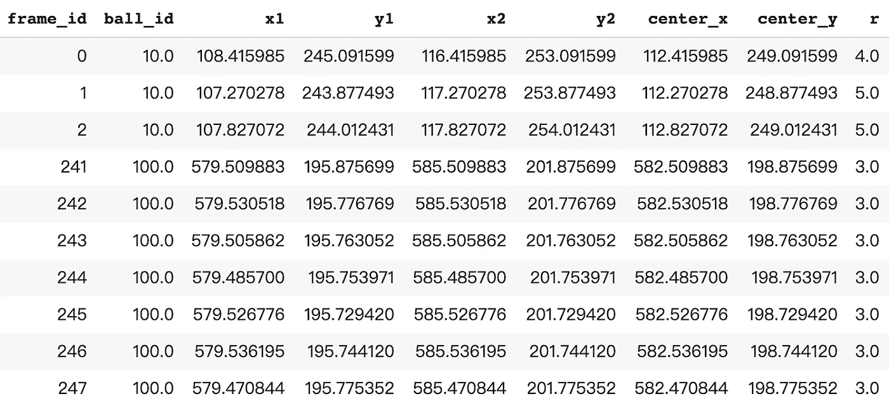

# 使用检测器 2 对象检测和分类跟踪来检测和跟踪棒球

> 原文：<https://towardsdatascience.com/detect-and-track-baseball-using-detectron2-and-sort-6dd92a46e6f2?source=collection_archive---------19----------------------->

## 当视频中有多个棒球时，我如何跟踪棒球。



棒球检测和跟踪。

# 介绍

在我的[上一篇文章](/how-to-build-a-baseball-detector-using-detectron2-50b44edec6b7)中，我使用 Detectron2 训练并构建了一个模型来检测视频中的棒球。

[](/how-to-build-a-baseball-detector-using-detectron2-50b44edec6b7) [## 如何使用 Detectron2 构建棒球检测器

### 使用自定义数据集的 Train Detectron2 对象检测。

towardsdatascience.com](/how-to-build-a-baseball-detector-using-detectron2-50b44edec6b7) 

使用探测器 2 的棒球探测。(来自[我之前的帖子](/how-to-build-a-baseball-detector-using-detectron2-50b44edec6b7))

它工作得很好，能够在大多数画面中捕捉到球。然而，将该模型应用于真实棒球练习视频的一个潜在问题是，视频中可能有不止一个棒球，如第一幅图所示。这个问题使得很难提取精确球的信息，例如球的速度和飞行角度。

解决这个问题的一个可能的方法是跟踪球并给它们分配唯一的 id，然后我可以计算每个球的信息并选择我想要的球。

有几种方法来跟踪物体，我决定使用亚历克斯·比雷的[排序](https://github.com/abewley/sort)(简单的在线和实时跟踪)。详细介绍和论文可以在作者的报告中找到。我将在这篇文章中重点讨论实现。

[](https://github.com/abewley/sort) [## abewley/排序

### 视频序列中 2D 多目标跟踪的简单在线实时跟踪算法。查看示例…

github.com](https://github.com/abewley/sort) 

# 棒球追踪——排序

我使用了 Google Colab，所以我首先安装了我的 Google Drive，并将 sort.py 复制到这个文件夹中。然后我安装了排序和导入的需求。

```
!cp "gdrive/My Drive/Colab Notebooks/object_tracking/sort.py" .
!pip install filterpyfrom sort import *
```

然后我调用了排序对象

```
mot_tracker1 = Sort(max_age=3, min_hits=1, iou_threshold=0.15)
```

max_age、min_hist 和 iou_threshold 是可以根据要求进行调整的参数。

然后，我通过每帧更新跟踪器，将分类跟踪器集成到对象检测循环中。

```
track_bbs_ids = mot_tracker1.update(dets)
```

dets 是一个 numpy 检测数组，格式为[[x1，y1，x2，y2，score]，[x1，y1，x2，y2，score]，…]。

它将返回一个数组[[x1，y1，x2，y2，ID]，[x1，y1，x2，y2，ID]，…]。ID 是由 SORT 分配的唯一焊球 ID。

必须注意的是，即使在检测到空帧的情况下，也必须对每一帧调用该函数。无检测时使用 np.empty((0，5))。

然后我通过绘制边界框和 id 来可视化它。



球跟踪。

结果挺好的。地面上的球被检测到并被分配了 id。然而，快速移动的球并没有通过排序分配给任何 ID。这可能是由于框架之间的球的距离太大，球的尺寸太小。框架之间的边界框没有重叠，因此排序将它们视为不同的球。

我试验了上面显示的排序参数，并做了一些变通来解决这个问题。

为了进行排序，我手动将边界框变大，因此帧之间的重叠变大。



球跟踪。

现在飞球可以被捕获并分配到一个唯一的 ID。

最后，我可以反转并可视化真实的边界框。我把盒子转换成圆形，这样更适合球形的球。我还为球添加了一个尾巴来显示轨迹。



球跟踪

看起来不错！在这一点上，我有每一帧的球检测 ID。在探测循环期间，我存储在一个列表中，并将其转换为 pandas dataframe 以供进一步分析。



熊猫数据框中的球检测细节。

# 接下来:

1.  检测效果不是很好，一些球没有被识别出来，还有一些噪音，比如白手套，鞋子等等。被鉴定为鲍尔。我需要扩展训练数据集并改进检测模型。
2.  检测速度有点慢，也许可以尝试不同的架构。
3.  从侧面拍摄视频，这样我就可以在不考虑失真的情况下计算速度和角度。

感谢阅读，欢迎反馈和建议！

在这里支持我:[https://medium.com/@c.kuan/membership](https://medium.com/@c.kuan/membership)