# 检测后院的动物——深度学习的实际应用。

> 原文：<https://towardsdatascience.com/detecting-animals-in-the-backyard-practical-application-of-deep-learning-c030d3263ba8?source=collection_archive---------3----------------------->

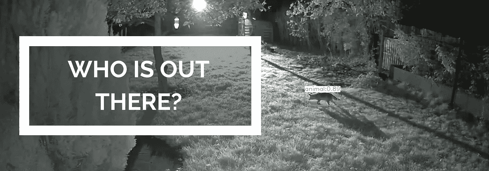

这篇文章基于我在真实(和农村)生活情况中应用现有深度学习技术的经验。

我将展示如何将深度学习技术应用到实践中，并从中获得乐趣。

您可以从 [my Github repo](https://github.com/gaiar/animal-detector/tree/dev) 获得完整代码。

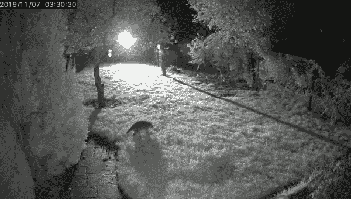

后院发现浣熊

# 动机

你可能已经从我以前的帖子中了解到，我是一个“自然爱好者”，当我们不在的时候，我总是想知道我们的乡间别墅后院发生了什么。狐狸到处游荡或浣熊在屋顶上行走的谣言是真实的还是只是故事？

牢记这一点，我安装了夜视运动启动摄像机对准我们的后院，并开始捕捉拜访我们的夜间物种。

首先，我在回顾自己的录音，发现即使每个人都睡着了，那里的生活仍在继续。相机证明，狐狸和浣熊是相当频繁的访客，知道我想保持跟踪他们。但是我不能每晚都录自己的节目，只挑选有趣的。

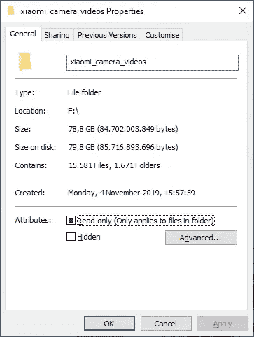

一台摄像机拍摄半年视频。因为树的移动导致了大量的误报。

因此，我需要一个自动化系统来区分由于风或快速光照条件变化而导致的树木移动的假阳性和真实的动物移动。

我已经决定检验一下是否有可能从现有的开源技术中获得优势，而不需要成为这方面的专家，也不需要在任何云解决方案和硬件上花费大量金钱。

**这些动物来自哪里？**

大约三分之一的勃兰登堡州被 15 个自然保护区占据(1 个国家公园、3 个生物圈保护区和 11 个自然公园)

在[的 Brandeburgs iNaturalist 页面](https://www.inaturalist.org/places/29473#taxon=40151)上，你可以数出 23 种不同的哺乳动物，其中至少有 5 种是我在自家后院捕捉到的。

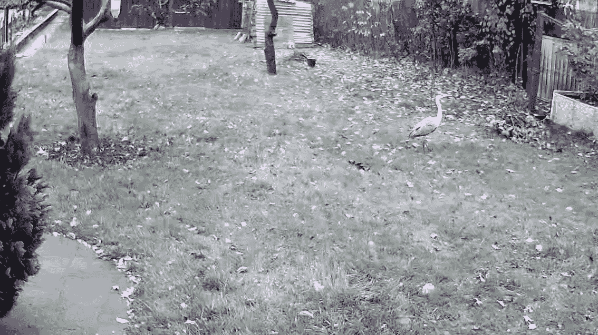

苍鹭落在后院。

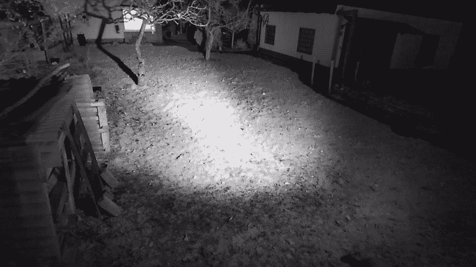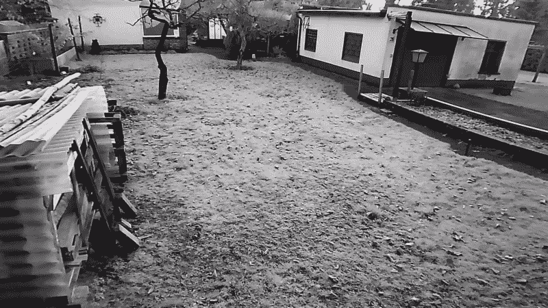

其中至少有一只是松鼠。还是两者都有？

# 它是如何工作的？

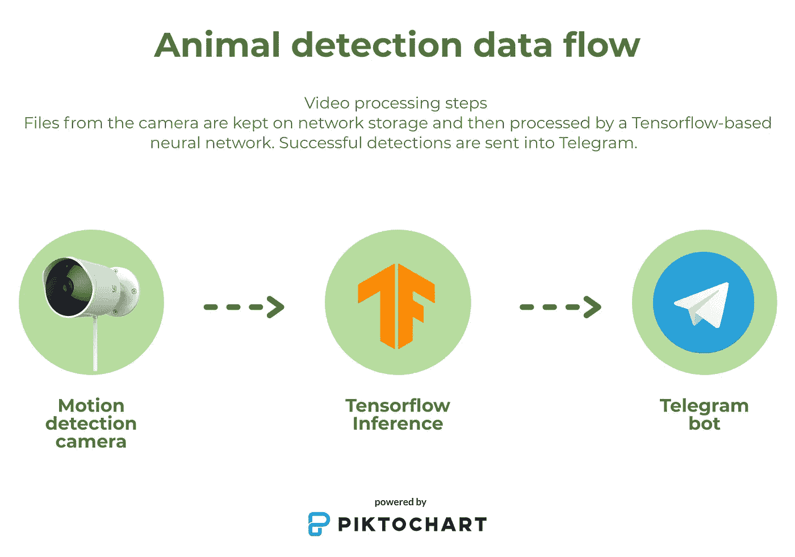

1.  **捕捉:** IP 户外摄像机捕捉运动并保存视频
2.  **Store:** 运行在 Raspberry Pi 3 上的 Small bash 通过 FTP 下载所有新视频，并保存到 NAS 存储中
3.  **分析:**使用 GPU 加速 Tensorflow 的 Python 应用程序对传入的视频文件进行推理，并在有检测的情况下生成新视频
4.  **分享:** Python 应用更新 Telegram bot，发送新的检测视频

在接下来的部分中，我将经历每一步，并与你分享我的发现。

# 捕获

为了捕捉运动，我使用了两个小米/小米户外相机，通过黑客固件扩展了相机功能。这是一款非常可爱又实惠的相机，你可以在户外使用，不用担心会摔坏。

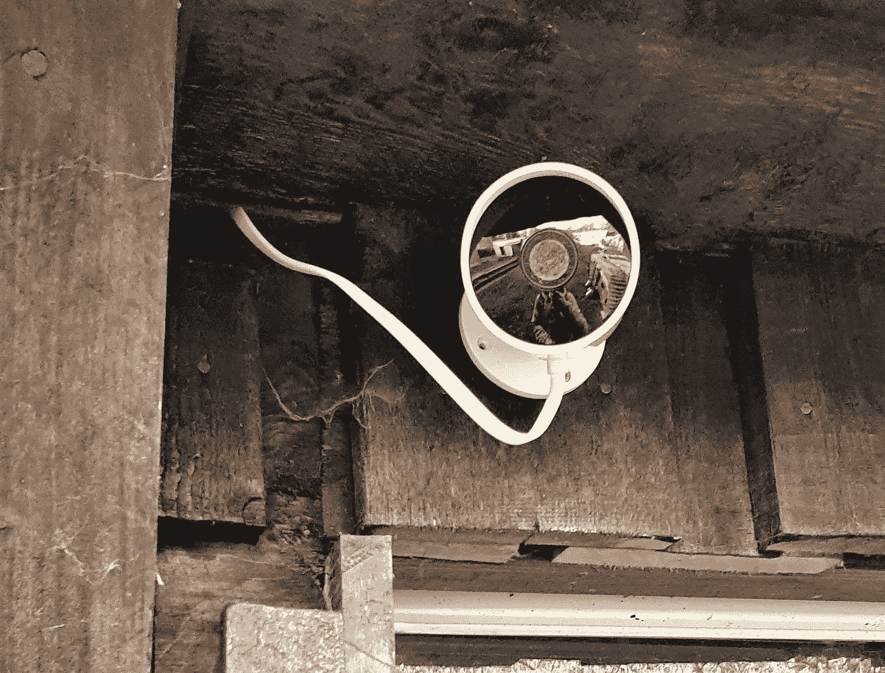

摄像头指向后院

[被黑版本的固件](https://github.com/TheCrypt0/yi-hack-v4)增加了所需的功能，如 FTP 服务器和 RTSP 流，以便与家庭助理等软件集成

# 商店

这是一个简单的部分。

在我的本地 Raspberry Pi 上，我已经向 cron 添加了一个小型 bash 脚本，用于下载所有新的视频文件，并将它们存储到 USB“Lots-Of-TBs”驱动器中。

我根据这里的说明改编了一个脚本:[https://askubuntu . com/questions/758640/how-to-automatically-sync-the-contents-of-a-local-folder-with-the-contents-of-a](https://askubuntu.com/questions/758640/how-to-automatically-sync-the-contents-of-a-local-folder-with-the-contents-of-a)

用于从摄像机中提取视频的 Cron 脚本

# 分析

所有收到的文件都通过 OpenCV 进行处理，并使用 Tensorflow 进行分析

这是需要根据硬件对软件进行适当调整的部分。正如你可能理解的那样，在乡下，你不会让庞大的服务器保持运行，所以你需要从你负担得起的设备中获取最大的收益。


旅程的开始

1.  安装 OpenCV
2.  多重处理视频阅读器
3.  张量流模型兆探测器
4.  一批
5.  可能的优化:图形优化，TensorRT

由于我没有数据、资源和时间来训练我自己的动物检测神经网络，我在网上搜索今天可用的内容。我发现，即使有最先进的神经网络和从世界各地收集的数据，这项任务也不像看起来那么简单。

当然也有做动物检测的产品和研究。尽管如此，与我所寻找的有一个主要区别——他们从照片相机或智能手机相机中检测生物，这样的照片在颜色、形状和质量上与你用运动检测相机获得的照片不同。

但是，不管怎样。仍然有一些项目和我的目标一样。我的搜索把我带到了微软的 [CameraTraps 项目。据我所知，他们正在使用从世界各地不同的野生动物摄像机收集的数据构建图像识别 API。因此，他们开源了预先训练的模型，用于检测图像上是否出现“动物”或“人”，称为“](https://github.com/microsoft/CameraTraps) [MegaDetector](http://dmorris.net/misc/cameratraps/ai4e_camera_traps_overview/) ”

该模型的主要限制来自模型的名称。它只是一个“探测器”，而不是一个“分类器”

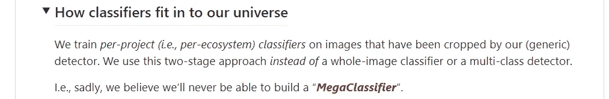

微软关于检测器和分类器的声明

即使考虑到这样的限制，这样的方法确实非常适合我。

该模型被训练成检测三种不同的类别:

1.  动物
2.  人
3.  车辆

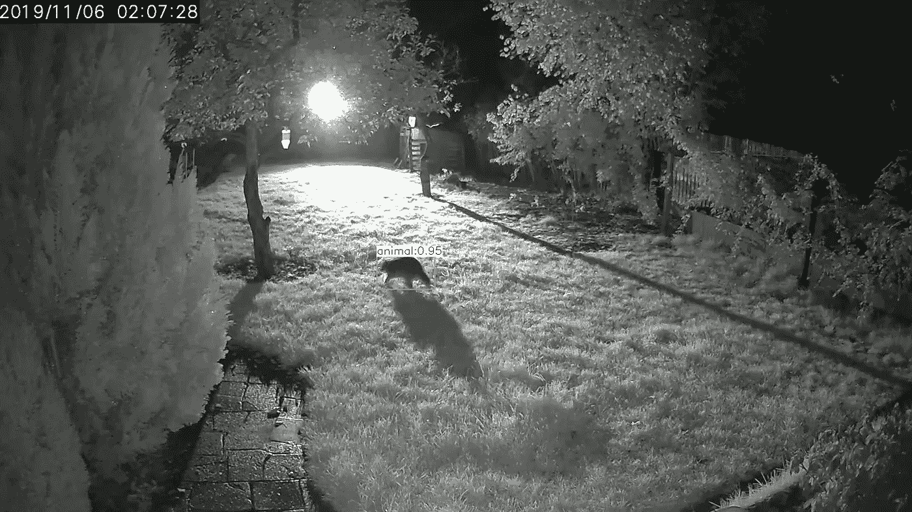

浣熊被认定为“动物”类

在大多数情况下，当谈到视频对象检测时，您会在各种博客帖子中找到实时视频。我的情况有点不同——作为输入，我有一大堆由摄像机产生的视频文件，作为输出，我也想要视频文件。

用于在 Python 中读写视频文件——事实上被认为是 OpenCV 库。我也发现它是我最喜欢的图像处理包。

对视频文件进行推理的逻辑非常简单:

1.  **阅读:**从视频中获取一帧
2.  **检测:**对图像进行推断
3.  **写:**如果有检测，保存一帧视频到新文件。
4.  **重复:**运行步骤 1-3，直到视频结束

它可以用这个代码示例来实现

使用 OpenCV VideoReader 进行 Tensorflow 对象检测

尽管这种简单的方法在同一个线程读写时有几个瓶颈，但它是有效的。因此，如果你正在寻找一个代码来在视频上尝试你的模型，检查[那个脚本](https://tensorflow-object-detection-api-tutorial.readthedocs.io/en/latest/camera.html)。

我花了大约 10 分钟来处理一个全高清 1 分钟 10 FPS 的视频文件。

```
Detection took 9 minutes and 18.18 seconds. Average detection time per frame: 0.93 seconds
```

但是你可以找到很多这样的教程——告诉你如何运行一个普通的 OpenCV/Tensorflow 推理。具有挑战性的部分是如何让代码持续运行并具有良好的性能。

## 输入/输出块

根据提供的代码，读取帧、检测和写回都在同一个循环中发生，这意味着迟早有一个操作会成为瓶颈，例如，从“不太稳定”的网络存储中读取视频文件。

为了去掉这一部分，我使用了来自一个出色的计算机视觉博客 [Adrian Rosebrock](https://www.pyimagesearch.com/author/adrian/) 和他的库 [imutils](https://github.com/jrosebr1/imutils) 的指令。他提供了将读取帧和处理帧分割成多个线程的方法，这种方法为我提供了一个预先填充好的帧队列，准备进行处理。

[Adrian rose Brock 修改的文件视频流](https://gist.github.com/gaiar/9cac5c741ff3c8bafe79dfa275456709)

它不会对推断时间产生太大影响，但它有助于慢速驱动器，这些驱动器通常用于视频存储。

## 优化:图形分析

我听说的另一部分是优化部署模型。我遵循了一个在这里发现的指南:[https://towards data science . com/optimize-NVIDIA-gpu-performance-for-efficient-model-inference-F3 e 9874 e 9 FDC](/optimize-nvidia-gpu-performance-for-efficient-model-inference-f3e9874e9fdc)并通过分配非 GPU 支持的层在 CPU 上处理来实现一些改进。

```
[INFO] :: Detection took 8 minutes and 39.91 seconds. Average detection time per frame: 0.86 seconds
```

## 批量推断

根据我以前的经验，深度学习训练的瓶颈之一是从磁盘到 GPU 的数据传输，为了最大限度地减少时间，当 GPU 一次获得几个图像时，会使用所谓的“批处理”。

我想知道是否有可能对推理进行同样的批处理。幸运的是，根据 StackOverflow 的回答，这是可能的。

我只需要找到最大可接受的批量大小，并传递数组或帧进行推断。为此，我用[批处理功能](https://gist.github.com/gaiar/9cac5c741ff3c8bafe79dfa275456709#file-filevideostream-py-L84)扩展了`FileVideoStream`类

```
[INFO] :: Detection took 8 minutes and 1.12 second. Average detection time per frame: 0.8 seconds
```

## 优化:从源代码编译

当我们谈论运行繁重、耗时的计算时，另一个重要部分是从硬件中获取最大收益。

最直接的方法之一是使用机器类型的优化包。每位 Tensorflow 用户都看到过的信息:

```
tensorflow/core/platform/cpu_feature_guard.cc:141] Your CPU supports instructions that this TensorFlow binary was not compiled to use: AVX AVX2
```

这意味着 Tensorflow 由于忽略内置 CPU 优化而没有充分利用硬件。原因是安装了通用包，它可以在任何类型的 x86 机器上工作。

提高其性能的一种方法是安装来自第三方的优化包，如[https://github.com/lakshayg/tensorflow-build](https://github.com/lakshayg/tensorflow-build)、[https://github.com/mind/wheels](https://github.com/mind/wheels)或[https://github . com/yaroslavvb/tensor flow-community-wheels/issues](https://github.com/yaroslavvb/tensorflow-community-wheels/issues)

另一种方法是按照谷歌的指示，从源码[https://www.tensorflow.org/install/source#tensorflow_1x](https://www.tensorflow.org/install/source#tensorflow_1x)编译这个包。但是考虑到，如果你以前没有经验，这可能有点困难，而且这是一个相当耗时耗内存的过程(上次在我的六核 CPU 上花了 3.5 小时)。

OpenCV 也是如此，但这是一个更复杂的主题，所以我不在这里讨论。Adrian Rosebrock 提供了一些方便的指南，如果你对这个话题感兴趣，请跟随他们。

# 分享

小 Python 应用程序等待带有检测的输入视频。当视频到达时，它更新了我的电报频道。我已经使用了我的[以前的项目](https://github.com/gaiar/xiaomi-video-watcher/tree/dev)，它将传入的视频重新发送到我的电报频道。

该应用程序是这样配置的，并使用[看门狗库](https://pypi.org/project/watchdog/)持续监控文件夹中的新文件

```
{
    "xiaomi_video_watch_dir" : PATH_TO_WATCH,
    "xiaomi_video_temp_dir" : PATH_TO_STORE_TEMP_FILES,
    "xiaomi_video_gif_dir" : PATH_WITH_OUTPUT_GIFS,
    "tg_key" : TELEGRAM_KEY
}
```

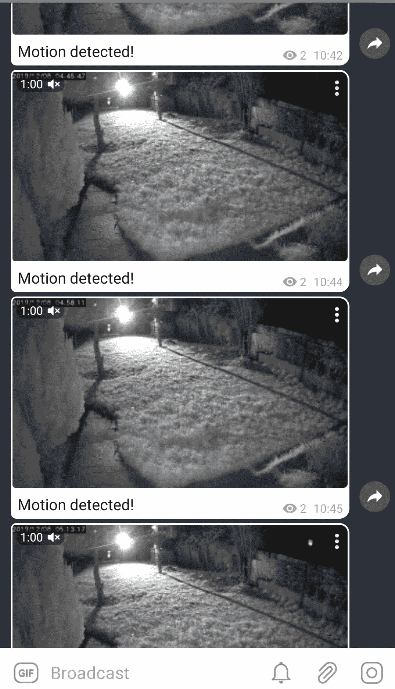

初始电报组版本

# 什么没成功？

这个项目给我带来了很多新的知识，即使我已经设法达到了我的最终目标，我也经历了一些失败的尝试。我认为这是每个项目最重要的部分之一。

## 图像增强

在我的研究过程中，我看到了几份来自 iWildCam Kaggle 竞赛参与者的报告。他们经常提到将 [CLAHE 算法](https://www.kaggle.com/cdm9804/histogram-equalization-to-improve-contrast)应用于直方图均衡化的输入图像。我已经尝试了上述算法和其他几种算法，但没有成功。应用图像修改降低了成功检测的数量。但说实话，夜间摄像头的图像看起来更清晰。

```
**def** enchance_image(frame):
   temp_img = frame
   img_wb = wb.balanceWhite(temp_img)
   img_lab = cv.cvtColor(img_wb, cv.COLOR_BGR2Lab)
   l, a, b = cv.split(img_lab)
   img_l = clahe.apply(l)
   img_clahe = cv.merge((img_l, a, b))
   return cv.cvtColor(img_clahe, cv.COLOR_Lab2BGR)
```

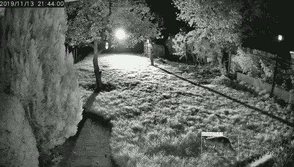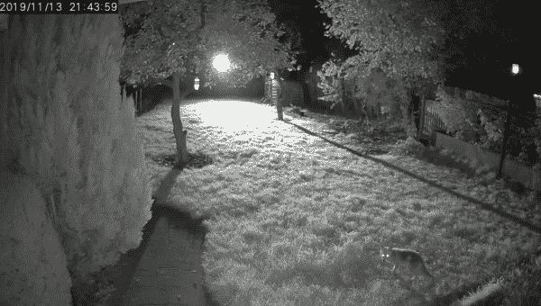

左图:CLAHE 应用版。右图:未增强

## 优化:TensorRT

出于某种原因，我无法遵循构建 tensort 引擎的指南，但是普通的 TF-tensort 文档工作得很好。

TF-TRT 模型优化

即使成功结束了优化，也没有发生推理加速。

```
[INFO] :: Detection took 8 minutes and 59.68 seconds. Average detection time per frame: 0.9 seconds
```

我的想法是，模型架构对于自动 TensorRT 引擎构建来说太深奥了。但是谁知道呢？

## 神奇加速

我有很多期望的另一个想法是从模型和图形优化中获得显著的加速。我期望得到接近文档和 YouTube 说明的结果(3-4 倍加速)，但我只得到大约 1.3-1.5 倍，这当然比什么都没有好得多。

我对为什么加速没有如此戏剧性的想法如下:

1.  GPU 是一个瓶颈——没有足够的 VRAM 不会给快速计算留下太多空间。
2.  用于 MegaDetector 的模型架构非常复杂(更快的 RCNN ),不适合自动优化
3.  我做了错事，\_(ツ)_/。但至少，我试过了。

## 充分利用 CPU 和 GPU

我不太喜欢的另一部分是 CPU 利用率。当 GPU 被计算堵塞时，CPU 消耗大约为 30%。我已经尝试给它一些额外的工作来预取视频帧，但它仍然没有在推理过程中发挥重要作用。

我希望从 Tensorflow 库中获得一些并行计算，但这似乎是我所能达到的最大程度。

我有一个想法，有两个并行的 Tensorflow 会话——一个用于 GPU，一个用于 CPU，但这有太多的工作要做。

# 未来计划

1.  用神经网络发布 Docker 图像
2.  与微软团队分享关于误报的发现
3.  将代码打包到 python 包中

# 捕捉到的视频令人惊叹

这里给读完的读者一点小奖励:)

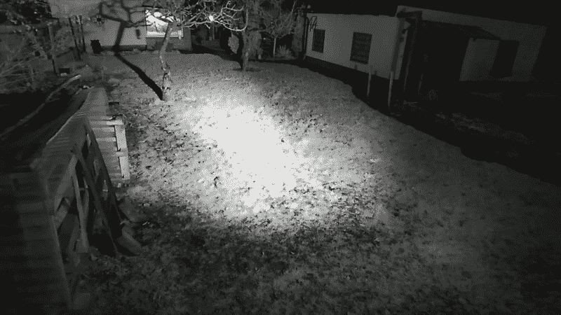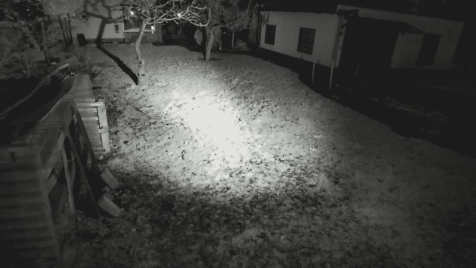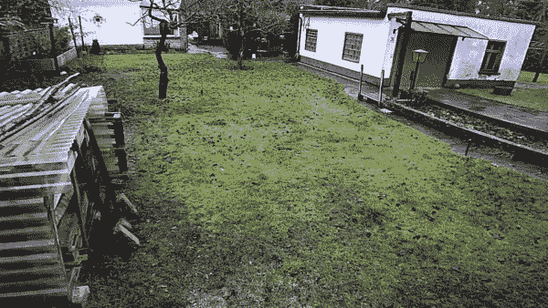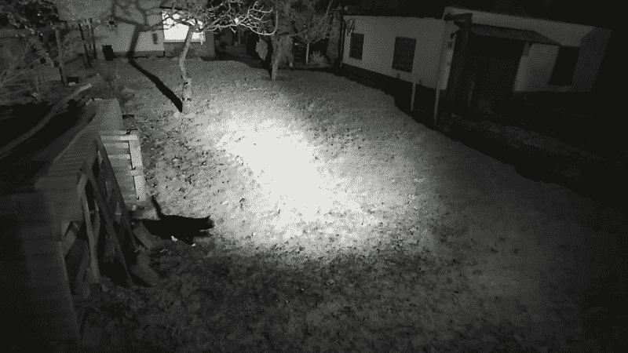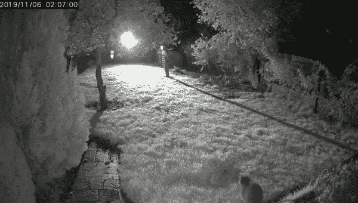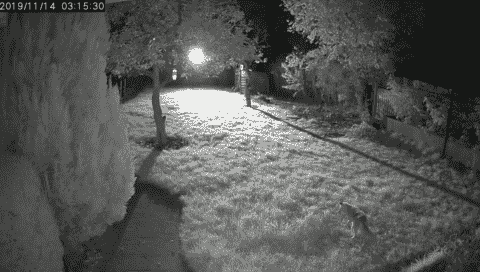

捕获和检测到的香料示例。