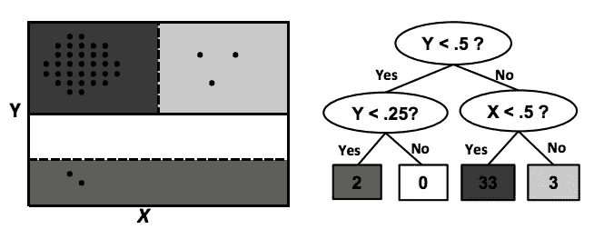

# 使用半空间树检测数据流中的异常

> 原文：<https://towardsdatascience.com/detecting-anomalies-in-data-streams-2daedbdaa436?source=collection_archive---------29----------------------->

## scikit-multiflow 简介和一种有前途的异常检测技术。

如今，许多领域都可以访问连续的数据流。如果没有一定程度的自动化，个人或团队通常很难管理这些信息。在展示流学习领域中一些令人兴奋的新发展之前，我想先从几个定义开始。

***数据流:*** *一个近乎连续的数据源。例如传感器数据或遥测数据。*

***流学习:*** *机器学习的子领域专注于开发专门从数据流中学习的技术。*

既然我们在同一页上，我想介绍一下工具包！我将使用新的(ish) python 库 [scikit-multiflow](https://github.com/scikit-multiflow/scikit-multiflow) 。


连续数据流正迅速成为许多机器学习应用的标准。像 scikit-multiflow 这样的专用库为流式数据提供了一个熟悉的用户界面。图片来自 Unsplash (Joshua Sortino)

为了这篇短文的目的，我将使用 skmultiflow 的内置数据生成器来创建数据流。

这里我使用 AnomalySineGenerator 类来生成一个包含异常点的数据集。

```
stream = AnomalySineGenerator(n_samples=1000, n_anomalies=250)
```

该发生器对正弦和余弦函数进行随机采样，以生成应在给定范围+-一些噪声内的数据。

为了让大家了解数据集的样子，我在下面用橙色突出显示了异常情况。


生成的数据集的绘图。异常点用橙色突出显示。图片作者。

现在，我们可以使用 skmultiflow 的流式半空间树异常检测器，并评估它在我们的数据集中检测异常的能力。

```
half_space_trees = HalfSpaceTrees()
```

在[ [1](https://www.ijcai.org/Proceedings/11/Papers/254.pdf) 中介绍了 skmultiflow 中使用的 HS-Tree 异常检测技术。尽管将 HS-Trees 与流数据耦合起来并不简单，但从概念上讲，该算法以一种简单的方式工作。



通过 HS-Trees 进行数据分区的示例(图片来自[ [1](https://www.ijcai.org/Proceedings/11/Papers/254.pdf) ])

每个 HS-Tree 将数据空间划分成几个窗口，并根据每个窗口中的数据点数量进行预测。对于异常检测，大多数点应该落在相同的窗口内，那些不在窗口内的点被预测为异常。当然，在现实中，该算法是一种集成算法，这意味着生成许多 HS-树，并且预测是这些树的多数投票。

既然我们对算法的作用有了更好的了解，我们可以继续进行预测。在下面的代码中，我们遍历流并进行预测，同时通过对每个新样本调用 partial_fit()来不断更新模型。

```
max_samples = 1000
n_samples = 0
true_positives = 0
detected_anomalies = 0
preds = []
target = []stream.restart()
while n_samples < max_samples and stream.has_more_samples():
    X, y = stream.next_sample()
    target.append(y[0])
    y_pred = half_space_trees.predict(X)
    preds.append(y_pred)
    if y[0] == 1:
        true_positives += 1
        if y_pred[0] == 1:
            detected_anomalies += 1
    half_space_trees.partial_fit(X, y)
    n_samples += 1
```

最终，流学习算法正确地预测了它负责识别的 221 个异常中的 165 个！

检查这些预测，很明显这个模型忽略了数据流早期的异常。这很直观，因为 it 没有太多时间来了解数据的底层分布。此外，在这种特定情况下,“异常数据”占整个数据集的很大一部分，这可能使决策树在早期面临挑战。

好吧，我希望你们都喜欢学习一些关于流学习的知识！Scikit-Multiflow 拥有一个充满活力的开发人员社区，非常受欢迎。如果你正在寻找一个好的开源项目，我强烈建议你参与！

**参考文献:**

[ [1](https://www.ijcai.org/Proceedings/11/Papers/254.pdf) ] S.C.Tan，K.M.Ting，和 T.F.Liu，“流数据的快速异常检测”，载于 ij Cai Proceedings-International Joint Conference on Artificial Intelligence，2011，vol. 22，no. 1，PP . 1511–1516。