# 用计算机视觉检测儿童孤独症谱系障碍

> 原文：<https://towardsdatascience.com/detecting-autism-spectrum-disorder-in-children-with-computer-vision-8abd7fc9b40a?source=collection_archive---------25----------------------->

凯利·西克玛在 [Unsplash](https://unsplash.com?utm_source=medium&utm_medium=referral) 上的照片

## 调整面部识别模型以检测自闭症谱系障碍

计算机视觉(CV)已经帮助医疗领域诊断[骨折](https://arxiv.org/abs/1902.07897)、[血栓](https://ieeexplore.ieee.org/document/6497970)，甚至[癌瘤](https://www.ncbi.nlm.nih.gov/pubmed/2924283)。它还可以用来帮助专家诊断自闭症。

[自闭症谱系障碍(ASD)](https://medlineplus.gov/autismspectrumdisorder.html) 是一种神经和发育障碍，始于儿童早期，持续人的一生。专家认为，患有 ASD 的人有独特的面部特征，这可以用来[帮助诊断他们的 ASD](https://www.spectrumnews.org/news/clinical-research-facial-features-can-help-diagnose-autism/) ，甚至[与 ASD 的严重程度](https://www.spectrumnews.org/news/facial-features-provide-clue-to-autism-severity/)相关。这种相关性可用于训练 CV 模型，以使用那些独特的面部特征来检测 ASD。

目标是提供一个免费的初步诊断工具，可以帮助父母决定进行进一步的 ASD 测试。对于具有重大现实影响的模型来说，负责任地表示它们的结果并使用[贝叶斯统计](/what-is-bayes-rule-bb6598d8a2fd)来解释它们的意义是很重要的。

## 为什么这很重要

[大约 25%](https://www.sciencedaily.com/releases/2020/01/200109130218.htm) 的自闭症儿童未被确诊。诊断自闭症是一个复杂的 T21 和昂贵的过程，不是每个家庭都能经历的。让合适的孩子去看合适的专家对于减少未确诊儿童的数量和家庭负担至关重要。

我想强调的是，我的目标不是诊断 ASD。相反，我想利用 CV 的力量和贝叶斯统计的基本原理来帮助父母决定他们是否应该带他们的孩子去看自闭症专家。

# 履行

所有的[代码都可以在 GitHub](https://github.com/mm909/Kaggle-Autism) 上获得，[数据可以在 Kaggle](https://www.kaggle.com/gpiosenka/autistic-children-data-set-traintestvalidate/version/5) 上获得。

 [## mm 909/ka ggle-自闭症

### 用计算机视觉检测儿童自闭症谱系障碍——采用面部识别模型检测…

github.com](https://github.com/mm909/Kaggle-Autism)  [## 自闭症儿童数据集

### 训练模型以从面部图像中检测儿童自闭症的数据集

www.kaggle.com](https://www.kaggle.com/gpiosenka/autistic-children-data-set-traintestvalidate/version/5) 

# 数据

Kaggle 数据集的第 5 版有 2940 幅图像，平均分为两类:自闭症和非自闭症。这些图像大小不一，但已经被裁剪成只显示孩子的脸。

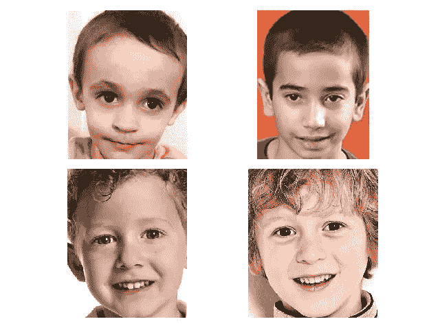

[资料来源:Kaggle，自闭症儿童数据集 v5](https://www.kaggle.com/gpiosenka/autistic-children-data-set-traintestvalidate/version/5)

## 年龄

该数据集的年龄分布大约为 2 岁到 14 岁，但大多数照片来自 2 岁到 8 岁的儿童。

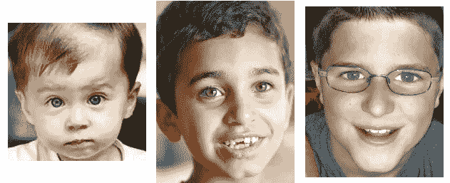

[资料来源:Kaggle，自闭症儿童数据集 v5](https://www.kaggle.com/gpiosenka/autistic-children-data-set-traintestvalidate/version/5)

## 性别

性别比例接近各自人口。男性被诊断为自闭症的人数是女性的 3 倍。因此，自闭症班级中男女比例接近 3:1。在非自闭症班级中，这一比例更接近 1:1。

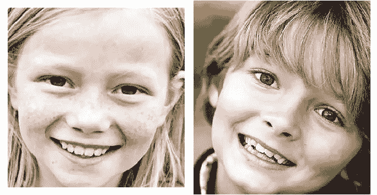

[资料来源:Kaggle，自闭症儿童数据集 v5](https://www.kaggle.com/gpiosenka/autistic-children-data-set-traintestvalidate/version/5)

## 人种

白人儿童与有色人种儿童的比例是 10:1。这和美国的真实分布[接近 7:1](https://en.wikipedia.org/wiki/White_Americans) 。

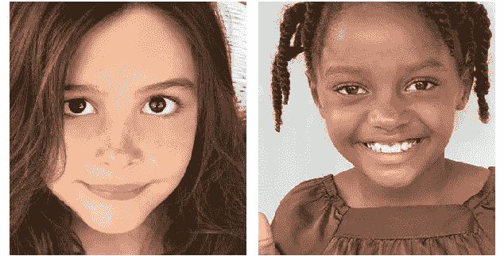

[资料来源:Kaggle，自闭症儿童数据集 v5](https://www.kaggle.com/gpiosenka/autistic-children-data-set-traintestvalidate/version/5)

# 模型

该模型将基于 [**VGG 人脸**](http://www.robots.ox.ac.uk/~vgg/data/vgg_face2/)**牛津深度面部识别模型**。****

## **[迁移学习](/a-comprehensive-hands-on-guide-to-transfer-learning-with-real-world-applications-in-deep-learning-212bf3b2f27a)**

**为了提取检测自闭症所需的面部特征，新模型将使用与 VGG 人脸相同的架构和权重。这是**特征表征迁移学习的一个例子。**当源域和目标域寻找相似的特征，但基于这些特征做出不同的推断时，使用这种类型的迁移学习。**

**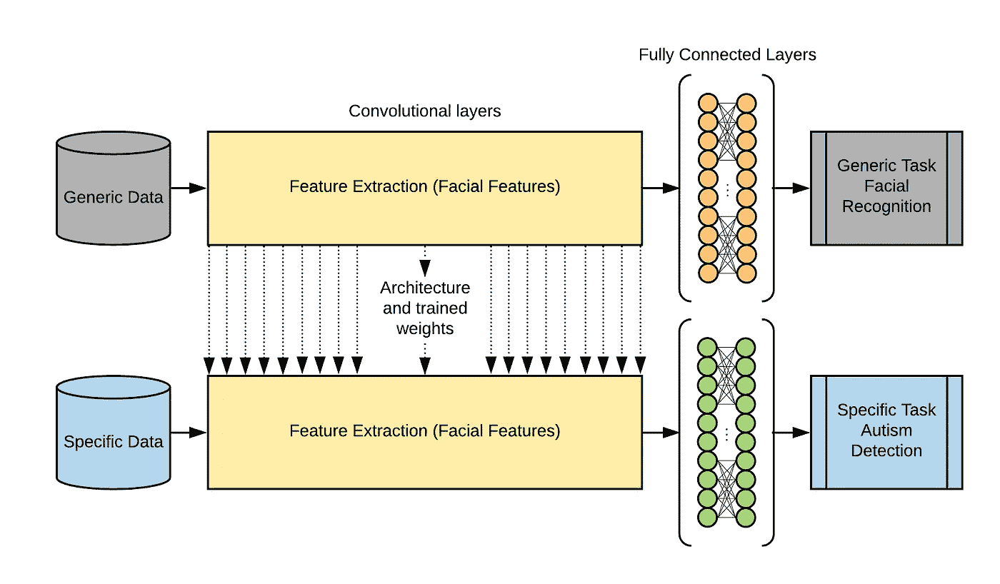**

**特征-表征迁移学习，来源:作者与 [Lucidchart](https://www.lucidchart.com/)**

**牛津模型被训练来识别潜在的面部特征，以识别独特的面孔。新模型还想识别潜在的面部特征，但要检测自闭症。**

# **结果**

**尽管在训练过程中使用准确性来衡量模型性能，但对于[贝叶斯](/what-is-bayes-rule-bb6598d8a2fd)预测来说，灵敏度和特异性是更重要的考虑因素。**

## **[学习曲线](https://en.wikipedia.org/wiki/Learning_curve_(machine_learning))**

**该模型在 44 个时期后在验证集上达到 85%的准确度。该模型在纪元 60 左右开始过度拟合。**

**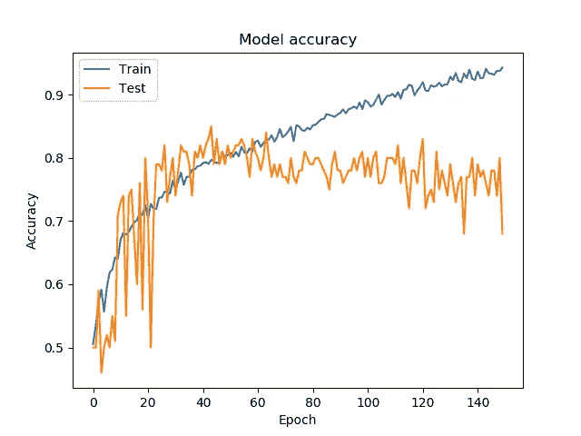**

**最佳模型的学习曲线，来源:作者**

## **[混淆矩阵](https://en.wikipedia.org/wiki/Confusion_matrix)**

> **编辑 2020 年 8 月:此表有误。假阴性应该有假阳性值，假阳性应该有假阴性值。接下来的一切仍然是正确的信息，但数字不正确。**

**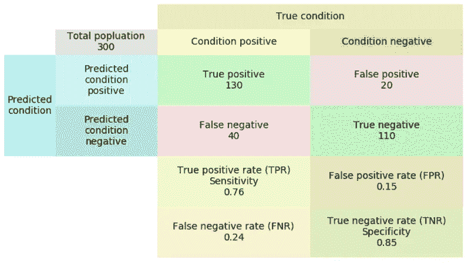**

**最佳模型的混淆矩阵，来源:作者**

## **[灵敏度和特异性](https://en.wikipedia.org/wiki/Sensitivity_and_specificity)**

**灵敏度和特异性用于量化模型预测假阴性和假阳性的频率。**

**敏感性是真正的阳性率。它衡量一个积极的预测正确的频率。**

**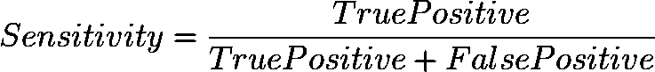**

**来源:作者用[代码编码](https://www.codecogs.com/latex/eqneditor.php)**

**特异性是真正的阴性率。它衡量一个负面预测正确的频率。**

**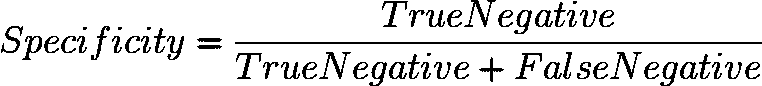**

**来源:作者用[代码编码](https://www.codecogs.com/latex/eqneditor.php)**

**该模型实现了 76%的灵敏度和 85%的特异性。**

# **影响:贝叶斯规则**

**[贝叶斯规则](/what-is-bayes-rule-bb6598d8a2fd)对于理解任何机器学习(ML)模型产生的结果都是至关重要的。**

**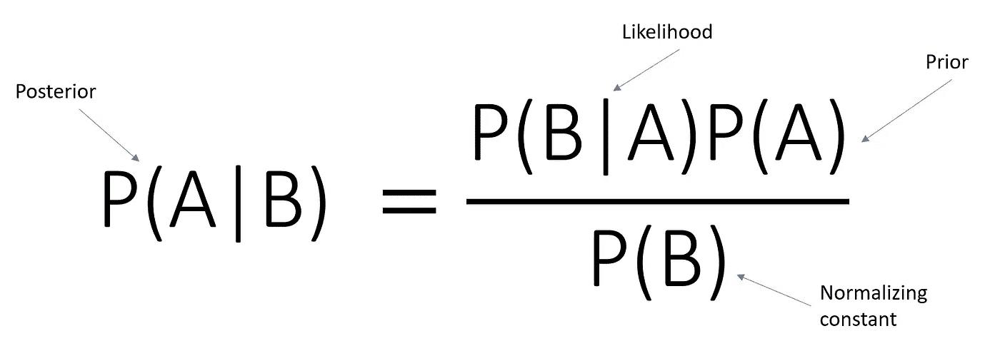**

**贝叶斯法则，[来源挪威创造](https://www.norwegiancreations.com/2018/10/bayes-rule-and-the-monty-hall-problem/)**

## **模型可能是错误的**

**重要的是要记住模型是会出错的。模型的正面结果并不意味着现实世界的正面结果。相反，这个新的信息，就像一个积极的预测，应该用来更新我们之前对该事件的了解。**

## **贝叶斯计算**

**随机选择的男性患自闭症的概率非常低，约为 2.7%。这是男性在知道任何其他信息之前患有自闭症的概率。因此，它被称为先验概率。**

**模型预测提供了新的信息，在做出决策时，应结合现有知识考虑这些信息。**

**贝叶斯定理可用于量化这种新信息对先验概率的影响程度。这个更新的概率称为后验概率。**

**利用模型的敏感性和特异性，可以计算出阳性预测的后验概率。对于男性来说，阳性结果会使患自闭症的概率从 2.70%增加到 12.34%。对于女性，概率从 0.66%增加到 3.27%。**

**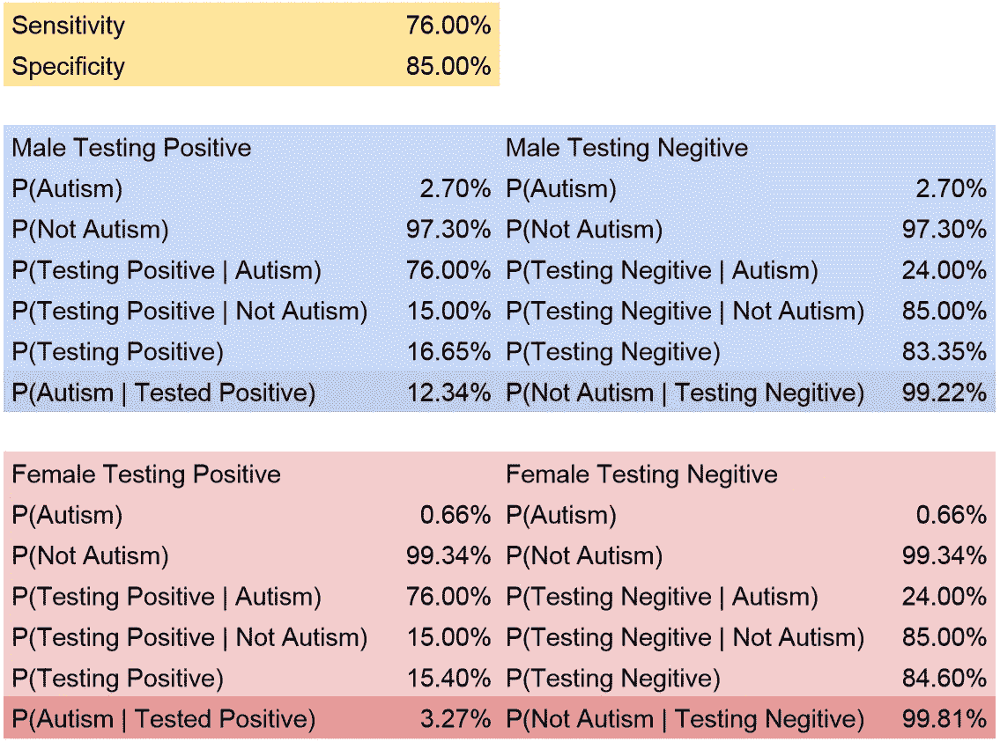**

**贝叶斯规则的结果，来源:作者**

# **限制**

**真实地展示模型的不足之处，可以让开源软件做出更好的贡献，也可以让数据科学整体变得更好。**

> **一如既往:更好的数据，更好的模型。**

## **年龄**

**这个模型是在 2 岁到 8 岁的儿童图像上训练的。因此，在该范围之外对儿童进行测试将给出不太准确的结果。**

## **人种**

**白人儿童与有色人种儿童的比例是 10:1。缺乏有色人种儿童的训练数据意味着结果对他们来说不太准确。**

# **结论**

**诊断自闭症是一个困难且昂贵的过程。幸运的是，面部特征和自闭症之间的相关性意味着可以训练一个 CV 模型来检测它。使用贝叶斯统计，可以负责任地报告该模型的结果，父母可以对孩子的健康做出更明智的决定。**

# **项目存储库**

** [## mm 909/ka ggle-自闭症

### 用计算机视觉检测儿童孤独症谱系障碍——采用面部识别模型检测

github.com](https://github.com/mm909/Kaggle-Autism)**