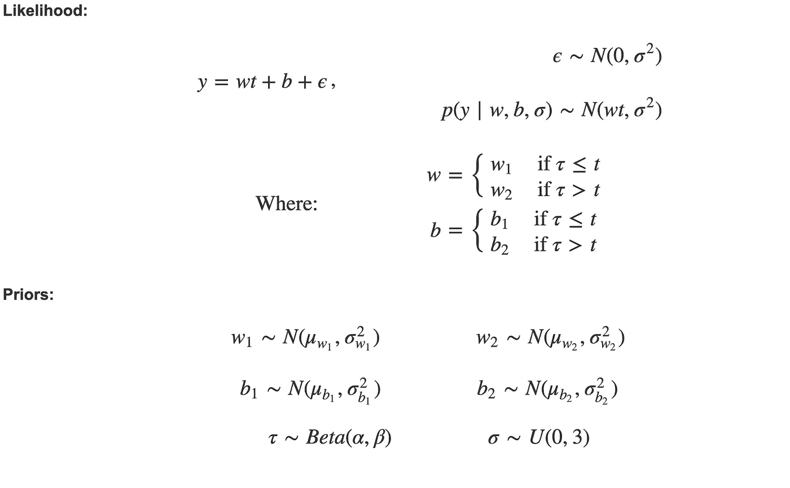
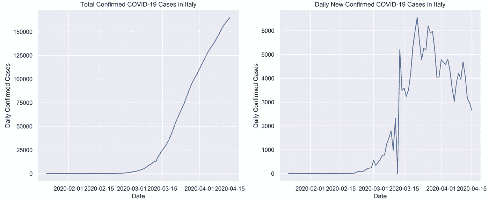
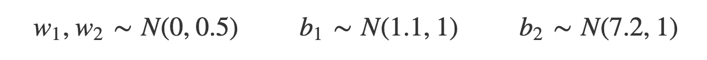
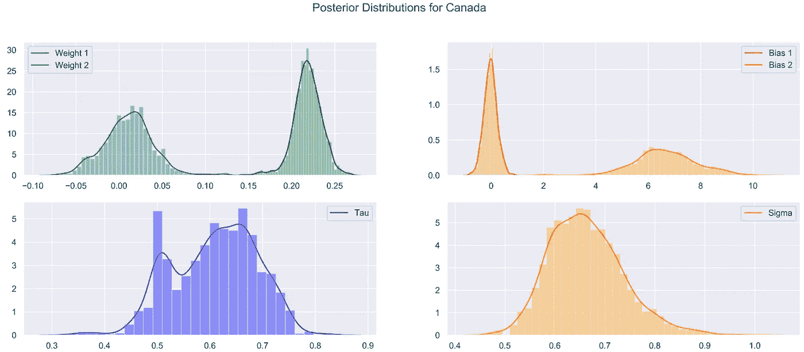
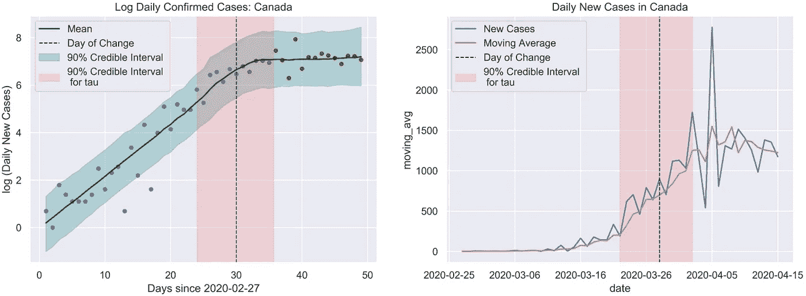
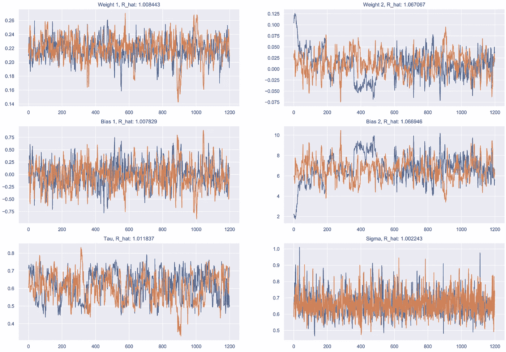
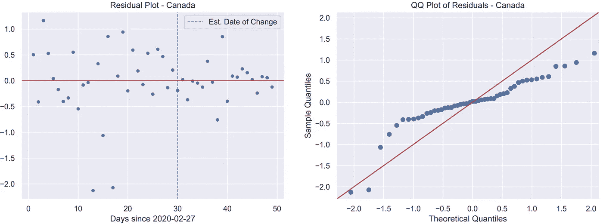
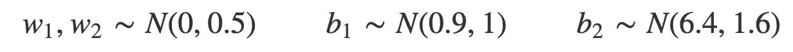
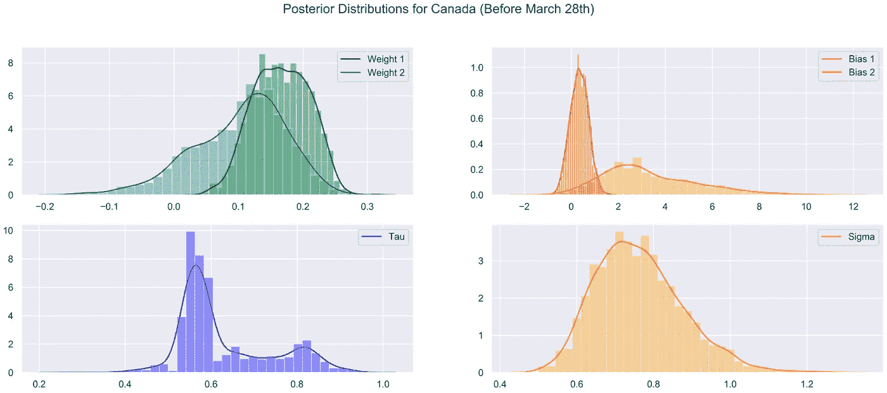
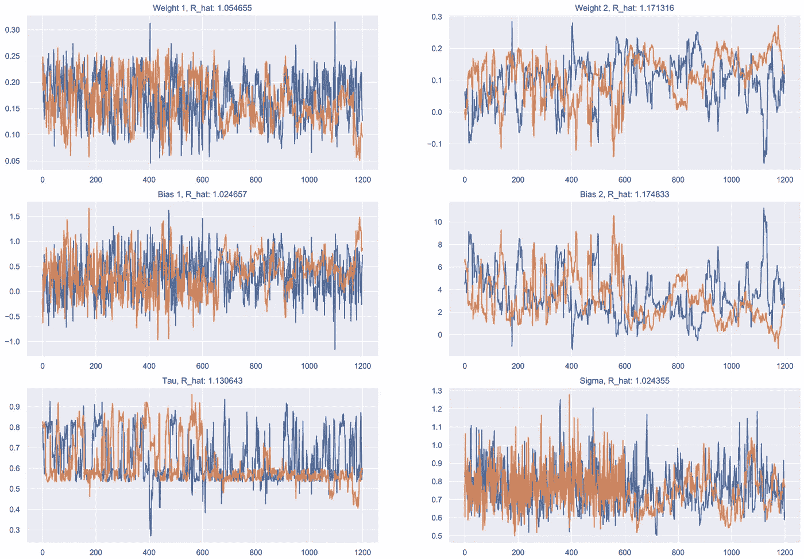

# 用贝叶斯模型检测新冠肺炎病例的变化

> 原文：<https://towardsdatascience.com/detecting-changes-in-covid-19-cases-with-bayesian-models-1b628214e8b1?source=collection_archive---------30----------------------->

## 贝叶斯变点模型，以估计不同国家的新新冠肺炎病例数开始变平的日期。


弗洛里安·奥利佛在 [Unsplash](https://unsplash.com/s/photos/light-at-the-end-of-the-tunnel?utm_source=unsplash&utm_medium=referral&utm_content=creditCopyText) 上拍摄的照片

# 问题

当前全球疫情及其相关资源(数据、分析等)。)，一段时间以来，我一直试图提出一个有趣的新冠肺炎问题，用统计数据来攻击。在查看了一些县的确诊病例数后，很明显在*某个*日期，新增病例数不再呈指数增长，其分布也发生了变化。然而，这个日期对每个国家来说是不同的(很明显)。这篇文章介绍并讨论了一个贝叶斯模型，用于估计特定国家新新冠肺炎病例分布变化的日期。模型系数是可解释的，可用于未来分析不同国家采取的社会距离措施的有效性。

在我们深入研究之前，有一个重要的提醒是，所有的模型都是错误的，但有些是有用的。这个模型对于估计变革的日期是有用的，但对于预测新冠肺炎将会发生什么是没用的。它不应该被误认为是一个惊人的流行病学模型，它会告诉我们隔离何时结束，而是一种用概率分布描述我们已经观察到的情况的方式。

这篇文章的所有代码可以在[这里](https://nbviewer.jupyter.org/github/jramkiss/jramkiss.github.io/blob/master/_posts/notebooks/covid19-changes.ipynb)找到，你可以在这里[阅读这篇文章的原始版本。](https://jramkiss.github.io/2020/04/15/covid-changepoint-analysis/)

# 模型

我们想要描述 *y* ，特定国家每天新增新冠肺炎病例数的对数，作为 *t* 的函数，即该病毒在该国开始传播的天数。我们将使用分段回归模型来实现这一点。we 分段的点将由学习参数τ确定，如下所述:



> 换句话说， *y* 将被建模为 *w* ₁ + *b* ₁，直到第τ天。在那之后，它将被模仿成₂+₂.

这个模型是用 [Pyro](https://pyro.ai/) 编写的，这是一种基于 [PyTorch](https://pytorch.org/) 的概率编程语言。这篇文章中包含了大量代码，但是大部分代码都在[的笔记本](https://nbviewer.jupyter.org/github/jramkiss/jramkiss.github.io/blob/master/_posts/notebooks/covid19-changes.ipynb)中。

# 数据

使用的数据是从 [Kaggle](https://www.kaggle.com/imdevskp/corona-virus-report) 下载的。我们掌握的是每个国家每日确诊病例的数量，下图显示了意大利的这一数据。很明显，在如何报告数据方面存在一些不一致，例如，在意大利，3 月 12 日没有新增确诊病例，但 3 月 13 日的预期病例增加了近一倍。在这种情况下，数据被分成两天。

这种病毒在不同的国家不同的时间开始传播。因为我们有一个回归模型，所以在病毒出现在某个特定国家之前包含数据是不合适的。这一日期是根据新病例的进展情况为每个国家人工选择的，决不是记录第一个患者的日期。“开始”日期最好解释为病毒开始持续增长的日期，而不是记录患者 0 的日期。



# 先前规格

病毒的增长对各个国家的人口动态很敏感，而我们可用的数据量有限，因此事先说明在这里非常重要。

从 *w* ₁和 *w* ₂开始，这些参数可以大致解释为日期变更前后病毒的增长率。我们知道，增长在开始时将是正的，不可能大于 1(毕竟， *w* ₁是一个梯度)。有了这些假设， *w* ₁ ~ N(0.5，0.25)是一个合适的先验。我们将对 p(w ₂ *)* 使用类似的逻辑，但是要记住灵活性。如果没有足够灵活的先验，在数据中没有真正的变化点的情况下，模型不会做得很好。在这些情况下， *w* ₂ ≈ *w* ₁，我们将在结果部分看到这个例子。现在，我们希望 *p(w* ₂ *)* 关于 0 对称，大多数值位于(-0.5，0.5)之间。我们将使用 *w* ₂ ~ N(0，0.25)。

接下来是偏向项， *b* ₁和 *b* ₂.这些参数的先验对国家特征特别敏感。新冠肺炎暴露程度较高的国家(无论出于何种原因)在高峰期的确诊病例将多于暴露程度较低的国家。这将直接影响 *b* ₂的后验分布(这是第二次回归的偏差项)。为了使该参数自动适应不同的国家，我们分别使用 *y* 的第一个和第四个四分位数的平均值作为 *b* ₁和 *b* ₂ 的先验平均值。 *b* ₁的标准差取为 1，这使得 *p(b* ₁ *)* 成为一个相对平坦的先验。将 *p(b* ₂ *)* 的标准差取为其先验均值的四分之一，这样先验均值越大。

至于τ，由于此时我们无法访问所有数据(病毒正在传播)，我们无法获得完全平坦的先验并让模型对其进行估计。相反，假设变化更可能发生在手头日期范围的后半部分，因此我们使用τ ~ Beta(4，3)。

下面是用 Pyro 写的模型。

```
class COVID_change(PyroModule):
    def __init__(self, in_features, out_features, b1_mu, b2_mu):
        super().__init__()
        self.linear1 = PyroModule[nn.Linear](in_features, out_features, bias = False)
        self.linear1.weight = PyroSample(dist.Normal(0.5, 0.25).expand([1, 1]).to_event(1))
        self.linear1.bias = PyroSample(dist.Normal(b1_mu, 1.))
        self.linear2 = PyroModule[nn.Linear](in_features, out_features, bias = False)
        self.linear2.weight = PyroSample(dist.Normal(0., 0.25).expand([1, 1])) #.to_event(1))
        self.linear2.bias = PyroSample(dist.Normal(b2_mu, b2_mu/4)) def forward(self, x, y=None):
        tau = pyro.sample(“tau”, dist.Beta(4, 3))
        sigma = pyro.sample(“sigma”, dist.Uniform(0., 3.))
        # fit lm’s to data based on tau
        sep = int(np.ceil(tau.detach().numpy() * len(x)))
        mean1 = self.linear1(x[:sep]).squeeze(-1)
        mean2 = self.linear2(x[sep:]).squeeze(-1)
        mean = torch.cat((mean1, mean2))
        obs = pyro.sample(“obs”, dist.Normal(mean, sigma), obs=y)
        return mean
```

[哈密顿蒙特卡罗](https://www.cs.toronto.edu/~radford/ftp/ham-mcmc.pdf)用于后验采样。这方面的代码如下所示。

```
model = COVID_change(1, 1,
                     b1_mu = bias_1_mean,
                     b2_mu = bias_2_mean)num_samples = 800
# mcmc
nuts_kernel = NUTS(model)
mcmc = MCMC(nuts_kernel,
            num_samples=num_samples,
            warmup_steps = 100,
            num_chains = 4)
mcmc.run(x_data, y_data)
samples = mcmc.get_samples()
```

# 结果

因为我住在加拿大，接触到预防措施开始的日期，所以建模将从这里开始。我们将 2 月 27 日作为病毒“开始”的日期。

前科:



**后验分布:**



从₁的 *w* 和₂的 *w* 的后验概率开始，如果数据没有变化，我们预计会看到这两个分布彼此接近，因为它们控制着病毒的增长率。这些分布以及₁和₂的后验概率没有重叠，这是一个好现象。这证明了我们的模型估计的变化点是真实的。

这个变化点估计为:**2020–03–28**

作为补充说明(警告:不科学)我的公司在 3 月 16 日发布了一项在家工作的强制性政策。大约在这一天，多伦多的大多数公司都会发布强制性在家工作政策。假设报告的病毒潜伏期长达 14 天，这一估计日期的变化是合理的，因为它是在广泛的社会距离措施开始后的 12 天！

在下图中可以看到模型拟合以及 90%可信区间带。左边是每日案例数的日志，这是我们用来拟合模型的，右边是每日案例的真实数量。单纯看日例数很难直观确定一个变化点，看确诊总例数更难。



## 评估趋同

运行这些实验时，最重要的步骤是诊断 MCMC 的收敛性。我通过观察链的混合和平稳性以及 [R_hat](https://rdrr.io/cran/asbio/man/R.hat.html) 来采用 3 种方法评估该模型的收敛性。R_hat 是当样本数趋于无穷大时，每个后验分布将减少的因子。理想的 R_hat 值是 1，但是小于 1.1 的值是收敛的强指示。我们观察马尔可夫链的混合和平稳性，以便知道 HMC 是否产生合适的后验样本。

下面是每个参数的[轨迹图](https://stats.stackexchange.com/questions/120936/why-we-need-trace-plot-for-mcmc-results)。每条链都是固定的，混合良好。此外，所有 R_hat 值都小于 1.1。



收敛之后，在继续其他示例之前，最后要检查的是模型对数据的适合程度。和之前做的假设一致吗？为了测试这一点，我们将使用残差图和 QQ 图，如下所示。
我已经列出了估计的变化点，以便比较变化前后的残差来检验同质性。残差服从均值为零的正态分布，在变化日期之前和之后都不依赖于时间。



# 没有变化呢？

啊哈！如果新病例的数量还没有开始变平呢？！为了测试该模型对这种情况的稳健性，我们将查看加拿大截至 3 月 28 日的数据。这是模型估计曲线在加拿大开始变平的日子。

没有真实的更改日期并不意味着模型会输出“无更改”(lol)。我们将不得不使用后验分布来推断模型提供的变化日期是不合适的，因此数据中没有变化。

**前科:**



**后验分布:**



*w* ₁和 *w* ₂的后验概率有明显重叠，表明病毒的增长率没有明显变化。₁*b*和₂*b*的后验概率也是重叠的。这些表明模型很难估计一个合理的τ，这对我们来说是一个很好的验证，先验并不太强。

尽管我们已经得出结论，该数据没有更改日期，但出于好奇，我们仍将绘制该模型。


与前面的例子相似，MCMC 已经收敛。下面的轨迹图显示了链的充分混合和稳定性，并且大多数 R_hat 值小于 1.1。



# 后续步骤和未决问题

该模型能够很好地描述数据，足以产生曲线开始变平的日期的可靠估计。一个有用的副产品是第二条回归线的系数项， *w* ₂.通过计算不同国家的₂和₂，我们可以比较他们的社交距离措施的有效性。这一分析和更多内容可能会在随后的文章中发布。

请关注我的个人[博客](https://jramkiss.github.io/)上的相关帖子！

感谢您的阅读，如果您有任何建议或推荐，请通过电子邮件或其他方式联系我，甚至只是聊天！