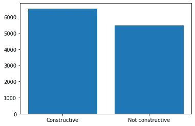
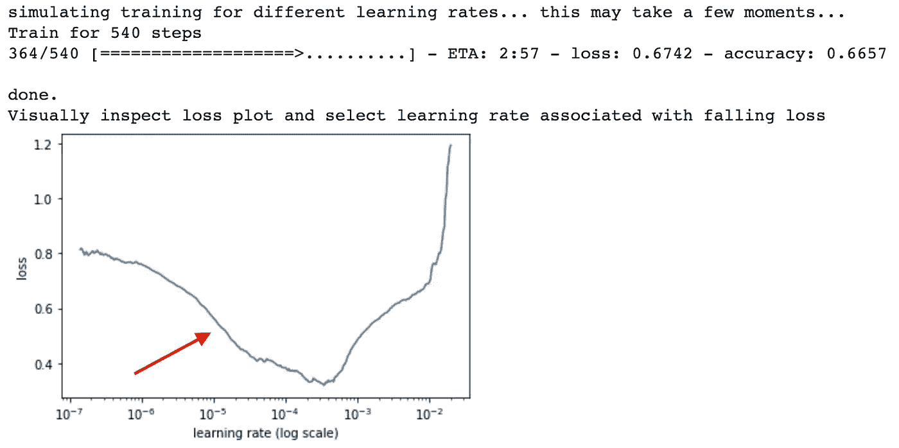
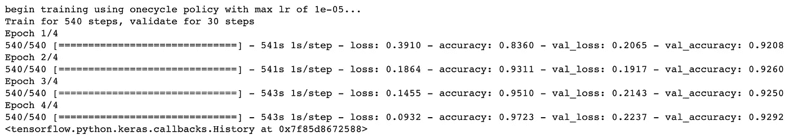
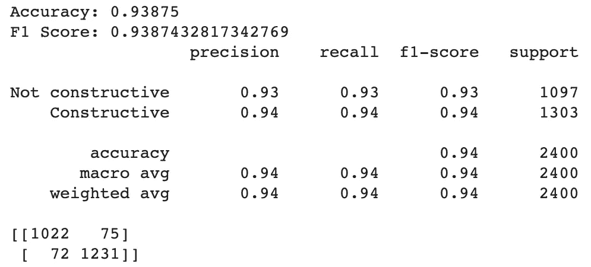

# 检测在线文章评论中的建设性

> 原文：<https://towardsdatascience.com/detecting-constructiveness-in-online-article-comments-477bf4b4bd8?source=collection_archive---------79----------------------->

## 使用带 ktrain 的 Distilbert 的端到端分类教程

马修·施瓦茨在 [Unsplash](https://unsplash.com?utm_source=medium&utm_medium=referral) 上的照片

促进在线评论区的建设性是让互联网成为一个更有生产力的地方的重要一步。除了通过简单地指出错误或试图伤害来给出反馈，建设性可以通过论证和尊重的话语技巧来使用，以便利用这些过去的错误来进行未来的改进。

类似于情感分析或毒性检测，可以使用深度学习技术来建模建设性和分类文章评论。当前最先进的模型使用 transformer 架构，在并行处理输入序列时，它比通常的递归单元(LSTM、GRU……)更有效。在这篇文章中，我们将使用由 [HuggingFace](https://huggingface.co/) 创建的 **Distilbert** (Sanh 等人，2019)。该模型是 BERT (Devlin 等人，2018 年)的精华版本，本质上意味着一个轻得多的模型，几乎达到类似的性能。我们将使用 **ktrain** Python 库(Maiya，2020)，它允许在 Tensorflow Keras 中非常容易地实现最先进的模型。关于 ktrain 实现的更多信息，[本教程](/ktrain-a-lightweight-wrapper-for-keras-to-help-train-neural-networks-82851ba889c)和[官方文档](https://github.com/amaiya/ktrain)可以帮到你！

对于建设性来说，标记数据的数量相当有限，所以我们将使用最大和最新的一个，建设性评论语料库(C3)，可在 [Kaggle](https://www.kaggle.com/mtaboada/c3-constructive-comments-corpus/kernels?sortBy=hotness&group=everyone&pageSize=20&datasetId=581971) 上获得，并在 Kolhatkar 等人(2020)中详细描述。该数据集由 12000 条新闻评论组成，包含几个建设性和毒性标签，但我们将使用的唯一标签是 *constructive_binary* 。

# 数据处理

像往常一样，第一步是导入项目所需的所有库。您将需要安装 *ktrain* ，根据您的设置，这可能会很棘手，然后导入它。我们还从 *scikit-learn* 导入了基本的三重奏*熊猫*、 *numpy* 和 *matplotlib* ，以及一些度量和拆分工具。

让我们从读取熊猫数据帧中的数据集文件开始。我们还应该看看我们感兴趣的列， *comment_text* 和 *constructive_binary* 。

C3 数据帧头

我们很快就需要知道我们想要允许的最大输入长度，所以了解一下注释长度是很有用的。运行以下代码以显示 DataFrame comment 列的描述。

结果显示长度平均值为 71 个标记，第 90 个和第 99 个百分点分别对应于 157 和 362 个标记，因此将 MAXLEN 设置在 150 到 200 个标记之间似乎是个好主意。为了节省一些内存空间，就说 150 吧。

接下来，我们应该定义几个全局变量，包括**最大输入长度**、数据集的**路径和保存训练模型**的**路径、**目标标签名称**和我们想要使用的 **HuggingFace 模型**，在我们的例子中是 *bert-base-uncased* ，它只使用小写输入。**

现在让我们看一下输出类分布，以检查数据集是否平衡:

目标类别分布

建设性的评论比非建设性的评论多，所以数据集略有不平衡。在验证和测试步骤中，我们希望保持输出类的良好代表性，这意味着我们希望目标类分布在所有 train/val/test 集中是相同的。为此，我们将使用 scikit-learn 实现的分层分裂。让我们从划分训练集(我们称之为中间集)和测试集开始，将完整集的 20%放在一边。为了更加方便，数据帧的索引可以在以后重新设置。

将另外 10%到 20%的训练数据设置为验证目的是一种好的做法，此外，在 ktrain 中使用验证集是可能的，因此我们再次使用分层分裂，并将 10%设置为备用。再次重置每个数据帧的索引。

完美！我们现在已经准备好使用三个数据集，所以让我们将输入和输出分开，以馈入我们的机器学习模型。您可以将输入列(X)读入一个 numpy 数组，并将输出(y)转换为一个小 int。

# 分类

现在是时候通过加载一个 Transformer 对象来初始化 ktrain 模块了，该对象采用前面定义的 **MODEL_NAME** 、 **MAXLEN** 和**标签**。最先进的体系结构不一定需要特殊的预处理，如停用词删除、标点符号删除等。相反，他们使用一种特殊的无监督标记化方法，优化了称为 WordPiece 的词汇外(OOV)的数量。由于这一点，并且因为我们的数据集不是很嘈杂，我们简单地使用 ktrain 预处理器。最后，您可以获得一个分类器对象，然后获得一个采用 **batch_size** 超参数的学习器对象。这个超参数在逻辑上可以根据您的需要进行调整(就像 MAXLEN 一样)，但是在增加它时要注意内存问题。

以下代码为您完成了所有这些工作:

就在训练模型之前，您可以选择使用学习率查找器(Smith，2018)轻松优化学习率调整过程，它基本上在短期内训练模型，同时以指数方式提高学习率:

学习率查找图表

一个可供选择的学习率值位于第一个显著下降的斜坡上，比第一个平坦区域稍靠前一点，红色箭头指向的位置。在这种情况下，合适的值是 0.00001。让我们现在*最后*训练模型。我们使用循环训练政策(Smith，2017)来连续增加和减少学习率，但如果您想改变，也可以使用其他政策！ **4 个时期**对于模型收敛来说肯定是足够的，但是这也可以根据您的方便进行调整(训练这样大的模型需要大量的时间和资源！).

详细培训

一旦训练结束，您可以使用学习者对象的 *validate* 方法进行验证，但是为了简短起见，我们将跳过这一部分。

ktrain 的*预测器*对象允许对新数据进行预测。运行下面的代码对整个测试集进行预处理和分类。它还打印了几个常用的指标来帮助您解释结果。

测试集上的构造性分类结果

我们达到了 **0.94** 加权 F1 和 **0.94** 的精度，非常好，干得好！您的 Distilbert 模型现在适合检测建设性的新闻文章评论。您可以用下面的代码行保存模型，但是要注意，它相当重(~300MB)。

现在由您来调整超参数，使用更高级的机器学习方法或更重的模型(BERT、XLNet 等)。)去尝试，去取得更好的成绩！

*感谢阅读！* *我希望这对你来说是有益的，对我来说也是有趣的*

# 参考

德夫林、雅各布、张明蔚、肯顿·李和克里斯蒂娜·图塔诺瓦(2018)。“BERT:用于语言理解的深度双向转换器的预训练”。 [*arXiv 预印本 arXiv:1810.04805*](https://arxiv.org/abs/1810.04805) 。

Kolhatkar、Varada、Nithum Thain、Jeffrey Sorensen、Lucas Dixon 和 Maite Taboada(2020)。《C3:建设性评论文集》。竖锯和西蒙·弗雷泽大学”。d O I:[*10.25314/ea 49062 a-5c F6–4403–9918–539 e 15 FD 7b 52*](https://doi.org/10.25314/ea49062a-5cf6-4403-9918-539e15fd7b52)。

马亚，阿伦 S (2020)。“ktrain:用于增强机器学习的低代码库”。 [*arXiv 预印本 arXiv:2004.10703*](https://arxiv.org/abs/2004.10703) 。

莱斯利·史密斯(2017)。“训练神经网络的循环学习率”。2017 年 IEEE 计算机视觉应用冬季会议。 [*IEEE，第 464–472 页*](https://ieeexplore.ieee.org/abstract/document/7926641/) 。

莱斯利·N·史密斯(2018)。“神经网络超参数的训练方法:第 1 部分-学习速率、批量大小、动量和权重衰减”。 [*arXiv 预印本 arXiv:1803.09820*](https://arxiv.org/abs/1803.09820) 。