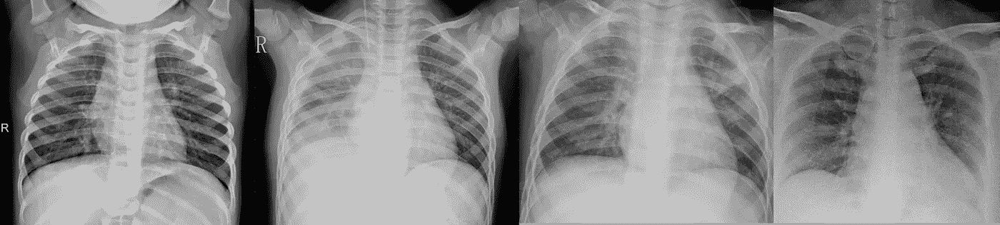
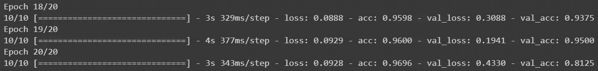
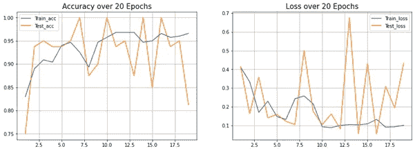
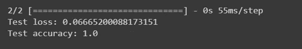
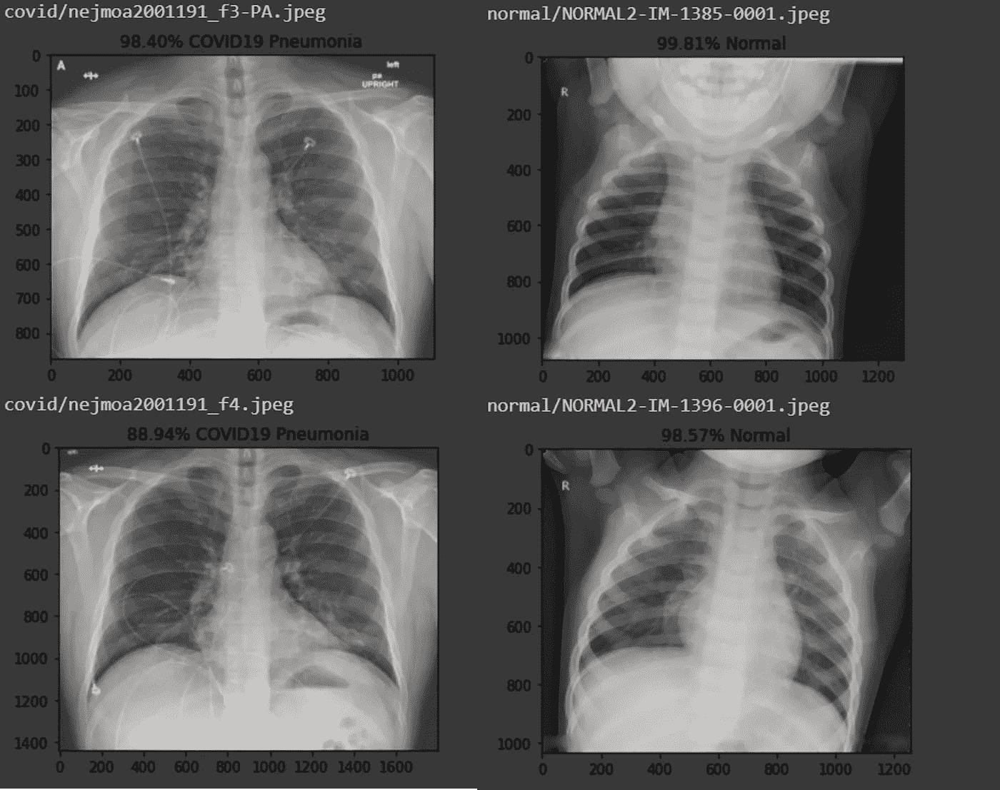
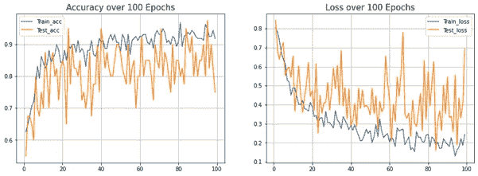
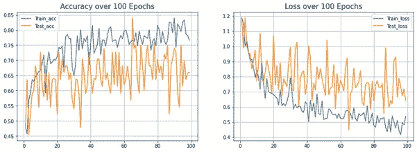

# 用迁移学习从胸部 X 射线检测新冠肺炎诱发的肺炎:在 Tensorflow 和 Keras 中的实现。

> 原文：<https://towardsdatascience.com/detecting-covid-19-induced-pneumonia-from-chest-x-rays-with-transfer-learning-an-implementation-311484e6afc1?source=collection_archive---------3----------------------->

## 深度学习正在向新型冠状病毒进军。

# 介绍

新型冠状病毒(SARS-COV-2)已经成为人类面临的最紧迫的问题。新冠肺炎病像野火一样席卷全球，仅在三个月内就改变了全球面貌。高繁殖率和更高的并发症几率导致了边境关闭、空无一人的街道、猖獗的囤积、大规模的自我隔离政策、经济衰退和文化转向不信任。世界进入了一场新的世界大战，由一个看不见的敌人发动了闪电战。

随着发达国家的病例数量不断增加，各国政府正在慢慢意识到这个问题的严重性，人们希望看到全世界团结起来应对这一威胁。然而，无论是在 T2、国家还是个人层面，我们仍然可以观察到分歧和不信任。关于[种族主义袭击](https://edition.cnn.com/2020/02/20/us/coronavirus-racist-attacks-against-asian-americans/index.html)、[盗窃](https://www.bbc.co.uk/news/uk-england-northamptonshire-51771584)、[不负责任行为](https://www.theguardian.com/world/2020/mar/19/uruguay-coronavirus-party-guest-argentina)的报道十分猖獗。医生呼吁公众认真对待这种情况，并在避免所有非必要旅行的同时就地躲避。


选定国家的 COVID 病例数 19。(图片来源:路透社)

三月前抗击病毒的策略主要围绕[遏制和追踪](https://www.independent.co.uk/news/health/coronavirus-test-world-health-organisation-uk-contact-tracing-chris-whitty-phe-a9405476.html)——在疾病发展之前发现和隔离可能的病例。然而，随着病例的指数增长，世界各地的[医院](https://www.msn.com/en-us/news/world/how-coronavirus-overwhelmed-italy-with-more-than-4000-deaths-in-one-month/ar-BB11tFLj)已经[迅速变得不堪重负](https://www.independent.co.uk/news/health/coronavirus-uk-cases-intensive-care-nhs-northwick-park-a9414311.html)，政府政策已经转向[缓解甚至接受](https://www.scmp.com/week-asia/explained/article/3075754/what-herd-immunity-and-can-it-stop-coronavirus)。受影响国家缺乏检测能力进一步加剧了这一令人沮丧的过程，导致确诊病例数落后于真实值。这导致中国卫生当局暂时转而根据症状和胸部 x 光/CT 进行诊断。然而，这种解决方案仍然存在与其他肺炎原因重叠的风险，它们导致了许多混乱，国家又回到了基于 PCR(聚合酶链式反应)的测试。

**基于人工智能的解决方案最近已被广泛探索用于** [**研究**](https://www.sciencedaily.com/releases/2019/09/190930104505.htm) 中的肺炎检测，此类方法也已在本次疫情期间[提出。据报道，定制模型的灵敏度和特异性接近 90%。然而，它们在确定肺炎病因方面的特异性，特别是对其他病毒性疾病(如流感)的特异性，仍在激烈辩论中。它们固有的实验性质要求同时使用确认方法，作为多学科诊断方法的一部分。](https://www.radiologybusiness.com/topics/artificial-intelligence/ai-radiologists-coronavirus-pneumonia-chest-ct-x-ray)

在本文中，我们将探讨使用相对简单的迁移学习过程和受约束的数据集，构建一个能够在胸部 X 射线中检测各种肺炎原因的系统的可行性和困难。当然，这里描述的方法和内容仅用于教育目的。这不是一项科学严谨的研究，不应用于医学目的。

# 履行

**我们已经在以前的文章中详细介绍了** [**迁移学习**](https://medium.com/gradientcrescent/improving-classification-accuracy-using-data-augmentation-segmentation-a-hybrid-implementation-8ec29fa97043) **和** [**卷积神经网络**](https://medium.com/gradientcrescent/building-a-malaria-classifier-with-keras-background-implementation-d55c32773afa) **，强烈推荐我们的读者参考它们以获得更全面的考虑。**

为了解决手头的问题，我们收集了自己的数据集，将蒙特利尔大学的约瑟夫·保罗·寇恩博士收集的 [Kaggle 胸部 x 光数据集](https://www.kaggle.com/paultimothymooney/chest-xray-pneumonia)与 [COVID19 胸部 x 光数据集](https://github.com/ieee8023/covid-chestxray-dataset)结合起来。这两个数据集都由肺炎患者的后前胸图像组成。随着更多案例的发布，COVID19 数据集每天都在更新，因此我们访问了 2020 年 3 月 18 日可用的实例。我们的数据集分为 4 个不同的类别，每类 9 张图像用作测试集。

*   健康:79 张图片
*   肺炎(病毒性):79 张图片
*   肺炎(细菌性):79 张图片
*   肺炎(新冠肺炎):69 张图片

让我们看一些例子来强调不同原因之间的细微差别。特别是，**如果没有广泛的放射培训** **，病毒性病例和新冠肺炎病例之间的差异是无法区分的** [**，这加剧了一线医护人员面临的困难**](https://www.google.com/search?q=covid19+resource+site+for+radiology+and+imaging&rlz=1C1EJFA_enSG791SG791&oq=covid19+resource+site+for+radiology+and+imaging&aqs=chrome..69i57.5111j0j7&sourceid=chrome&ie=UTF-8)



入院病人的胸透。从左至右:健康、细菌、病毒、COVID19。

我们的代码是用 Keras 和 Tensorflow 编写的，并在一个支持 GPU 的 Google 协同实验室笔记本实例中运行。所有代码都可以在 GradientCrescent [库上获得。](https://github.com/EXJUSTICE/GradientCrescent)

# **二进制案件**

让我们从二元案例开始——比较健康的肺和那些表现出由 SARS-COV-2 病毒引起的肺炎的肺。这在*covid 19 _ GradientCrescent _ Binary*笔记本中有所涉及。

首先，让我们从 GradientCrescent Google Drive 导入数据集。

```
!gdown [https://drive.google.com/uc?id=1coM7x3378f-Ou2l6Pg2wldaOI7Dntu1a](https://drive.google.com/uc?id=1coM7x3378f-Ou2l6Pg2wldaOI7Dntu1a)!unzip Covid_Data_GradientCrescent.zip
```

接下来，我们将导入一些必要的库，并定义数据集路径和网络的一些参数。因为我们是迁移学习，我们将保持我们的学习率在 5e-4 的低值。

```
import numpy as npimport tensorflow as tfDATASET_PATH = ‘/content/two/train’test_dir = ‘/content/two/test’IMAGE_SIZE = (150, 150)NUM_CLASSES = len(data_list)BATCH_SIZE = 10 # try reducing batch size or freeze more layers if your GPU runs out of memoryNUM_EPOCHS = 20LEARNING_RATE =0.0005 
```

接下来，让我们使用 ImageDataGenerator 类来设置相应的训练和验证预处理以及批处理图像准备函数，对于这种情况，将我们的 *class_mode* 参数指定为“binary”。

```
#Train datagen here is a preprocessor
train_datagen = ImageDataGenerator(rescale=1./255,
 rotation_range=50,
 featurewise_center = True,
 featurewise_std_normalization = True,
 width_shift_range=0.2,
 height_shift_range=0.2,
 shear_range=0.25,
 zoom_range=0.1,
 zca_whitening = True,
 channel_shift_range = 20,
 horizontal_flip = True ,
 vertical_flip = True ,
 validation_split = 0.2,
 fill_mode=’constant’)train_batches = train_datagen.flow_from_directory(DATASET_PATH,
 target_size=IMAGE_SIZE,
 shuffle=True,
 batch_size=BATCH_SIZE,
 subset = “training”,
 seed=42,
 class_mode=”binary”,

 )valid_batches = train_datagen.flow_from_directory(DATASET_PATH,
 target_size=IMAGE_SIZE,
 shuffle=True,
 batch_size=BATCH_SIZE,
 subset = “validation”,
 seed=42,
 class_mode=”binary”,

 )
```

完成所有这些后，让我们来定义我们的网络，它在我们的两台笔记本电脑之间共享。我们采用预训练的 [VGG16 网络](https://arxiv.org/pdf/1409.1556.pdf)，并将其与我们自己的一系列密集连接的层相适应，我们的输出层具有针对二进制分类情况的 sigmoid 激活函数。我们将编译我们的网络，并将 ADAM 优化器附加到它上面。

```
from keras import models
from keras import layers
from keras.applications import VGG16
from keras import optimizers
from keras.layers.core import Flatten, Dense, Dropout, Lambdaconv_base = VGG16(weights=’imagenet’,
 include_top=False,
 input_shape=(150, 150, 3))conv_base.trainable = Falsemodel = models.Sequential()
model.add(conv_base)
model.add(layers.Flatten())
model.add(layers.Dense(256, activation=’relu’))
model.add(layers.Dense(1, activation=’sigmoid’))model.compile(loss=’binary_crossentropy’,

 optimizer=optimizers.Adam(lr=LEARNING_RATE),
 metrics=[‘acc’])
```

定义好我们的网络后，让我们开始 20 个纪元的训练。

```
STEP_SIZE_TRAIN=train_batches.n//train_batches.batch_size
STEP_SIZE_VALID=valid_batches.n//valid_batches.batch_sizeresult=model.fit_generator(train_batches,
 steps_per_epoch =STEP_SIZE_TRAIN,
 validation_data = valid_batches,
 validation_steps = STEP_SIZE_VALID,
 epochs= NUM_EPOCHS,
 )
```

您应该会发现，我们的验证准确性收敛速度相对较快，超过了 80%。有了更大的数据集，我们将能够提供更多的验证示例来减少不同时期之间的差异，但结果对于演示目的来说是令人满意的。



二进制情况的最后 3 个时期的精度和损失。

最后，我们将使用 *matplotlib* 库来绘制我们的精度和损失参数，作为我们训练时期的一个因素。

```
import matplotlib.pyplot as pltdef plot_acc_loss(result, epochs):
 acc = result.history[‘acc’]
 loss = result.history[‘loss’]
 val_acc = result.history[‘val_acc’]
 val_loss = result.history[‘val_loss’]
 plt.figure(figsize=(15, 5))
 plt.subplot(121)
 plt.plot(range(1,epochs), acc[1:], label=’Train_acc’)
 plt.plot(range(1,epochs), val_acc[1:], label=’Test_acc’)
 plt.title(‘Accuracy over ‘ + str(epochs) + ‘ Epochs’, size=15)
 plt.legend()
 plt.grid(True)
 plt.subplot(122)
 plt.plot(range(1,epochs), loss[1:], label=’Train_loss’)
 plt.plot(range(1,epochs), val_loss[1:], label=’Test_loss’)
 plt.title(‘Loss over ‘ + str(epochs) + ‘ Epochs’, size=15)
 plt.legend()
 plt.grid(True)
 plt.show()

plot_acc_loss(result, 20)
```



对于二进制情况，取 20 个时期的精度和损耗参数。

为了确认我们的结果，我们将在测试数据集上测试我们的模型，每个类包含 9 个图像。**请注意，您需要将*随机播放*参数设置为*真*以获得准确的结果。**

```
test_datagen = ImageDataGenerator(rescale=1\. / 255)eval_generator = test_datagen.flow_from_directory(
 test_dir,target_size=IMAGE_SIZE,
 batch_size=1,
 shuffle=False,
 seed=42,

 class_mode=”binary”)
eval_generator.reset()x = model.evaluate_generator(eval_generator,
 steps = np.ceil(len(eval_generator) / BATCH_SIZE),
 use_multiprocessing = False,
 verbose = 1,
 workers=1
 )print(‘Test loss:’ , x[0])
print(‘Test accuracy:’,x[1])
```



虽然看起来我们的模型在这个任务中表现得很完美，但是考虑到一个大得多的测试数据集，我们希望这个值与我们的验证精度相匹配。最后，让我们使用 *cv2* 图像处理类和 Keras 的 *predict_generator()* 方法绘制一些测试图像以及它们各自的预测。注意，要复制这一点，您需要将 evaluation_generator 的 *shuffle* 参数设置为 *False* ，以避免类索引混乱。

```
eval_generator.reset() 
pred = model.predict_generator(eval_generator,1000,verbose=1)
print(“Predictions finished”)import cv2import matplotlib.image as mpimg
for index, probability in enumerate(pred):
 image_path = test_dir + “/” +eval_generator.filenames[index]
 image = mpimg.imread(image_path)
 #BGR TO RGB conversion using CV2
 image = cv2.cvtColor(image, cv2.COLOR_BGR2RGB)pixels = np.array(image)
 plt.imshow(pixels)

 print(eval_generator.filenames[index])
 if probability > 0.5:
 plt.title(“%.2f” % (probability[0]*100) + “% Normal”)
 else:
 plt.title(“%.2f” % ((1-probability[0])*100) + “% COVID19 Pneumonia”)
 plt.show()
```



COVID19(左)和健康(右)测试集图像的预测概率。

我们的网络成功地发现了两个案例之间的差异。但这是肤浅的，让我们把赌注提高一个档次，试着区分不同类型的肺炎。我们将切换到第二本 Jupyter 笔记本，*covid 19 _ GradientCrescent _ multi . ipynb .*

# **多级案件**

在这种情况下，我们不仅试图将健康的肺与感染肺炎的肺分开，还试图区分肺炎的不同原因，无论它们是由细菌、新型冠状病毒病毒还是其他病毒引起的。

我们的大部分代码与二进制代码是相同的。为了避免重复，我们来强调一下主要区别:

*   我们的 ImageDataGenerator 类中的 *class_mode* 参数被设置为“分类”。
*   现在，我们最终密集连接层中的神经元数量对应于所考虑的类的数量，并附带了一个 *softmax* 激活函数。这将允许我们给出每个类别的概率输出，并取最大值作为我们的最终预测输出。
*   该模型现在用*分类 _ 交叉熵*损失函数编译。
*   训练时期的数量增加，以适应增加的情况复杂性。同样的，学习率也降到了 1E-4。

让我们在考虑三个类别(健康、新冠肺炎、细菌)时，在以 5E-4 的学习速率训练 100 个时代之后，查看训练结果。



三级情况下，100 个时期内的精度和损耗参数。

虽然我们的模型的性能到目前为止是令人满意的，达到 80%以上，但让我们来看看合并了其他病毒性肺炎原因的四级情况。



四级情况下，100 个时期内的精度和损耗参数。

正如可以观察到的，三级病毒性肺炎类别的引入使准确性显著下降到 60%以上。这是可以理解的，因为新冠肺炎本身是由 SARS-COV-2 病毒引起的，因此我们可以预期这两个类别之间的特征域有很大的重叠。随着更细观的模型、更高的数据可用性和更长的微调过程，我们预计精确度会提高。

我们的结果增加了单独使用 CT/X 射线诊断 COVD-19 的难度，并有助于部分解释为什么中国卫生当局放弃了这种方法，转而使用基于 PCR 的测试:由于所有其他冬季病菌都在传播，确定个别病例中肺炎的原因变得非常困难。甚至可能有几种[并行的肺炎原因，](https://www.ncbi.nlm.nih.gov/pubmed/17603232)进一步使临床诊断复杂化。

我们希望你喜欢这篇文章，并希望你查看 GradientCrescent 上的许多其他文章，涵盖人工智能的应用和理论方面。要了解关于 [GradientCrescent](https://medium.com/@adrianitsaxu) 的最新更新，请考虑关注该出版物并关注我们的 Github 资源库。

记得保持安全，洗手，并互相照顾。正如古代诗人长谷所言——“虽然我们生活在不同的地方，但我们共享一片天空”。