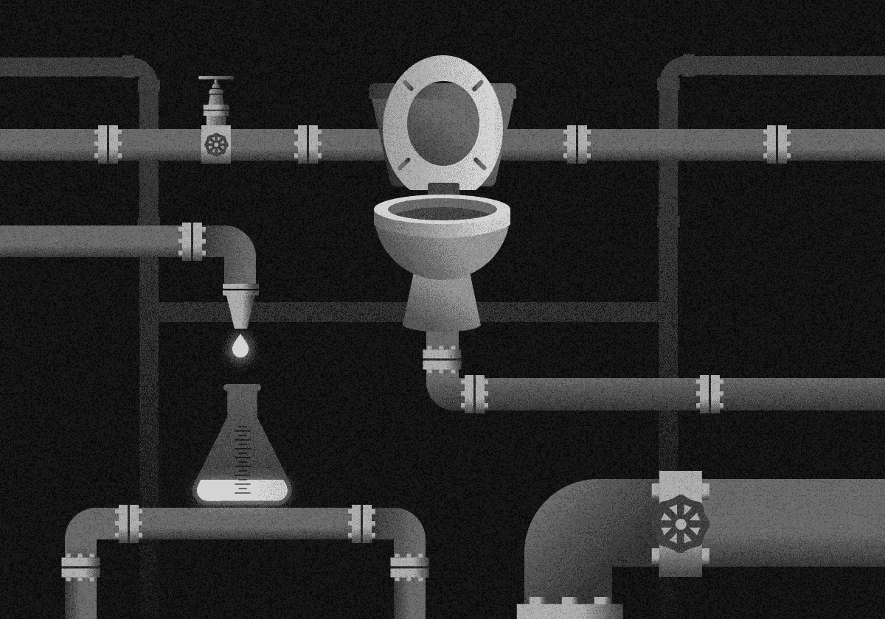
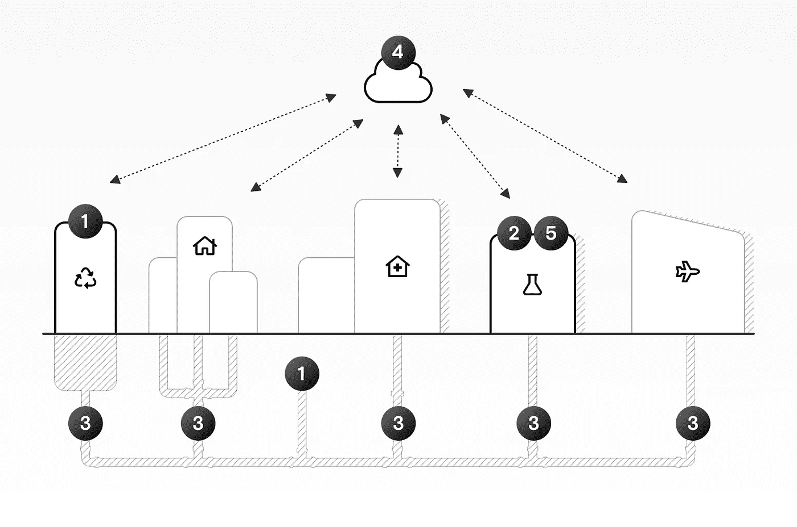

# 通过废水监测检测新冠肺炎疫情

> 原文：<https://towardsdatascience.com/detecting-covid-19-outbreaks-through-wastewater-monitoring-f97bace1eb57?source=collection_archive---------40----------------------->

## 通过废水监测检测新冠肺炎疫情

来源:作者

试图监控新冠肺炎疫情的政府通常不得不做出艰难的权衡。

大规模测试人口中的个体成员既昂贵又困难:有限的实验室设备和医疗设施使得测试整个国家的人口几乎是不可能的。一个更便宜且逻辑上更简单的策略是分析污水。因为可以在人类排泄物中检测到新冠肺炎病毒和其他病毒，所以废水处理厂提供了综合信息。

目前，与单独测试相比，废水监测在 T2 更慢，在 T4 更不准确:需要更长的时间才能得到结果，而且更难确定爆发的确切地点。

但是，我们几乎已经掌握了让废水监测更快、更准确所需的所有知识。我们可以通过以下方式更有效地检测和应对新冠肺炎(和其他病毒)疫情:

*   驱动一套**开放标准**；
*   开发**小型化设备**；和
*   创建**互操作数据平台**。

我们最近概述了一个由五部分组成的解决方案，该方案可以扩展到在整个大陆甚至全球范围内监测新冠肺炎。因为我们相信许多人、国家和组织可以从这些建议中受益，所以这里有一个我们发现的潜力的总结。

# 废水监测的工作原理

世界各地的污水处理系统都是类似的。水从单个的房子被倒入一个更大的集中管道系统。然后污水流向中央水处理厂。

病毒通常可以在受感染者的粪便中检测到。这就是为什么查看在特定水处理厂检测到的病毒浓度可以让我们估计该厂服务区域内的感染人数。

但是废水可能需要几天或几周的时间才能到达一个集中处理厂，因为在这个过程中经常有中间的清洁步骤。因此，监测工厂的废水通常意味着，虽然我们知道爆发发生了，我们知道它有多大，但我们不知道它发生在集水区的确切时间或地点(专家称之为空间分辨率和时间分辨率)。

因此，废水监测作为检测病毒爆发的潜在解决方案经常被忽视。

这将需要大规模的协调努力，以改善目前的技术和废水监测过程。但是考虑到确定新病毒爆发的价值，并与扩大个体测试所需的成本和努力相比，很明显这项工作需要完成。

# 我们改进废水监测的五部分解决方案

我们的五部分解决方案包括:1)监控指导，2)参考样本，3)小型化设备，4)可互操作的数据平台，以及 5)机器学习分析。来源:作者

我们提议的改善和扩展废水监控的五部分解决方案包括:

1.  **关于如何设置监测设备和取样的标准化指南**:所有各方都需要同意这套标准，因为为了获得可比较的数据，每个人都必须以相同的方式进行。
2.  **用于制备样品和量化病毒的参考方法**:即使有关于设置监测设备的标准指南，每个人还需要就如何在实验室制备样品以及如何测量废水中特定病毒的浓度达成一致。
3.  **小型化仪器**在更靠近源头的地方测量废水:我们需要制造小型的某些监测设备。
4.  跨部门和国家共享数据的互操作数据平台:这些都需要开发。
5.  **机器学习预测分析**:这将使我们能够尽早发现新病毒或已知病毒的新爆发，以协调适当的应对措施。

其中一些组件已经存在或正在开发中。我们详细查看这五项建议中的每一项，以显示我们所处的****和我们可能达到的**(在 3-24 个月的时间内)。******

# ******解决方案 1:监控指南******

******为处理厂制定一套关于如何提取样本和优化监测流程的指南，将有助于确保所有后续步骤中的数据一致。******

********我们在哪里:********

*   ****我们已经使用废水监测来回顾性地分析和描述疫情**。不同城市的做法略有不同，很多步骤都是手动完成的。比如污水采样有两种不同的方法:
    **抓样**:在单个时间点取单个样本；
    **复合取样**:在 24 小时内收集和组合样本。******
*   ****目前的工艺通常需要在每个处理厂现场训练有素的专家。****
*   ****可能需要数周才能得到有用的结果，而且不同工厂或国家之间的数据并不总是可比的。****

******我们可能在哪里:******

*   ****随着监测设备和过程的改进，我们可以主动分析废水来预测即将到来的疾病爆发。****
*   ****通过自动化尽可能多的步骤，标准化设备和协议，并确保工厂和国家之间的一致性，我们可以降低成本并提高监测质量。****

# ****解决方案 2:制备样品和定量病毒的参考方法****

****为实验室创建参考样品和方案将确保样品制备和浓度测量的一致性。****

******我们在哪里:******

*   ****我们知道我们可以在废水中检测病毒，包括 SARS 和新型冠状病毒病毒，但有几种方法可以测量样本和量化病毒浓度。****
*   ****“正常”是什么并不总是很清楚。****
*   ****样品可能以不同的方式制备，这可能会影响结果，并使不同实验室之间的数据比较变得困难。****

******我们可能在哪里:******

*   ****通过创建用于制备样品和量化病毒的标准化方案，以及就一组参考样品达成一致，不同国家的不同实验室可以共享和比较数据。这种标准化将使**更快**、**更灵敏**的分析成为可能——这两个因素都很重要，尤其是对早期预警系统而言。****

# ****解决方案 3:收集和标准化粪便样本的小型化仪器****

****制造适用于大型污水处理厂的小型监测设备，将有助于我们更准确、更经济地查明疫情。****

******我们在哪里:******

*   ****废水处理厂测量整个集水区的平均信息。由于一些设备是为大型处理厂设计的，因此在更精细的层面上复制这种取样过程存在后勤方面的挑战。****
*   ****这意味着特定集水区的较小部分中的爆发可能被较大区域的平均值“抹平”,从而难以检测到爆发。****

******我们可能在哪里:******

*   ****开发小型化的取样设备将使我们能够进行更详细的测量。****
*   ****更详细的测量可以告诉我们疾病爆发的确切位置——精确到一个街区，甚至一座特定的建筑。****
*   ****通过不等待废水到达一个集中的工厂，我们也可以更快地获得这些测量值，给我们更好的空间和时间分辨率——也就是说，允许我们采取行动来遏制甚至防止疾病爆发。****

# ****解决方案 4:开发一个可互操作的平台来整合环境和健康数据****

****跨部门、跨角色和跨城市使用的单一数据平台将让所有人都在同一页面上。****

******我们在哪里:******

*   ****许多部门和国家已经在更广泛地共享他们的数据。这允许其他国家和部门之间的一些合作，甚至让公众成员直接获得信息。****
*   ****卫生部门和水管理部门并不总是有效合作，有时很难利用废水管理的见解来推动与健康相关的决策。****
*   ****各国共享数据仍然很困难。****

******我们可能在哪里:******

*   ****建立一个可互操作的数据平台来处理和组合来自水管理部门(如病毒浓度激增)和卫生部门(如感染率和住院率)的指标，将有助于我们做出更有效的决策。****
*   ****通过鼓励多个城市采用相同的平台，我们可以很容易地看到从“鸟瞰”到特定邮政编码爆发的一切。****
*   ****研究人员、工程师、政治家和决策者都可以从一个可靠的、集中的“真理来源”获得数据。****

# ****解决方案 5:预测分析****

****我们可以使用机器学习来自动预测何时何地爆发。****

******我们在哪里:******

*   ****废水监测目前太慢，无法用于预警系统。****
*   ****即使实现了上述所有解决方案，仍然需要时间来收集和分析我们需要的样本和数据。****
*   ****我们目前主要使用这些数据进行**回顾**分析。****

******我们可能在哪里:******

*   ****通过使用先进的机器学习，我们可以在废水中发现指示疾病爆发的新模式——甚至在患者首次报告症状之前。****
*   ****我们可以使用机器学习来纠正使我们的测量产生偏差的因素，例如一天中的时间、一周中的哪一天，甚至是天气，所有这些因素都会影响任何给定时间集水区内的人数。****
*   ****宏基因组分析也将帮助我们检测新病毒。我们可以监测以前在废水中没有检测到的新病毒 DNA，并将其与已知病毒进行映射，以识别新突变的潜在危险爆发。****

# ****有前途的废水监测项目实例****

*   ****法国和荷兰在欧洲领先。2020 年 4 月，法国已经[看到了一个月采样的第一批结果](https://www.sciencemag.org/news/2020/04/coronavirus-found-paris-sewage-points-early-warning-system)，荷兰[从 2020 年 8 月开始将监测](https://newseu.cgtn.com/news/2020-07-21/Netherlands-leads-the-way-with-nationwide-COVID-19-sewage-testing-ShzEz63aMg/index.html)扩大到全国水平。****
*   ****在荷兰， [RIVM 每周从 300 多个污水处理厂采集样本](https://www.rivm.nl/en/covid-19/sewage)，并通过[在线仪表盘](https://coronadashboard.government.nl/landelijk/rioolwater)将这些数据公之于众。****
*   ****欧盟说一个[EU-宽项目](https://ec.europa.eu/jrc/en/science-update/call-notice-feasibility-assessment-eu-wide-wastewater-monitoring-system-sars-cov-2-surveillance)是可行的。****

# ****你想把这项技术带到你的城市吗？****

****如果您参与水资源管理或病毒爆发监测，并希望讨论将这项技术引入您的城市，我们很乐意与您交谈。如果你是一名居民，你的城市采用这种技术会使你受益，请与你的代表分享这篇文章。****

****[如果您想讨论使用机器学习进行健康监测，请与我们的首席执行官](https://datarevenue.com/en-contact)预约通话。****