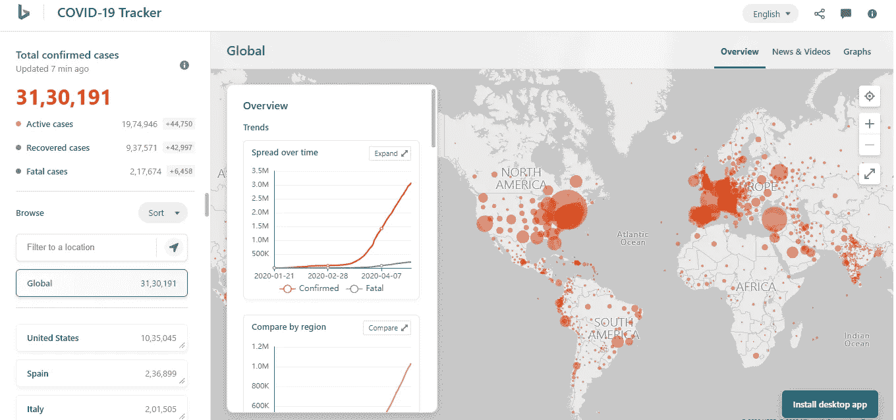
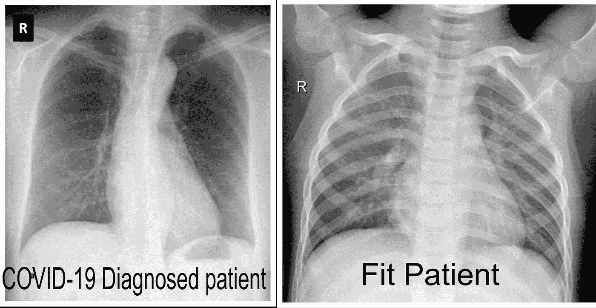
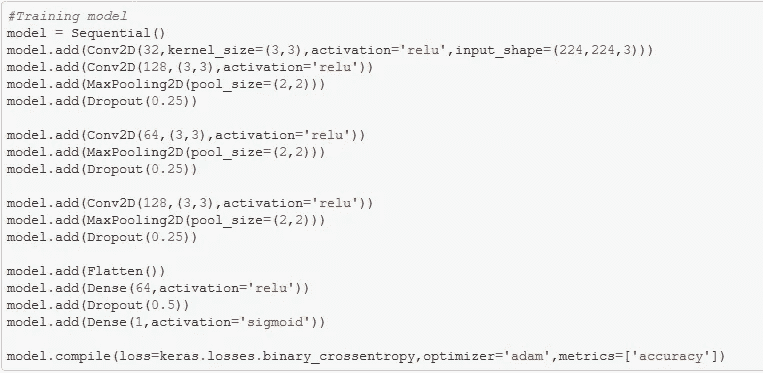
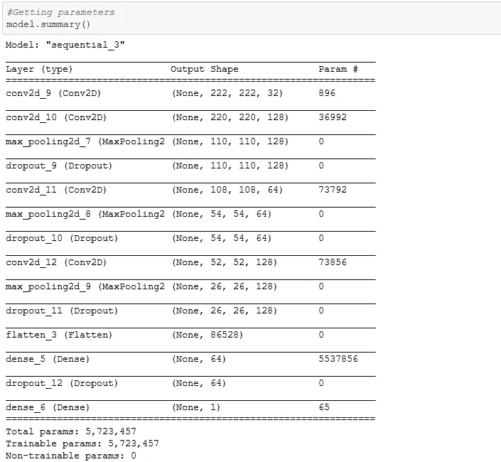
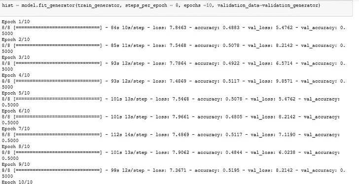
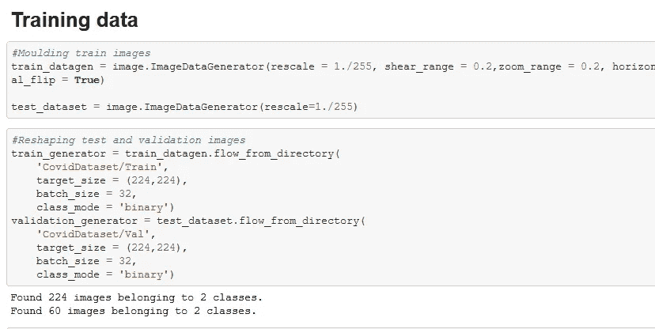
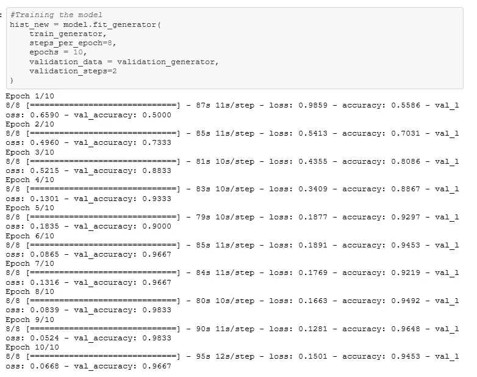
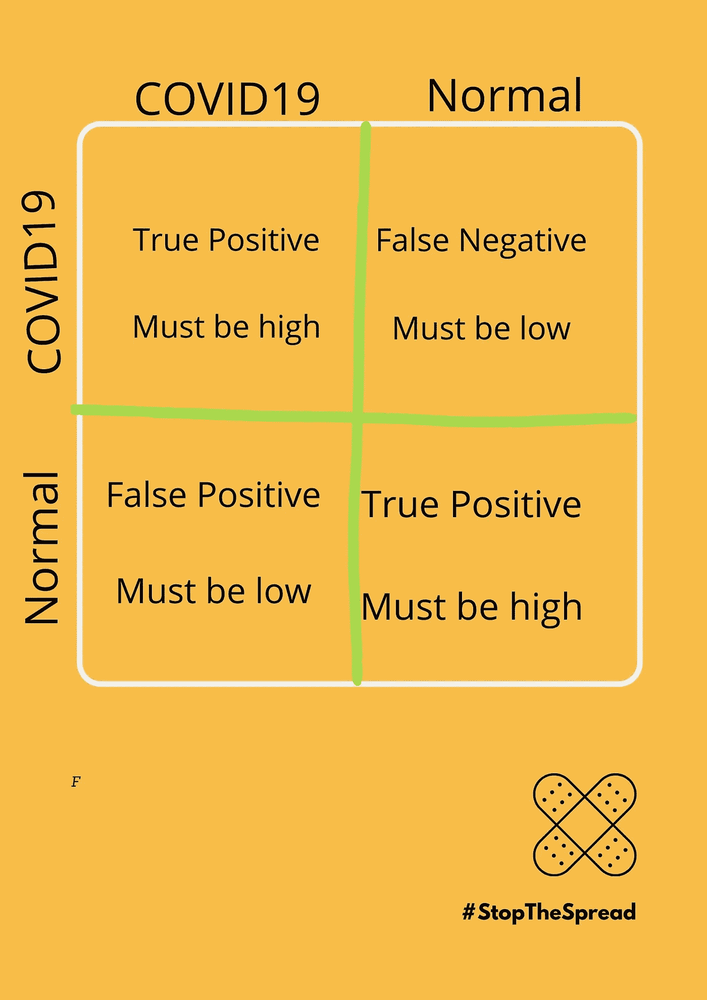
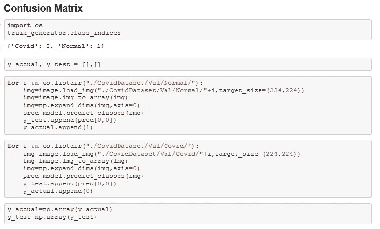
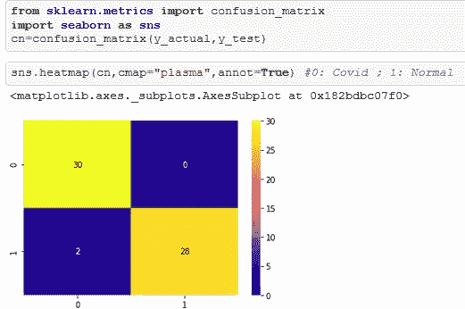

# 使用深度学习检测新冠肺炎

> 原文：<https://towardsdatascience.com/detecting-covid-19-using-deep-learning-262956b6f981?source=collection_archive---------13----------------------->

## 一个实用的方法来帮助医生帮助我们对抗新冠肺炎

**“冠状病毒病 2019** ( **新冠肺炎**)是由*严重急性呼吸综合征冠状病毒 2”*引起的高度传染性疾病。

“这种疾病于 2019 年 12 月首次起源于中国武汉，自那以来，它已经在全球范围内传播，影响了超过 200 个国家。影响如此之大，以至于 ***世界卫生组织(世卫组织)*** 已经宣布**新冠肺炎**正在发生的疫情为国际关注的突发公共卫生事件。”

截至 4 月 29 日，全世界 200 多个国家共有 31，30，191 例病例，2，17，674 例死亡。(来源:[必应新冠肺炎追踪器](https://bing.com/covid))。

因此，在这个特定的场景中，需要做的一件主要事情是*手动测试*，并且大多数国家已经开始做这件事情，以便能够了解真实情况并做出适当的决定。

但是人工检测的缺点包括检测试剂盒的可获得性差，血液检测成本高且效率低；验血大约需要 5-6 个小时才能得出结果。

因此，我们的想法是利用深度学习技术来克服这些情况，以获得更好、更有效的治疗。由于这种疾病具有高度传染性，因此我们越早得出结果，城市中的病例就越少，这就是为什么我们可以使用卷积神经网络来完成我们的工作。

如果没有贴标签，你能区分两张 x 光片吗？我打赌你不能，但是 CNN 可以。

该问题是一个二元分类问题，其中我们对正常和新冠肺炎病例进行分类。

使用深度学习来解决这种情况有几个利弊:

1.  优点:更节省时间；不太贵；易操作的
2.  反对意见:实际上我们需要 100%的准确性，因为我们不能错误地识别患者，因为这可能导致疾病的进一步传播，这是非常不鼓励的。

但是，这个模型仍然可以返回良好的准确性，并可以进一步得到加强。

# 数据准备

机器学习需要大量的数据来训练；对于这种类型的问题，我们需要的数据是 COVID 受影响和健康患者的胸部 x 光片。

1.  **[**约瑟夫**](https://josephpcohen.com/w/) 博士最近开源了一个 [**数据库**](https://github.com/ieee8023/covid-chestxray-dataset) 包含患有新冠肺炎病患者的胸部 x 光照片。所使用的数据集是一个开源数据集，包括来自公开研究的新冠肺炎图像，以及不同肺炎致病疾病(如 SARS、链球菌和肺囊虫)的肺部图像。**
2.  **我还使用了 [**Kaggle 的胸部 X 射线**](https://www.kaggle.com/paultimothymooney/chest-xray-pneumonia) 竞赛数据集来提取健康患者的 X 射线，并对 100 幅图像进行了采样，以与新冠肺炎可用图像进行平衡。**

**所以，数据集由新冠肺炎 X 射线扫描图像组成。事实证明，最常用的视图是后前视图，我在分析中考虑了新冠肺炎 PA 视图 X 射线扫描。**

**为了对我们的数据进行分层，我们将获取相同数量的图像，并将它们混合，稍后将分为测试和训练数据。**

# **模型部署**

**由于我们已经准备好了数据，这是这个项目中最繁琐的部分，让我们进入下一步，我们将创建一个深度学习模型，该模型将学习正常 X 射线和新冠肺炎影响 X 射线之间的差异。**

**我假设你们都知道 CNN 架构的基础知识，如果没有，我强烈推荐你们关注:-[CNN 基础知识](https://www.youtube.com/watch?v=MKBYwuxXtvo)**

****

**模型架构**

**我倾向于有***3 个隐藏层，*** 你可以试验更多或更少的层，这取决于你。我将模仿增加神经元的传统路线，因为我们越深入层内，学习的特征就越多。**

**我将有 *(224，224，3)* 个输入神经元，我们正在将数据调整为具有 3 个通道 的 ***224*224，因为它被认为是理想的大小。*****

**最后，我将展平我们的特征，并将使用 sigmoid 作为激活函数，因为我们有*二进制分类问题*，因此我们的输出将只包含一个单元格， ***adam 作为优化器*** 与*配合得非常好，因此除了 ***交叉二进制熵之外，还使用它们来编译模型。******

******

***因素***

***你可能想知道为什么我不直接部署 VGG16 或任何预定义的模型，但为此，你必须知道 ***VGG16*** 的架构，它包含大约***1.4 亿个参数*** ，另一方面，我们的模型包含大约***570 万个参数*** ，所以使用定制的模型比在迁移学习上训练几个小时更好，更优化，特别是对于这样的小数据集。***

# ***培训用数据***

***因为我们已经定义了我们的模型，我们剩下的下一个任务是在定义的模型上训练我们的数据。***

***我试着在不进行剪切、缩放和水平移动的情况下训练数据，所以我得到的准确率约为 50%，对于像这样的实时项目来说，这是相当低的。***

************

***由于数据没有成型，接收信号较少，因此准确性较低***

***因此，为了更好地接收特征，最好对数据进行建模，因此，我们对训练数据执行剪切、缩放和水平旋转。***

***一旦图像被增强，我们可以在输入形状中对它们进行整形，即****224 * 224***，批量大小为 32 的 ***，并且可以训练我们的训练集。*******

********

****准备培训数据****

****在我的训练过程中，我用 ***10 个周期，每个周期 8 步*** ，再次自由试验超参数，也许会产生更好的结果。****

********

****训练模型****

********

****总结模型****

****此外，我们可以绘制损耗和精度图，以便更好地理解所需的超参数。****

****定义的超参数产生 96.4%的准确性，这并不坏，但仍可以提高，因为如果我们在真实场景中部署一个准确率约为 96.4%的模型，错误识别的患者仍可能传播疾病，我们的高效方法目标将无法实现。****

****同样，如果你想节省训练的时间，你可以从我的 [***Github 库***](https://github.com/dakshtrehan/Covid-19-Detection) ***下载训练好的模型。*******

# ****混淆矩阵****

****为了以更容易理解的方式可视化结果，我们将实现一个混淆矩阵。****

****混淆矩阵的原型如下****

********

****我们得到的混淆矩阵如下****

****************

****解码混淆矩阵，在 30 名 COVID 受影响的患者中，我们得到了 *30 人*我们得到了 *0 名被错误分类的患者*，在 2 名 *8 名正常患者*中，我们得到了 *28 名患者*被正确分类， *2 名被错误分类。*****

****我们得到的结果是好的，但仍然可以提高精度，以实现我们的意图。****

******如果你喜欢这篇文章，请考虑订阅我的简讯:** [**达克什·特雷汉每周简讯**](https://mailchi.mp/b535943b5fff/daksh-trehan-weekly-newsletter) **。******

# ******源代码******

****完整的源代码以及数据集和训练好的模型可以在我的 Github 存储库中找到:- [***新冠肺炎检测***](https://github.com/dakshtrehan/Covid-19-Detection)****

# ****结论****

****因此，作为总结，我想再次思考这样一个事实，即分析是在有限的数据集上进行的，结果是探索性的，不能从中推断出任何结论性的东西。该方法尚未经过医学验证。****

****我计划改进这个模型，用更多的 X 射线扫描来增加我的模型的韧性，这样这个模型就可以推广了。此外，我鼓励读者对模型进行实验，以使其更加精确。****

****一如既往，非常感谢你的阅读，如果你觉得这篇文章有用，请分享！****

*******待在家里，注意安全！*******

****请随意连接:****

> ****在 www.dakshtrehan.com 和我一起****
> 
> *****LinkedIN ~*[*https://www.linkedin.com/in/dakshtrehan/*](https://www.linkedin.com/in/dakshtrehan/)****
> 
> *****Instagram ~*[*https://www.instagram.com/_daksh_trehan_/*](https://www.instagram.com/_daksh_trehan_/)****
> 
> *****Github ~*[https://github.com/dakshtrehan](https://github.com/dakshtrehan)****

****阅读我的其他文章:-****

> ****[逻辑回归解释](/logistic-regression-explained-ef1d816ea85a)****
> 
> ****[线性回归解释](https://medium.com/towards-artificial-intelligence/linear-regression-explained-f5cc85ae2c5c)****
> 
> ****[确定最适合您的 ML 模型](https://medium.com/datadriveninvestor/determining-perfect-fit-for-your-ml-model-339459eef670)****
> 
> ****[将机器学习技术与现实生活联系起来](https://levelup.gitconnected.com/relating-machine-learning-techniques-to-real-life-4dafd626fdff)****
> 
> ****[为新手提供数据科学服务](https://medium.com/towards-artificial-intelligence/serving-data-science-to-a-rookie-b03af9ea99a2)****

****关注更多机器学习/深度学习博客。****

> *****中等~*[https://medium.com/@dakshtrehan](https://medium.com/@dakshtrehan)****
> 
> *****干杯。*****

*****封面模板和混淆矩阵模板是我在*[*www.canva.com 上做的。*](http://www.canva.com.)*x 射线图像是 github 和 kaggle 上可用的开源数据集的一部分。其余图片来自我的 Jupyter 笔记本。如果您想获得使用许可，请联系我。*****

*****另外，我还要感谢 Prateek bhaiyaa 和编码模块，他们通过他们的数据科学会议帮助我更好地理解了这些模型。*****