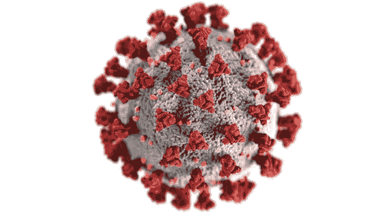
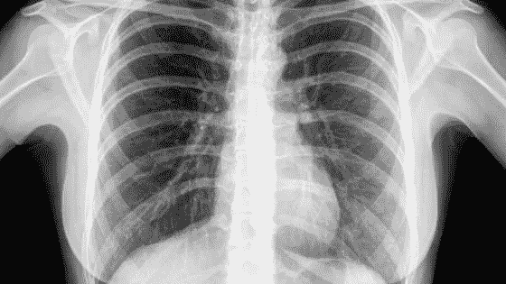
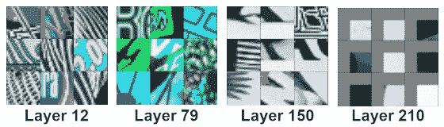

# 以 97%的准确率检测新冠肺炎:小心人工智能炒作！

> 原文：<https://towardsdatascience.com/detecting-covid-19-with-97-accuracy-beware-of-the-ai-hype-9074248af3e1?source=collection_archive---------14----------------------->

## 当病毒式营销走得太远时

[疾控中心](https://unsplash.com/@cdc?utm_source=unsplash&utm_medium=referral&utm_content=creditCopyText)在 [Unsplash](https://unsplash.com/s/photos/covid?utm_source=unsplash&utm_medium=referral&utm_content=creditCopyText) 拍摄的照片

一名 n 澳大利亚人工智能博士生最近在 LinkedIn 上发了一篇[帖子](https://www.linkedin.com/posts/activity-6645711949554425856-9Dhm/)关于他对新型冠状病毒的研究。这个帖子收集了成千上万的观点、赞和分享。

# AI 很棒

他建立了一个深度学习模型，能够从胸片中预测病人是否感染新冠肺炎病毒，准确率为 97.5%。

目前，该项目的特点是:

*   受过训练的 PyTorch 模型
*   集装箱化应用代码
*   翻译成 8 种语言的 GitHub [库](https://github.com/elcronos/COVID-19)
*   开发中的 web 应用程序
*   开发中的移动应用程序
*   AWS 中用于托管模型的无服务器架构的蓝图
*   在营销和赞助方面付出了很多努力

上面的一切都是在大约一周内建成的。

## 医疗诊断中的深度学习

深度卷积网络对于疾病诊断和治疗具有潜在的益处。近年来出现了许多科学出版物[1]，下面是其中的一些:

*   2016 年，一组伦敦研究人员发表了一种诊断糖尿病视网膜病变的方法，准确率为 86%，在 8 万张眼底照片的数据集上进行训练[2]。
*   同年，乌干达研究人员使用 10，000 个对象的数据集评估了 CNN 在显微血涂片上的性能[3]。
*   两名日本研究人员在 550，000 个 CT 扫描数据集上领导了一项对肺结节进行分类的工作[4]。

但在这里，快速浏览一下 GitHub 知识库，往好了说，描绘了对深度学习和人工智能的严重缺乏理解，往坏了说，描绘了在利用疫情的同时进行**自我宣传的恶意尝试。原因如下。**

# 糟糕的工程

这个解决方案有几个问题，其中大部分在下面的 [Reddit 线程](https://www.reddit.com/r/MachineLearning/comments/fni5ow/d_why_is_the_ai_hype_absolutely_bonkers/)中被揭穿。

首先，这些网络的潜在神经表示非常复杂，因此它们需要大量的训练样本，如前述研究中所述。

**但截至目前，新冠肺炎探测器是在…** [**50 张图像**](https://github.com/elcronos/COVID-19/tree/574b73b087ed9855eb52f0f368f822b8548b253b/dataset) **的数据集上训练的！**

*图 1:模型从胸部 x 光片中学习。来自* [NIH 胸部 x 光数据集](https://cloud.google.com/healthcare/docs/resources/public-datasets/nih-chest)的图像

对于一个拥有超过 150 层和超过 2000 万个参数的网络来说，这完全是荒谬的。

此外，还存在巨大的数据偏差。这 50 张图片并不是根据一个人是否携带病毒来标记的，而是根据新冠肺炎急性病例的肺部损伤来标记的。除非你的肺已经被病毒破坏了，否则这个模型无法检测到感染。在一个人出现肺炎症状的情况下，如果这些症状不是急性的，则该模型的准确性未经证实。

最后，COVID 模型基于一个流行的基线网络 ResNet-50[5]。虽然这是图像识别和分类的常用方法，但 ResNet 是使用日常物体的照片进行预训练的。因此，其隐藏层的内部表现被几何形状和彩色图案激活(2)。

*图 ResNet 特征的可视化[6]*

这种模式在 x 光照片中是找不到的。这就是为什么大多数医学神经网络都是从零开始制作的。

当我们仔细查看代码库时，会出现许多其他问题。训练、验证和测试数据集包含重复图像；大部分的训练过程都是从 PyTorch 教程中截取的，用不必要的代码混淆；Github 的问题是荒谬的…

**很明显，那篇文章注定会有成千上万的赞、分享和观点，不管标题背后的内容是什么。**

> 宣传作为商业竞争的一种手段，给发明者带来了机会，也极大地刺激了科学家的研究。
> 
> 爱德华·伯奈斯

# 尼日利亚王子的蛇油

然而，作者在面对事实时并不绝望，经常提出以下答案:

> *你好* xxx *，在加拿大一家研究机构放射学家的支持下，我们已经策划了 5000 例*

我不知道这个大胆的答案中的部分真理，但如果这样的模型被用于医学应用，它可能是非常危险的。

作者甚至创建了一个拥有多个渠道的 [Slack group](https://join.slack.com/t/covid-19detector/shared_invite/zt-cw28jq9g-2FcPBD~zNRYLnVhr34hrRQ) 。不用说，它引起了很多人的兴趣。

*#数据科学家*频道没有太多严肃的内容，被满怀希望但经验不足的热情新人打断。同样，在*#医生*频道中唯一的有形内容来自解决医疗问题的专业人士，例如，胸部 x 光检查不是新冠肺炎诊断的推荐方法。最后，*#研究人员*频道几乎空无一人。

另一方面，UI/UX 频道正在生成大量内容。该倡议现在有 5 个不同的标志和一个手机和网络界面的模型。

甚至还有一个*#营销*频道来寻找加强沟通和筹集资金的方法，还有一个*#赞助商*频道，潜在投资者询问投资回报的未来前景。

[*自己看*](https://join.slack.com/t/covid-19detector/shared_invite/zt-cw28jq9g-2FcPBD~zNRYLnVhr34hrRQ)

# 当心炒作

**深度学习不是银弹解决方案**。许多没有做好准备的公司试图将其内部化为数据团队，当他们看到成本上升而很少或根本没有投入生产时，他们变得疯狂了。

尽管如此，如今人工智能的进步是开创性的。完全忽视它们的人是疯狂的。

这并不意味着直接跳入池中，在水中扑腾着呼吸空气。因此，拥有 AI / ML、数据操作、架构、开发和许多其他主题的横向技能的坚如磐石的团队非常重要。

[*安托万冠军，2020 年 3 月 23 日*](http://antoinechampion.com)

# 参考

[1]医学图像处理的深度学习:概述、挑战和未来，Muhammad Imran Razzak，Saeeda Naz，Ahmad Zaib，2017。

[2]哈里·普拉特、弗兰斯·科恩、黛博拉·M·布罗德本特、西蒙·P·哈丁和郑亚林。糖尿病视网膜病变的卷积神经网络，2016 年。

[3]John A . Quinn、Rose Nakasi、Pius KB Mugagga、Patrick Byanyima、William Lubega 和 Alfred Andama。基于显微镜的护理点诊断的深度卷积神经网络，2016 年。

[4]坂本雅治和中野博树。具有选择性分类器的级联神经网络及其使用肺部 x 射线 ct 图像的评估，2016。

[5]深度残差学习在图像识别中的应用，何，孙，2015 .

[6]，戴伦·杨，拉维·塔迪纳达。可视化剩余网络，2017。