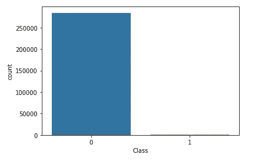
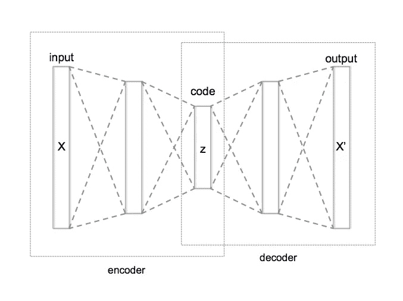
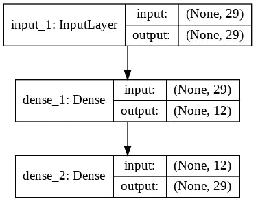
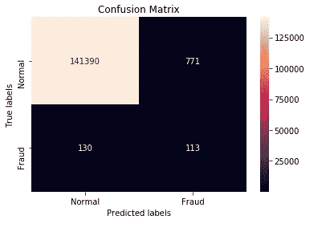
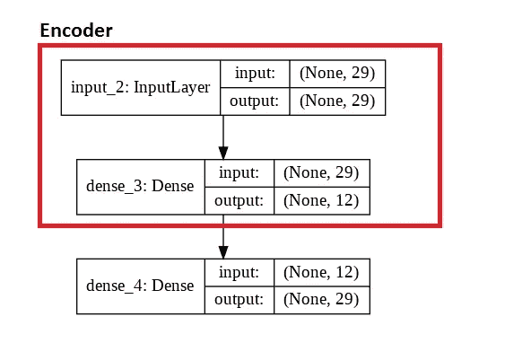
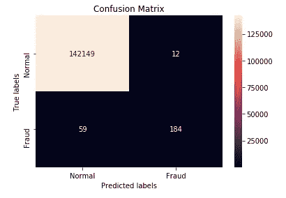

# 用 Python 中的自动编码器检测信用卡欺诈

> 原文：<https://towardsdatascience.com/detecting-credit-card-fraud-with-autoencoders-in-python-98391cace8a3?source=collection_archive---------25----------------------->

## 使用 Tensorflow 和 Keras 的两种方法


[粘土银行](https://unsplash.com/@claybanks?utm_source=medium&utm_medium=referral)在 [Unsplash](https://unsplash.com?utm_source=medium&utm_medium=referral) 拍摄的照片

在本文中，我们将演示两种不同的使用自动编码器的方法。特别是，我们将尝试使用自动编码器将信用卡交易分为欺诈性和非欺诈性。我们将要使用的数据集是“信用卡欺诈检测”数据集，可以在 [Kaggle](https://www.kaggle.com/mlg-ulb/creditcardfraud) 中找到。完整代码可在 [GitHub](https://github.com/dpanagop/ML_and_AI_examples/blob/master/Credit_Fraud_detection_with_autoencoders.ipynb) 上获得。其中有一个在 Colab 中打开和执行代码的链接，所以请随意尝试。代码是用 Python 写的，用了 Tensorflow 和 Keras。

该数据集包含欧洲持卡人的 284，807 笔信用卡交易。出于安全原因，数据集的原始特征不可用。可用的是 28 个特征，它们是原始特征的 PCA 的结果。还有，每笔交易的金额和“时间”一栏。最后一个函数计算每个事务和集合中第一个事务之间的秒数。最后，每个交易的类型在“类”列中。欺诈交易用 1 表示，非欺诈交易用 0 表示。该数据集高度不平衡，非欺诈交易占总数的 99.8%。因此，我们的分类问题也可以被视为异常值检测问题，欺诈性交易被视为异常值。



284，807 笔交易中只有 492 笔是欺诈

对于我们的例子，我们将忽略“时间”列。训练和测试数据集中的标准分割方法将用于评估每种方法。因为一个类的情况太少，我们将把数据集分成两半，而不是通常的 70%-30%。

如开始所述，我们将使用自动编码器来完成分类任务。根据[维基百科](https://en.wikipedia.org/wiki/Autoencoder):

> 自动编码器是一种人工神经网络，用于以无监督的方式学习有效的数据编码。

简而言之，自动编码器是一个神经网络，它被训练来重新创建作为输入的任何内容。在输入层和输出层之间有一堆隐藏层。在正中间有一层，包含的神经元比输入少。这一层的输出是自动编码器的所谓编码器部分的结果。



一个自动编码器的表示(作者:[切尔文斯基](https://commons.wikimedia.org/w/index.php?title=User:Chervinskii&action=edit&redlink=1)来源:[维基百科](https://en.wikipedia.org/wiki/File:Autoencoder_structure.png)

使用自动编码器的理由是，隐藏层将以一种良好的方式将输入映射到向量空间(无论“良好”可能意味着什么)。通过使用具有很少神经元的层的结果，我们将我们的输入从高维空间映射到更低维的空间。

## 第一种方法:使用重建误差

我们的第一个方法是创建一个自动编码器，只在非欺诈交易上训练它。合乎逻辑的是，预期欺诈情况下该自动编码器的重构误差将高于非欺诈情况下的重构误差。我在 Venelin Valkok 的优秀媒体文章中读到过这种技术。我建议你学习它，因为在它里面，这个方法以一种非常详细和容易理解的方式被解释。

[](https://medium.com/@curiousily/credit-card-fraud-detection-using-autoencoders-in-keras-tensorflow-for-hackers-part-vii-20e0c85301bd) [## 使用 Keras 中的自动编码器检测信用卡欺诈——面向黑客的 TensorFlow(第七部分)

### 信用卡交易中的异常检测是如何工作的？

medium.com](https://medium.com/@curiousily/credit-card-fraud-detection-using-autoencoders-in-keras-tensorflow-for-hackers-part-vii-20e0c85301bd) 

出于演示的原因，我们将创建一个简单的由三层组成的自动编码器。输入层、一个隐藏层和输出层。隐藏层将有 12 个神经元。



第一种方法中使用的简单自动编码器的表示

如前所述，网络仅使用训练集的非欺诈案例进行**训练。在 100 个时期之后，我们获得了一个网络，我们用所有的训练集案例来喂养这个网络。然后，我们可以计算输入和输出之间的误差(重建误差)。结果如下表所示。**

```
+----------------+--------------------+--------------------+
|     Class      | Mean Squared Error | Standard Deviation |
+----------------+--------------------+--------------------+
| Non-Fraudulent |      0.767519      |       3.439808     |
|    Fraudulent  |     29.855354      |      43.107802     |
+----------------+--------------------+--------------------+
```

基于这些结果，在测试数据集中，如果实例的重构误差大于平均值的标准偏差的三倍，即大于 0.767519+3*3.439808=11.078922，则我们将该实例描述为欺诈性实例。当然，阈值的选择是我们的模型的超参数，在实际应用中，它应该被微调。

我们可以看到，我们的模型在测试数据集的 243 个(46.5%)欺诈案例中检测到了 113 个。此外，142161 个非欺诈案件中有 771 个(0.5%)被归类为欺诈案件。



第一种方法的混淆矩阵

## 第二种方法:编码器和 k-NN

在我们的第二种方法中，我们将使用自动编码器的编码器部分。编码器将把实例映射到低维空间，并且 k-最近邻(k-NN)将用于分类。在这种方法**中，欺诈性和非欺诈性交易都将用于训练编码器**。可以说，编码器将用于降维，从而加速 k-NN 的执行。

我们将使用与第一种方法相同的模型。输入层和具有 12 个神经元的内部隐藏层将是编码器部分。



编码器由自动编码器的前两层组成

对于分类部分，所有实例(来自训练集和测试集)将通过编码器映射到 12 维空间。对于测试集中的每个实例，训练集的三个最接近的相邻案例将决定它是否是欺诈性的。

第二种方法从测试数据集的 243 个欺诈案例中检测出 184 个(75.7%)。此外，142161 个非欺诈案件中有 12 个(0.008%)被归类为欺诈案件。



第二种方法的混淆矩阵

## 结束语

我们很快看到了两种使用自动编码器进行分类的方法。欢迎您尝试使用 Colab 代码。可以尝试的事情有:

*   在第一种方法中改变误差阈值
*   向自动编码器添加更多层
*   改变编码器最后一层的神经元数量

## 进一步阅读

*   Venelin Valkok 的 Medium 文章更详细地解释了第一种方法[https://medium . com/@ curious ly/信用卡欺诈检测使用 auto encoders-in-keras-tensor flow-for-hacker-part-VII-20 e0c 85301 BD](https://medium.com/@curiousily/credit-card-fraud-detection-using-autoencoders-in-keras-tensorflow-for-hackers-part-vii-20e0c85301bd)
*   第二种方法[https://hub . packtpub . com/using-auto encoders-for-detecting-credit-card-fraud-tutorial/](https://hub.packtpub.com/using-autoencoders-for-detecting-credit-card-fraud-tutorial/)