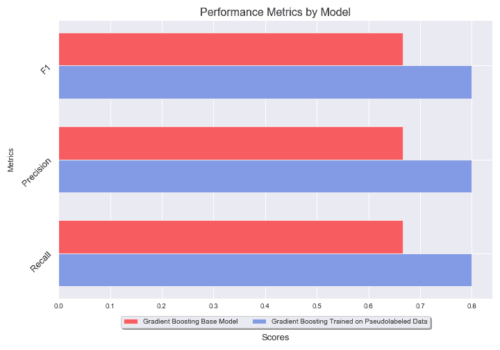
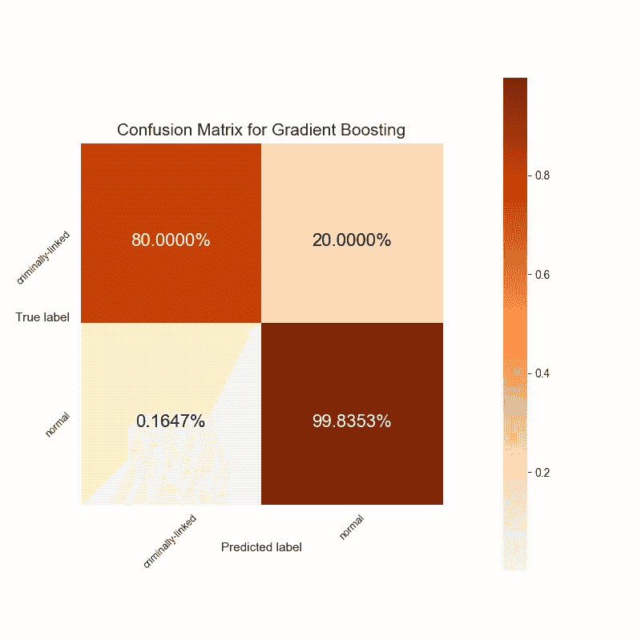
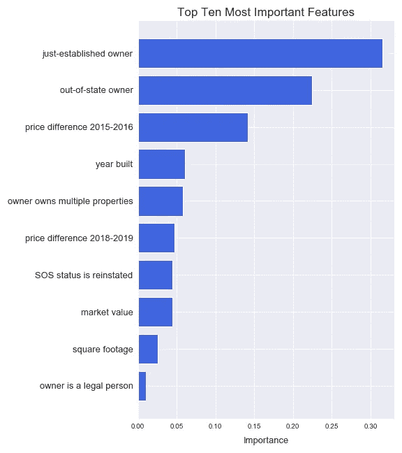

# 侦查房地产投资犯罪

> 原文：<https://towardsdatascience.com/detecting-criminal-investment-in-real-estate-5311d5a91ac8?source=collection_archive---------33----------------------->

## 将半监督机器学习应用于德克萨斯州贝克萨尔县的房产数据

蒂亚戈·罗德里格兹在 [Unsplash](https://unsplash.com?utm_source=medium&utm_medium=referral) 上的照片

# 背景

腐败的墨西哥政客和贩毒集团经常在美国，尤其是德克萨斯州的住宅房地产中洗钱。在美国，利用房地产清洗非法所得有几个好处:价格通常稳定，有可能升值，资产具有功能性。此外，全现金购买是一种有效的方式来避免获得抵押贷款所涉及的银行审查，有限责任公司可以为真正的买家提供匿名。因此，房地产为非法资金融入合法金融体系提供了一个简单而直接的途径。

由于目前 20%的房地产购买不涉及融资，这种通过住宅房地产进行的洗钱活动已成为美国财政部金融犯罪执法网络(FinCEN)的一个重要关注点。作为这一重点的一部分，FinCEN 于 2016 年 1 月开始发布地理目标指令。这些 GTO 在法律上要求产权保险公司报告符合特定标准的房地产交易。在县一级应用，它们主要覆盖门户城市，如迈阿密、纽约和洛杉矶。一个被 GTO 覆盖的县一直让我印象深刻，那就是德克萨斯州的贝克萨尔县，圣安东尼奥周围的那个县。

直到 1836 年，贝克萨尔县一直是墨西哥的一部分，至今仍与该国北部保持着密切的文化联系，周末通勤是家常便饭。根据 2016 年 7 月以来的一项 GTO，该县最近发生了几起墨西哥政客和白领罪犯在圣安东尼奥周围的房地产中藏匿不义之财的高调事件。⁴ ⁵作为一名前调查分析师，我经历过一些这样的案例，但还有很多比我最初意识到的更多。

因此，我使用了来自贝克萨尔县财产评估员和德克萨斯州的公开可用数据来建立一个能够检测该县住宅房地产犯罪投资的模型。[结果的 TLDR:我标记了一小部分数据，半监督方法将 F1 分数从 0.667 提高到 0.8]

# 数据

贝克萨尔县评估区提供(实体光盘！)以象征性的费用购买其年度评估数据。由于该县的一些洗钱事件发生在数年前，我获得了 2015 年至 2019 年四年的数据。每个都有超过 600，000 个属性的多个数据集，我使用的特定数据集包含 408 个特征，我在几次迭代中对其进行了精简。

为了设计关于财产所有权的潜在有用特性，我从德克萨斯州公共账户审计员那里获得了几个数据集，这需要直接接触他们的开放记录部分。

我选择了一个包含活跃企业纳税人的数据集和另一个提供这些公司官员和董事信息的数据集。我将这两者合并，创建了一个包含公司董事信息的数据集。

为了将公司数据与 Bexar 县的财产数据结合起来，在执行了一些基本的文本清理之后，我合并了一个完全匹配的名称。

# 特征工程

荷兰的一项研究在很大程度上启发了这个项目，该研究发现，识别荷兰引人注目的房产的三个最佳指标是外国所有权、所有者是一家刚刚成立的公司以及不寻常的价格波动。⁶因此，创造相似的特征是至关重要的。我能够通过从财产契约日期中减去公司执照日期来复制刚刚成立的公司。

根据荷兰的调查结果和我调查洗钱的经验，我做了几个不同的二元特征来表明财产的所有者是公司还是信托。例如，如果包括纳税人姓名，这是一个法人，而不是一个公司。或者，如果名称包含几个公司术语或后缀中的一个，那么它可能是一家公司。

为了近似一个不寻常的价格波动特征，我计算了每套房产从 2015 年开始的市值同比变化百分比。

我还为房产是否满足 Bexar County 的两个 GTO 标准创建了一个显式特性:房产价值大于 300，000 美元，所有者是一家公司。

# 标记一小部分数据

因为我获得的公共记录数据没有欺诈活动的标签，所以我创建了一个小的标签数据集来验证我的方法。虽然近年来在无监督机器学习方面取得了很多进展，但当标记一个小的子集是可行的时，半监督方法已经显示出巨大的前景。⁷因此，我必须为涉及刑事诉讼的财产创建积极的类别标签。通过使用当地报纸和法庭文件，我能够找到 59 处大致符合这些标准的房产。

圣安东尼奥的 1115 Links Cv 就是这些物业的一个例子，该物业由 Red Kaizen Investments LLC 所有。Red Kaizen Investments LLC 是墨西哥金融家 Rafael Olvera Amezcua 被指控经营虚假储蓄和贷款业务，诈骗储户超过 1.6 亿美元的法庭案件中被列为被告的数十家公司之一。⁸

在 GTO 覆盖的辖区内，有 1，082 笔交易符合高风险可疑活动报告(SARs ),占符合报告要求的所有交易的 17%。⁹ ⁰通过粗略计算，我预计这将转化为大约 700 处符合贝克萨尔县数据中这些标准的房产。必须注意的是，并非所有标记为犯罪的属性实际上都符合 GTO 要求，因此这不应被视为一个精确的指标。

尽管如此，我有一个非常强的积极的犯罪财产类别，但超过 600，000 个财产，虽然可能是非犯罪的，但没有标记。因此，存在着巨大的阶级不平衡和标签挑战。为了解决班级不平衡的问题，我依靠精确、回忆和混淆矩阵，而不是准确度。如果只有 0.1%的交易是欺诈性的，一种算法总是可以预测交易是非犯罪的，并且在 99.9%的时间里是正确的。精度和召回允许捕获假阳性(精度)和假阴性(召回)的比率。

作为标记未标记财产的相当大的子集的快速第一步，我将数据中最常见的 30 个财产所有者(即，拥有最多财产的 30 个所有者)所拥有的财产标记为非犯罪财产。我有信心将这些房产归为非犯罪类，因为房主是大型建筑公司以及州政府和市政府。然而，应该指出的是，这并不能产生一个真正有代表性的样本，因为它偏向于大业主。

在过滤掉异常属性并匹配我手动标记的犯罪属性后，我在数据集中有 5516 个非犯罪属性和 47 个具有强标签的犯罪属性。

# 数据伪标记

我的半监督欺诈检测方法的下一步是对我的大型未标记数据集的剩余部分的 15%进行伪标记。首先，我用手工标记的小数据子集上的表格数据训练了几个适合分类任务的基线模型:支持向量机、XGBoost、随机森林和梯度增强。梯度增强在测试数据上具有最强的性能，XGBoost 次之。

梯度提升使用一系列决策树来迭代上一个决策树的残差。这 100 个弱学习者集合起来形成一个强模型。通常，我发现梯度提升是一个很好的基础模型，因为它是一个性能更高的决策树，训练起来相对较快。此外，决策树是一种更容易解释的机器学习模型，这对于我确定哪些特征对欺诈分类最有帮助至关重要。

因此，我使用基于原始训练数据训练的超参数优化梯度推进模型来预测 86，708 个属性的标签。接下来，我将这个伪标记数据与标记数据相结合，并进行新的超参数搜索，现在我在这个更大的数据集上训练了一个新的梯度提升分类器。

# 结果

这个新模型在召回率、精确度和 F1 分数方面都优于基线模型。

我很高兴召回率如此之高，同时仍然保持较低的误报率。在这种情况下，当务之急是减少误报，但是误报越多，法规遵从性分析师需要做的手动工作就越多。

此外，该模型发现的对预测最重要的特征与荷兰的研究吻合得很好。

我的模型的最重要的特征是，房产由一家在房产购买日 365 天内成立的公司拥有。前面提到的荷兰研究与他们的第二强指标具有相同的特征。

我的模型依赖于多年来的年度价格差异作为最重要的特征之一。这大致反映了荷兰的研究如何将不寻常的价格波动作为其首要指标。⁴

拥有多处房产的业主符合我在资产追踪方面的经验，也符合荷兰研究的第二层指标之一。

# 结论

我的方法验证了检测犯罪投资的伪标记方法，表明一小部分标记数据可以用来对抗现有技术。这进一步证实了这种方法在新应用中的可行性，并提出了在这种应用中的可行途径，在这种应用中，访问完全标记的数据集是[禁止的](https://www.ft.com/content/56dde36c-aa40-11e9-984c-fac8325aaa04)。以下是一些有趣的后续内容:

*   使用[主动学习](https://papers.nips.cc/paper/2554-active-learning-for-anomaly-and-rare-category-detection.pdf)来找出哪些额外的数据点需要标记。
*   根据地理定位命令在其他县采用这种方法。
*   合并更多数据集(如邻域数据)以构建更多要素。

*感谢* [*妮娜·洛帕蒂娜*](https://medium.com/u/6f5d4443ed92?source=post_page-----5311d5a91ac8--------------------------------) *，感谢所有在这方面的帮助。如果你对 NER 感兴趣，一定要看看她做的所有很酷的工作。*

*这个项目的资源库可以在* *这里找到* [*。*](https://github.com/mpky/property_project)

[1][https://home . treasury . gov/system/files/136/National-Strategy-to-Counter-Illicit-finance v2 . pdf](https://home.treasury.gov/system/files/136/National-Strategy-to-Counter-Illicit-Financev2.pdf)，第 18 页。

[2][https://www . fin cen . gov/sites/default/files/shared/Real _ Estate _ GTO-mia . pdf](https://www.fincen.gov/sites/default/files/shared/Real_Estate_GTO-MIA.pdf)

[3]标准是:购买为全现金，购买者为公司，购买价格为 30 万美元或以上(根据最新 GTO)。

[4][https://www . express news . com/news/local/article/Coahuila-corruption-and-drug-ties-spread-5665058 . PHP #/0](https://www.expressnews.com/news/local/article/Coahuila-corruption-and-drug-ties-spread-5665058.php#/0)

[5][https://translate.google.com/translate?hl=en&sl = es&u = https://www . elfinanciero . com . MX/opinion/raymundo-Riva-Palacio/El-imperio-de-los-Medina&prev = search](https://translate.google.com/translate?hl=en&sl=es&u=https://www.elfinanciero.com.mx/opinion/raymundo-riva-palacio/el-imperio-de-los-medina&prev=search)

[6][https://www . politieacademie . nl/kennisonderzoek/kennis/media theek/PDF/86218 . PDF](https://www.politieacademie.nl/kennisenonderzoek/kennis/mediatheek/PDF/86218.pdf)

[https://arxiv.org/abs/1805.03620](https://arxiv.org/abs/1805.03620)

[8][https://www . document cloud . org/documents/6248702-Agreed-Final-judgment . html](https://www.documentcloud.org/documents/6248702-Agreed-Final-Judgment.html)

[9]风险较高的可疑交易报告由金融机构提交给 FinCEN，fin cen 随后对交易进行调查。财政部上下文中的高风险 sar 是指那些由于涉及高风险外国管辖区、毒品洗钱和跨国犯罪的活动而提交的 sar。

[10][https://home . treasury . gov/system/files/136/National-Strategy-to-Counter-Illicit-finance v2 . pdf](https://home.treasury.gov/system/files/136/National-Strategy-to-Counter-Illicit-Financev2.pdf)，第 18 页。

[11]我的数据集中有 21，131 处房产符合价格和公司所有的 GTO 要求。全国平均有 20%的房产是在没有贷款的情况下购买的，有 4226 处房产符合这三个标准；其中的 17%是 718。

[12]我为此遵循的实现是:[https://datawhatnow . com/pseudo-labeling-semi-supervised-learning/](https://datawhatnow.com/pseudo-labeling-semi-supervised-learning/)

[13][https://www . police academy . cn/知识调查/媒体中心/PDF/86218.pdf】第 231 页。](https://www.politieacademie.nl/kennisenonderzoek/kennis/mediatheek/PDF/86218.pdf)

[14][https://www . police academy . cn/知识调查/知识/媒体中心/pdf/86218.pdf](https://www.politieacademie.nl/kennisenonderzoek/kennis/mediatheek/PDF/86218.pdf)第 231 页。