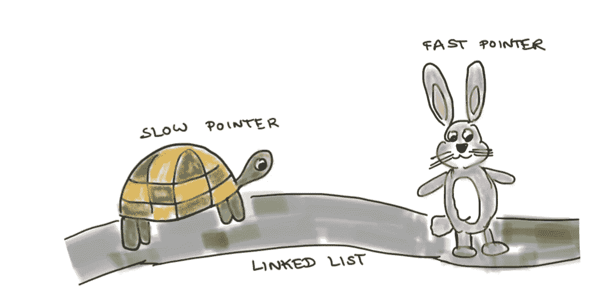
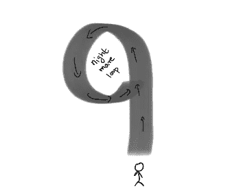

# 检测链表中的循环

> 原文：<https://towardsdatascience.com/detecting-cycles-in-linked-lists-an-analogy-559c3639ef43?source=collection_archive---------51----------------------->

## 用类比理解龟兔算法



(图片由作者提供)用野兔和乌龟探测周期

当我们开始用算法思考时，链表是我们首先遇到的一些数据结构。在这个主题上经常遇到的问题是检测链表中的循环。

在这篇文章中，让我们来解决这个问题。但是在那之前...

# 什么是链表？

想象一个狭窄的隧道。隧道里的每一个点都指向前方的一个点。你知道这个隧道的入口。一旦踏入隧道，里面完全是漆黑一片，其他什么都看不到。但是还是有希望的。如果你在 X 点，那么你前面的 Y 点会出现一道光，所以你现在可以移动到 Y 点。


(图片由作者提供)正前方的聚光灯亮起

灯在你前面的台阶上一直亮着，当你一到达那里就消失了。所以你只能一步一步地前进(不知道后面是什么，也不知道前面还有什么)

如果隧道到了尽头，你就能看到前方的阳光。所以一旦你踏上“最后一步”，你就会知道隧道已经结束了。隧道就是你的*链表*。

# 什么是循环？

想象你在这样一个隧道前面。但是你被警告隧道可能有一个*周期*，即“隧道的尽头”可能链接回隧道中间的某个地方。所以事实上隧道没有尽头。例如，想象一个 9 字形的隧道。



(图片由作者提供)陷入噩梦循环

如果隧道没有周期，它有一个实际的终点，从那里你可以看到阳光，知道你已经到达了终点。如果你最终走过一个有循环的隧道，你会一直循环下去，永远被困在黑暗中，不知道隧道的尽头是否有光明，或者你是否被困在一个噩梦般的循环中。

# 问题出在哪里？

你的工作是想出一个策略，让你能检测出你面前的这个隧道是否有循环，也就是*你能检测出你的链表是否有循环*？假设你在隧道里，你意识到隧道有一个循环，你可以用无线电发出求救信号，有人会来救你。

# 很酷的策略！

你邀请你的两个爱冒险的朋友过来。他们将被送进装有无线电的隧道。他们同时进入隧道，但其中一人会以比另一人慢的速度行走。

如果隧道没有循环，一切都很好，两个朋友都将退出隧道(当然，更快的一个会更快退出)。

*如果隧道确实有周期*怎么办？嗯，速度快的会先陷入循环。他一直跑来跑去。较慢的一个也将在稍后陷入循环。他也不停的跑来跑去。但最终…这两个人会相遇！！

他们为什么会相遇？这看起来很直观，但是我们需要*证据*。一个明智的朋友低声说“想想相对速度”


(图片由作者提供)一个证明的想法！

从慢一点的人的角度想想。他相对于自己是静止的，而较快的人以非零速度运动。当你站在环形轨道上不动，而你的朋友在绕着它跑，会发生什么？他撞到了你。瞧啊。

# 总结

因此，在我们的隧道(也称为链表)中检测循环的策略是——使用两个装有无线电(指针)的朋友，一个慢一个快来遍历隧道。如果他们中的任何一个离开隧道，他们会用无线电通知你，你知道隧道没有循环。否则，如果隧道确实有一个循环，他们将会相遇，一旦他们相遇，将会用无线电通知你，你将会知道确实有一个循环。

# 名字是…

毫不奇怪，这种算法的一个名字显然是*龟兔赛跑算法*

# 我们来编码吧！

让我们将我们的策略翻译成 python 代码。

```
class ListNode:
    def __init__(self, x=None):
         self.val = x
         self.next = Nonedef hasCycle(head: ListNode) -> bool:
    ''' Return True if linked list has a cycle, else false'''

    #Base case : If linked list has <= 1 element, no cycle
    if head is None or head.next is None:
         return False #Position slow and fast pointers at start and start+1 position
    slow_pointer = head
    fast_pointer = head.next #Traverse linked list while fast_pointer is not at end of list
    while(fast_pointer is not None):
        #If pointers meet, return True
        if slow_pointer == fast_pointer:
            return True
        #if fast pointer is 1 step before end of list, return False
        elif fast_pointer.next is None:
            return False
        #else move fast_pointer up by 2 steps, slow_pointer by 1
        else:
            slow_pointer = slow_pointer.next
            fast_pointer = fast_pointer.next.next #Fast_pointer has reached end of list, return False
    return False
```