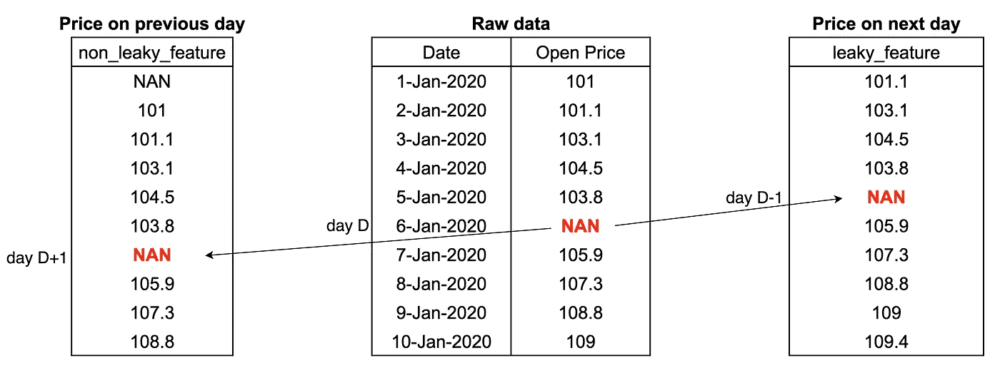
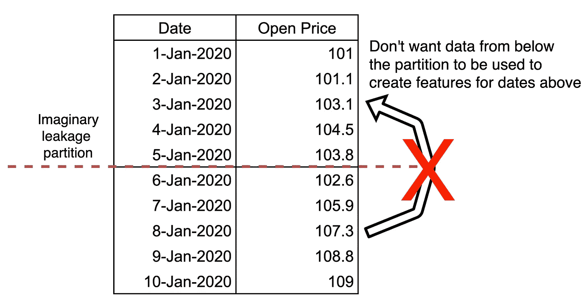
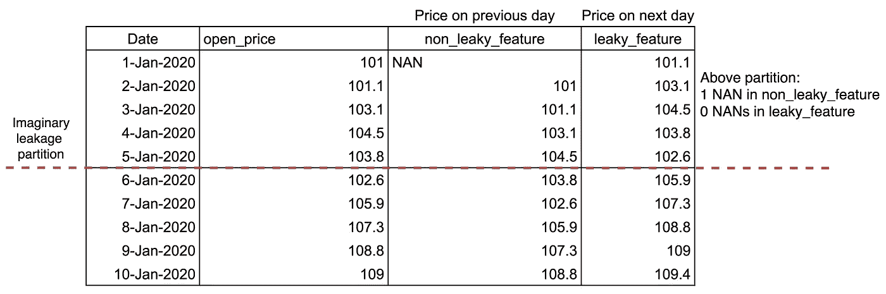
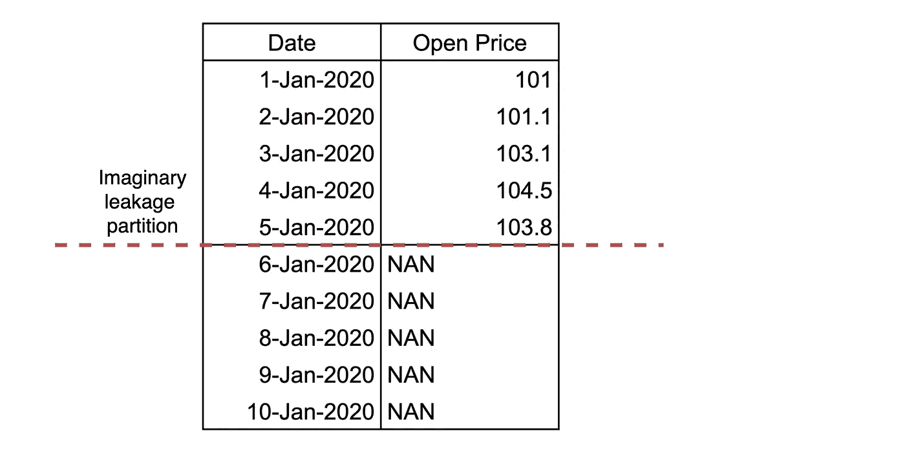
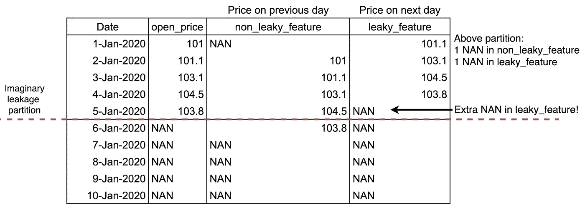
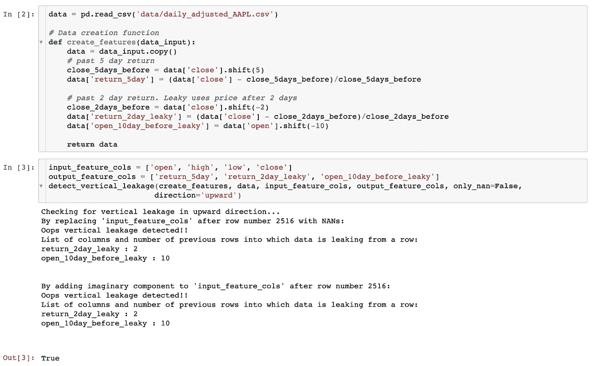

# 使用 NANs/复数检测机器学习流水线中的泄漏

> 原文：<https://towardsdatascience.com/detecting-data-leakage-in-ml-pipelines-using-nans-and-complex-numbers-66a066116b40?source=collection_archive---------31----------------------->

## 检测数据泄漏的简单而精确的方法

机器学习管道中的数据泄漏可能会对您的模型造成严重破坏。在这篇文章中，我将分享一个非常简单的方法，使用 nan 和复数来检测数据泄漏，同时将 ML 管道视为一个黑盒。我将非常简单地谈谈什么是数据泄露。我还会谈到`leak-detect`，我发布的 python 包可以在一行代码中完成所有这些。

## **数据泄露快速介绍**

描述数据泄漏最精确的方式可能是这样的:

> 当在训练期间用于创建预测变量的数据在推断时不可用时，在 ML 模型中发生数据泄漏。

显然，在训练期间使用推断时不可用的数据(特征)会导致模型在生产中表现不佳。根据您公司的规模，这种低性能可能意味着数百万美元的损失！

## 泄漏的一个例子

特征创建管线会通过哪些方式引入数据泄漏？

1.  使用用于创建特征工程目标的目标或数据。
2.  使用未来期间的数据进行特征工程。

首先通常更容易检测和跟踪。所以，让我们试着用一个例子来理解第二个。假设您正试图预测一家公司 5 天后的股价。我们的数据包含日期和每日开盘价。

```
## target (to be predicted): Open price after 5 days.
data['target'] = data['open_price'].shift(-5)
```

我们希望为这项任务创建各种手工制作的功能。比如说，我们想要的一个特性是“前一天的价格”。

```
data['price_previous_day'] = data['open_price']**.shift(1)**
# .shift(1) gives value from previous row
```

但是我们没有做`.shift(1)`，假设我们错误地做了`.shift(-1)`，并使用开盘价下一行的值作为特征。我们只是创建了“第二天的*价格”。这是一个漏洞，因为它使用了未来时期的数据。*

有许多避免泄漏的最佳实践可以遵循，但是没有一个可以让你 100%确定你的管道没有泄漏。这就是 NANs 和复数的用武之地！这种方法可以看作是数据泄漏的单元测试。

## 方法论

在进入方法论之前，我们先做个类比:)。

比方说，你有两个水箱通过一根封闭的管道相连。不检查管道，怎么能检测出这个管道确实是封闭的，没有漏水呢？您可以向一个水箱添加颜色，并检查另一个水箱是否也有该颜色。**就像水彩画一样，NANs 和复数非常适合于泄漏检测任务，因为它们具有在实数的任何操作之后持续存在的能力。**实数与 NAN 或复数之间的加法、减法等运算分别产生 NAN 或复数。当然，这也有例外，我们稍后会谈到。


在股票价格示例中，假设我们将特定日期 D 的开盘价设置为 NAN，并使用该数据创建我们的特性。第二天的价格(泄漏特征)将具有第 D-1 天的 NAN 值，而“前一天的价格”(非泄漏)将具有第 D+1 天的 NAN 值。



因此，对于泄漏特性，我们将在 D 日之前的特性中观察到额外的 NAN。本质上，如果 D 日的开盘价用于创建 D 日之前的特性(这是泄漏)，我们将在 D 日之前的特性中看到额外的 NAN。如果在一个输入为 NAN 时使用任何产生 NAN 的操作来创建特性，则情况确实如此。

如果我们想检查 D+1 日、D+2 日等的数据是否用于创建 D 日之前的要素，该怎么办？嗯，我们把它们都设置为 NAN，并且只在 d 日之前的最终特征中计算 NAN。

**该方法可以总结为 4 个简单的步骤:**

1.定义一个*假想的*泄漏分区，将数据分成上下两半。在我们的例子中，我们不希望下半部分数据(未来)用于创建上半部分数据(过去)的特征。



2.对原始数据运行数据创建管道，并计算上半部分所有要素中的 nan 数量。我们的数据创建管道创建了上面描述的泄漏和非泄漏特性。我们的非泄漏特征(前一天的价格)有 1 个 NAN，因为我们的数据从 2020 年 1 月 1 日开始，而泄漏特征(第二天的价格)有 0 个 NAN。



3.现在，将原始数据中用于创建要素的所有列设置为渗漏分区下的 NAN。



4.用 NANs 在这个原始数据上运行数据创建管道。再次计算分区上方的 NANs 的数量。对于我们的漏功能，有一个额外的南！



非泄漏特性的上半部分中的 nan 数量保持不变，但泄漏特性增加了 1 个。这个多余的 NAN 是哪里来的？它唯一能来自的地方是全是南的下半部。我们刚刚在我们的泄漏特征中检测到泄漏！**这种方法适用于任何特性，因为它不依赖于特性的定义。**

通过增加一个虚部而不是用 NAN 代替，并计算具有虚部的行数，可以重复上述相同的过程。Pandas 和 numpy 已经支持所有 nan 和复数运算。所以，你根本不用修改代码！此外，这只能检测管道中的泄漏，而不能检测原始数据中可能已经存在的泄漏。

**为什么同时使用 NANs 和复数？**

用 NANs 和复数运行这个测试很重要，因为您的管道可能会用一个值替换 NANs。或者 numpy 把复数转换成实数进行一些运算。我测试了它的不同功能，包括加法、乘法、最大、最小运算和泄漏检测功能。尽管如此，留意特殊情况还是很重要的。

## Python 包

我还发布了一个 python 包:`[**leak-detect**](https://github.com/abhayspawar/leak-detect)`用一行代码完成所有这些！`[leak-detect](https://github.com/abhayspawar/leak-detect)`可以检测由于错误代码而发生的水平(从目标到特性)和垂直(从未来到过去)泄漏。在下面的示例中，我们创建了两个使用未来数据的渗漏特征:“return_2day_leaky”和“open_10day_before_leaky”。两者都被检测到具有垂直泄漏。它还打印出数据漏入的先前行数。对于第一个特性，它是 2，因为它使用 2 天后的价格。



使用泄漏检测的示例

回购中的[检漏示例. ipynb](https://github.com/abhayspawar/leak-detect/blob/master/leak-detect%20example.ipynb) 笔记本列举了更多这样的例子。你可以通过`pip install leak-detect`来安装这个包。下面是 [github 回购](https://github.com/abhayspawar/leak-detect)。

## 其他类型的数据创建管道呢？

泄漏检测只对类似于股票价格数据的数据有效。在您的情况下，您可以使用多个数据集来创建要素，甚至可以使用 SQL。无论你的管道是什么，想法仍然是一样的。您必须编写自己的自定义函数，通过查看泄漏检测代码[来复制这些函数。](https://github.com/abhayspawar/leak-detect/blob/master/leak_detect/base.py)

希望这是对你有用的东西。如果你有什么想法，请在评论中告诉我！你也可以通过 abhayspawar 在 [Twitter](http://twitter.com/abhayspawar) 、 [Linkedin](https://www.linkedin.com/in/abhayspawar/) 和 Gmail 上联系我。非常感谢你的阅读。注意安全！