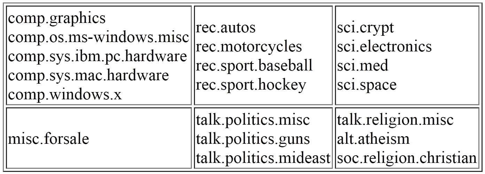
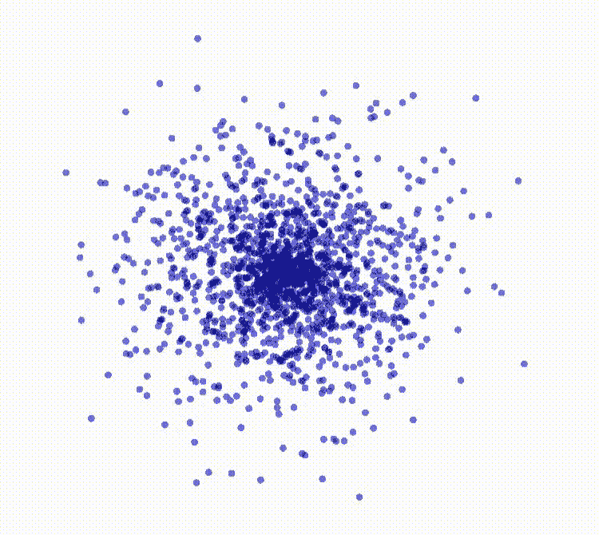
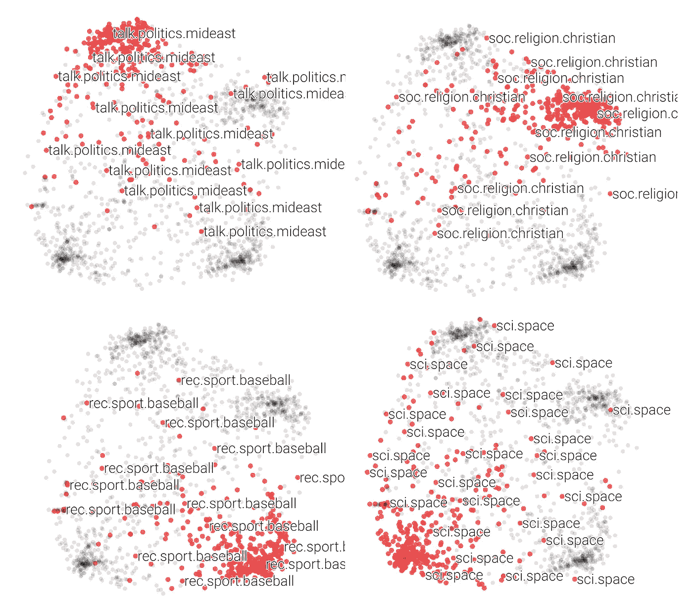
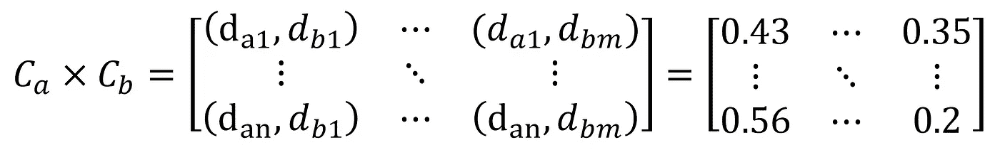
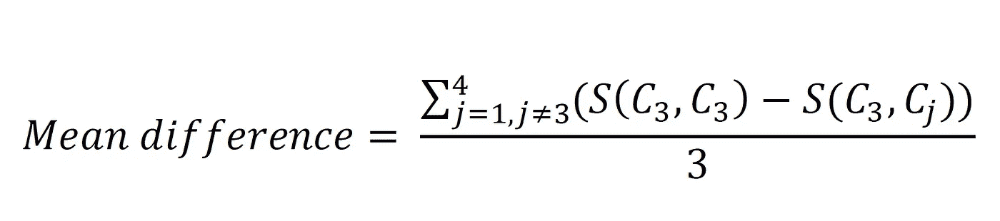
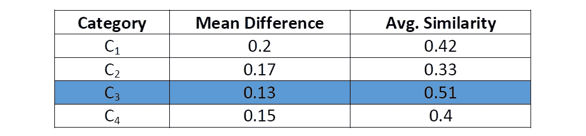

# 用 Doc2vec 检测文档相似度

> 原文：<https://towardsdatascience.com/detecting-document-similarity-with-doc2vec-f8289a9a7db7?source=collection_archive---------7----------------------->

## Python 的分步实践介绍


“什锦浆果”由[威廉·费尔克](https://unsplash.com/@gndclouds?utm_source=medium&utm_medium=referral)在 [Unsplash](https://unsplash.com?utm_source=medium&utm_medium=referral) 上演唱

我们可以用很多方法来分析和理解文本数据。这种方法通常处理称为自然语言处理(NLP)的人工智能领域。

NLP 允许我们执行大量的任务，其中我们的数据由文本或语音组成。情感分析、机器翻译和信息检索只是我们日常使用的 NLP 应用的几个例子。今天，通过结合使用 NLP 和机器学习技术，这些任务中的许多都可以很成功地解决。

在这篇文章中，我想举例说明一个这样的方法，doc2vec，并希望提供一些关于它如何工作以及如何实现它的基本见解。

# 任务

简而言之，给定大量的文本文档，我们希望能够:

1.  衡量文档在语义上的相似程度。
2.  使用此信息根据相似性对文档进行聚类。

# 我们将涵盖的内容

我知道这是一个较长的职位。因此，在我们开始之前，这里有一个我们将涵盖的所有内容的大纲:

1.  数据集介绍
2.  doc2vec 和矢量表示概述
3.  训练 doc2vec 模型
4.  可视化生成的文档向量
5.  评估模型

你可以随意阅读，以你觉得舒服的速度。我甚至鼓励你把它分成几部分，在你认为合适的时候反复阅读，以保持专注。

# 数据

为了训练和测试我们的模型，我们将使用[20 个新闻组](http://qwone.com/~jason/20Newsgroups/)数据集。这个数据集由 20 个不同主题的大约 18000 个新闻组帖子组成:



[20 个新闻组](http://qwone.com/~jason/20Newsgroups/)数据集的结构

为了加快训练速度，也为了让我们以后的评估更加清晰，我们把自己限制在四个类别。此外，为了确保这些类别尽可能不同，这四个类别被选择为不属于同一个分区。

例如，这意味着我们可能想用例如 *soc.religion.christian* 替换其中一个，而不是选择 *rec.sport.baseball* 和 *rec.sport.hockey* 。在这里，我决定使用类别*足球.宗教.基督教*，*科学.空间*，*谈话.政治.中东*，以及*娱乐.体育.棒球*。

选择类别后，他们的文档被分成训练集和测试集，同时跟踪哪些文档属于哪个类别，以便以后更容易判断模型的性能。

在 Python 中，我们可以使用 [sklearn](http://scikit-learn.org/stable/modules/generated/sklearn.datasets.fetch_20newsgroups.html) 来获取数据:

按类别组织培训和测试数据

基本上，我们正在做的是创建两个字典，每个字典有 4 个关键字(即 4 个类别)。每个键包含属于该类别的所有文档作为其值，其中一个字典包含训练文档，另一个包含测试文档。此外，参数`remove=('headers', 'footers', 'quotes')`从文档中移除元数据，如页眉、页脚和引用，以防止我们的模型[过度适应它们的](https://en.wikipedia.org/wiki/Overfitting)。

# 生成向量

现在我们有了数据，让我们重新审视我们的任务。请记住，我们首先要弄清楚我们的文档以及它们的上下文是如何相互关联的。

我们希望能够衡量文档在语义上的相似程度

换句话说，我们想要做的是将我们的文本文档转换成数字的、矢量化的形式，稍后聚类算法可以使用这种形式将相似的文档分组在一起。

## Doc2vec

产生这种载体的一种算法是 doc2vec [1]。在 Gidi Shperber 的文章中可以找到对这个概念的很好的介绍。本质上，doc2vec 使用神经网络方法来创建可变长度文本片段的向量表示，例如句子、段落或文档。这些矢量表示的优点在于，它们捕捉了输入文本的语义，即含义。这意味着在向量空间中，意义或上下文相似的文本比不一定相关的文本彼此更接近。

Doc2vec 建立在另一种叫做 word2vec 的算法之上[2]。正如您可能已经从名称中猜到的那样，word2vec 的功能与 doc2vec 非常相似，除了我们得到的不是文档向量，而是单词向量。例如，这意味着像“fast”和“quick”这样的词在向量空间中比“London”彼此更接近。不仅如此，这些向量表示还可以用来执行简单的向量运算。例如，`vector("King") - vector("Man") + vector("Woman")`产生与“Queen”的矢量表示最相似的矢量。

关于 word2vec 的更深入的介绍，我推荐看看这篇由 [Kung-Hsiang，Huang (Steeve)](https://medium.com/u/2fc7b9c3f02a?source=post_page-----f8289a9a7db7--------------------------------) 撰写的[文章](/word-embedding-with-word2vec-and-fasttext-a209c1d3e12c)。


显示向量空间中单词之间的关系— [TensorFlow](https://www.tensorflow.org/tutorials/representation/word2vec)

# 培养

现在我们对 doc2vec 的作用有了一个概念，让我们看看如何在我们的数据上训练一个 doc2vec 模型。下面的实现很大程度上受到了这个[教程](https://github.com/RaRe-Technologies/gensim/blob/develop/docs/notebooks/doc2vec-lee.ipynb)的启发，我强烈推荐你去看看。

首先，我们需要稍微调整一下原始数据，为训练做准备。

组织和预处理培训和测试文档

同样，我们使用字典来跟踪哪些文档属于哪个类别。为了训练 doc2vec 模型，训练文档需要采用 *TaggedDocument* 的形式，这基本上意味着每个文档接收一个惟一的 id，由变量`offset`提供。

此外，函数`tokenize()`将文档从一个字符串转换成由文档单词组成的字符串列表。它还允许选择**停用词**以及超过一定长度的词进行删除。

停用词通常是对一段文本没有上下文意义的常用词，因此会被删除。你会注意到，在这里，我选择不删除任何停用词，因为这样做性能似乎会稍微好一点。

通常，停用词的移除高度依赖于手头的任务，并且找出要移除的停用词(如果有的话)并不总是简单明了的。

我们最后得到的是以下变量:

*   `train_corpus`:培训就绪文档列表
*   `cat_dict_test_clean`:包含按类别组织的标记化测试文档

*请注意，只有实际用于培训的文档才需要标记。*

准备好培训文档后，我们现在可以开始培训我们的模型了。

训练模型

我们首先创建一个 *doc2vec* 对象，它将作为我们的模型，并用不同的超参数值初始化它。

`epochs`的值决定了训练过程中使用训练语料的次数。`vector_size`决定了生成的文档向量有多大。此外，任何出现频率低于`min_count`的单词都将被丢弃。在不涉及太多细节的情况下，`window`在训练中用于确定在检查给定单词的上下文时要包含多少个单词。更多信息请参见第 2.2 节。[1]的。

当从头开始训练这样的模型时，这些参数的最佳值通过称为 [*超参数调整*](https://en.wikipedia.org/wiki/Hyperparameter_optimization) 的过程找到。

我在这里使用的价值观绝不是最佳的，也不是一成不变的。请随意使用不同的超参数集来试验训练不同的模型。

然后我们构建词汇表，它基本上是一个字典，包含训练语料库中所有唯一单词的出现次数。最后，对模型进行训练。

我们现在可以从测试集中推断出未知文档的新向量，并使用它们来评估我们的模型。这就是跟踪我们的文档属于哪个类别的用处。

推断测试文档的文档向量，并组织它们以保存到文件中

我们在`inferred_vectors_test`中按类别保存这些向量。同时，我们初始化另一个字典`metadata`，它将每个类别映射到一个整数，该整数对应于该类别的推断向量的数量。如果这看起来很奇怪，一会儿就会明白了。这两个变量现在可以用来创建两个文件，如下所示:

将向量和元数据写入文件

两个文件中的第一个文件`doc2vec_20Newsgroups_vectors.csv`，每行包含一个推断的文档向量，用制表符分隔的值表示，向量按类别排序。

第二个文件`doc2vec_20Newsgroups_vectors_metadata.csv`，每行包含第一个文件中相应向量的类别。这可能看起来像这样:

```
talk.politics.mideast
talk.politics.mideast
.
.
.
talk.politics.mideast
rec.sport.baseball
rec.sport.baseball
.
.
.
rec.sport.baseball
sci.space
sci.space
.
.
.
sci.space
soc.religion.christian
soc.religion.christian
.
.
.
soc.religion.christian
```

# 形象化

那么我们为什么要把向量和它们的元数据保存到文件中呢？好了，我们现在可以使用这两个文件，使用 [TensorFlow 的投影工具](http://projector.tensorflow.org/)来可视化我们文档之间的相似之处。在投影仪工具中，您可以选择不同的降维方法，即 t-SNE、PCA 和自定义轴标记，来表示 2D 或 3D 空间中的矢量。

投影仪尝试对数据点进行聚类，以便相似的点彼此更接近。每种方法都将表示数据点之间的关系，也就是说，以不同的方式分配数据点。例如，一种方法将更侧重于表示各个点之间的局部相似性，而另一种方法可能侧重于保持数据集的整体结构。



用 2D t-SNE 图可视化文档向量

除了看起来非常酷之外，我们可以用这些可视化来判断矢量的质量。通过搜索元数据文件中每个向量的类别名称，我们可以看到图上每个点属于哪个类别。

然而，你会注意到，你可能有很多点位于中间的某个地方，并不真正属于任何集群。一个原因可能是你选择的降维方法；特别是对于 t-SNE，使用的参数值对数据点的分布有很大的影响。

此外，不能忽视的事实是，一些文件可能只是在上下文中含糊不清。例如，来自一个类别的特定文档可能使用大量在来自另一个类别的文档中大量使用的术语，因此它们的向量彼此之间可能比它们自己类别的向量更相似。



多次显示相同的数据点分布，突出显示每个类别的点

你可以通过点击这个[链接](http://projector.tensorflow.org/?config=https://gist.githubusercontent.com/osharaki/f620e141ccc36753449dc20f761e5bef/raw/6b0cd9848e6b0cc44d0c54a7f02deb2fa74cf1a4/test.json)，使用上面例子中使用的矢量和元数据自己尝试投影仪。

为了从数字上检查文档之间的关系，我们可以通过使用`similarity_unseen_docs()`函数来计算它们的推断向量之间的余弦距离。

这个函数将我们刚刚训练的 doc2vec 模型和要比较的两个文档作为其参数。作为文档相似性的度量，该函数返回一个介于 0 和 1 之间的值，该值越大，文档越相似。

如果我们想要比较单个文档，这是非常有用的，但是如果我们需要评估我们的模型的性能，我们将不得不扩展它，不仅包括单个文档，还包括我们数据集的一部分。

# 评估我们的模型

直观上，人们会期望属于同一类别的文档比属于其他类别的文档彼此更相似。这正是我们用来判断模型的标准。一个好的模型应该为同一类别的文档给出比跨类别文档更高的相似性值。因此，在深入了解代码的本质之前，让我们先来看看如何构建比较。

我们要做的第一件事是为所有类别创建文档对集。更具体地说，给定我们的四个类别，我们用 C₁来表示，..,C₄，其中每个类别是一组文档，我们得到以下类别对:

*   (C₁、C₁)、(C₁、C₂)、(C₁、C₃)、(C₁、C₄)
*   (C₂、C₂)、(C₂、C₃)、(C₂、C₄)
*   (C₃、C₃)，(C₃、C₄)
*   (c₄c₄)

*注意，当测量余弦相似性时，像(such)和(such)这样的对是等价的，因此为了避免冗余，只考虑两个组合中的一个。*

对(Ca，Cb)对应于包含类别 a 中所有文档的集合和包含类别 b 中所有文档的集合的笛卡尔积。更正式地说:


现在，对于每个文档对，我们计算文档的相似度。对于每个类别对，这会产生一个介于 0 和 1 之间的值的矩阵(每个文档对一个值)。



可能的相似度矩阵假设有两类 ***a*** *和* ***b*** *分别包含***和* ***m*** *文档。**

*因为我们使用这些矩阵来判断两个类别中的文档总体上有多相似，所以将一个矩阵中的所有值浓缩成一个值作为相似性的度量无疑会使我们的工作容易得多。因此，我们将对每个矩阵做的是将矩阵中的所有值相加，得到一个值，我们称之为*相似度总计*，然后将这个值除以矩阵中的元素总数，得到一个*平均相似度*值。*

*请记住，我们判断我们的模型不是根据它告诉我们来自相同类别的文档有多相似，而是根据这些相同类别的文档彼此之间比来自其他类别的文档有多相似。因此，我们真正追求的价值不仅仅是(C₃，C₃)的平均相似度(T30)有多高，而是相对于(C₁，C₃)，(C₂，C₃)和(C₃，C₄).)的平均相似度有多高*

*因此给定我们的四个类别，这留给我们每个类别四个*平均相似度*；一个用于同类文档，三个用于跨类文档。*

*下面是我们要为每个类别做的事情。使用每个类别的四个*平均相似度*值，我们将计算跨类别*平均相似度*和同类别*平均相似度*之间的平均相似度差异。更正式地说:*

**

*计算类别 3 的平均相似性差异。s()表示两个类别的余弦相似性。请注意 j=3 是如何被跳过的，因为由此产生的减法是多余的。*

*较高的平均差异告诉我们，该模型能够识别某个类别的文档与其他类别的文档更加不同。当然，如果一个类别的文档确实与另一个类别的文档相似，情况可能并不总是如此。例如，这在诸如 *comp.os.ms-windows.misc* 和 *comp.windows.x* 的类别中可能比在*comp . OS . ms-windows . misc*和 *soc.religion.christian* 中更容易识别。*

*评估结果可总结如下:*

**

*显示的平均相似度是同类文档的平均相似度。一个好的模型应该是给出高的平均差**和平均相似度 *值*的模型。***

**以如此紧凑的形式表示结果使得用不同的超参数训练多个模型并比较它们的性能更加有效。**

**现在，让我们来看看如何对此进行编码。首先，我们创建一个字典，将文档对列表映射到它们所属的类别对。考虑到结果对的数量很大，我们需要限制这个数量，以便在合理的时间内执行我们的评估。为此，我们从每个字典条目中随机抽取 500 个文档对，并计算每个文档对的余弦相似度。**

***注意 500 是任意选择。理想情况下，样本越大，表示越准确。***

**这就产生了类似于我们之前看到的相似矩阵。最后，我们将这些矩阵作为列表保存在一个新的字典中，每个列表都被映射到它所代表的类别对。**

**生成相似性矩阵**

**下一步是使用这些相似性值来计算我们上面讨论的紧凑表示。我们首先检查所有的类别对。如果我们找到一个相同类别的配对，我们保存它的平均相似度，以备以后计算平均差异时使用。对于跨类别对，我们简单地将它们的平均相似度保存在一个列表中。**

**最后一步是使用*平均相似度*列表和之前保存的同类*平均相似度*计算*平均差异*。这个数字，加上同类的平均相似度，作为模型描述这个类别的一个度量。然后对每个类别重复这一过程。**

# **摘要**

**所以可能需要消化很多东西。以下是我们在本文中讨论的所有内容的总结:**

*   **我们看了一下 *doc2vec* 这是一种常用于生成文本文档的向量表示的方法。**
*   **我们看到了如何使用 Gensim 在 Python 中准备数据和训练 doc2vec 模型。**
*   **我们看到了使用 TensorFlow 的投影仪来可视化我们的矢量是多么有用。**
*   **最后，我们讨论了一种评估 doc2vec 模型的可能方法，它允许对多个模型进行有效的比较。**

***谢谢你留下来！希望听到您的反馈，并回答您的任何问题。***

# **参考**

**[1] Q. V. Le 和 T. Mikolov，[句子和文档的分布式表示](https://arxiv.org/abs/1405.4053)(2014)
【2】t . miko lov，K. Chen，G. Corrado 和 J. Dean，[向量空间中单词表示的有效估计](https://arxiv.org/abs/1301.3781)，【2013】**