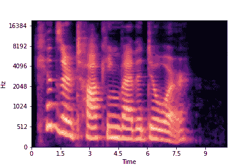

# 利用迁移学习从声音中识别情感

> 原文：<https://towardsdatascience.com/detecting-emotions-from-voice-clips-f1f7cc5d4827?source=collection_archive---------22----------------------->

## 使用迁移学习训练神经网络从语音剪辑中识别情绪。

一个快乐的人的声音片段的声谱图

> 在经典情景喜剧《生活大爆炸》中题为“情感检测自动化”的一集里，霍华德设法获得了一个设备，可以帮助谢尔顿(他很难读懂别人的情感暗示)通过将设备指向周围的人来理解他们的感受…

人类不仅倾向于用口语来传达信息，还会用音调、肢体语言和表情来传达信息。同样的信息以两种不同的方式说出来，可能会有非常不同的含义。因此，牢记这一点，我考虑着手一个项目，利用音调、响度和各种其他因素来识别语音剪辑中的情绪，以确定说话者的感受。

这篇文章基本上是一个简短但完整的教程，它解释了如何训练一个神经网络来预测一个人的情绪。该过程将分为 3 个步骤:

1.  理解数据
2.  数据预处理
3.  训练神经网络

我们将需要以下库。fastai
2。numpy
3。matplotlib
4。天秤座
5。pytorch

您还需要一个 jupyter 笔记本电脑环境。

# 理解数据

我们将一起使用两个数据集来训练神经网络:

## RAVDESS 数据集

RAVDESS 数据集是 24 个演员用 8 种不同的情绪(中性、平静、快乐、悲伤、愤怒、恐惧、厌恶、惊讶)说同样的两句台词的音频和视频剪辑的集合。在本教程中，我们将只使用音频剪辑。您可以从这里的[获取数据集。](https://zenodo.org/record/1188976)

## TESS 数据集

TESS 数据集是两个女人表达 7 种不同情绪(愤怒、厌恶、恐惧、快乐、惊喜、悲伤和中性)的音频剪辑的集合。你可以从[这里](https://tspace.library.utoronto.ca/handle/1807/24487)获取数据集。

我们将声音剪辑转换成图形格式，然后将两个数据集合并成一个，然后我们将把它分成 8 个不同的文件夹，每个文件夹对应 RAVDESS 数据集部分中提到的一种情绪(我们将把惊讶和惊喜合并成一个组件)。

# 数据预处理

我们将把声音剪辑转换成图形数据，这样它就可以用于神经网络的训练。为此，请查看下面的代码:

上面的笔记本显示了如何将声音文件转换为图形数据，以便神经网络可以解释它。我们正在使用名为 librosa 的库来做这件事。我们正在用 MEL 标度将声音数据转换成频谱图，因为这个标度的设计是为了使它更容易解释。这个笔记本包含应用于一个声音文件的代码。包含将初始数据集转换为最终输入数据的全部代码的笔记本可以在[这里](https://github.com/shaan2909/Emotion-Detection-from-Sound/blob/master/Sound%20Preprocessing%20.ipynb)找到。

因此，在运行上面笔记本中给出的每个声音文件的代码，然后根据需要划分文件后，你应该有 8 个单独的文件夹，分别标有相应的情绪。每个文件夹应该包含所有声音剪辑的图形输出，这些声音剪辑表达了文件夹所标注的情感。

# 训练神经网络

我们现在将开始训练神经网络，通过观察声音片段产生的频谱来识别情绪。我们将使用 fastai 库训练神经网络。我们将使用一个预训练的 CNN ( resnet34)，然后在我们的数据上训练它。
我们将要做的如下:

1.制作具有适当数据扩充的数据加载器，以输入到神经网络。每幅图像的大小为 432×288。

2.我们将使用在 imagenet 数据集上预先训练的神经网络(resnet34)。然后，我们将通过适当的裁剪将我们的图像缩小到 144 乘 144 的大小，然后在该数据集上训练我们的神经网络。

3.然后，我们将在尺寸为 288×288 的图像上再次训练神经网络。

4.然后，我们将分析神经网络在验证集上的性能。

5.瞧啊。训练过程将会完成，你将拥有一个可以从声音片段中识别情绪的神经网络。

开始训练吧！

在上面的部分中，我们已经使用我们的数据创建了一个数据加载器。我们对图像进行了适当的变换，以减少过度拟合，并将其缩小到 144 乘 144 的大小。我们还将其分为验证集和训练集，并根据文件夹名称标记数据。如您所见，数据有 8 个类别，因此这是一个简单的影像数据集分类问题。

在上面的部分中，我们使用了一个预训练的神经网络，然后在大小为 144×144 的图像上训练它来识别情绪。在训练结束时，我们的准确率达到了 80.1 %。
现在我们有了一个神经网络，它非常擅长通过查看 144×144 大小的图像来识别情绪。因此，现在我们将使用相同的神经网络，并训练它通过查看 288×288 大小的图像来识别情绪(它应该已经很擅长了)。

在上面的部分中，我们在 288×288 大小的图像上训练神经网络(我们已经在 144×144 大小的图像上训练过)。瞧，瞧！它现在可以从声音片段中识别情绪，而不管语音的内容如何，准确率为 83.1 %(在验证集上)。
在下一节中，我们将使用混淆矩阵分析神经网络的结果。

上面的部分包含了我们数据集的混淆矩阵。

完整的培训用笔记本可以在[这里](https://github.com/shaan2909/Emotion-Detection-from-Sound/blob/master/Training%20.ipynb)找到，从预处理到培训的所有笔记本都可以在[这里找到。](https://github.com/shaan2909/Emotion-Detection-from-Sound)

感谢你阅读这篇文章，希望你喜欢！

# 引文

**RAVDESS:** living stone SR，Russo FA (2018)瑞尔森情感语音和歌曲视听数据库(rav dess):北美英语中一组动态、多模态的面部和声音表情。PLoS ONE 13(5): e0196391。[https://doi.org/10.1371/journal.pone.0196391](https://doi.org/10.1371/journal.pone.0196391)。

**多伦多情感演讲集(苔丝):** 皮乔拉-富勒，m .凯思琳；杜普斯，凯特，2020，《多伦多情感演讲集(TESS)》，[https://doi.org/10.5683/SP2/E8H2MF](https://doi.org/10.5683/SP2/E8H2MF)，学者门户网站 Dataverse，V1