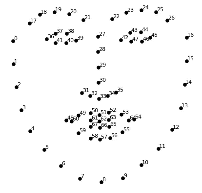
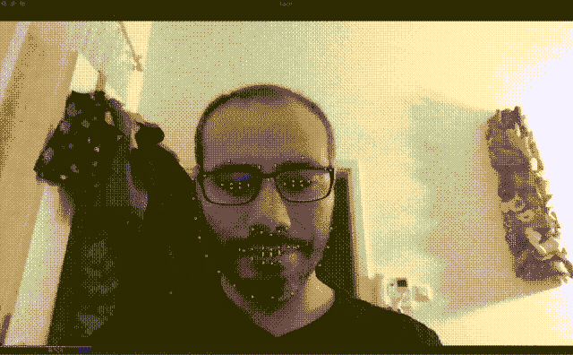

# 用 Python 检测人脸特征

> 原文：<https://towardsdatascience.com/detecting-face-features-with-python-30385aee4a8e?source=collection_archive---------3----------------------->

## 计算机视觉

## 使用 OpenCV 和 DLib 识别人脸并提取最多 6 个面部特征


作者的形象

今天我们将学习如何使用图像来检测人脸并提取面部特征，如眼睛、鼻子、嘴巴等。我们可以做许多令人难以置信的事情，将这些信息作为预处理步骤，如捕捉人脸以标记照片中的人(手动或通过机器学习)，创建效果以“增强”我们的图像(类似于 Snapchat 等应用程序中的那些)，对人脸进行情感分析等等。

过去，我们已经介绍过如何使用 OpenCV 来检测图像中的形状，但今天我们将通过引入 DLib 和从图像中提取人脸特征来将它提升到一个新的水平。

[](/essential-opencv-functions-to-get-you-started-into-computer-vision-743df932e60) [## 帮助您开始学习计算机视觉的基本 OpenCV 函数

### 了解常见的 OpenCV 函数及其应用，帮助您开始学习计算机视觉。

towardsdatascience.com](/essential-opencv-functions-to-get-you-started-into-computer-vision-743df932e60) 

[Dlib](http://dlib.net/) 是一个先进的机器学习库，旨在解决复杂的现实世界问题。这个库是使用 C++编程语言创建的，它可以与 C/C++、Python 和 Java 一起工作。

值得注意的是，本教程可能需要对 OpenCV 库有一些了解，比如如何处理图像、打开相机、图像处理和一些小技巧。

# 它是如何工作的？

我们的脸有几个可以被识别的特征，像我们的眼睛、嘴巴、鼻子等等。当我们使用 DLib 算法来检测这些特征时，我们实际上获得了围绕每个特征的点的地图。

这张由 67 个点(称为地标点)组成的地图可以识别以下特征:



点地图

*   颌点= 0–16
*   右眉点数= 17–21
*   左眉点数= 22–26
*   鼻点= 27–35°
*   右眼点数= 36–41
*   左眼点数= 42–47
*   嘴部点数= 48–60
*   嘴唇点数= 61–67

现在我们已经知道了一些我们计划如何提取特性，让我们开始编码吧。

# 安装要求

像往常一样，本文将提供带有代码的示例，我将一步一步地指导您实现一个完整的人脸特征识别示例。但是在我们开始之前，您需要启动一个新的 Python 项目并安装 3 个不同的库:

*   opencv-python
*   dlib

如果你像我一样使用`pipenv`，你可以用下面的命令安装它们:

```
pipenv install opencv-python, dlib
```

如果你在 Mac 和某些版本的 Linux 上工作，你可能会在安装 dlib 时遇到一些问题，如果你在安装过程中遇到编译错误，请确保检查你正在使用的 CMake 库版本。在 Mac 中，要确保您有 CMake 可用并且版本正确，您可以运行:

```
brew install cmake
```

对于其他操作系统，请在线查看具体支持。

# 步骤 1:加载并显示图像

我们将从小处着手，构建代码，直到我们有一个完整的工作示例。

通常我喜欢使用绘图来渲染图像，但是因为我们在帖子的后面准备了一些很酷的东西，我们将做一些不同的事情，我们将创建一个窗口来显示我们的工作结果。

让我们直接进入代码

```
import cv2# read the image
img = cv2.imread("face.jpg")# show the image
cv2.imshow(winname="Face", mat=img)# Wait for a key press to exit
cv2.waitKey(delay=0)# Close all windows
cv2.destroyAllWindows()
```

很简单，对吧？我们只是用`imread`加载图像，然后告诉 OpenCV 在`winname`中显示图像，这将打开窗口并给它一个标题。

之后，我们需要暂停执行，因为当脚本停止时窗口会被破坏，所以我们使用`cv2.waitKey`按住窗口直到按下一个键，之后，我们破坏窗口并退出脚本。

如果您使用代码并将名为`face.jpg`的图像添加到代码目录中，您应该会得到如下所示的内容:


原象

# 第二步:面部识别

到目前为止，我们还没有对图像做任何事情，除了将它显示在一个窗口中，相当无聊，但是现在我们将开始编码好的东西，我们将从识别图像中哪里有人脸开始。

为此，我们将使用名为`get_frontal_face_detector()`的 Dlib 函数，相当直观。不过有一个警告，这个函数只适用于灰度图像，所以我们必须先用 OpenCV 来实现。

`get_frontal_face_detector()`将返回一个`detector`，这是一个我们可以用来检索人脸信息的函数。每个面都是一个对象，包含可以找到图像的点。

但是让我们更好地在代码上看到它:

```
import cv2
import dlib# Load the detector
detector = dlib.get_frontal_face_detector()# read the image
img = cv2.imread("face.jpg")# Convert image into grayscale
gray = cv2.cvtColor(src=img, code=cv2.COLOR_BGR2GRAY)# Use detector to find landmarks
faces = detector(gray)for face in faces:
    x1 = face.left() # left point
    y1 = face.top() # top point
    x2 = face.right() # right point
    y2 = face.bottom() # bottom point
    # Draw a rectangle
    cv2.rectangle(img=img, pt1=(x1, y1), pt2=(x2, y2), color=(0, 255, 0), thickness=4)# show the image
cv2.imshow(winname="Face", mat=img)# Wait for a key press to exit
cv2.waitKey(delay=0)# Close all windows
cv2.destroyAllWindows()
```

上面的代码将从图像中检索所有的面，并在每个面上呈现一个矩形，生成如下所示的图像:


到目前为止，我们在寻找人脸方面做得很好，但我们仍然需要一些工作来提取所有的特征(标志)。接下来让我们继续。

# 第三步:识别面部特征

你喜欢魔术吗？到目前为止，DLib 的工作方式非常神奇，只用几行代码我们就可以完成很多工作，现在我们有了一个全新的问题，它会继续这么简单吗？

简短的回答是肯定的！原来 DLib 提供了一个名为`shape_predictor()`的函数，它将为我们完成所有的魔法，但有一个警告，它需要一个预先训练好的模型才能工作。

有几个型号可以与`shape_predictor`一起工作，我正在使用的型号可以在这里下载[，但也可以尝试其他型号。](https://github.com/italojs/facial-landmarks-recognition/blob/master/shape_predictor_68_face_landmarks.dat)

让我们看看新代码现在是什么样子

```
import cv2
import dlib# Load the detector
detector = dlib.get_frontal_face_detector()# Load the predictor
predictor = dlib.shape_predictor("shape_predictor_68_face_landmarks.dat")# read the image
img = cv2.imread("face.jpg")# Convert image into grayscale
gray = cv2.cvtColor(src=img, code=cv2.COLOR_BGR2GRAY)# Use detector to find landmarks
faces = detector(gray)for face in faces:
    x1 = face.left() # left point
    y1 = face.top() # top point
    x2 = face.right() # right point
    y2 = face.bottom() # bottom point # Look for the landmarks
    landmarks = predictor(image=gray, box=face)
    x = landmarks.part(27).x
    y = landmarks.part(27).y # Draw a circle
    cv2.circle(img=img, center=(x, y), radius=5, color=(0, 255, 0), thickness=-1)# show the image
cv2.imshow(winname="Face", mat=img)# Wait for a key press to exit
cv2.waitKey(delay=0)# Close all windows
cv2.destroyAllWindows()
```

像以前一样，我们总是建立在相同的代码上，现在对每张脸使用我们的预测函数来找到界标。现在我仍然在做一些奇怪的事情，比如 27 号在那里做什么？

```
landmarks = predictor(image=gray, box=face)
x = landmarks.part(27).x
y = landmarks.part(27).y
```

我们的预测函数将返回一个对象，该对象包含所有 68 个点，根据我们之前看到的图表，这些点符合一张脸，如果您注意它，点 27 正好在两眼之间，因此如果计算正确，您应该会在脸的两眼之间看到一个绿点，如下所示:


我们越来越接近了，现在让我们渲染所有的点，而不仅仅是一个点:

```
import cv2
import numpy as np
import dlib# Load the detector
detector = dlib.get_frontal_face_detector()# Load the predictor
predictor = dlib.shape_predictor("shape_predictor_68_face_landmarks.dat")# read the image
img = cv2.imread("face.jpg")# Convert image into grayscale
gray = cv2.cvtColor(src=img, code=cv2.COLOR_BGR2GRAY)# Use detector to find landmarks
faces = detector(gray)
for face in faces:
    x1 = face.left() # left point
    y1 = face.top() # top point
    x2 = face.right() # right point
    y2 = face.bottom() # bottom point # Create landmark object
    landmarks = predictor(image=gray, box=face) # Loop through all the points
    for n in range(0, 68):
        x = landmarks.part(n).x
        y = landmarks.part(n).y # Draw a circle
        cv2.circle(img=img, center=(x, y), radius=3, color=(0, 255, 0), thickness=-1)# show the image
cv2.imshow(winname="Face", mat=img)# Delay between every fram
cv2.waitKey(delay=0)# Close all windows
cv2.destroyAllWindows()
```

Tada！魔力:


但是如果你对所有的点都不感兴趣呢？嗯……你实际上可以调整你的`range`间隔来获得上面词汇表中指定的任何特性，就像我在这里做的那样:


太棒了，但我们能做些更酷的吗？

# 步骤 4:实时检测

是的，你没看错！是的，这可能就是你所想的！下一步是连接我们的网络摄像头，从您的视频流中进行实时地标识别。

你可以通过相机或使用视频文件遍历视频帧，在你的脸上进行实时面部标志检测。参考下面的代码，如果你想使用自己的摄像头，但对于视频文件，请确保将数字 0 改为视频路径。

如果您想结束窗口，请按键盘上的 ESC 键:

```
import cv2
import dlib

# Load the detector
detector = dlib.get_frontal_face_detector()

# Load the predictor
predictor = dlib.shape_predictor("shape_predictor_68_face_landmarks.dat")

# read the image
cap = cv2.VideoCapture(0)

while True:
    _, frame = cap.read()
    # Convert image into grayscale
    gray = cv2.cvtColor(src=frame, code=cv2.COLOR_BGR2GRAY)

    # Use detector to find landmarks
    faces = detector(gray)

    for face in faces:
        x1 = face.left()  # left point
        y1 = face.top()  # top point
        x2 = face.right()  # right point
        y2 = face.bottom()  # bottom point

        # Create landmark object
        landmarks = predictor(image=gray, box=face)

        # Loop through all the points
        for n in range(0, 68):
            x = landmarks.part(n).x
            y = landmarks.part(n).y

            # Draw a circle
            cv2.circle(img=frame, center=(x, y), radius=3, color=(0, 255, 0), thickness=-1)

    # show the image
    cv2.imshow(winname="Face", mat=frame)

    # Exit when escape is pressed
    if cv2.waitKey(delay=1) == 27:
        break

# When everything done, release the video capture and video write objects
cap.release()

# Close all windows
cv2.destroyAllWindows()
```

最后的结果在这里:



根据原始视频创建的 GIF，我必须剪切帧以使 GIF 具有合适的大小。

即使在光线较弱的情况下，结果也相当准确，尽管上面的图像有一些误差，但光线较好的情况下效果很好。

# 结论

OpenCV 和 DLib 是强大的库，简化了 ML 和计算机视觉的工作。今天我们只触及最基本的内容，还有很多东西要向他们学习。

非常感谢你的阅读！