# 检测有代码和无代码的假新闻

> 原文：<https://towardsdatascience.com/detecting-fake-news-with-and-without-code-dd330ed449d9?source=collection_archive---------1----------------------->

## 使用 Python 和其他工具比较不同的 NLP 技术和方法来检测假新闻。


Héizel Vázquez 插图

这些推文到底是真是假？

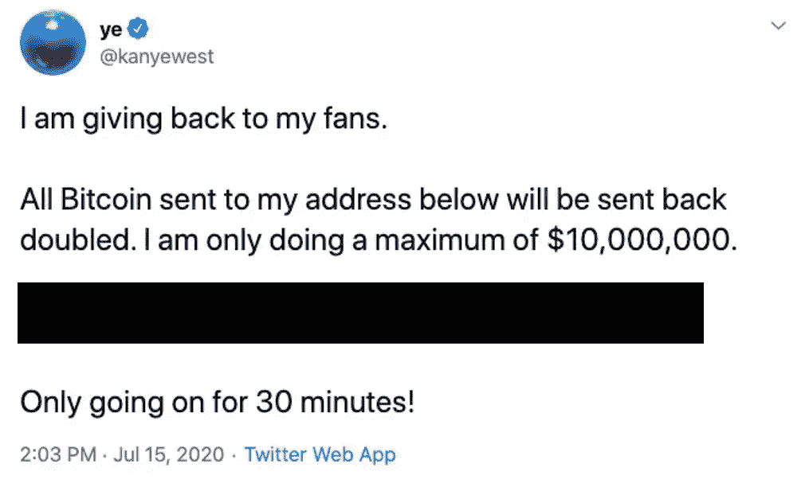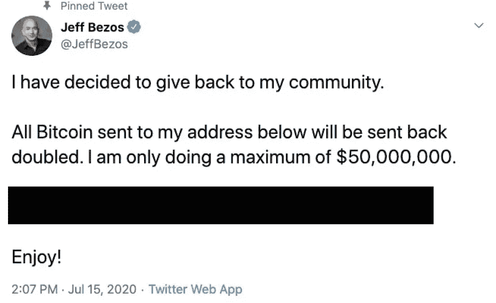

他们确实是。7 月 15 日(昨天当我写这篇文章时)，Twitter 出现了一个重大问题，大账户被黑客攻击，要求比特币捐款，承诺将汇款金额翻倍。因此，即使这些推文是真实的，它们也包含了虚假信息。

该公司在推特上写道:

这不是第一次发生这种情况，也可能不是最后一次。但是，我们能防止这种情况吗？我们能阻止这一切发生吗？

# 问题是

问题不仅仅是黑客，进入账户，发送虚假信息。这里更大的问题是我们所说的“假新闻”。假新闻是那些虚假的新闻故事:故事本身是捏造的，没有可证实的事实、来源或引用。

当某人(或类似于机器人的东西)冒充某人或可靠来源传播虚假信息时，也可以被认为是假新闻。在大多数情况下，制造这种虚假信息的人有一个议程，可以是政治的、经济的或改变行为或对某个话题的想法。

现在假新闻的来源数不胜数，大多来自编程好的机器人，它们乐此不疲(它们是机器呵呵)，全天候持续传播虚假信息。

引言中的推文只是这个问题的基本例子，但在过去 5 年中更严肃的研究表明，虚假信息的传播与选举、关于不同主题的流行观点或感受之间有很大的相关性。

这个问题是真实的，而且很难解决，因为机器人正在变得更好，正在欺骗我们。要一直检测信息的真假并不容易，因此我们需要更好的系统来帮助我们了解假新闻的模式，以改善我们的社交媒体和沟通，并防止世界陷入混乱。

# 目的

在这篇短文中，我将解释几种使用从不同文章中收集的数据来检测假新闻的方法。但是相同的技术可以应用于不同的场景。

我会用两种方式来做:

*   对于编码人员和专家，我将解释加载、清理和分析数据的 Python 代码。然后我们会做一些机器学习模型来执行一个分类任务(假的还是假的)
*   对于非技术人员，我将在 Analyttica 的一个名为 [TreasureHunt LEAPS](https://bit.ly/leaps-favio) 的系统中使用点击模式，这将允许我们做几乎所有我们用 Python 做的事情，但不需要编程，并且自动查看生成的代码。**注意:你点击的 LEAPS 的链接会把你从我的推荐中引导到我的网站，这是一个免费的平台，但是如果你也分享你的链接，你可以赢得积分！**

# 数据

数据来自 Kaggle，你可以在这里下载:

[](https://www.kaggle.com/clmentbisaillon/fake-and-real-news-dataset) [## 真假新闻数据集

### 新闻分类

www.kaggle.com](https://www.kaggle.com/clmentbisaillon/fake-and-real-news-dataset) 

有两个文件，一个是真实新闻，一个是虚假新闻(都是英文的)，共有 23481 条“虚假”推文和 21417 条“真实”文章。

所有数据和代码都可以在这个 GitHub repo 中找到:

[](https://github.com/FavioVazquez/fake-news) [## FavioVazquez/假新闻

### 假新闻检测。在 GitHub 上创建一个帐户，为 FavioVazquez/假新闻的发展做出贡献。

github.com](https://github.com/FavioVazquez/fake-news) 

# 用 Python 解决问题

## 数据读取和连接:

首先，我们将数据加载到 Python 中:

```
fake = pd.read_csv("data/Fake.csv")
true = pd.read_csv("data/True.csv")
```

然后我们添加一个标志来跟踪假的和真的:

```
fake['target'] = 'fake'
true['target'] = 'true'
```

现在让我们连接数据帧:

```
data = pd.concat([fake, true]).reset_index(drop = True)
```

我们将打乱数据以防止偏差:

```
from sklearn.utils import shuffle
data = shuffle(data)
data = data.reset_index(drop=True)
```

## 数据清理

删除日期(我们不会将它用于分析):

```
data.drop(["date"],axis=1,inplace=True)
```

删除标题(我们将只使用文本):

```
data.drop(["title"],axis=1,inplace=True)
```

将文本转换为小写:

```
data['text'] = data['text'].apply(lambda x: x.lower())
```

删除标点符号:

```
import stringdef punctuation_removal(text):
    all_list = [char for char in text if char not in string.punctuation]
    clean_str = ''.join(all_list)
    return clean_strdata['text'] = data['text'].apply(punctuation_removal)
```

删除停用词:

```
import nltk
nltk.download('stopwords')
from nltk.corpus import stopwords
stop = stopwords.words('english')data['text'] = data['text'].apply(lambda x: ' '.join([word for word in x.split() if word not in (stop)]))
```

## 数据探索

每个主题有多少篇文章？

```
print(data.groupby(['subject'])['text'].count())
data.groupby(['subject'])['text'].count().plot(kind="bar")
plt.show()
```

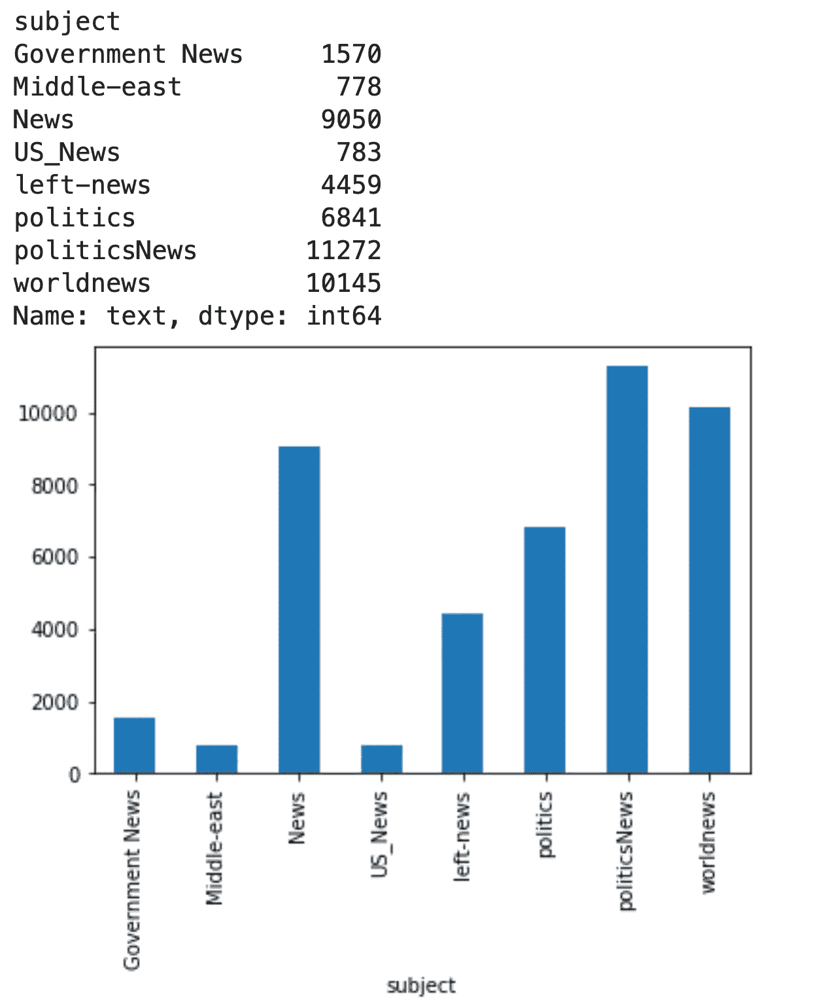

有多少假货和真货？

```
print(data.groupby([‘target’])[‘text’].count())
data.groupby([‘target’])[‘text’].count().plot(kind=”bar”)
plt.show()
```

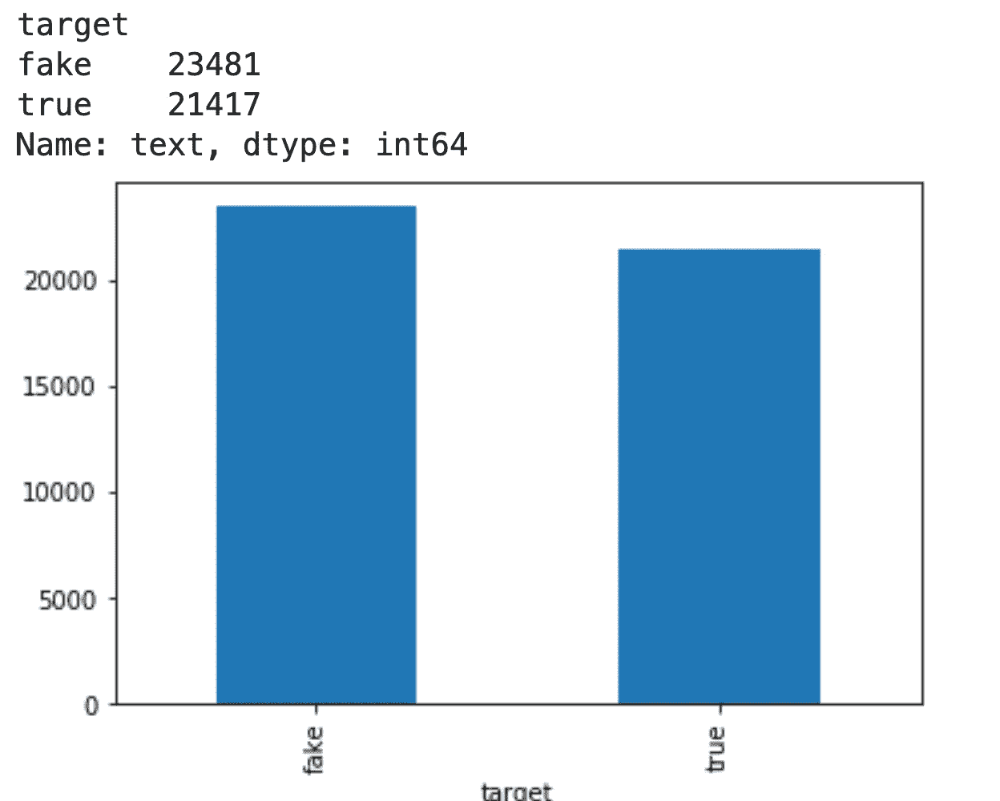

假新闻的词云:

```
from wordcloud import WordCloudfake_data = data[data["target"] == "fake"]
all_words = ' '.join([text for text in fake_data.text])wordcloud = WordCloud(width= 800, height= 500,
                          max_font_size = 110,
                          collocations = False).generate(all_words)plt.figure(figsize=(10,7))
plt.imshow(wordcloud, interpolation='bilinear')
plt.axis("off")
plt.show()
```

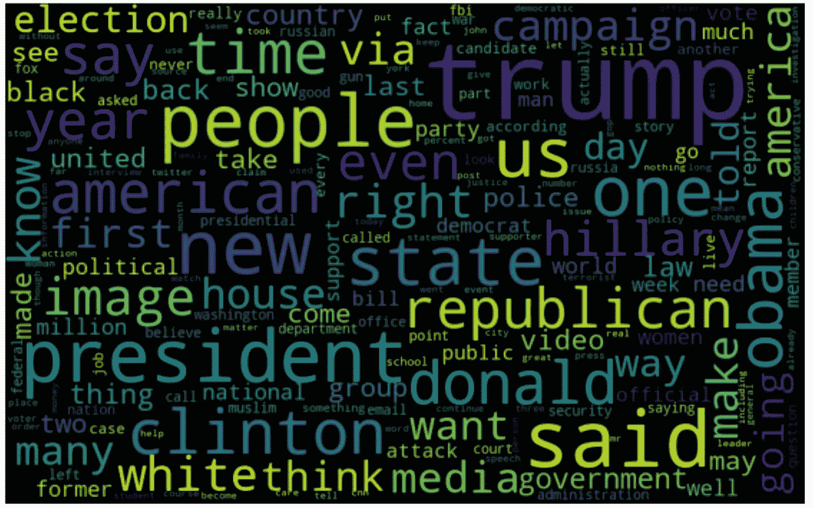

真实新闻的文字云:

```
from wordcloud import WordCloudreal_data = data[data[“target”] == “true”]
all_words = ‘ ‘.join([text for text in fake_data.text])wordcloud = WordCloud(width= 800, height= 500, max_font_size = 110,
 collocations = False).generate(all_words)plt.figure(figsize=(10,7))
plt.imshow(wordcloud, interpolation=’bilinear’)
plt.axis(“off”)
plt.show()
```

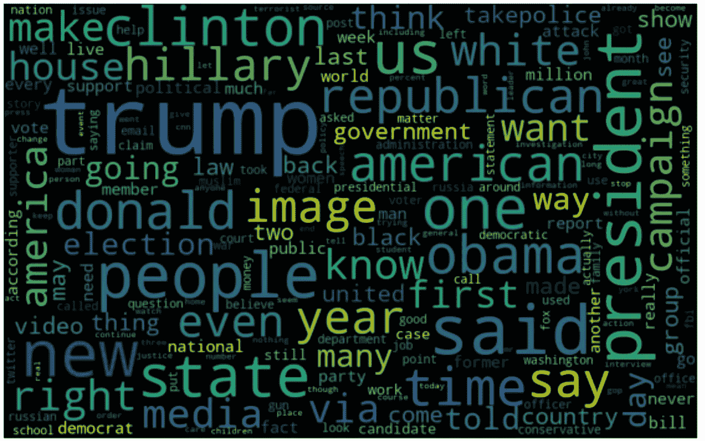

最常用词功能:

```
# Most frequent words counter (Code adapted from [https://www.kaggle.com/rodolfoluna/fake-news-detector](https://www.kaggle.com/rodolfoluna/fake-news-detector))   
from nltk import tokenizetoken_space = tokenize.WhitespaceTokenizer()def counter(text, column_text, quantity):
    all_words = ' '.join([text for text in text[column_text]])
    token_phrase = token_space.tokenize(all_words)
    frequency = nltk.FreqDist(token_phrase)
    df_frequency = pd.DataFrame({"Word": list(frequency.keys()),
                                   "Frequency": list(frequency.values())})
    df_frequency = df_frequency.nlargest(columns = "Frequency", n = quantity)
    plt.figure(figsize=(12,8))
    ax = sns.barplot(data = df_frequency, x = "Word", y = "Frequency", color = 'blue')
    ax.set(ylabel = "Count")
    plt.xticks(rotation='vertical')
    plt.show()
```

假新闻中出现频率最高的词:

```
counter(data[data[“target”] == “fake”], “text”, 20)
```

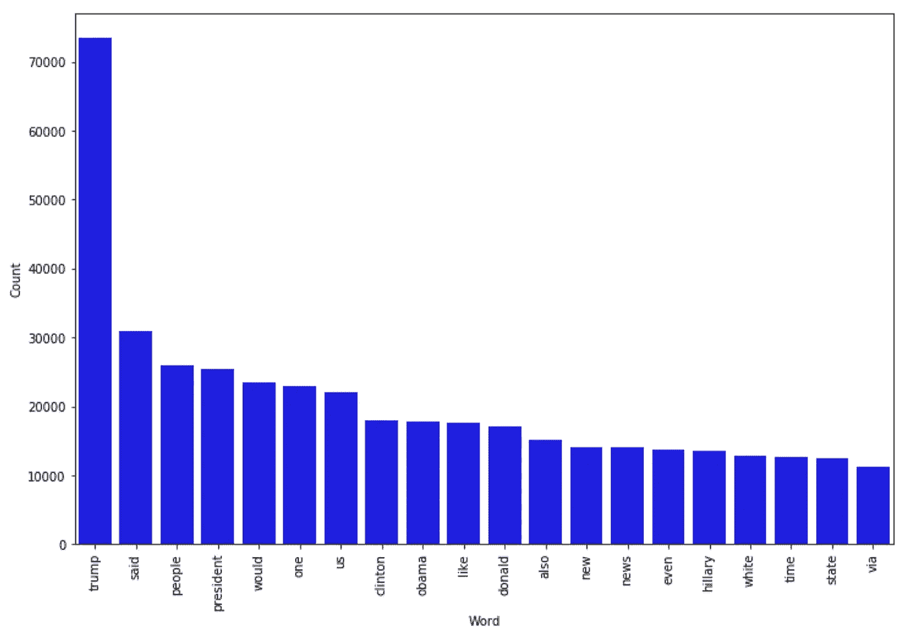

真实新闻中最常见的词:

```
counter(data[data[“target”] == “true”], “text”, 20)
```

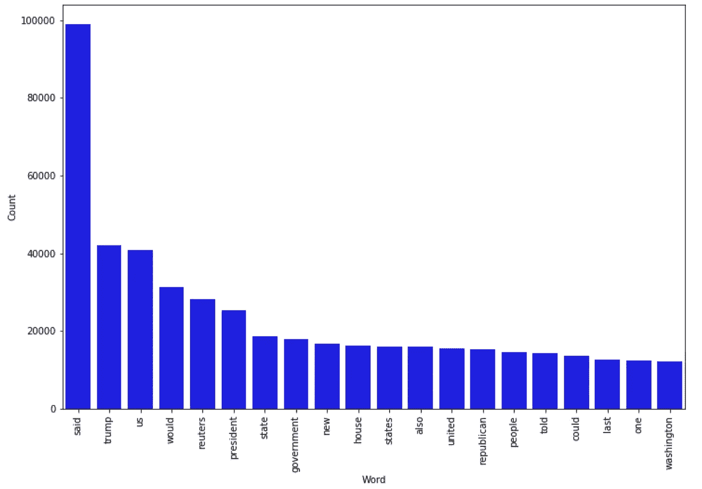

## 建模

建模过程将包括对存储在“文本”列中的语料库进行矢量化，然后应用 [TF-IDF](http://www.tfidf.com/) ，最后是分类机器学习算法。相当标准的文本分析和自然语言处理。

对于建模，我们有这个函数来绘制模型的混淆矩阵:

```
# Function to plot the confusion matrix (code from [https://scikit-learn.org/stable/auto_examples/model_selection/plot_confusion_matrix.html](https://scikit-learn.org/stable/auto_examples/model_selection/plot_confusion_matrix.html))
from sklearn import metrics
import itertoolsdef plot_confusion_matrix(cm, classes,
                          normalize=False,
                          title='Confusion matrix',
                          cmap=plt.cm.Blues):

    plt.imshow(cm, interpolation='nearest', cmap=cmap)
    plt.title(title)
    plt.colorbar()
    tick_marks = np.arange(len(classes))
    plt.xticks(tick_marks, classes, rotation=45)
    plt.yticks(tick_marks, classes)if normalize:
        cm = cm.astype('float') / cm.sum(axis=1)[:, np.newaxis]
        print("Normalized confusion matrix")
    else:
        print('Confusion matrix, without normalization')thresh = cm.max() / 2.
    for i, j in itertools.product(range(cm.shape[0]), range(cm.shape[1])):
        plt.text(j, i, cm[i, j],
                 horizontalalignment="center",
                 color="white" if cm[i, j] > thresh else "black")plt.tight_layout()
    plt.ylabel('True label')
    plt.xlabel('Predicted label')
```

拆分数据:

```
X_train,X_test,y_train,y_test = train_test_split(data['text'], data.target, test_size=0.2, random_state=42)
```

**逻辑回归:**

```
# Vectorizing and applying TF-IDF
from sklearn.linear_model import LogisticRegressionpipe = Pipeline([('vect', CountVectorizer()),
                 ('tfidf', TfidfTransformer()),
                 ('model', LogisticRegression())])# Fitting the model
model = pipe.fit(X_train, y_train)# Accuracy
prediction = model.predict(X_test)
print("accuracy: {}%".format(round(accuracy_score(y_test, prediction)*100,2)))
```

我得到了 98.76%的准确率。混乱矩阵:

```
cm = metrics.confusion_matrix(y_test, prediction)
plot_confusion_matrix(cm, classes=['Fake', 'Real'])
```

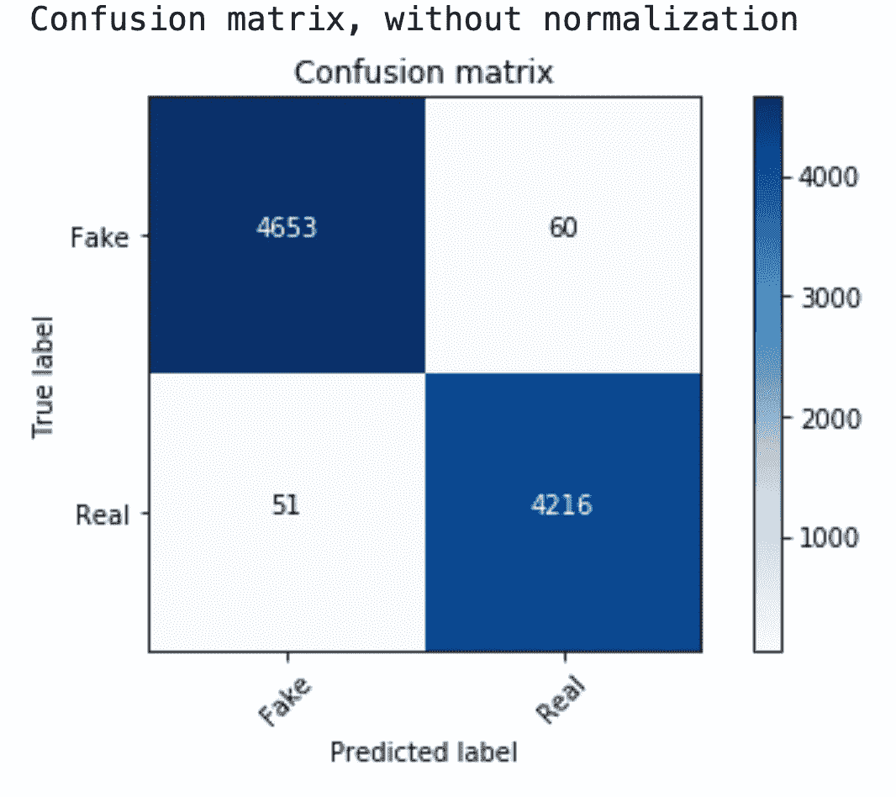

**决策树分类器:**

```
from sklearn.tree import DecisionTreeClassifier# Vectorizing and applying TF-IDF
pipe = Pipeline([('vect', CountVectorizer()),
                 ('tfidf', TfidfTransformer()),
                 ('model', DecisionTreeClassifier(criterion= 'entropy',
                                           max_depth = 20, 
                                           splitter='best', 
                                           random_state=42))])
# Fitting the model
model = pipe.fit(X_train, y_train)# Accuracy
prediction = model.predict(X_test)
print("accuracy: {}%".format(round(accuracy_score(y_test, prediction)*100,2)))
```

我得到了 99.71 %的准确率。混乱矩阵:

```
cm = metrics.confusion_matrix(y_test, prediction)
plot_confusion_matrix(cm, classes=['Fake', 'Real'])
```

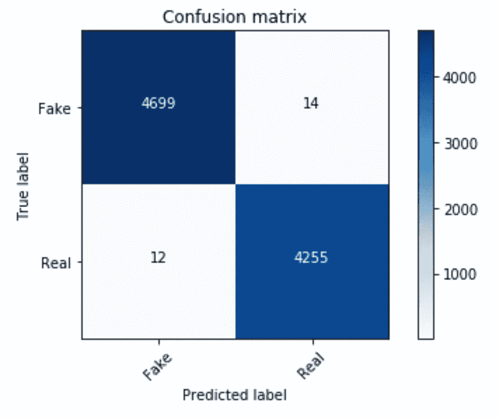

**随机森林分类器:**

```
from sklearn.ensemble import RandomForestClassifierpipe = Pipeline([('vect', CountVectorizer()),
                 ('tfidf', TfidfTransformer()),
                 ('model', RandomForestClassifier(n_estimators=50, criterion="entropy"))])model = pipe.fit(X_train, y_train)
prediction = model.predict(X_test)
print("accuracy: {}%".format(round(accuracy_score(y_test, prediction)*100,2)))
```

我得到了 98.98 %的准确率。混乱矩阵:

```
cm = metrics.confusion_matrix(y_test, prediction)
plot_confusion_matrix(cm, classes=['Fake', 'Real'])
```

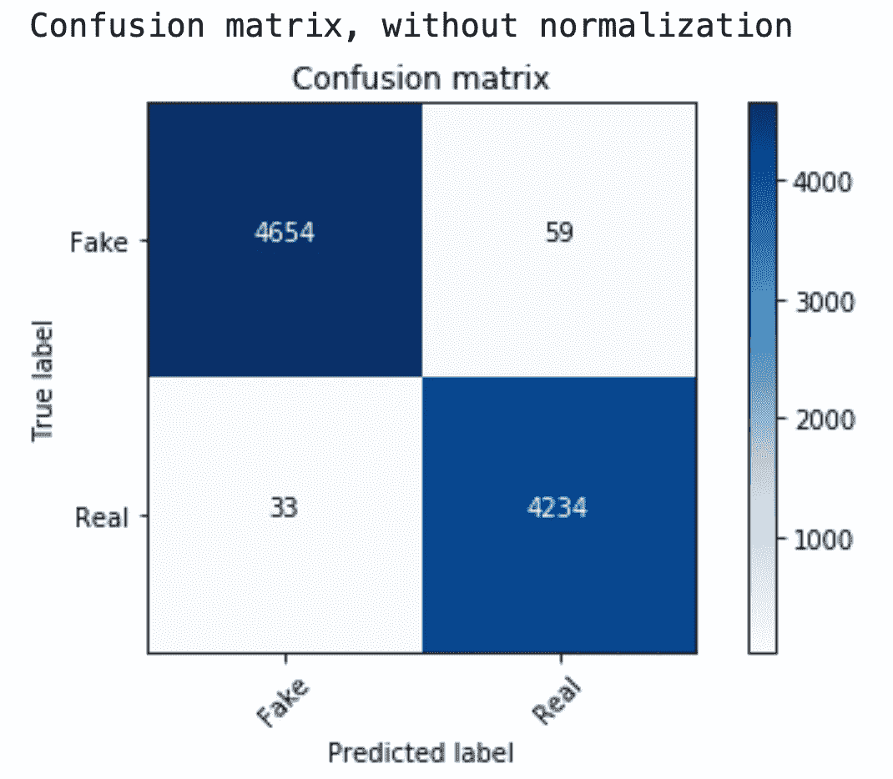

# 不用编码解决问题

我们有一个很好的 Python 模型。现在是时候不用编码做同样的事情(或者尽可能多的事情)了。同样，我们将为此使用一个名为 [LEAPS](https://bit.ly/leaps-favio) 的系统。有很多事情要做，我也不想复制 15 张截图来说明怎么做。所以我只放最重要的部分。

**重要提示:为了能够使用某些函数，您需要选择数据集的至少一列。如果你想了解更多关于如何使用平台查看他们的免费课程** [**这里**](https://leapsapp.analyttica.com/courses/all?type=all) **。**

以下是如何做到这一点:

*   创建一个免费帐户
*   创建新项目
*   上传数据:您必须分别上传每个数据集，然后将“fake.csv”重命名为 fake，将“true.csv”重命名为 true。在平台中这是一个简单的过程。
*   在假数据集和真数据集中创建一个名为“target”的列。对于假的，它应该是一个常量值 **0** ，对于真的，它应该是一个常量值 **1。**进入功能- >数据管理- >列操作- >生成常量列(Py)。**注意:要执行此操作，您必须选择数据集中的所有列。创建列后，您必须将其重命名为“目标”。**
*   追加两个表，并用真假 tweets 创建一个完整的表。确保在执行追加之前选择所有列。你可以在函数->数据管理->表操作->追加表中找到追加操作。将新表重命名为“All”。**注意:您必须从两个数据集中选择所有列来执行追加表操作。**
*   删除“日期”和“标题”列。首先选择它们，然后进入功能->数据管理->列操作->删除列:

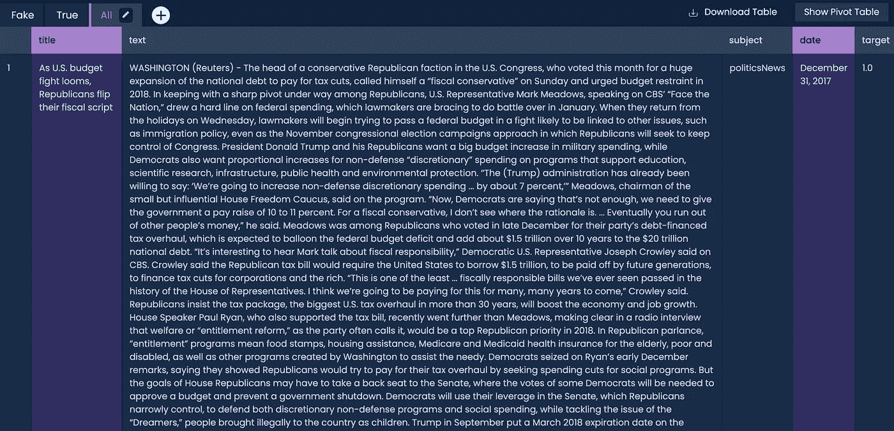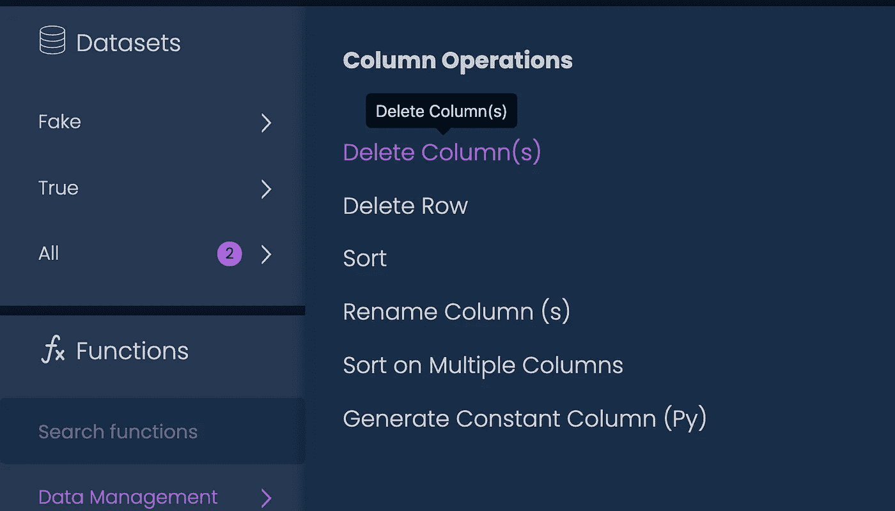

*   最后一步创建了一个新表，在我的例子中命名为“Table_4”。我们将暂时在那张桌子上工作。现在，我们将把列“text”全部转换为小写。为此，我们选择列，然后进入函数->文本分析->文本预处理->小写。你应该有这个:

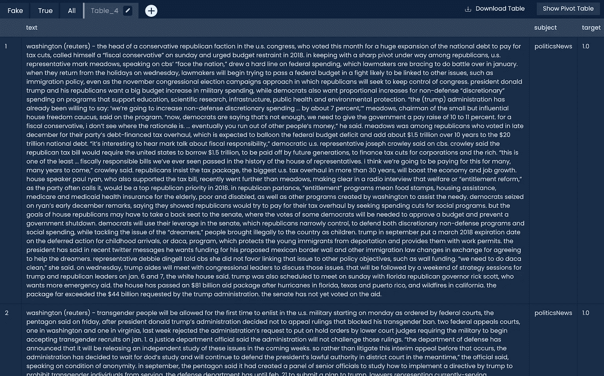

*   我们现在将删除标点符号。要做到这一点，进入功能->文本分析->文本预处理->删除标点符号。你应该会看到这个:

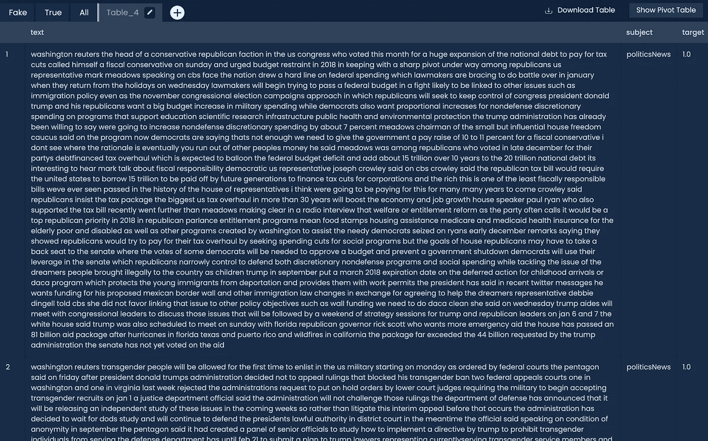

*   让我们创建一个语料库来进行下一步工作。要做到这一点，进入功能->文本分析->文本预处理->建立语料库。让我们也将最后一列重命名为“语料库”。
*   最后，让我们删除停用词(在“语料库”列)。要做到这一点，进入功能->文本分析->文本预处理->删除单词。这将删除基于一些 Python 和 R 库的单词，但是您可以在这里定义更多要删除的单词。这是你现在应该有的:

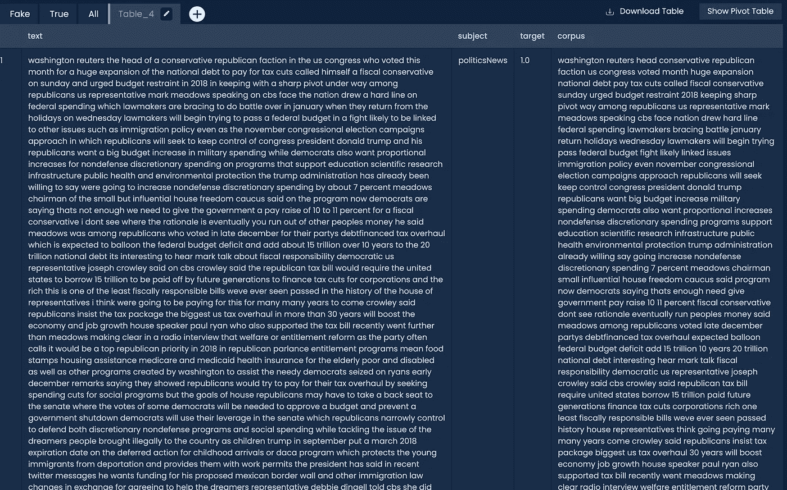

*   让我们从 Python 部分复制一些图表和统计数据。第一:每科多少篇？我们必须选择“主题”列，然后转到函数->数据可视化->分布图->按组绘制密度图(Py)。这是我能得到的最相似的图表。结果是:

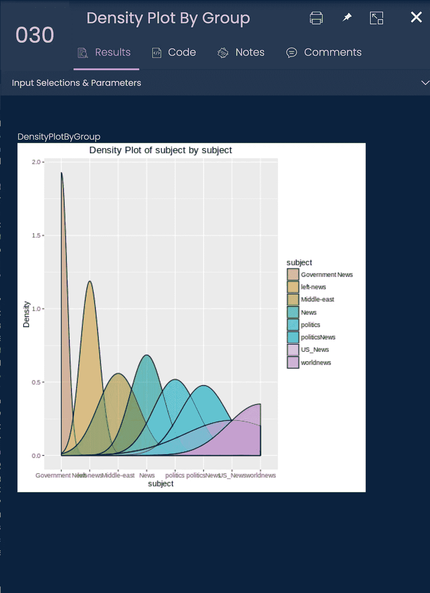

*   现在让我们看看一个图表中有多少“假”和“真”的文章。为此，请转到函数->数据可视化->分布图->直方图。这是我得到的:

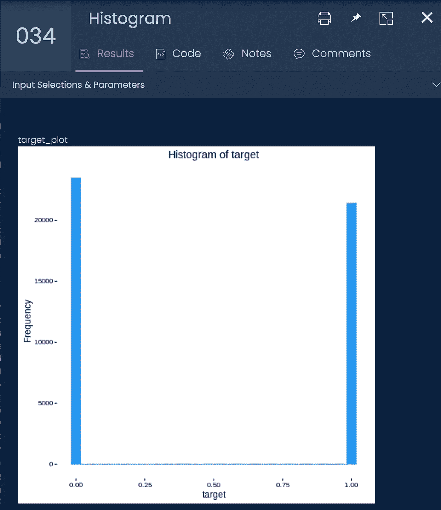

*   让我们现在建立单词云。为此，我必须首先再次分离“假”和“真”文章的数据。要做到这一点(选择“目标”列)，进入功能->数据管理->数据采样/子集->过滤分类。我为“假的”创建了一个名为“Fake_Clean”的表，然后为“真的”创建了一个名为“True_Clean”的表。然后我为两个语料库(语料库的复数)都创建了单词 cloud。要创建词云，请进入功能->文本分析->信息检索->词云，选择“语料库”栏。**注:最后我按类用了云这个词，选了“目标”作为类。结果是一样的。**

这是我从“假”文章中得到的信息:

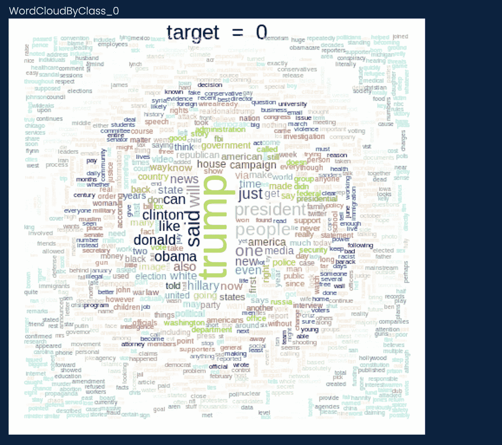

这是“真实”的文章:

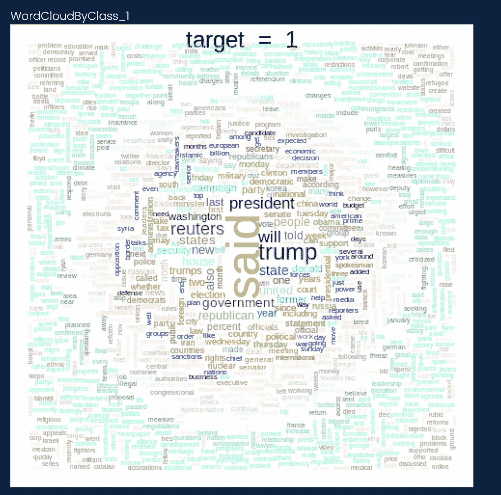

非常类似于 Python 的结果。

*   然后我画出了“假”和“真”文章中最常见的词。为此，请进入功能->文本分析->信息检索->常用术语。对于我得到的“真实”文章:

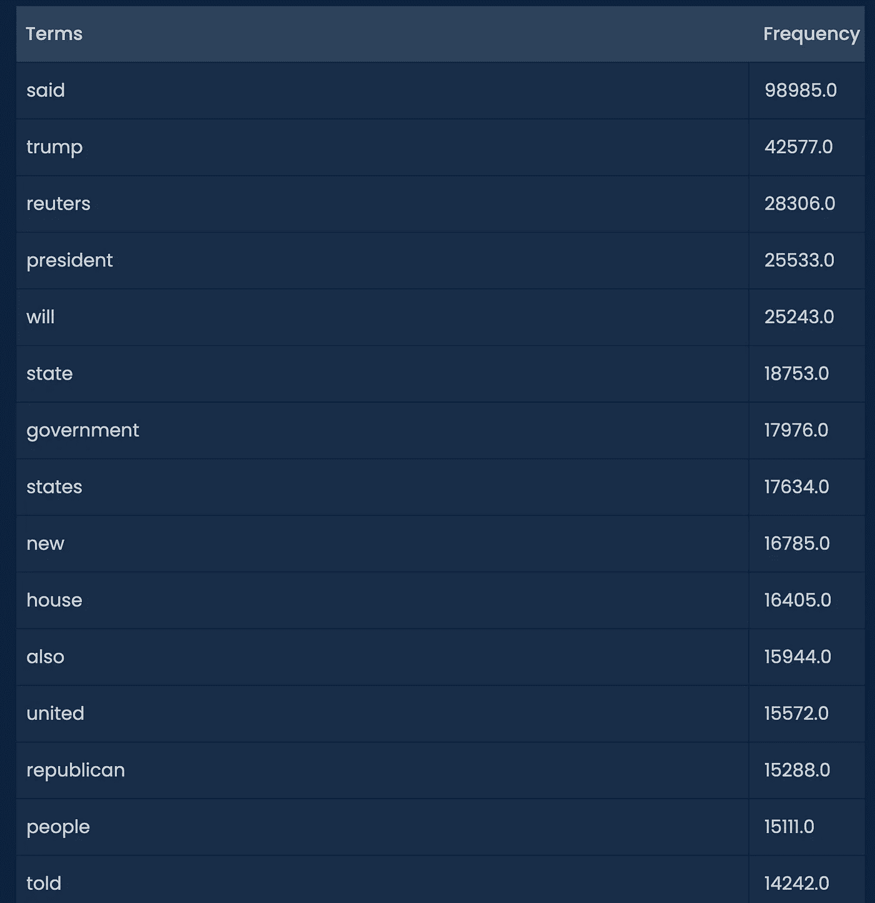

对于我得到的“假”文章:

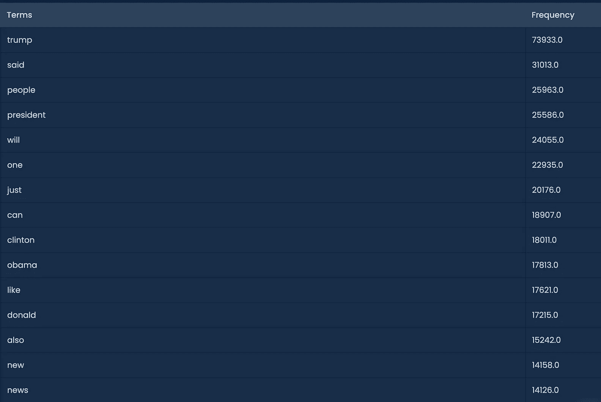

再次非常类似于我们在 Python 部分得到的。

*   对于 ML 部分，让我们从随机森林分类器开始。我进入函数->文本分析->文本分类->随机森林分类(Py)配置(选择“目标”和“语料库”变量):

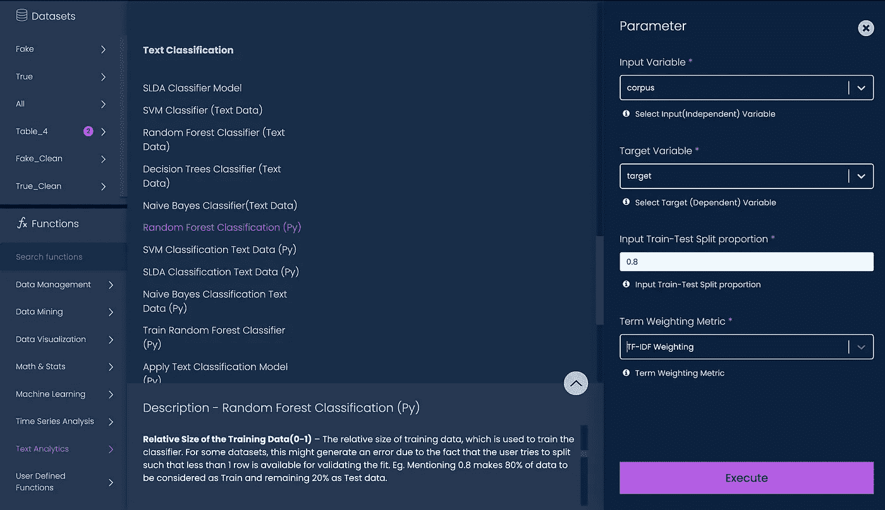

这将标记化，然后使用 TF-IDF 作为加权度量。这是结果:

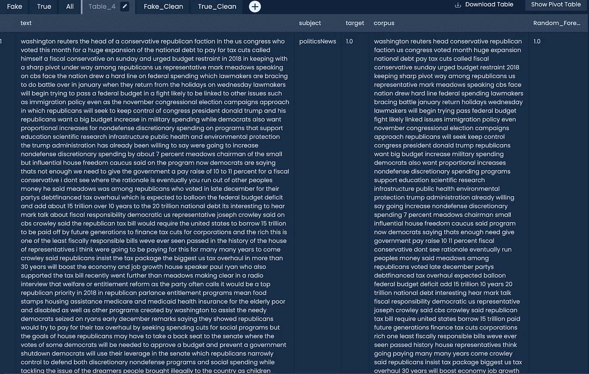

您将获得一个新列，其中包含您的模型的结果。很简单。如果您想获得 Python 或其他地方的指标，现在可以下载带有模型的最终数据集。同样的过程也可用于其他型号，如:

*   决策树分类
*   SVM 分类
*   高斯朴素贝叶斯分类

还有更多！您甚至可以将这些模型与比较文本分类模型进行比较。此外，您可以测试其他模型，如情感分析、文本聚类、Word2Vec 等等。

# 结论

文本分析和自然语言处理可以用来解决假新闻这个非常重要的问题。我们已经看到了它们对人们的观点以及这个世界思考或看待一个话题的方式所能产生的巨大影响。

我们使用样本数据建立了一个机器学习模型来检测虚假文章，但这个过程与检测虚假推文或类似的事情非常相似。你首先需要收集数据，如果你对如何用 twitter 做这件事感兴趣，我去年写了一篇文章:

[](/analyzing-tweets-with-nlp-in-minutes-with-spark-optimus-and-twint-a0c96084995f) [## 使用 Spark、Optimus 和 Twint 在几分钟内使用 NLP 分析推文

### 社交媒体是研究人们交流和行为方式的黄金，在这篇文章中，我将向你展示…

towardsdatascience.com](/analyzing-tweets-with-nlp-in-minutes-with-spark-optimus-and-twint-a0c96084995f) 

我们还看到，用 Python 构建模型很简单，如果你知道如何编码，我认为我们都应该学习，但如果你不知道，像 [TreasureHunt LEAPS](https://bit.ly/leaps-favio) 这样的平台可以帮助你不费吹灰之力就解决问题，而且还是免费的！您甚至可以与他人分享您解决的问题和内置代码，进行协作、学习等等

感谢您阅读本文，希望它能对您当前的工作或调查以及对数据科学的理解有所帮助。