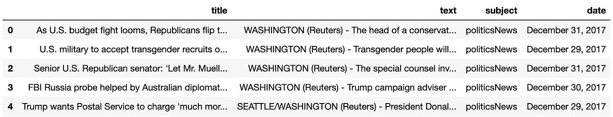
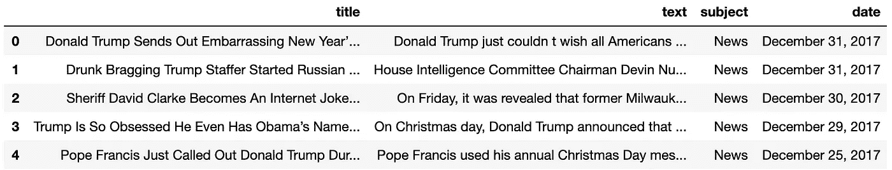
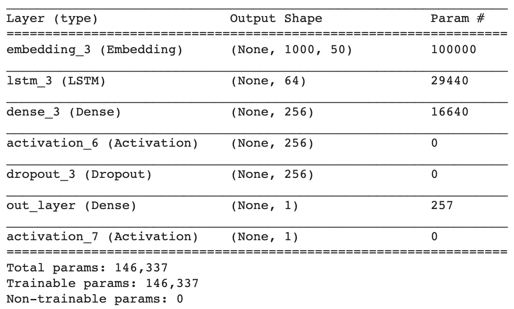
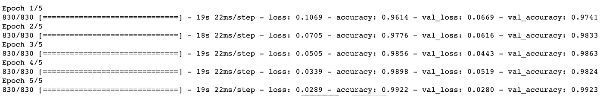
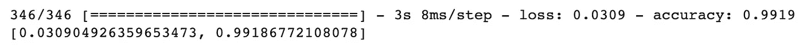
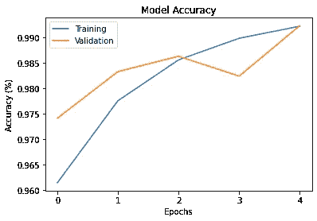
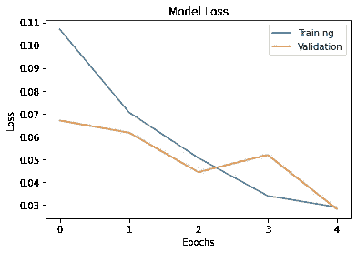

# 用深度学习检测假新闻

> 原文：<https://towardsdatascience.com/detecting-fake-news-with-deep-learning-7505874d6ac5?source=collection_archive---------37----------------------->

## 用 Keras 实现简单的 LSTM


图片来自 [Pixabay](https://pixabay.com/?utm_source=link-attribution&amp;utm_medium=referral&amp;utm_campaign=image&amp;utm_content=4881486) 的 [memyselfaneye](https://pixabay.com/users/memyselfaneye-331664/?utm_source=link-attribution&amp;utm_medium=referral&amp;utm_campaign=image&amp;utm_content=4881486)

我一直想做一个涉及文本分类的小项目，并决定尝试一种我以前没有使用过的架构:长短期记忆(LSTM)。简而言之:LSTM 氏症是一种循环神经网络(RNN)，能够长时间记忆信息(这是一种优于香草 RNN 的优势)。如果你想了解更多的细节:[这里有一个关于 LSTM 建筑](http://colah.github.io/posts/2015-08-Understanding-LSTMs/)的精彩而详尽的解释。

好吧，让我们开始吧！

我在 Kaggle 上找到了一个真假新闻的数据集:[真假新闻数据集](https://www.kaggle.com/clmentbisaillon/fake-and-real-news-dataset#Fake.csv)。我试着在 Jupyter 笔记本上本地做这件事，但是一旦我到了训练部分，我的电脑几乎爆炸了——一个时期的 ETA 至少是 2 个小时。我把东西转移到一个 GPU 加速的 Google Colab 实例中，事情变得更加顺利。[这里是查看笔记本](https://colab.research.google.com/drive/15SmOCOnL8IktcMVDn0Lxhe9U_aq_ppqN)的链接。

```
# load datasets into a panda's dataframe
real = pd.read_csv('data/True.csv')
fake = pd.read_csv('data/Fake.csv')
```

现在让我们看看数据是什么样子的。



“真实”数据集



“假新闻”数据集

```
real.head()fake.head()
```

我立即注意到的一件事是真实新闻文章中的“(路透社)”标签。事实证明，几乎所有的真实故事都来自路透社，几乎没有任何假新闻包含这个词。我想最终比较有单词和没有单词的模型。

```
real.loc[real.text.str.contains('Reuters')].count()/real.count()
> title      0.998179
> text       0.998179
> subject    0.998179
> date       0.998179fake.loc[fake.text.str.contains('Reuters')].count()/fake.count()
> title      0.013247
> text       0.013247
> subject    0.013247
> date       0.013247
```

现在，让我们给出数据标签，并将它们组合成一个数据集进行训练，然后对它们进行训练/测试拆分。

```
# Give labels to data before combining
fake['fake'] = 1
real['fake'] = 0
combined = pd.concat([fake, real])## train/test split the text data and labels
features = combined['text']
labels = combined['fake']X_train, X_test, y_train, y_test = train_test_split(features, labels, random_state = 42)
```

现在我们用 Keras 中的 Tokenizer 对象处理文本数据。我们不会删除停用词，因为每个词的上下文以及句子和段落的构成都很重要。我认为这两个班级的写作质量存在潜在的差异。路透社的记者居然有文字编辑！

```
# the model will remember only the top 2000 most common words
max_words = 2000
max_len = 400token = Tokenizer(num_words=max_words, lower=True, split=' ')
token.fit_on_texts(X_train.values)
sequences = token.texts_to_sequences(X_train.values)
train_sequences_padded = pad_sequences(sequences, maxlen=max_len)
```

现在让我们建立模型！

```
embed_dim = 50
lstm_out = 64
batch_size = 32model = Sequential()
model.add(Embedding(max_words, embed_dim, input_length = max_len))
model.add(LSTM(lstm_out))
model.add(Dense(256))
model.add(Activation('relu'))
model.add(Dropout(0.5))
model.add(Dense(1, name='out_layer'))
model.add(Activation('sigmoid'))model.compile(loss = 'binary_crossentropy', optimizer='adam',\
               metrics = ['accuracy'])print(model.summary())
```



现在我们来训练模型。

```
model.fit(train_sequences_padded, y_train, batch_size=batch_size, epochs = 5, validation_split=0.2)
```



基于训练数据的 LSTM 模型训练进展

现在让我们评估一下测试/维持集。

```
test_sequences = token.texts_to_sequences(X_test)test_sequences_padded = pad_sequences(test_sequences,\ 
                                       maxlen=max_len)
```



非常非常好。



绘制模型的准确性和损失表明，它可能仍然需要更多的训练，因为没有过度拟合的证据。

99%是一个很好的结果，但是，记住所有的真实新闻都有“路透社”在里面？假设它只是一个单词，我想看看从文本中删除它会如何影响模型的性能(如果有的话)。我认为在单词选择和编辑方面一定有很多其他潜在的模式，可能会使模型的分类变得容易。

从所有新闻文本中删除“Reuters”后，最终模型的测试集评估准确率为 98.5%。因此，其预测能力略有下降(0.6%的差异)。我还以为会更多。

获得这样一个几乎现成的好结果应该会让您更多地考虑底层数据。如果它好得令人难以置信，它很可能就是真的！路透社的新闻故事依赖于风格指南，并经过严格编辑，我不能说假新闻也是如此。这些潜在的模式可能允许模型从这个特定的数据集学习，*但是它如何推广到从不同来源在野外发现的新闻呢*？

我在 2019 年脸书上查看最多的假新闻文章上找到了一篇[商业内幕文章](https://www.businessinsider.com/most-viewed-fake-news-stories-shared-on-facebook-2019-2019-11)。很难找到其中一些例子的全文。

对于第五个名为*“奥马尔与恐怖组织伊斯兰团体举行秘密筹款活动”的分享故事*，该模型预测其为**真实**。

对于标题为“*的#1 分享故事，特朗普的祖父是一名皮条客和逃税者；他的父亲是三 k 党成员，*模型预测它为**假新闻** *。*

我还在 CNN 上抢到了当前的头条新闻，“ [*特朗普将联邦社交距离准则延长至 4 月 30 日*](https://www.cnn.com/2020/03/29/politics/trump-coronavirus-press-conference/index.html) ”，模型预测为**真实**。

## 结论

该模型似乎是训练和测试数据集上的一个非常强大的预测器，但是它可能不会在此之外进行很好的推广。当出现一个不符合设定的假新闻故事时，模型是 1 对 2。这个样本规模很小，我想尝试追踪更多数据集之外的假新闻，看看它的表现如何。我也想尝试更多的艺术模式(埃尔莫/伯特)。希望你喜欢阅读！