# 在 Luckin Coffee 的收益电话会议记录中发现欺诈

> 原文：<https://towardsdatascience.com/detecting-fraud-in-luckin-coffees-earnings-call-transcripts-7940b1f133df?source=collection_archive---------61----------------------->

## 本文使用自然语言处理技术来检测受会计丑闻困扰的中国咖啡连锁店的欺诈行为。

Ashkan Forouzani 在 [Unsplash](https://unsplash.com?utm_source=medium&utm_medium=referral) 上的照片

2020 年初，Luckin Coffee 在首席执行官承认在公司 2019 年的盈利报告中夸大会计数字后，从纳斯达克证券交易所退市。

Luckin Coffee 曾被誉为星巴克在中国咖啡市场的最大竞争对手，被指控在 2019 年捏造销售收入。尽管丑闻花了一些时间才被曝光，但它启发我开始思考通过文字检测欺诈的可能性。

本文重点介绍了将自然语言处理技术应用于 2019 年第二季度和第三季度的 Luckin Coffee 收入电话。我们将努力寻找有价值的花絮并回答这些问题

> 我们能在管理层的言辞和语气中找到欺诈的暗示吗？
> 
> 通过文本挖掘技术，我们是否也能快速有效地发现某个商业模式陷入困境或不可持续？

## 关于数据集

我通过 Luckin Coffee 的官网下载了它的收入通话记录。机器人流程自动化工具用于将 pdf 文本提取到 r。

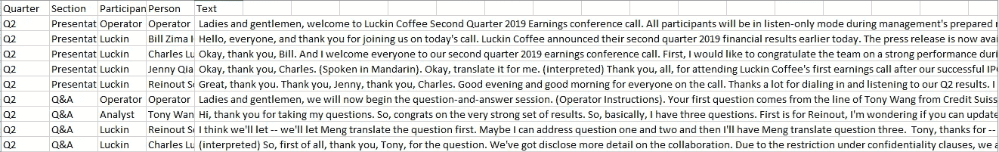

本文中用于分析的 CSV 文件的快照

## 清理和浏览数据集

像任何数据科学项目一样，我们需要了解我们的数据集并清理它。由于这是一个相对较小的数据集，我只删除了常见的停用词，所以我们仍然有足够的数据用于分析。

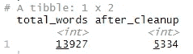

删除停用词前后的字数

## Luckin Coffee 的赚话费谁说的最多？

首先，我们来看一下 Luckin Coffee 财报电话会议中与会者的发言字数。正如预期的那样，首席财务官和首席执行官在电话会议上与观众分享了最多的内容。

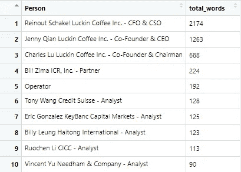

在 Luckin Coffee 收入电话中发言字数排名前 10 位的参与者

## 想象每个参与者的极性

情感分析帮助我们提取一个人对某个主题的观点，无论是积极的还是消极的。在这一部分中，我们试图找出 Luckin Coffee 的收入电话中每个参与者的情绪。

下面的图表通过持续时间和频率显示了每个参与者的极性。消极词汇被分配较低的分数(消极分数)，反之，积极词汇获得较高的极性分数。

请注意，下面的第二张图表显示，Luckin Coffee 的首席执行官、首席财务官和董事长在收入电话会议中使用了许多积极的词语。

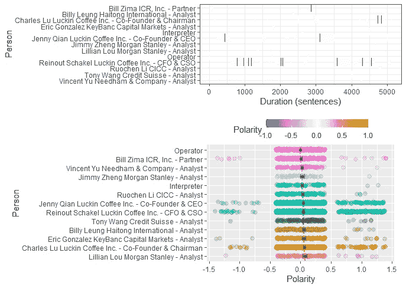

Luckin Coffee 收入电话中每个人的极性。

## 咖啡还是茶？—分析 Luckin Coffee 收入电话中最常用的单词/短语

最流行的文本挖掘技术之一是找出特定单词在数据集中出现的频率。在本节中，我们将使用词频来分析 Luckin Coffee 的商业模式。

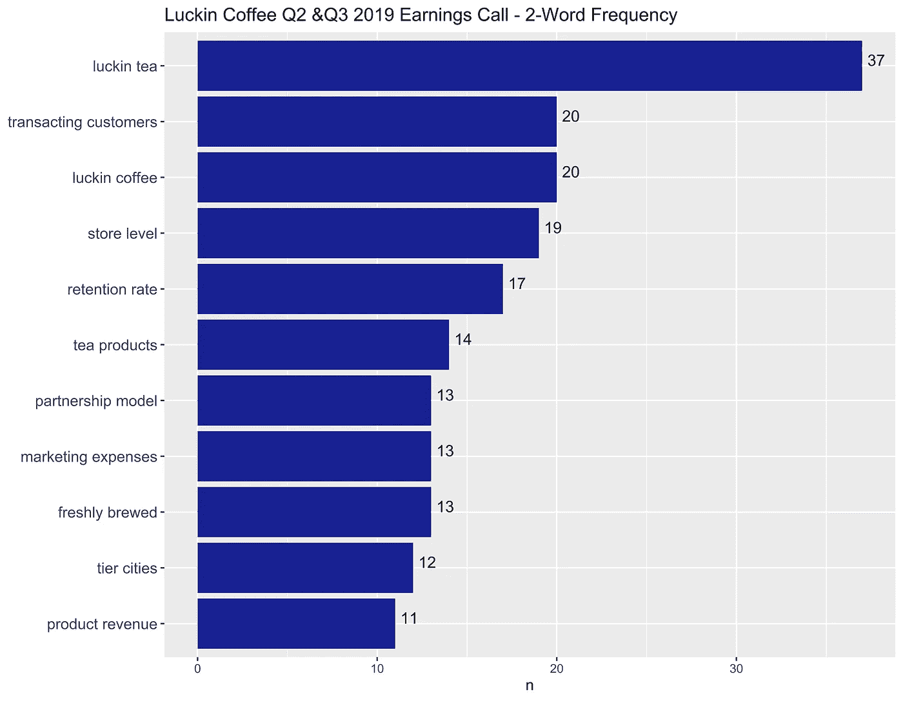

基于 Luckin Coffee 收入呼叫的二元条形图

根据上面的双字频率条形图，我们可以对该公司的业务模式做出一些假设:

*   **咖啡和茶为主要产品** : Luckin Coffee 一直标榜自己是星巴克在中国咖啡市场的竞争对手。除了咖啡产品，该公司还积极尝试渗透到中国的茶叶市场。
*   **注重赢得顾客的忠诚度**:“保留率”和“营销费用”这两个词表明，Luckin coffee 正在花费大量的营销费用来赢得中国饮料市场份额。
*   **向中国特定城市扩张**:中国有一个城市等级体系，每个城市属于一个特定的等级。例如，北京和上海是一线城市。我们可以假设 Luckin Coffee 正在将其商店网点扩展到特定级别的城市。
*   **利用合作模式获得更多客户**:有趣的是,“合作模式”一词成为收入电话中最热门的双字母词之一。我们还可以假设 Luckin Coffee(计划)通过合作关系发展业务，以获得更多客户和/或扩大其商店的位置。

词频让我们了解一个主题的主题。接下来我们看单词网络图来看构成本题内容的单词。

## 词网络图:Luckin Coffee 的价值主张和通过合作模式增加的增长

下图显示了在收入电话中经常一起出现在一个句子中的单词。下图突出了三个主题。

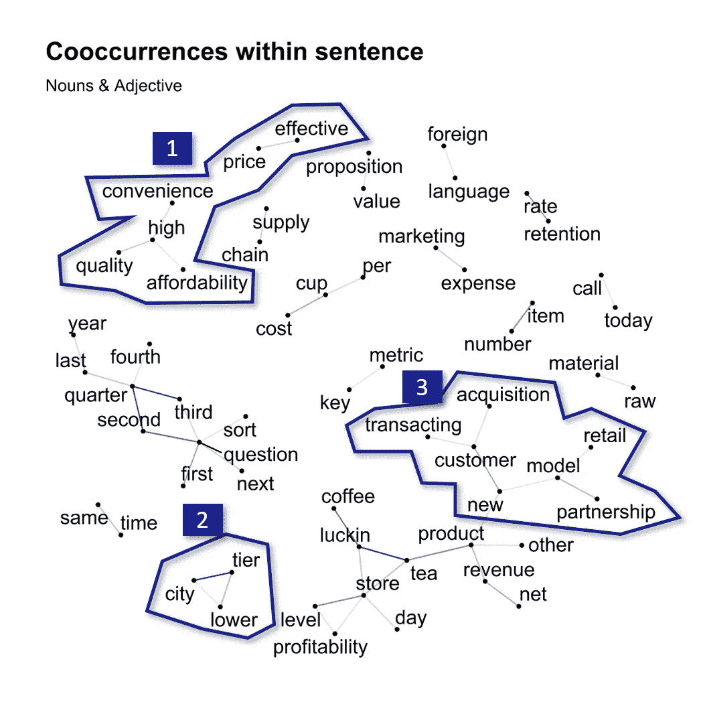

词网络图——句内共现

1.  Luckin Coffee 的价值定位主要集中在以实惠/有效的价格销售，同时在便利的位置保持其质量
2.  为了实现这一价值主张，Luckin Coffee 瞄准中国租金可能更低的低线城市是有意义的
3.  在公司内部建立伙伴关系模式的目标是在不同的地点获得更多的客户

通过以上发现，我们可以怀疑 Luckin Coffee 的收入报告中捏造的销售数字可能是由于其与其他方的合作关系管理不善。

## 快速开设新店——分析最常用的情感词汇/短语

除了找出每个参与者在赚钱电话中的极性，我们还可以将单词标记为特定的情绪，然后进行单词计数。在我们的例子中，我们将查看 Luckin Coffee 的首席执行官(在捏造的销售调查中终止)和首席财务官的情绪词频。

总的来说，这位首席执行官在两次盈利电话中使用了“商店”一词约 25 次(在积极和预期类别中)。第二和第三个经常提到的词是‘伙伴关系’(约 6 次)，和‘需求’(约 5 次)。注意第一个单词和第二个单词之间有很大的差距。这可能是一个信号，表明 Luckin Coffee 如此专注于其扩张计划，以至于该公司忽视了客户想要的产品吗？

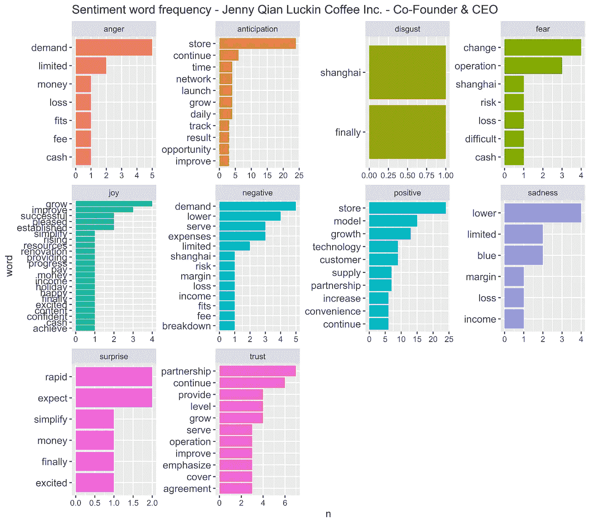

情感词频柱状图——luck in Coffee 的 CEO

至于首席财务官和首席社会官,“商店”一词也被提到了近 40 次，负面和悲伤类别中的“较低”也被提到了约 15 次。这些发现可能表明，2019 年的大部分金融行动都是为了在中国扩张门店。

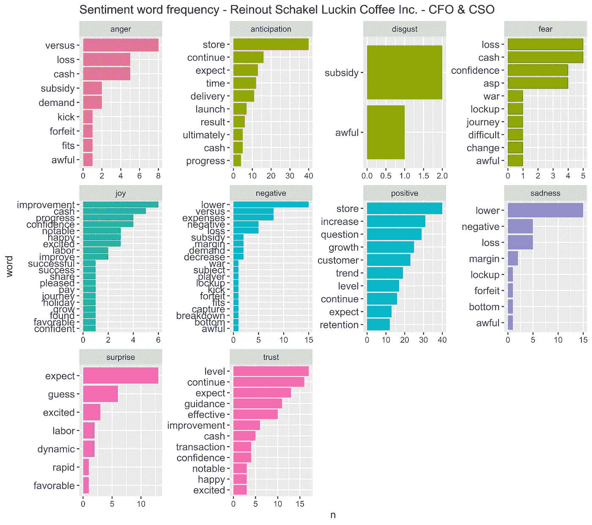

情感词频柱状图——luck in Coffee 的 CFO & CSO

接下来，我们还可以通过 CFO & CSO 所说的话来看看出现在“lower”前后的单词。

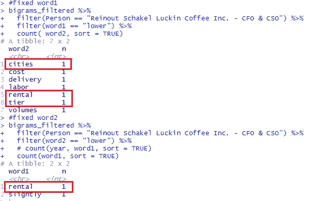

出现在“下级”前后的词— CFO 和 CSO

我们注意到“低”这个词与城市等级和租金相关。低线城市的人口规模和收入水平通常较低。因此，这些城市的租金也低于北京等一二线城市。这些发现表明，Luckin Coffee 的目标是在中国的低线城市开设更多门店。

## 自动售货机和中东咖啡市场——从盈利电话中提取关键词。

另一种流行的文本挖掘技术是通过数据科学的视角从文档中提取关键词。在我们的例子中，我使用`udpipe` R 包中的 RAPID 和 PMI 函数从收入调用中获得关键字。

快速是指快速自动提取关键词。RAPID 算法试图通过分析单词的频率和共现来确定文本数据中的关键短语。

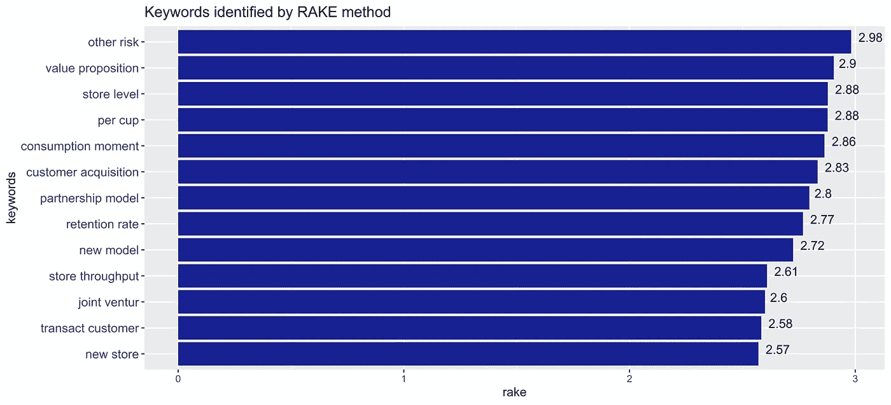

RAKE 方法确定的关键字条形图

PMI 指的是逐点互信息，寻找成对的词的搭配顺序。该算法将尝试识别比预期更频繁地同现的单词序列。

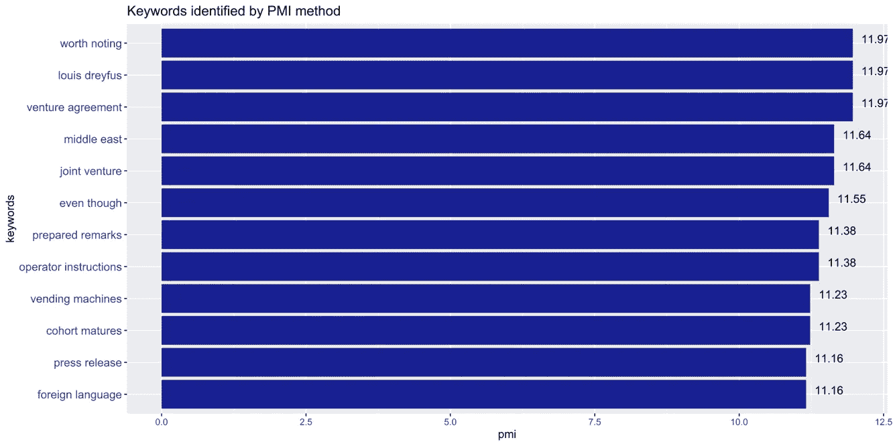

通过 PMI 方法识别的关键字条形图

RAKE 关键字提取方法产生类似于词频技术的结果。另一方面，PMI 方法提供了更多见解，包括:

*   Luckin Coffee 与其他方有风险投资协议(也许是 Louis Dreyfus？)
*   除了打入中国的咖啡市场，Luckin Coffee 也在关注中东市场。
*   Luckin Coffee 已经/可能计划通过自动售货机出售他们的饮料。

## 结论

简而言之，我们能够通过文本分析探索 Luckin Coffee 的商业模式。有几点可能暗示该公司存在欺诈行为。

首先，管理层极度关注供应方面——开设新店。虽然该公司解释了其需求战略——通过合作模式留住客户，但在财报电话会议上并没有过多提及“需求”、“客户偏好”等词。

第二，Luckin Coffee 盈利报告中捏造的销售数字可能是因为该公司对外部零售方的管理不善。自 2019 年年中/年底以来，Luckin Coffee 一直在中国日报开设新店。雷鸣般的扩张速度可能导致管理层失去了管理和与合作伙伴合作的能力。

最后，Luckin Coffee 计划渗透到中国的咖啡和茶市场。看看捏造的销售是否与其新推出的茶产品有关，这将是很有趣的。