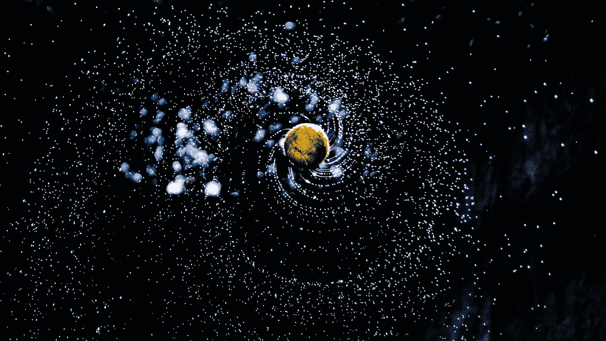
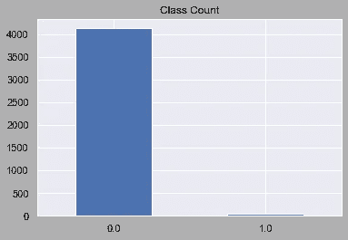
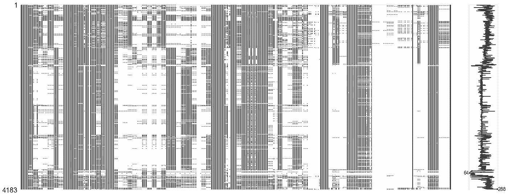
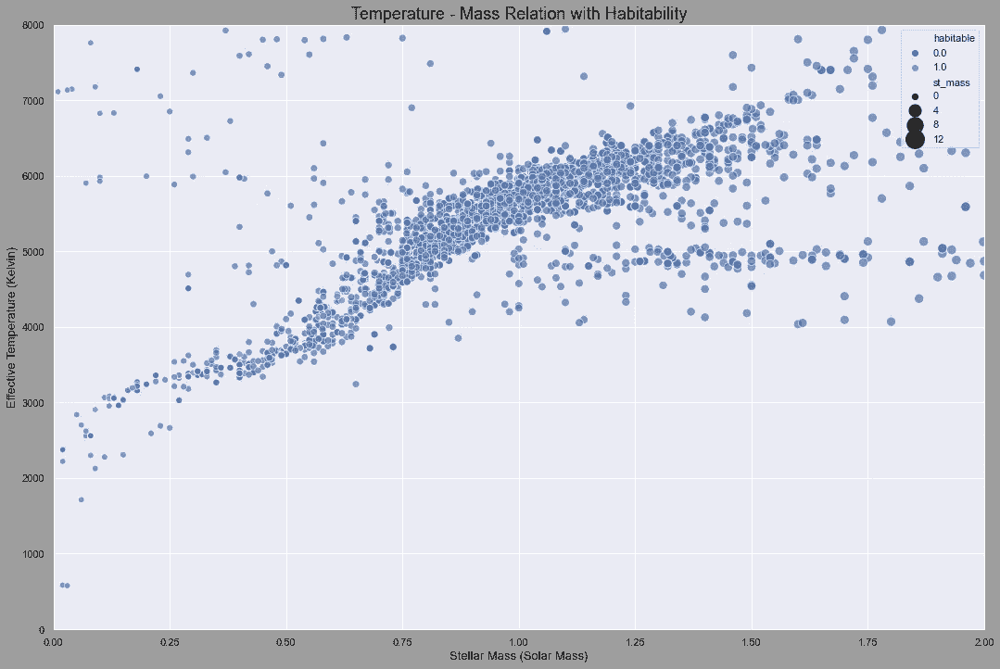
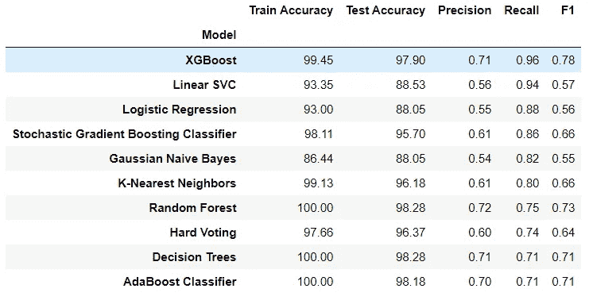
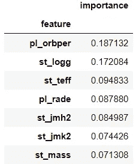

# 用机器学习探测系外行星的可居住性

> 原文：<https://towardsdatascience.com/detecting-habitability-of-exoplanets-with-machine-learning-b28c2d825760?source=collection_archive---------29----------------------->

> “宇宙是一个相当大的地方。如果只有我们，这似乎是对空间的极大浪费。”卡尔·萨甘


山姆拍摄的照片🐷 on [Unsplash](https://unsplash.com?utm_source=medium&utm_medium=referral)

我们大多数人都想知道在我们的星球之外有生命吗？对我们的祖先来说，我们似乎首先是孤独的，但当我们检查星星时，我们意识到这是一个相当大的宇宙。然后我们开始问地外文明是否存在，它们在哪里？我们把这个问题称为费米悖论。它陈述了缺乏地外文明证据和对其概率的各种高估计之间的矛盾。

但是，正如卡尔·萨根所说:“缺乏证据并不是不存在的证据。”所以我们正在寻找外星人在哪里，或者他们是否存在的问题。
系外行星研究的主要工作领域之一就是找到这个问题的答案。在不同的恒星系统中寻找可能适合居住的行星是系外行星研究的主要目标之一。到目前为止，我们已经发现了 60 颗可居住的系外行星，我们将继续寻找更多的系外行星。



照片由 [Alazar Kassahun](https://unsplash.com/@mr_bcubed5?utm_source=medium&utm_medium=referral) 在 [Unsplash](https://unsplash.com?utm_source=medium&utm_medium=referral) 上拍摄

所以，我决定开发一个机器学习项目来预测这些可居住的行星。通过进入这个项目，我提取了两个数据集:美国宇航局系外行星档案和 PHL 的可居住系外行星目录。

# 数据知识

因此，有两个数据集需要处理: [Nasa](https://exoplanetarchive.ipac.caltech.edu/cgi-bin/TblView/nph-tblView?app=ExoTbls&config=planets) 系外行星档案和 [PL 数据](http://phl.upr.edu/projects/habitable-exoplanets-catalog/data/database)，其中包含可居住性情况。我从美国宇航局获得的数据集是我的中心数据集，因为它有更多的恒星和行星的特征，例如；行星半径、恒星温度、轨道周期等等。我需要 PHL 的数据来使用可居住性功能。下图显示了目标特征的分布，这意味着可居住性。如您所见，我有一个不平衡的数据集，我将在下面的部分中处理它。



目标特征的分布。作者图片

# 方法学

本项目遵循的方法是:

1.  预处理和数据合并
2.  处理缺失数据
3.  探索性数据分析
4.  机器学习模型的数据准备
5.  定义模型
6.  评估和优化

天文数据集通常会有很多缺失值，我的情况也是如此。因此，我从清除这些丢失的值开始。



作者图片

这张图片显示了我丢失了多少价值。很明显，是很多。所以，我按照以下步骤来解决我的问题:

*   我删除了丢失数据超过 40%的列。

```
# remove columns with more than 40% missing data
def remove_missing(f):
    count = len(planets[planets[f].isnull()])
    if count/len(planets) > 0.4:
        return 1
    else:
        return 0

missing_values = [x for x in planets.columns if remove_missing(x)]
planets = planets.drop(missing_values, axis=1)
```

*   我删除了具有十个以上唯一值的分类特征。

```
# remove categorical features with more than 10 unique values
cols = [x for x in planets.columns if x not in planets._get_numeric_data().columns]
for i in cols:
    if(len(planets[i].unique()) > 10):
        planets = planets.drop(i, axis=1)
```

*   对剩余分类特征的处理。
*   数值的迭代计算。

```
# IterativeImputer
# get only numeric values
numeric_values = planets[planets._get_numeric_data().columns]
imp = IterativeImputer(RandomForestRegressor(), max_iter=10, random_state=76)
numeric_values = pd.DataFrame(imp.fit_transform(numeric_values), columns=numeric_values.columns)
numeric_values.to_csv('Imputed Data.csv', index='rowid')
```

在下面的步骤之后，我得到了一个包含 131 个条目的干净数据集，并继续进行合并过程。

## 合并数据集

正如我之前所说的，我有两个项目数据集，所以我需要将它们结合起来，以便在机器学习模型中使用。除了可居住性，我的所有特征都在美国宇航局的系外行星档案中。因此，我把它从 PHL 数据集中拿了出来，放在中央数据集中。

```
#drop not-habitable planets
phl = phl[phl.P_HABITABLE != 0]#create habitable column for planets data with the help of phl #dataframe
#get names of planets
habitable_planets = phl.P_NAME.values
planets['habitable'] = planets['pl_name'].isin(habitable_planets
```



质量-温度-可居住性关系。作者图片

# 走向机器学习

我完成了清理和合并过程，但仍有工作要做。我应该做一些准备步骤，为机器学习模型准备数据。我仍然有这么多的功能，我不想从模型中得到过度拟合的结果。此外，我必须解决不平衡的问题。因此，我按照以下步骤编写了一些数据准备方法:

*   丢弃低相关性要素&为模型数据集选择高相关性要素。
*   经过一些研究，我决定将这些特征添加到模型的数据集中:行星质量、行星径向速度振幅[m/s]、平衡温度[K]、行星半径[地球半径]和轨道周期[天]。但是，由于缺失值问题，我只有行星半径和轨道周期。
*   标准化和对数变换。
*   SMOTE —过采样。

```
#Selecting highly correlated features
unrelevant_features = corr_df[corr_df['habitable'] <= 0.09]to_drop = [column for column in unrelevant_features.index]
planets_c.drop(planets_c[to_drop[:97]], axis=1, inplace=True)planets_c[['pl_rade', 'pl_orbper']] = planets[['pl_rade', 'pl_orbper']]# log transformation to decrease the effect of the outliers
log_cols = ['gaia_plx', 'st_pm', 'gaia_pm', 'st_teff', 'pl_rade', 'pl_orbper']
planets_c[log_cols] = (planets_c[log_cols]+1).transform(np.log)
norm_cols = ['st_pmdec', 'gaia_pmdec']
planets_c[norm_cols] = preprocessing.normalize(planets_c[norm_cols])
```

嗯，我现在可以开始定义分类模型了。我从探索基本模型开始:KNN、逻辑回归、朴素贝叶斯、线性 SVC 和决策树。然后，集合模型就像:随机森林、AdaBoost、GradientBoosting 和 XGBoost。结果如下:



图片作者。

首先，行星半径和轨道周期特征不在模型数据集中。没有这些功能，我得到的最好的 F1 分数只有 54%，所以他们对结果做出了相当大的贡献。从特征重要度表也可以看出。



图片作者。

线性 SVC 是召回分数方面第二成功的模型。因此，我想比较他们的混淆矩阵:


作者图片。

# 最后的想法

*   像行星半径、轨道天数、恒星表面重力和恒星表面温度这样的特征对模型有重大影响。
*   机器学习算法在寻找可能的宜居行星方面做得很好，即使没有化学性质。
*   XGBoost 在任务上真的很成功。这个模型预测了所有的系外行星，除了一个。
*   作为进一步的工作，我的目标是通过在学术论文上的 NLP 工作找到可居住性的相关特征。我还打算开发一个 flask 应用程序。

> “以非常不同的方式，宇宙充满生命的可能性和我们完全孤独的相反可能性同样令人兴奋。不管怎样，对我来说，想更多地了解宇宙的欲望是不可抗拒的，我无法想象任何真正富有诗意的人会不同意。”理查德·道金斯

此外，如果你想了解更多，也可以看看我的 [Github](https://github.com/alpercakr/Planet-Hunting-and-Habitability-Detection-with-Machine-Learning) 简介！