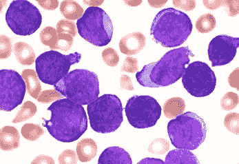
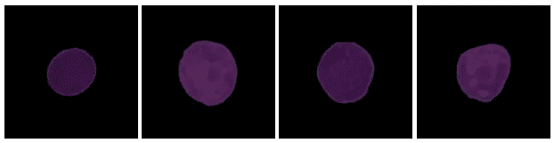
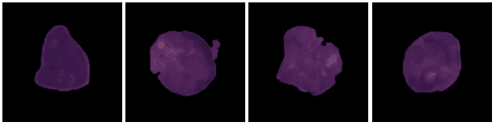
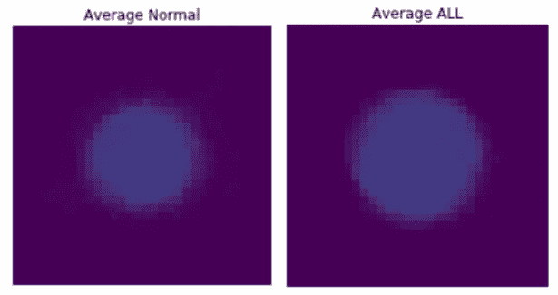
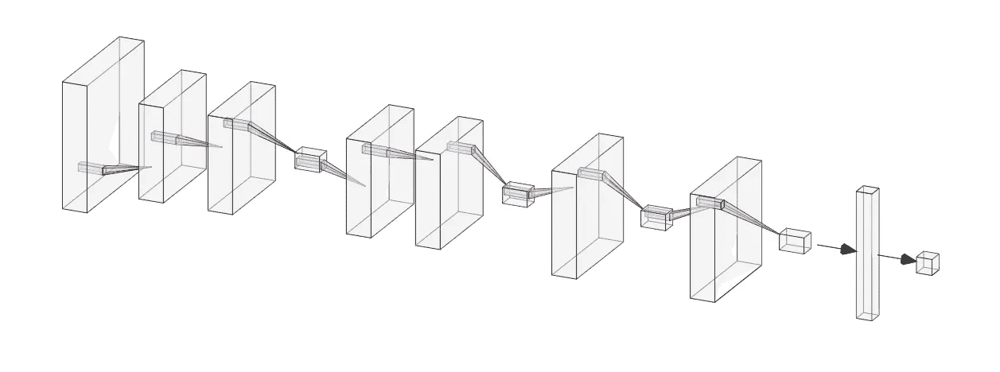
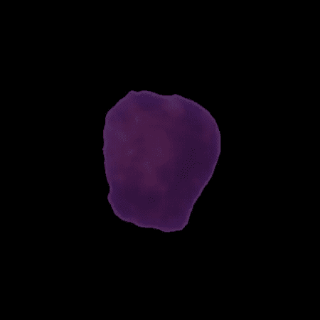
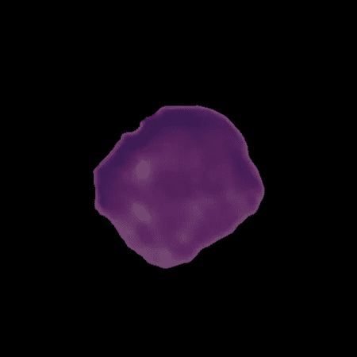

# 用 CNN 检测白血病

> 原文：<https://towardsdatascience.com/detecting-leukemia-with-a-cnn-af699b19ab99?source=collection_archive---------51----------------------->

## [机器学习](https://towardsdatascience.com/machine-learning/home)

## CNN 能可靠地识别癌细胞吗？

急性淋巴细胞白血病(ALL)是最常见的儿童癌症，也是 20 岁前癌症死亡的最常见原因。在 20 世纪 60 年代，所有人的存活率只有 10%，但诊断测试的进步和化疗的改进已经将发达国家的存活率提高到 90%。[ [1](https://www.nejm.org/doi/full/10.1056/NEJMra1400972)

[图片](https://unsplash.com/photos/wZHDa7cD7Ps)承蒙[波维切维斯基](https://unsplash.com/@pawel_czerwinski) — [昂斯佩什](https://unsplash.com/)

研究人员正在尝试各种个性化的方法，主要是利用表观遗传学筛查和全基因组关联研究(GWAS)来确定潜在的抑制目标，以进一步提高存活率。[ [2](https://www.ncbi.nlm.nih.gov/pmc/articles/PMC4567699/) ， [3](https://www.nature.com/articles/bcj201753) ]大约 80%的病例是儿童，但是，正如 Terwilliger 和 Abdul-Hay 所指出的，50 岁是所有发病率的另一个高峰，老年患者的长期缓解率低于儿童，约为 30-40%。[ [3](https://www.nature.com/articles/bcj201753)

ALL 被描述为骨髓中淋巴细胞的增殖和分化。重要的细胞过程，如淋巴细胞分化的调节、细胞周期调节、生长因子和肿瘤抑制受体信号传导以及表观遗传修饰，被扰乱。此外，约三分之一的病例存在染色体易位。这可以通过将癌基因重新定位到活跃转录区域而导致癌基因的过度表达，或者通过将肿瘤抑制基因重新定位到基因组的非转录区域而导致肿瘤抑制基因的低表达。[ [1](https://www.nejm.org/doi/full/10.1056/NEJMra1400972) ， [3](https://www.nature.com/articles/bcj201753) ] ALL 通常是多克隆的，这进一步使治疗复杂化，因为许多亚群将可能对任何一种治疗产生抗性。 [1](https://www.nejm.org/doi/full/10.1056/NEJMra1400972)

## 所有细胞形态

所有的都可以分成 3 个不同的亚型，这使得鉴别变得困难，即使对于有经验的从业者也是如此。L1 小而均一，圆形，无裂口，无明显的核仁或液泡。这些细胞最有可能成为正常的淋巴母细胞。L2 较大且不均匀，形状不规则，常开裂，并有明确的核仁和液泡。L3 具有 L1 的形状，但有明显的核仁和液泡。[ [4](https://www.ncbi.nlm.nih.gov/pmc/articles/PMC4335145/) ， [5](http://piurilabs.di.unimi.it/Papers/cimsa_2005.pdf)

照片由[詹姆斯·格雷利尔](https://commons.wikimedia.org/wiki/Category:Blood_films_of_acute_lymphoblastic_leukemia#/media/File:Acute_lymphoblastic_leukaemia_smear.jpg)在维基媒体上发布— [CC BY-SA 3.0](https://creativecommons.org/licenses/by-sa/3.0)

# 数据收集

该数据由 10，000 多张单细胞显微术急性淋巴母细胞白血病和正常淋巴母细胞的图像组成，分类失衡约为 2:1，全部正常。在没有使用所有图像的情况下，有了足够的图像和计算资源，我决定对正的所有类进行下采样，以管理类不平衡。因此，用 4000 幅图像以 57:43 的类别不平衡完成了训练。

图像是存储为的 450x450 RGB 图像。bmp 文件，一种光栅图形位图，将图像存储为 2D 矩阵。

数据可以在[这里](https://app.box.com/s/xeclwwd2xep9ntljtgyptmt4k5wone9n)找到。它来源于阿肯色医学科学大学(UAMS)对所有显微镜的研究。

# 探索性数据分析

这是我们组中的一些正常细胞。我们看到球形、未分裂的细胞，染色质均一，几乎没有液泡。

作者照片。

这是我们集合中一些 ALL 细胞。我们看到不规则形状的分裂细胞，有异质的染色质和多个核仁和液泡。

作者照片。

## 平均图像

查看每一类的平均图像，我们看到细胞内部有太多的变化，无法识别有意义的差异，但我们清楚地看到，所有细胞平均比正常细胞大得多。这并不奇怪，因为癌细胞的生长不受控制。

作者照片。

# 建模

我 *用 Paul Breton 的这个* [*post*](https://blog.betomorrow.com/keras-in-the-cloud-with-amazon-sagemaker-67cf11fb536) *和对应的 GitHub*[*repo*](https://github.com/Pravez/KerasSageMaker)*来指导 Sagemaker 使用 Keras。*

我在 AWS Sagemaker 中使用了 Keras 框架，在 Model_Scripts 目录中的一个单独的 Python 脚本中指定了神经网络架构和编译超参数。训练是在 time 大型笔记本实例中完成的，允许在易处理的训练时间内完成数百个时期。

我采用了基于 CRISP-DM 过程的迭代方法来建模。预测多数类的虚拟分类器具有 57%的准确度。我创建了一个普通的模型，有一个 Conv2D 层和一个致密层，准确率为 68%，已经比虚拟模型好了。然后，我通过添加额外的 Conv2D 层和由 MaxPooling 层分隔的层块，创建了更大、更复杂的体系结构。

最复杂的模型在 3 层的 3 个块中有 9 个卷积，但这不是最成功的模型，因为它似乎过度拟合了我们的训练数据。很明显，深而窄的块比宽的块获得了更高的指标。最好的模型是一个 2x2x1x1 结构，总共有 6 个回旋。在 MaxPooling 和 Dense 图层之后添加了 MaxPooling 图层和 Batch Normalization 图层，以防止过度拟合，但最终模型中没有这些图层。

我尝试使用召回率作为模型选择的辅助指标，但是这将模型推至总是选择所有图像，并将模型精度推至虚拟分类器。因此，我决定放弃回忆，专注于准确性。由于召回率如此之高且牺牲了准确性，该模型作为一种工具将毫无用处，因为无论如何，所有图像都必须由人类医生进行检查，这就否定了该模型的益处。

## 最终网络架构

作者照片。

## 模型编译超参数

我使用二进制交叉熵作为损失函数，因为这是一个二进制分类问题，RMSprop 和 Adam 用于优化。学习率设置为 0.001，衰减为 0.0001。

## 模型部署

使用 AWS 端点部署了性能最佳的模型，以便从测试集中加载尚未看到的图像，从而生成预测。部署位于我的 [GitHub](https://github.com/ArenCarpenter/Detecting_ALL_with_CNN) 中模型训练下的 003_Modeling_AWS 笔记本中。

## 错误分类的图像

在这里，我们看到一个模型误归类为正常的图像，而它实际上是所有。该模型显然是对缺乏内部空泡和分裂以及致密染色质作出反应，以归类为正常。不规则的形状应该表明这是所有。

作者照片。

在这里，我们看到一个图像，该模型误归类为所有，而它实际上是正常的。该模型可能会对不规则的细胞轮廓以及内部较亮的不均一区域做出反应，这些区域表明存在空泡或未包装的染色质，从而将其归类为 ALL。这绝对是一个具有挑战性的细胞正确排序。

作者照片。

# 见解和建议

该模型达到了 84%的准确率，使其成为在新病例中识别 ALL 的有用工具。由于血液样本显微镜检查已经是所有人的默认诊断测试，该模型可以很容易地用于验证人类医生或标记该模型没有信心进行进一步审查的病例。即使对人类来说，诊断 ALL 也是困难的，因此拥有一个健壮、准确的验证模型可以提高诊断的速度和准确性。由于 ALL 是一种急性白血病，因此早期确诊尤为重要，如果不治疗，它可能在几周或几个月内死亡。

# 后续步骤

## 模型改进

这种模式有几个潜在的改进途径。我尝试使用 Adam optimizer，它为 RMSprop 计算的梯度增加了动量和偏差校正的感觉，并使用批量标准化来提高模型性能，尽管它迄今为止确实有助于建模。我还可以实现早期停止和模型检查点，通过允许模型在达到过度拟合阈值时停止训练来对抗过度拟合。我尝试了几个层次的辍学，定在 25%，但进一步的调查可能会产生更好的结果。

## 产品改进

模型的可解释性通常与模型的准确性同等重要，甚至更重要，尤其是对于医学诊断需求而言。在现实世界的应用中，医生能够看到为什么模型已经达到某个决定是非常重要的。为此，建立一个图像分割模型来识别和标记重要的特征，如图像中空洞、非球形细胞或切割边缘的存在和数量，可以大大提高模型的可用性。此外，部署模型并允许新图像的实时集成将使模型保持最新。

# 连接

这是这个项目的 GitHub repo。你可以在 [LinkedIn](https://www.linkedin.com/in/aren-carpenter/) 和 [Twitter](https://twitter.com/ArenCarpenter) 上与我联系，或者访问我的[网站](http://arencarpenter.com/)获取更多文章。

# 来源

[1] S.P. Hunger 和 C.G. Mullighan，[儿童急性淋巴细胞白血病](https://www.nejm.org/doi/full/10.1056/NEJMra1400972)。2015.新英格兰医学杂志 373(16):1541–1552。

[2] C.H. Pui，J.J. Yang，S.P. Hunger 等，[儿童急性淋巴细胞白血病:通过合作取得进展](https://www.ncbi.nlm.nih.gov/pmc/articles/PMC4567699/)。2015.临床肿瘤学 33(27):2938–2948。

[3] T. Terwilliger 和 M. Abdul-Hay，[急性淋巴细胞白血病:综合综述和 2017 年更新](https://www.nature.com/articles/bcj201753)。2017.血癌杂志 7:1–12。

[4] M.M. Amin，S. Kermani，a .塔莱比和 M.G. Oghli，[使用 K-Means 聚类和支持向量机分类器识别显微图像中的急性淋巴细胞白血病细胞](https://www.ncbi.nlm.nih.gov/pmc/articles/PMC4335145/)。2015.医学信号与传感器杂志 5(1):49–58。

[5] F. Scotti，[外周血显微镜图像中急性白血病识别的自动形态学分析](http://piurilabs.di.unimi.it/Papers/cimsa_2005.pdf)。2005.测量系统计算智能会议。