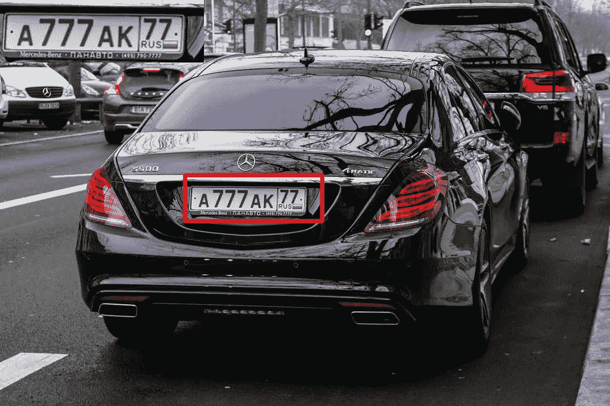
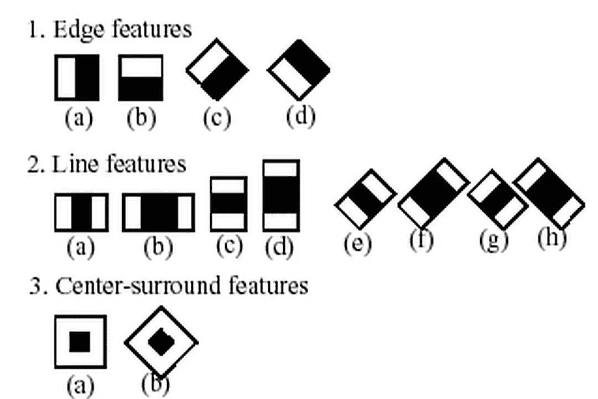
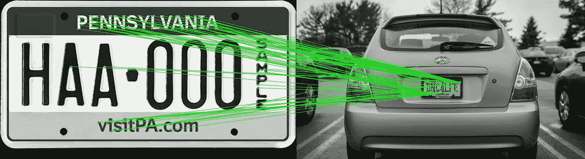
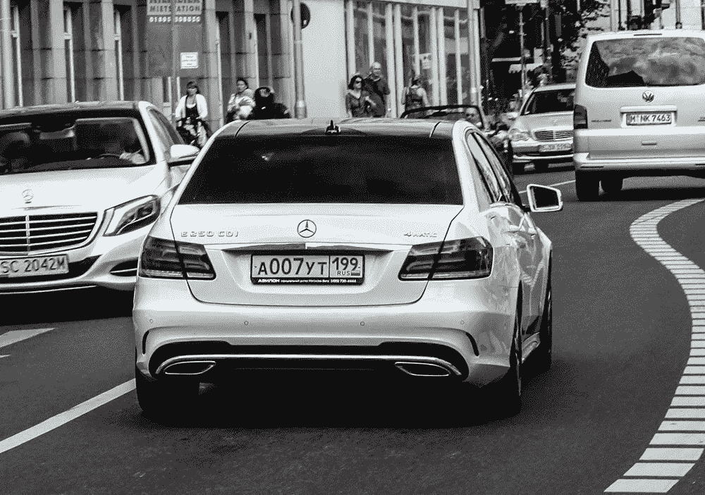
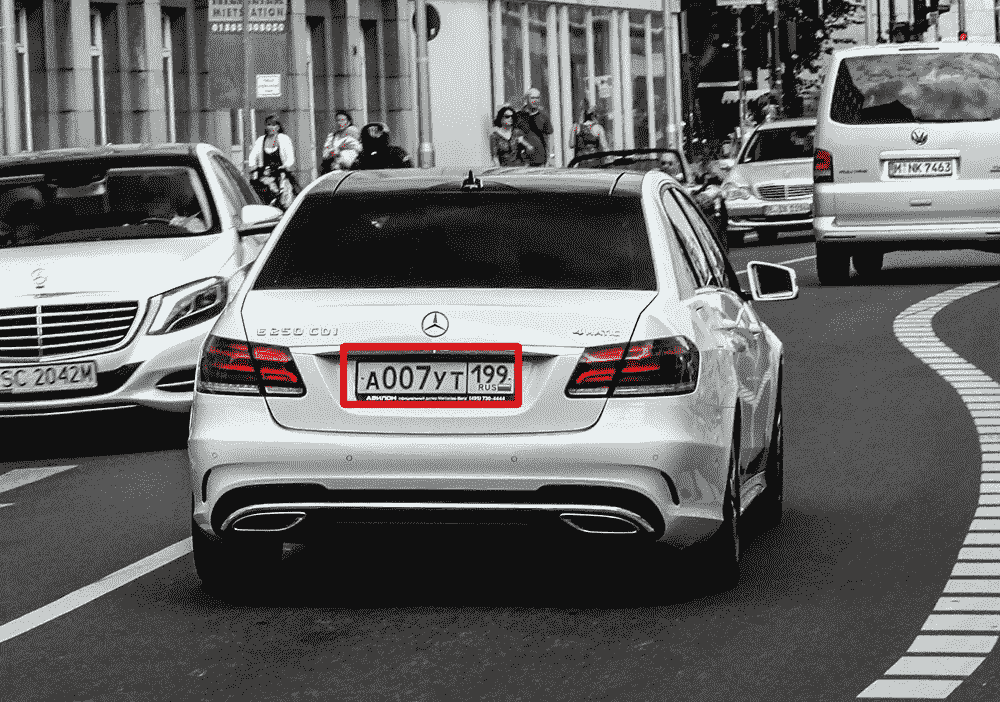
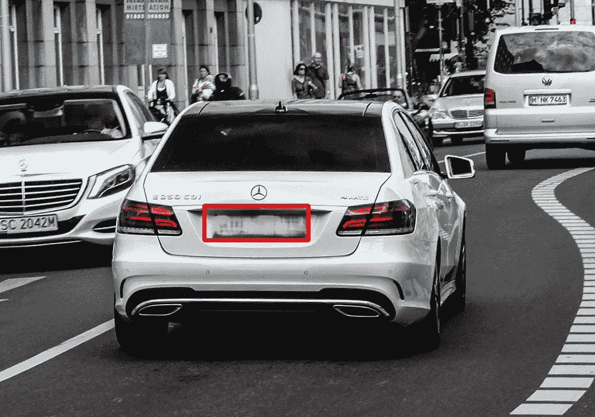

# 使用计算机视觉检测车牌

> 原文：<https://towardsdatascience.com/detecting-license-plates-using-computer-vision-87b2f6d3e56e?source=collection_archive---------37----------------------->

## 给定汽车的图像和视频，计算机视觉将被用来找出车牌的样子以及如何检测车牌。

来自 Unsplash 的 Damir Kopezhanov 的 Phtot

计算机视觉是一个不同于任何其他领域的数据科学领域。他们不是处理数据集，而是处理图像。与神经网络试图像人脑一样处理数据一样，计算机视觉试图以人类视觉的方式来查看、识别和处理图像。

在本文中，我们将检测计算机视觉最常用的案例之一，检测车牌。它们很明显，很容易辨认，这使得它们很容易被计算机拾取和识别。但是首先我们要让电脑知道是什么让车牌成为车牌。

# 级联分类

我们告诉电脑车牌是什么样子的方法是，我们给它几百个车牌样本，以及不是车牌图像的样本。然后在这些例子上训练一个分类器，如果输入图像包含牌照，它将输出 1，否则输出 0。

级联分类的不同分类器

级联分类被用作分类器，因为它由几个更简单的分类器(*阶段*)组成，这些分类器随后被应用于感兴趣的区域，直到在某个阶段候选被拒绝或者所有阶段都通过。这些简单的分类器检测车牌的边缘、车牌中的线条和周围的特征。如果在输入图像中不能检测到这些分类器中的一个或多个，它将拒绝该图像并声明没有牌照。但是如果可以找到所有这些特征，它会将图像分类为其中有牌照。

## 特征匹配

为了让您了解级联分类的作用，我将向您展示一个特征匹配的示例。特征匹配从两幅图像中找到相应的特征。

下面是一张汽车牌照和车尾的照片。特征匹配要做的是找到与汽车后部图像中的特征相对应的车牌特征。

特征匹配的输出

上面的图像是匹配两幅图像的特征的输出。这些线条显示了两幅图像中的共同特征。正如我们所见，几乎所有的线路都连接到汽车后面的牌照上。这基本上就是级联分类器的工作方式，以及它如何检测图像中的车牌。

# 结果呢

在我们对图像应用级联分类之后，如果检测到牌照，它将返回在图像中发现它的位置的 x，y 位置以及牌照的宽度和高度。现在我们已经有了图像中显示车牌位置的点，我们可以在图像上绘制一个围绕它的矩形。使用 OpenCV(一个计算机视觉库)，它有一个功能，我们可以在给定的图像上绘制矩形，它所需要的只是应该绘制的点。

因此，从级联分类器输出的 x，y，宽度和高度，我们可以改变这个图像…

原象

# o…

检测到牌照，现在它周围有一个红色框

但是有了这些点，我们可以做更多的应用。我们能做的实际上是模糊车牌。这在现实世界中经常使用，因为显示汽车的电视网络在没有他们的批准下不能合法地显示某人的车牌。所以他们模糊了车牌，这样就没人能看到了。类似于绘制矩形，OpenCv 有一个函数，给定一组点，它将在该位置模糊图像。

所以我们的原始图像变得模糊，现在看起来像这样…

牌照模糊后，就再也看不清楚了

# 检测视频中的车牌

为了理解我们如何做到这一点，我们必须了解什么真正构成了一个视频。视频本质上只是连续放置的帧，以感知某物在移动。你可以把它想象成一本动画书，当书被翻动时，图画看起来会移动，即使只是图像一次改变一点点。构成视频的这些帧只是被轻微改变的图像。因此，就像我们对上面的图像所做的那样，我们要做的就是对给定视频中的每一帧应用相同的分类器。如果该框架有一个牌照，一个红色的矩形将被放置在它的周围。

将要使用的视频是在高速公路上行驶的汽车。为了展示计算机视觉的更多应用，我们不仅要检测下面视频中的汽车牌照，还要放大牌照并显示在每个牌照被检测到的地方。

**注意**:不要指望分类器会提取视频中的每一个车牌。你会发现，当一辆车离得太远时，它就不会认出那个车牌，因为车牌的特征开始变得不太清楚，无法通过分类器。

## 视频中的计算机视觉

# 结论

计算机视觉不同于其他任何视觉。这是一个不断发展的领域，数据科学家和工程师正在寻找新的方法来创建有影响力的可视化。上面的例子是为了给那些不知道什么是计算机视觉的人一个介绍，并让他们了解计算机视觉的发展方向。希望这能激励你更多地了解这个迷人的领域，就像它激励我做这个项目一样。

如果你感兴趣，这个项目的代码可以在我的 GitHub 上找到:[https://GitHub . com/zita 9999/License-Plates-and-Computer-Vision/tree/master](https://github.com/zita9999/License-Plates-and-Computer-Vision/tree/master)

## 参考

[1] K .穆拉塔列夫，白色轿车，【https://unsplash.com/photos/3Gg-98LaCxE 

[2] G .比亚尔基，黑色奔驰，【https://unsplash.com/s/photos/pennsilvania-licenseplates 

[3]4k 都市生活，https://beautifulwashington.com/汽车驾驶放松视频，

[4] OpenCV，级联分类，[https://docs . OpenCV . org/2.4/modules/obj detect/doc/Cascade _ class ification . html](https://docs.opencv.org/2.4/modules/objdetect/doc/cascade_classification.html)