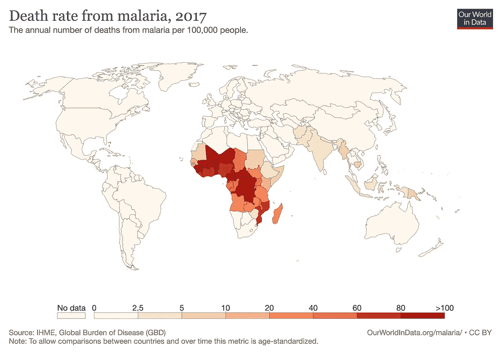
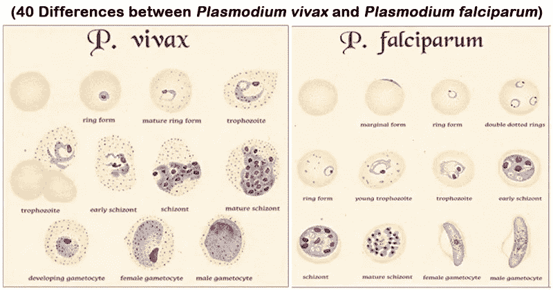
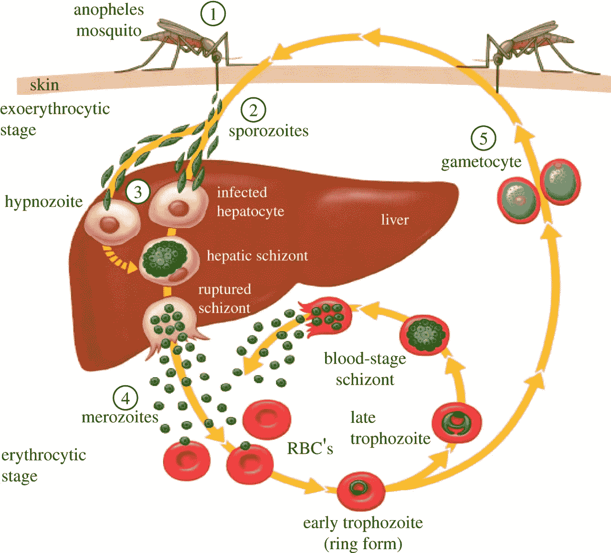
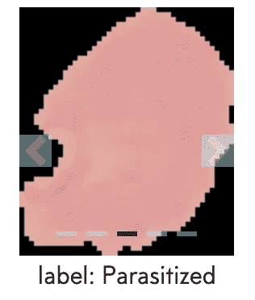
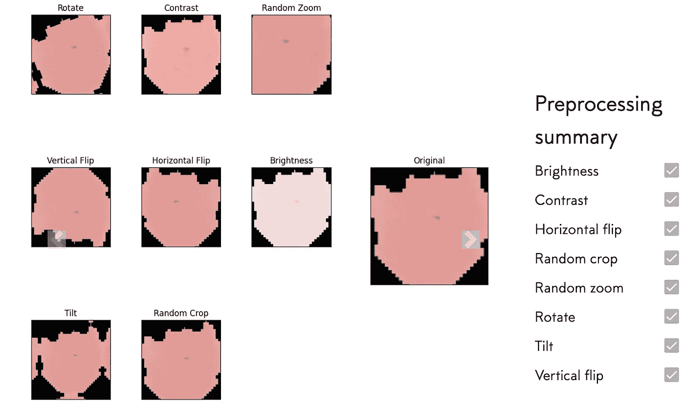
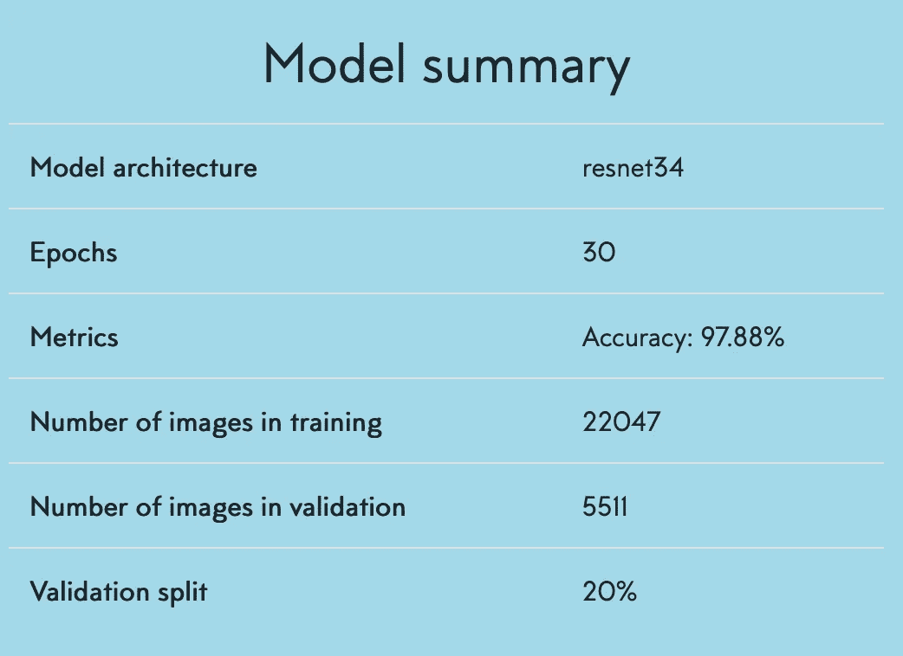

# 利用迁移学习检测疟疾

> 原文：<https://towardsdatascience.com/detecting-malaria-using-transfer-learning-fab5e1810a88?source=collection_archive---------42----------------------->

## 使用机器学习和显微血液图像来检测疟疾

描述如何开发诊断疟疾的 ML 程序的视频。

> 弗朗切斯科·帕尔马和艾萨克·罗萨写的

在本文中，我们将首先描述疟疾是如何工作的，如何诊断这种疾病，以及它固有的问题。然后我们将讨论用于借助血液样本检测疟疾的 ML 模型及其性能结果。

> 疟疾是人类已知的最致命的寄生虫相关疾病之一。自从人类出现在地球上，它就一直存在，而且肯定会长期存在。

2018 年，有 2.28 亿人感染，405，000 人死亡，这是一个重大的健康问题。

非洲是所有疟疾病例的 94%(2018)，但它也在中国南方流行，几乎存在于所有大陆。由于疟疾主要袭击非洲国家，遏制和有效抗击这种寄生虫变得更加困难。事实上，疟疾肆虐的发展中国家并不总是拥有适当的资源来降低其对疟疾的脆弱性。

据估计，受疟疾影响的国家每年损失 120 亿美元，这是由于许多公民在疟疾大爆发期间无法工作、高昂的医疗费用以及对旅游业的不利影响。加上大约 27 亿美元的人道主义援助，毫无疑问，疟疾对受影响国家的经济产生了巨大的负面影响。

# **疟疾，是什么？**

疟疾实际上只是这种疾病的名称。它是由一种单细胞原生动物寄生虫引起的，这种寄生虫的属名是疟原虫。

疟原虫包括各种各样的寄生虫，大约有 200 种，但只有少数几种能污染人类。因为它们是寄生虫，所以它们利用几种宿主来进食和繁殖。

5 种疟原虫寄生虫能成功寄生人类并对人类有害，*迟缓疟原虫、间日疟原虫、卵形疟原虫、*三日疟原虫、*诺氏疟原虫* (P 代表疟原虫)。虽然引用的所有 5 个物种都可能导致疟疾，但通常致命并导致严重疟疾的是*弱毒疟原虫*。

引起疟原虫的两种不同类型的疟疾，来源:[https://microbenotes . com/differences-between-plasmodium-vivax-and-plasmodium-falciparum/](https://microbenotes.com/differences-between-plasmodium-vivax-and-plasmodium-falciparum/)

与其他类型的寄生虫相比，这些寄生虫的生命周期相当简单，因为它们只有两个宿主，即蚊子和人类。

这种寄生虫的生命始于蚊子的肠道，经过一个繁殖阶段后，它们转移到昆虫的唾液腺。当蚊子以人类为食吸血时，疟原虫进入了人类的血流中。感染后，它们首先进入肝脏并经历增殖期。一旦成熟并达到更高的数量，它们就会离开肝脏，进入红细胞。

此时，寄生虫将不断繁殖，直到身体能够有效地对抗感染。一些疟原虫将分化成有性卵样细胞，并在人类血液中自由流动，直到蚊子再次进食并吃掉它们。一旦再次进入蚊子的内脏，雄性卵样细胞将使雌性受精，循环可以再次开始。

疟原虫的生命周期，来源:[https://sk.pinterest.com/pin/706220785288117948/](https://sk.pinterest.com/pin/706220785288117948/)

疟疾发烧通常发生在疟原虫大量冲出红细胞时，并引发免疫反应，如高烧、呕吐、恶心和头痛。由于许多红细胞被溶解，在某些情况下还会导致贫血，这种贫血会导致多种器官衰竭和代谢性酸中毒。

有效对抗寄生虫的最好方法在于预防胜于一切。这包括晚上睡觉时使用驱蚊剂和驱虫蚊帐。一些高风险地区也用杀虫剂熏制，以避免有太多的蚊子。

一旦感染，有几种药物存在，但这种药物必须非常迅速地给药，以避免对个体的严重伤害甚至死亡。

这种寄生虫的一个大问题，也可能是它仍然存在的主要原因之一，是它能够迅速进化并对它遇到的药物产生耐药性。随着蚊子对杀虫剂产生抗药性，抗击疟疾变得更加困难。此外，发展中国家的不卫生条件，尤其是撒哈拉以南非洲，是理想的蚊子滋生地，尤其是在雨季，昆虫有许多水坑产卵。

> 避免疟疾严重并发症的最有效方法是快速诊断。这样既能避免死亡，又能遏制寄生虫，以免感染更多人。

检测疟疾感染最常见的方法是进行显微镜血液分析。这不需要一套复杂的技能，但是，基本的医学知识是必不可少的。问题是，在发展中国家，适当的医疗材料和人员并不总是容易获得，使得这种诊断慢于预期，如果不是不存在的话。

另一个主要问题是，当资源可用时，有高估感染人数的趋势。许多研究表明，存在严重的过度诊断问题(某些农村卫生中心高达 98%的错误诊断(安哥拉，2012)。这导致疟疾治疗被大量滥用，因此可能导致疟疾药物短缺。此外，这种药物滥用降低了患者在真正生病时对药物的反应，并增强了疟原虫的抵抗力。最后，这加剧了进行血液微观分析所需的适当知识的缺乏。

尽管为抗击疟疾做出了许多努力，但资源的滥用仍然是一个主要问题

# A .我如何帮助治疗疟疾？

我们已经看到，滥用资源是一个主要问题，但如何更好地投资以帮助防治疟疾？

A.我可能是答案，而且在很多方面。首先，使用人工智能和人工授精程序快速检测这种疾病可以通过快速诊断挽救无数生命。鉴于之前看到的数据，它不仅比人快，而且可能更准确。这种准确性将导致更好的药物管理，从而节省大量资金。这些节省下来的钱可以重新注入，更好地利用。

> 给红细胞拍照非常容易，只需要一台显微镜和一个适配环就可以给红细胞拍照。一旦拍摄了照片，就有可能简单地通过一个 ML 程序来运行它，这个程序被训练来识别被感染的细胞。

鉴于检测感染的方法相当简单，我们认为可以尝试使用 [Giotto](https://www.giotto.ai/) 开发一个疟疾检测程序，不涉及任何代码。重点是输入未分类的红细胞图像，让程序以令人满意的准确度进行分类。

Giotto 是一个机器学习平台，可以开发图像分类的 ML 程序，而不必编码。要更详细、一步一步地描述乔托，你可以阅读我们[以前的博客文章](/step-by-step-flower-classification-without-coding-c652a7f73251)。

无代码平台使用起来很简单，这可能会真正使人工智能民主化。不仅任何人都可以使用它，而且部署 docker 的可能性意味着只有一台计算机，没有 wifi，你可以用最简单的方式使用人工智能。这是一个关键点，因为许多高风险疟疾区非常偏远，因此没有像样的互联网连接。如果这行得通，农村社区就不必去最近的医疗中心了(记住，有时这很远)。重点不是取代人类的专业知识，但当没有其他选择时，这可能是一个答案。

正确训练程序的关键是拥有适当的数据。这意味着你需要有充分标记的每类文件夹来分析，以及每个文件夹中更多或更少的相同数量的图像(当然，当谈到图像分类时)。我们使用了由 27'558 幅红细胞图像组成的数据集,其中一半是寄生的，一半是正常的。

拥有正确标记的图像是首要的

为了处理这个数据集，我们首先必须把它上传到[乔托。](https://www.giotto.ai/)然后，我们必须选择适用于我们图像的数据增强技术。在这种情况下，应用了所有的方法，因为它们都不会改变图像的完整性。通过进行这种增强过程，我们通过向模型提供比初始集更多的数据来提高模型的性能。

所有的数据扩充过程都应用于我们的数据。

一旦完成，我们必须选择模型的所有特性，比如 resNet 数和历元数。我们的模型在 resNet 34 和 30 个历元的情况下表现最佳。

这个项目的训练时间相当长，因为数据集非常庞大；完成培训大约需要 3 个小时。

> 通过 20%的验证分割，我们的模型实现了 97.88%的准确率，没有一行代码。

这个精度是令人满意的，因为为程序选择的设置不是太高(resNet 34 和 30 历元)。已经用 10 个时期获得了非常相似的结果(约 96%)。

# **结论**

尽管医学取得了令人印象深刻的创新，但这种寄生虫仍然在世界许多地方蓬勃发展，每年夺走数十万人的生命。找到对抗疟疾的新方法至关重要。这可以帮助数百万人，也可以促进高风险地区的经济发展。

97.88%的准确率是令人满意的，尤其是这是在仅仅训练了 3 个小时，完全没有使用代码的情况下实现的。在资源匮乏的地方，这比那些很少或根本没有受过适当分析培训的人更容易获得更好的结果。这样一个简单的应用程序可以直接部署在农村地区，允许人们在没有其他选择的情况下进行自我治疗。

我们模型的总结。

你可以自己试试这个程序:[https://cloud.giotto.ai/ic/malaria](https://cloud.giotto.ai/ic/malaria)密码:malaria123

## 来源和链接

 [## 疟疾细胞图像数据集

### 用于检测疟疾的细胞图像

www.kaggle.com](https://www.kaggle.com/iarunava/cell-images-for-detecting-malaria)  [## 乔托

### 停止编码。启动人工智能

www.giotto.ai](https://www.giotto.ai/)  [## 安哥拉的疟疾过度诊断和抗疟药的过度消费:后果…

### 疟疾病例的过度诊断高达 85%。*大量滥用抗疟药物。*缺乏数据可靠性…

www.sciencedirect.com](https://www.sciencedirect.com/science/article/abs/pii/S0001706X16311251?via%3Dihub)  [## 疟疾|语义学者

### 德国联邦各部的工人们强烈要求国家赔偿…

www.semanticscholar.org](https://www.semanticscholar.org/paper/Malaria-Greenwood-Bojang/2245f5204a16f1e4765ed239b54432c9c4a96764)  [## 一个二级医疗保健中心对儿童疟疾的过度诊断和过度治疗…

### 疟疾的过度诊断和过度治疗是疟疾流行国家儿童的一个主要问题。这个…

journals.sagepub.com](https://journals.sagepub.com/doi/10.1177/0049475515622861)  [## 瓦基索临床诊断的成年女性中实验室确诊的疟疾发病率低

### 谢尔盖·叶戈罗夫，1 罗纳德·m·加利旺戈，1 阿洛伊修斯·塞马甘达，2，3 摩西·穆万加，4 艾琳·韦松加，4 乔治·米罗，5…

www.ncbi.nlm.nih.gov](https://www.ncbi.nlm.nih.gov/pmc/articles/PMC5109652/)  [## 疟疾概况介绍

### 疟疾是由疟原虫寄生虫引起的。寄生虫通过被感染女性的叮咬传播给人类…

www.who.int](https://www.who.int/news-room/fact-sheets/detail/malaria)  [## 疟疾

### 恶性疟原虫][诺氏疟原虫][三日疟原虫][卵形疟原虫][间日疟原虫]血液…

www.cdc.gov](https://www.cdc.gov/dpdx/malaria/index.html)