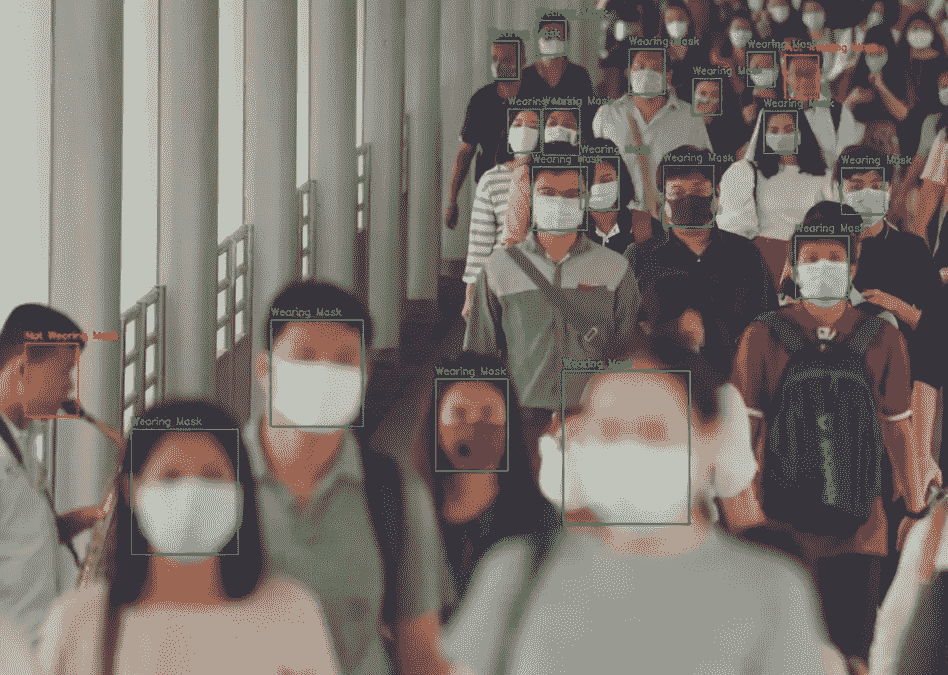
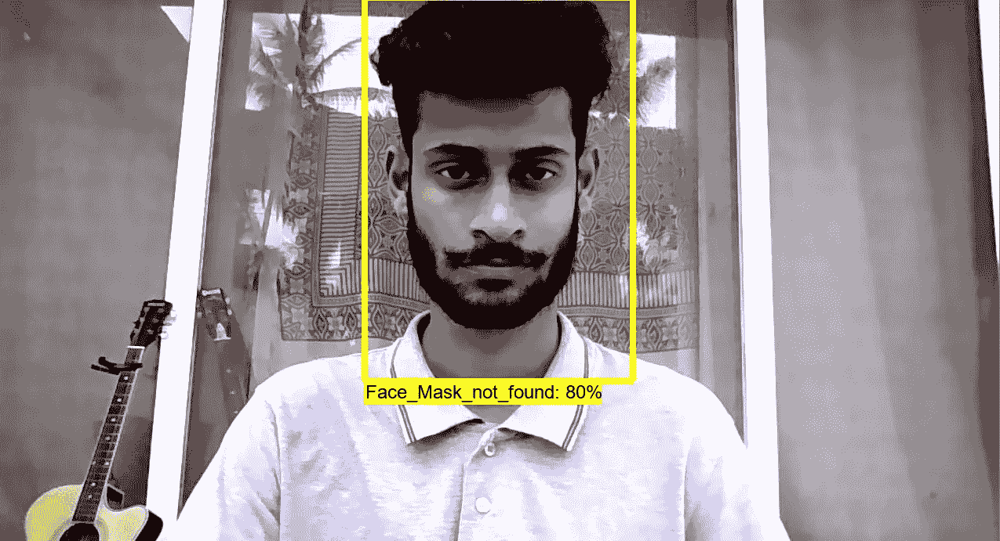
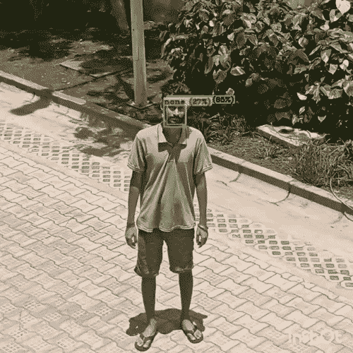
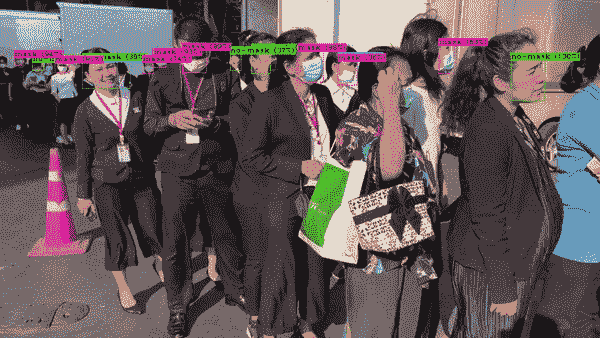
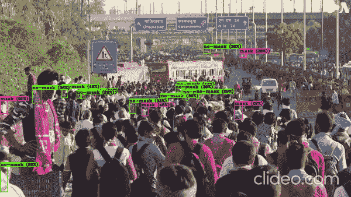

# 利用人工智能和计算机视觉实时检测密集人群中的面具

> 原文：<https://towardsdatascience.com/detecting-masks-in-dense-crowds-in-real-time-with-ai-and-computer-vision-9e819eb9047e?source=collection_archive---------49----------------------->

迈向美好未来的一小步

这是从半夜醒来开始的，在极度困难的过程中，由于新冠肺炎·疫情病毒，封锁期很长。

一个周六的早上 5 点，我起床去买东西，看到一群人在附近的办公区踢足球。然后我想，为什么我们不能从远处发现谁在不戴面具的情况下走来走去。

然后我突然想到，等等……你可以！我可以试试。(有时候你忘了，你自己拥有什么技能。我们大多数人都会这样！😂)我带着兴奋的心情回家，设置好自己的深度学习环境。

我使用我的版本 [DarkNet](https://pjreddie.com/darknet/) 运行 YOLOv3 模型进行场景检测，并快速旋转标准场景检测模型。然后，我开始从不同的公共数据集和存储库中，管理一个由屏蔽和未屏蔽图像组成的数据集。

[DarkNet](https://pjreddie.com/darknet/) 的美妙之处在于，一旦你构建了它所有的 C 二进制文件和绑定，重新训练它最外层的迁移学习就相当容易了。因此，我得到了模型的权重，然后我必须对数据集进行注释，并开始在我的 GTX 1060 上用 [CUDA](https://developer.nvidia.com/cuda-downloads) 进行大约 10 个小时的训练。

我达到一个点，直到损失为 0.02，然后导出生成的权重。

对我的网络摄像头拍摄的照片进行第一次测试

这是第一个结果。

我在几种光照条件下运行它，看到结果在低光照环境下波动，所以我添加了一些[直方图均衡](https://docs.opencv.org/master/d5/daf/tutorial_py_histogram_equalization.html)技术。

直方图均衡化为现有图像增加并平衡了一定程度的对比度。结果相当好。

下一步是通过视频来运行它。现在，在当前的封锁情况下，我无法使用 IP 摄像头，所以我让我的室友指向并拍摄我(原谅我的短裤😅，这里太热了！)从窗口到街上。

第二个测试来自我手机拍摄的视频

一旦精度适合我，我意识到我需要更多的性能提升。所以我尝试了不同的方法。我需要优化分配给运行该作业的线程的内存量，以及每个节拍处理的帧的缓存。

因此，我没有使用 Python 脚本来运行这项工作，而是必须整体构建 DarkNet 的其他模块，并使用 [CMake](https://cmake.org/) 来构建我的操作系统的 C 绑定，并将 DarkNet 添加到我的系统路径变量中。现在，我可以只使用 CLI 运行推理了😉

然后我开始在密集人群的视频上进行测试

使用该模型在视频上运行推理

在印度的人群中取得了惊人的效果

这是 YouTube 上运行项目演示的最终视频。

我达到了大约 40FPS，这对于视频处理来说足够好了。我真的很想运行网络摄像头，但遗憾的是，被隔离并没有给我在我的公寓里太多的空间来大规模测试一些东西。

这意味着我们现在可以在 IP 摄像机、无人机、公共场所的闭路电视和系统网络摄像头上运行这一功能。

理想的情况是将它部署在数据中心 GPU 上，如 Nvidia 2020 主题演讲中宣布的新 [Nvidia V100](https://www.nvidia.com/en-in/data-center/v100/) ，以获得惊人的性能和大规模的结果。

如果我们只是发现问题，我们可以建立很多东西，我觉得大多数问题只是每天出现。我们只需要在这方面有所创新。

#住宿之家#住宿安全