# 用一对一检测黑色素瘤

> 原文：<https://towardsdatascience.com/detecting-melanoma-with-one-vs-all-f84bc6dd0479?source=collection_archive---------46----------------------->

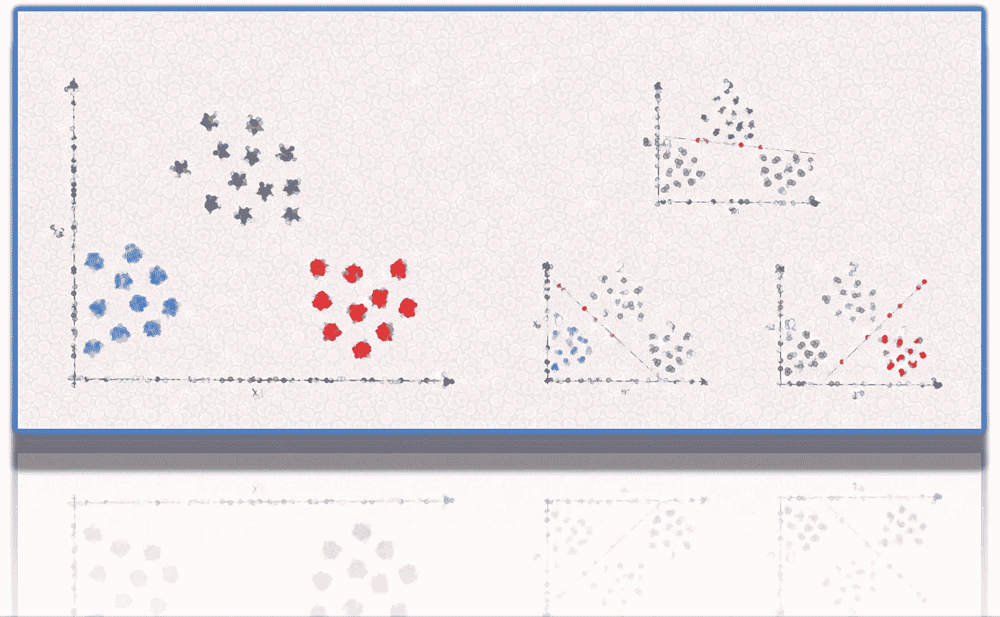

## [生物医学数据的机器学习](https://towardsdatascience.com/tagged/ml-for-bio-data)

## 使用皮肤镜图像创建自动检测黑色素瘤的应用程序

L 在需要对离散值输出进行分类和预测的应用中，多重分类的逻辑回归是一种很有前途的方法。在之前题为[“癌症中恶性肿瘤预测的逻辑回归”的文章中，](/logistic-regression-for-malignancy-prediction-in-cancer-27b1a1960184)我介绍了这个惊人的监督学习模型背后的一些基本概念，暗示了它在预测乳腺癌恶性肿瘤结果中的可能用途。

在这篇文章中，我希望展示*一对一*算法，它代表了逻辑回归的一个特殊实现，扩展到多个结果。我们将看到如何在 Python 3.7 中创建一个基于该算法的病理学信息学应用程序，以自动使用皮肤镜图像来检测黑色素瘤。不幸的是，由于数据集的限制，这种方法对于实例和特征之间的比例不均衡的任务来说并不是最佳的。**重要的是:本练习的唯一目的是揭示将机器学习应用于皮肤病变图像的基本概念，并且仅用于实验目的，而非临床使用。**

那么，为什么要使用*一对一*算法对皮肤癌图像进行分类呢？

这是我个人的观点，利用生物医学数据，尝试用最直接的方法来解决一个复杂的问题。如果这种方法导致“过于简单”，找到它的限制可以让我们在扩展它时有更多的控制。同时，一个简单的程序可以让我们发现它在现实中是多么强大。然后，永远不要低估逻辑回归:它可能会让你吃惊！

我第一次看到*一对一*应用是在 Coursera 的机器学习课程上，由 Andrew NG 教授[2]。课程的第三周“主要”是对 MNIST 数据集进行分类的练习，该数据集由 5000 张手写数字图像组成。Andrew NG 的课程基于 Octave/Matlab 代码，因此当我决定用 Python 实现我的逻辑回归函数时，我将它应用于 MNIST 数据集进行测试。测试的准确率为 89.5%，matthews 相关系数为 0.88(将训练集拆分为 4167 个图像，将测试集拆分为 833 个图像)。MNIST 图像具有 20X20 像素的分辨率，这意味着输入 400 个特征。手写数字是灰度的，每个数字位于单色背景的中心。MNIST 数据集的性质使逻辑回归方法更加简单，并解释了它在正确分类数字方面的成功。

所以我想，如果我把我的*一对一*代码应用到一个由更复杂的灰度图像组成的数据集，去掉所有多余的特征并保留每幅图像的最小特征集，会发生什么。在这个实验中，我使用了 [PH2](https://www.fc.up.pt/addi/ph2%20database.html) ，这是一个 8 位 RGB 彩色皮肤镜图片的数据集，是在佩德罗·西斯潘诺医院(葡萄牙马托西尼奥斯)的皮肤科获得的。我得到的结果是惊人的，尽管考虑到它的性能有点令人失望，这就是我将在这篇文章中向你展示的，以及 ML 理论的一些基础知识(最低限度)。

## 1.Pedro Hispano 医院)数据集

黑色素瘤(皮肤癌)是世界上最致命的癌症之一。美国癌症协会将其列为 2019 年美国 7000 多人死亡的原因。它来自黑素细胞，黑素细胞是含有色素的皮肤细胞。紫外线照射被普遍认为是最重要的致病因素。通过皮肤镜分析区分黑素瘤病变和良性皮肤癌是一项基本任务。然而，这种分类问题在医学上的复杂性至今仍是争论的焦点。

2019 年，来自南非德班夸祖鲁-纳塔尔大学数学、统计和计算机科学学院的 Adekanmi A. Adeguin 和 Serestina Viriri 利用 2017 年国际生物医学成像研讨会(ISBI)和 PH2 的数据集，开发了一种基于深度学习的黑色素瘤检测系统[3]。所有 PH2 图像的原始分辨率大约为 768x560 像素。200 个图像数据集包括三种黑色素细胞病变:80 个普通痣(结果 0)、80 个非典型痣(结果 1)和 40 个黑色素瘤(结果 2)。

## 2.上传和显示数据集

我已经将 PH2 图像转换为 128X128 像素的分辨率。您可以下载这个数据集作为压缩的存档文件“ [PH2_128X128.pickle.zip](https://github.com/lucazammataro/TDS/blob/master/PH2_128X128.pickle.zip) ”。此外，我还制作了同一个数据集的另一个版本，通过双变量分析过滤掉所有冗余的特征，(见第 4 段)，你可以在这里找到: [PH2_128X128_BIVA.pickle](https://github.com/lucazammataro/TDS/blob/master/PH2_128X128_BIVA.pickle) 。

在进行本文提出的实验之前，请按照超链接下载这两个文件。然后打开你的 Jupyter 笔记本，输入*代码 1* ，导入所有必要的 Python 库:

代码 1:导入库。

*代码 2* 将实现 *UploadDataset* 函数来上传 PH2 档案。

代码 2:上传一个 PH2 数据集

使用 *UploadDataset* 指定您从[此链接](https://github.com/lucazammataro/TDS/blob/master/PH2_128X128.pickle.zip)下载的档案文件名:

```
df, X, y = UploadDataset('PH2_128X128.pickle')
```

该函数将返回一个 Pandas Dataframe， *X* 和 *y* 向量，并将产生以下输出:

```
Dataset uploaded.
archive: PH2_128X128.pickle
num of examples: 200
num of features (X): 16384
y is the output vector
num of classes: 3
```

在上传数据集的过程中， *UploadDataset* 提供了一些关于存档结构的有用信息，如数据集中示例的数量(200)、X 中特征的数量、以及类/标签的数量(在本例中为 3)。浏览*表 1* 中总结的数据帧，了解其结构:

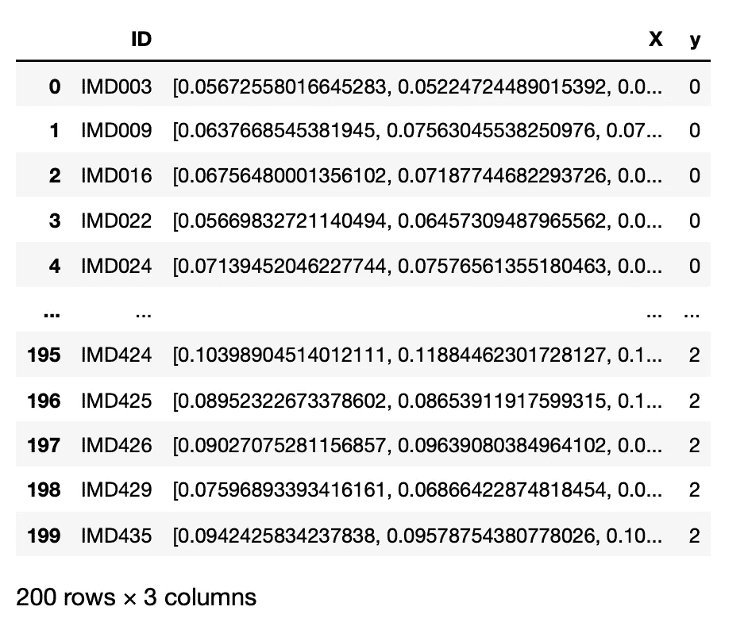

表 PH2 数据框架

dataframe 表示 PH2 数据集的基本组成部分(此处未提供关于图像的具体信息，例如组织学)。关于完整数据库的详细描述，请点击 PH2 网站的[链接。它由 ID 列、要素列和输出列组成。feature 列包含 16384 个特征的 numpy 数组，对应于 128X128 像素的乘积。](https://www.fc.up.pt/addi/ph2%20database.html)

如果我们想要可视化存储在档案中的 200 幅图像中的一幅，则*代码 3* 的*显示*功能代表一种可能的解决方案:

代码 3:显示 PH2 图像

我们所要做的就是以这种方式调用*显示*函数:

```
Display(df, 1)
```

其中 *df* 是上传的数据帧，第二个参数，在这种情况下，1 是图像的编号。*显示器*的输出如图 1 所示:

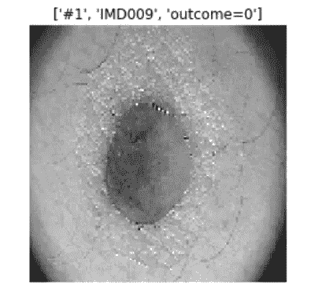

图 1:来自 PH2 数据集的图片之一。(图片来自[https://www.fc.up.pt/addi/ph2%20database.html](https://www.fc.up.pt/addi/ph2%20database.html))

该函数显示图像及其相关结果，在本例中为 0(80 种常见痣中的一种)。与原始图像相比，该图像的分辨率大大降低。我尝试了几种分辨率(256X256，512X512，以及更低的像 20X20，我的结论是 128X128 是一个很好的折中。*显示*功能在 128X128 像素灰度图像中重塑 16384 个特征的 numpy 阵列。无论如何，相对于样本数量，该数据集的特征数量仍然太高，这将导致稀疏性问题。正如我们将在接下来的段落中看到的，我将展示如何解决这个问题。

## 3.正则化 Logistic 回归及其对决策边界的影响

我们已经展示了 PH2 数据集，并描述了访问其图像的代码；现在，我们需要引入一些关于逻辑回归正则化的新概念，我们将在这种情况下使用。显然，处理正则化的论点听起来可能跑题了，因为 PH2 数据集受“太多特征”的影响，而不是“很少特征”的问题，这是正则化的典型情况。然而，我认为对于逻辑回归极限的详尽解释，一个完整的关于这个主题的讨论是值得考虑的。

为什么要正则化逻辑回归？

在机器学习中，我们将数据分为训练集和测试集。训练集用于调整代表我们模型的*假设 h* 的参数；测试集用于评估我们的模型在未知的新例子上的表现，概括新数据。术语“一般化”指的是我们的假设适用于新出现的病例的程度。如果我们要创建一个可以对三种皮肤癌进行分类并预测新的癌症样本的应用程序，这就是我们想要的。当您准备数据集时，首先要做的是浏览一下关于要素的观测值数量，避免欠拟合/过拟合问题。

例如，一个典型的欠拟合问题是当您的假设 *h* 与数据趋势的映射很差时(可能是由于缺少特征)。您可以添加额外的特性( *x1 和 x2* )来添加额外的高阶多项式项。图 2 解释了这一概念，以应用于两类皮肤癌的逻辑回归的可能实现为例。图 2A 示意了装配不足的问题:

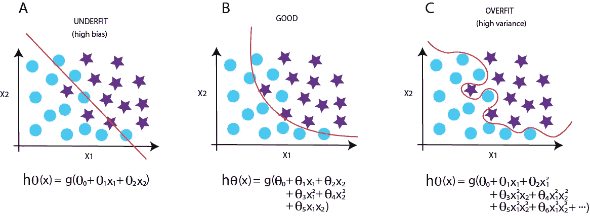

图 2:欠拟合和过拟合问题。青色圆盘代表普通痣；紫色星星对应黑色素瘤。

增加额外的特征会导致更好的假设，如图 2B 所示。但是当添加了这些额外特性之后，我们不得不面对相反的问题时，问题就出现了:过度拟合。文献中描述的解决欠拟合问题的方法之一是正则化成本函数的所有θ。

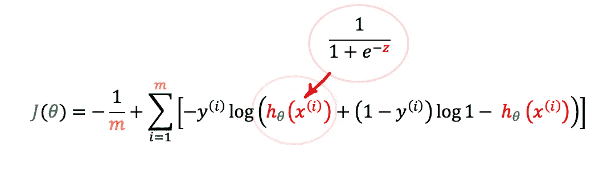

等式 1:逻辑回归成本函数。

逻辑回归的成本函数(如等式 1 中所述)的特征在于假设 *h* 具有 sigmoid 函数，用于非凸性(如本文[所述)。](/logistic-regression-for-malignancy-prediction-in-cancer-27b1a1960184)

正则化工作的机制包括惩罚我们必须添加到成本函数中的所有 *θ* ，以向特征添加额外的高阶多项式项，使它们变小。首先，我们希望消除膨胀成本函数的最后多项式项的影响，将它们减少到零。

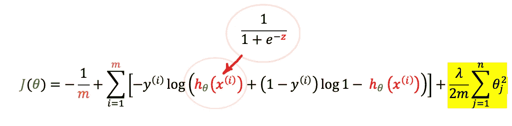

等式 2:正则化的逻辑回归成本函数。

一种合适的方法是修改成本函数以收缩所有θ参数，因为我们不知道收缩哪个参数是必要的。在末尾添加一项(等式 2 中以黄色突出显示的新正则项)将具有收缩所有θ的效果。重要的是:不要惩罚θ0。 *lambda* 的作用是收缩θ，所以如果 *lambda* 极大，假设 *h* 就会欠拟合。

为了阐明整个正则化过程，让我们报告一个小测试。想象一下，从黑素瘤数据集的一系列图像中仅绘制两个特征(x1 和 x2)。这两个特征聚集在蓝色和橙色的两个同心环中。每个环代表属于普通痣(蓝色类= 0)的一组值，而橙色类= 1 的值对应于黑色素瘤。我们希望应用逻辑回归来预测新值将落在何处(例如，新的未知值将落在蓝色点组中还是橙色点组中)。此外，我们希望计算一个决策边界，将蓝色组与橙色组分开。(您可以通过此链接下载[测试输入文件)。](https://github.com/lucazammataro/TDS/blob/master/two_labels_scattered_points.csv)

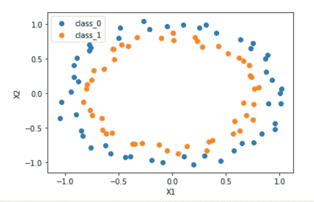

图 3:测试。

看一下图 3:很明显，用一条直线将两类点分开是不可能的:这是一个典型的欠拟合问题(图 2A)。我们需要添加额外的特征来为我们的假设添加额外的高阶多项式项。这里提出的代码示例将通过一个 *mapFeature* 函数处理添加额外特征的测试，将两个特征向量(x1 和 x2)转换为一个 28 维的二次特征向量，比如 x1 + x2 + x1 + x2 + x1x2 + x1x2 …等等，其中输入 x1 和 x2 必须是相同的大小。那么，假设就会有这个形状:hθ(x)= g(θ0+θ1x1+θ2x 2+θ3x 1+θ4x 2+θ5x1x 2…)。训练新特征的多维向量将导致逻辑回归形成更复杂的决策边界(图 4)。

这个测试的 Python 代码被分成三个部分(*代码 4* 、*代码 5* 和*代码 6* )。下载完[测试数据](https://github.com/lucazammataro/TDS/blob/master/two_labels_scattered_points.csv)后，按顺序复制并粘贴代码块。*代码 4* 包装了三个基本函数: *Sigmoid* 函数、 *Cost* 函数和 *Gradient* 。关于这三个功能的详细描述，我推荐读者阅读我的一篇文章，这篇文章致力于使用[逻辑回归预测乳腺癌的恶性程度。](/logistic-regression-for-malignancy-prediction-in-cancer-27b1a1960184)

代码 4:正则化的逻辑回归函数

*代码 5* 绘制决策边界图的特征。该代码改编自由 [Srikar](https://medium.com/@srikarplus) 在其[帖子](https://medium.com/analytics-vidhya/python-implementation-of-andrew-ngs-machine-learning-course-part-2-2-dceff1a12a12)中提出的 Python 源代码:

代码 5:映射特征

最后，*代码 6* 执行正则化测试并绘制决策边界(由 [Srikar](https://medium.com/@srikarplus) 重新调整):

代码 6:测试正则化和决策边界。

将*代码 4* 、 *5* 和 *6* 合并到同一个 Jupyter 笔记本中，运行整个练习:结果输出如下所示:

```
Running Regularized Logistic Regression...

Optimization terminated successfully.
         Current function value: 0.394594
         Iterations: 35
         Function evaluations: 118
         Gradient evaluations: 118

Accuracy %: 84.0
matthews_corrcoef: 0.6807791256663034
```

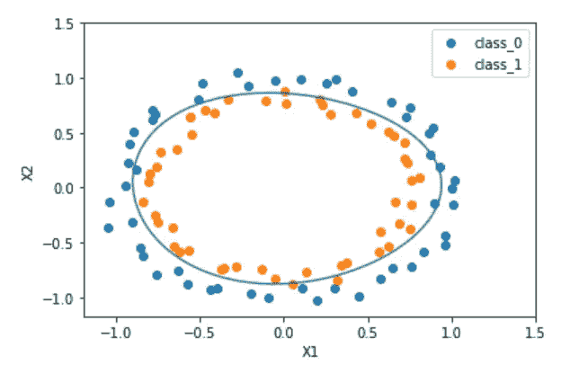

图 4:决策边界

准确率为 84%，马修斯相关系数为 0.68。这些结果随着不同的*λ*值而显著变化。

对于*λ*= 0.1，代码 6 还会生成一个数据集图，其中一条线代表决策边界

这里，我使用了 [*fmin_cg scipy 优化*函数](https://docs.scipy.org/doc/scipy/reference/generated/scipy.optimize.fmin_cg.html#r675e71ddb23e-1)，它实现了用于线性方程组数值解的*共轭梯度算法*。共轭梯度法是作为迭代算法实现的。在这种情况下，使用优化算法来解决太大而不能由直接实现处理的稀疏系统是必要的。

## 4.维数灾难和双变量分析。

所提出形式的 PH2 数据集由 200 个观察值和 16384 个灰度像素特征组成。这个数字高得令人难以置信，因为它代表了一幅图像的总像素数。试图使用一系列图像的“所有像素”来训练逻辑回归是适得其反的。此外，特征的数量远远高于观测值，我们可能会遇到一个被称为“[维数灾难](https://en.wikipedia.org/wiki/Curse_of_dimensionality)”的问题。尽管如此，对于一个预测模型来说，200 次观察是非常少的。

“维数灾难”是理查德·e·贝尔曼(Richard E. Bellman)创造的一个表达式(也称为“p>>n 问题”，其中 *p* 代表预测值， *n* 代表观察值)。这个问题出现在分析高维空间中的数据时，空间的体积增长如此之快，以至于可用的数据变得稀疏。这种“稀疏”的后果之一是*过拟合*问题(图 2C)。当我们有太多的特征时，它就会发生。已学习的假设 *h* 可能很好地符合训练集，但是不能概括新的例子(例如，新的黑色素瘤或普通痣的分类)。

在因维数灾难而过度拟合的情况下，正则化没有帮助。相反，将数据减少到几个一致的特征可以解决问题。为此，我在这里使用了我上一篇文章中的[双变量分析，来过滤掉多余的特征。](/logistic-regression-for-malignancy-prediction-in-cancer-27b1a1960184)

双变量分析是一种基于相关性的方法，它分析成对特征之间的关系。一般的假设是，高度相关的特征提供了我们想要消除的冗余信息，以避免预测偏差。以下代码改编自 [AN6U5](https://datascience.stackexchange.com/a/10461) ，用于相关矩阵的显示部分。上传 PH2 数据集后，从[Chris Albon【4】](https://chrisalbon.com/machine_learning/feature_selection/drop_highly_correlated_features/)重新改编的一段代码删除了所有相关性高于 0.9 的特征，保留了那些具有较低均值的特征。然后程序调用*feature _ correlation _ matrix*函数对矩阵进行可视化。该过程可以删除 16354 个冗余特征，仅保留 30 个。

代码 7:双变量分析。

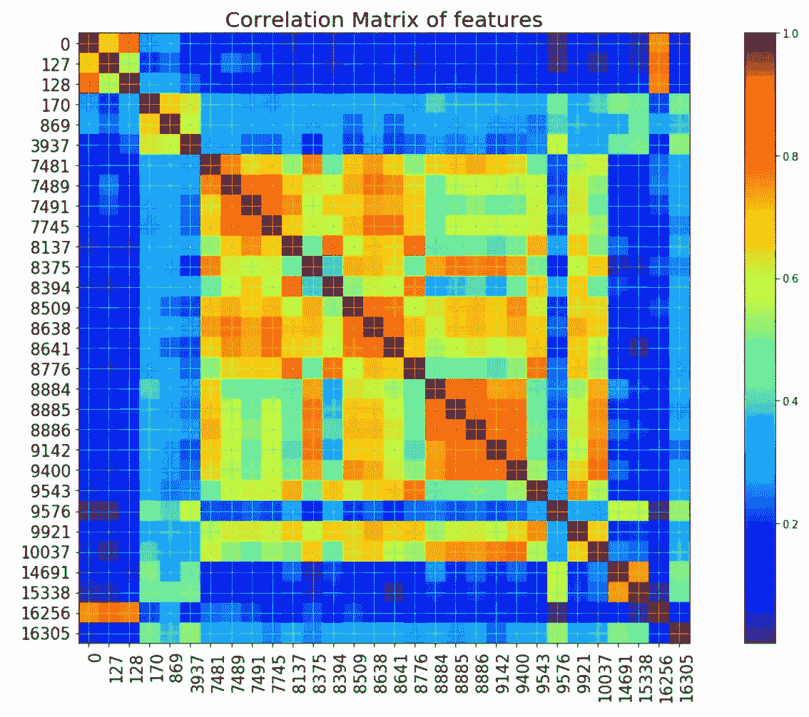

图 5:删除冗余特征后的特征相关矩阵。

去除冗余特征后得到的相关矩阵如图 5 所示。该矩阵显示了 30 个相关性小于 0.9 的特征。每个要素都标有一个数字，该数字对应于原始 16384 要素数据集的索引。

## 5.一对多的实施

在关于癌症恶性预测的[逻辑回归的文章](/logistic-regression-for-malignancy-prediction-in-cancer-27b1a1960184)中，我使用逻辑回归作为二元分类器，它能够将阳性类别与阴性类别(良性与恶性)分开。这里，我们需要扩展逻辑回归来解决多重分类问题。

PH2 数据集有三个结果:普通痣(结果 0)、非典型痣(结果 1)和黑色素瘤(结果 2)。*一对一*算法是逻辑回归的一种特殊实现，由三个不同的二元分类器组成。例如，如果我们从具有三个标签 0、1 和 2 的两个特征 *x1* 和 *x2* 收集值，在第一步中，算法将三个标签中的两个分配给负类，也就是说，标签 0 和 1 被分配给负类，而剩余的标签 2 被分配给正类。该算法前进到第二步，将负类分配给另一对标签(0 和 2)，将正类分配给标签 1；在第三步，我们将把标签 1 和 2 标记为负，把标签 0 标记为正。所以我们有三个分类器，每个都被训练来识别三个标签中的一个。对于每个标签 *i，**一对一*训练逻辑回归分类器 hθ(x)，以预测 y=1 的概率。每次计算对应于一系列θ值，这些值必须乘以向量*x。*最后，对于每个标签 *i，*该算法将挑选将 hθ(x) *最大化的唯一标签 *i* 。*

*图 6* 将解释一对多过程:

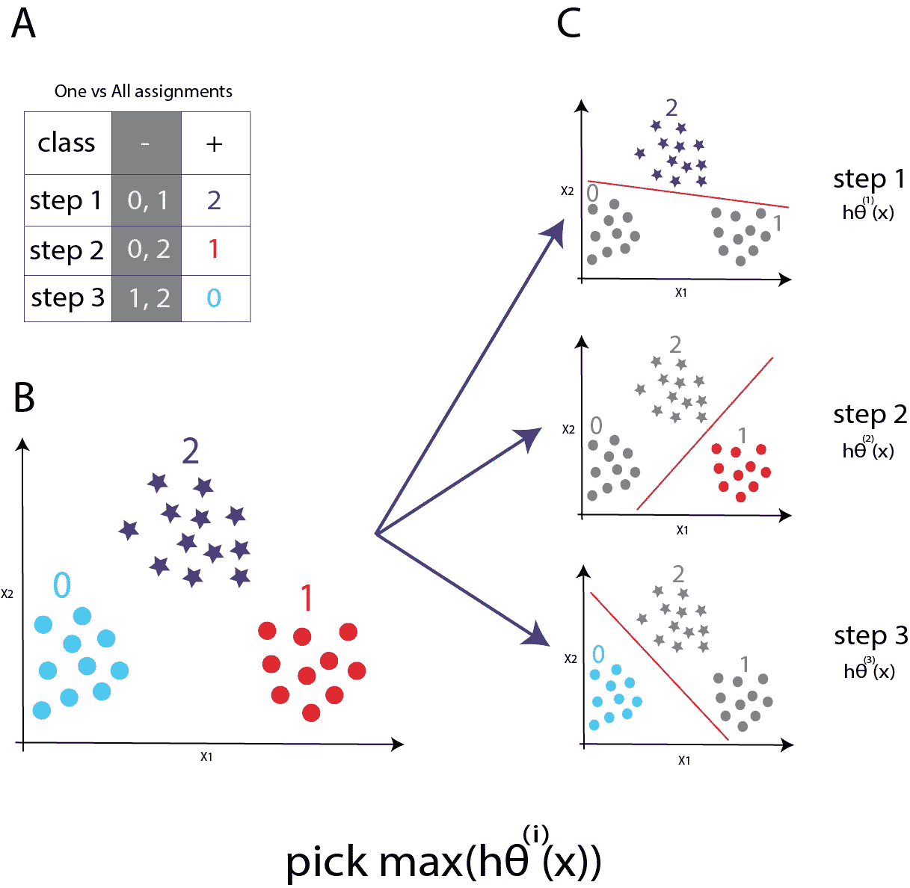

图 6。OneVsAll 算法。**图 6B** :青色圆盘代表普通痣(结果 0)，红色圆盘代表非典型痣(结果 1)，紫色星星对应黑色素瘤(结果 2)。考虑来自两个特征 x1 和 x2 的值:该算法包括在三个步骤中实现的三个不同的二元分类器。第一步将标签 0 和 1 的值分配给负类，将标签 2 的值分配给正类。第二步将负类分配给另一对标签(0 和 2)，将正类分配给标签 1。在第三步中，我们将把标签 1 和 2 标记为负，把标签 0 标记为正(**图 6A** 和 **6C** )。最后，对于每个标签 i *，*，该算法将挑选将 hθ(x) *最大化的唯一标签 i 。*

黑色素瘤检测的完整*一对一*算法包含在*代码 8 中。在 Jupyter 笔记本单元格中复制、粘贴并运行代码。“main”部分表示代码的驱动部分，它由正则化逻辑回归成本函数和梯度函数组成。此外，代码还提供了两个功能，一对多的实现和测试结果的预测。*

```
'''
MAIN
'''# Upload the dataset
df, X, y = UploadDataset('PH2_128X128_BIVA.pickle')# Split the dataset
X_train, y_train, X_test, y_test, indices, num_test = splitDataset(X, y)# Run oneVsAll
lmbda = np.float64(1e-4)
all_thetas = oneVsAll(X_train, y_train, lmbda)# Calc Accuracy
df_test_bench, pred_train, pred_test = CalcAccuracy(all_thetas, X_train, y_train, X_test, y_test, num_test)# Print the test results
df_test_bench
```

上传 PH2 数据集(双变量 30 特征版本)后， *splitDataset()* 函数将随机生成训练和测试数据集。然后 *oneVsAll()* 函数将在训练集上运行逻辑回归，但这里的一个关键函数是 *CalcAccuracy()。*该函数将计算训练和测试集的准确性。它将调用另一个名为 *predictOneVsAll()* 的函数，该函数将选取将 hθ(x)最大化的唯一标签 *i* ，使用以下 numpy 操作:

*预测= np.argmax(sigmoid( np.dot(X，all_thetas。t))，axis=1)*

最后， *CalcAccuracy()* ，将产生一个包含测试结果的 pandas dataframe，以及准确性和 matthews 相关分数。

代码 8:一对一对所有人

*代码 8* 产生的输出如下:

```
'''
-UPLOADING DATASET-
archive: PH2_128X128_BIVA.pickle
num of examples: 200
num of features (X): 30
y is the output vector
num of classes: 3

-SPLITTING DATASET-
random seed: 22549
# Training set:  160
# Test set:  40

-ONE VS ALL-
Optimization terminated successfully.
         Current function value: 0.495204
         Iterations: 67
         Function evaluations: 251
         Gradient evaluations: 251
Optimization terminated successfully.
         Current function value: 0.526326
         Iterations: 62
         Function evaluations: 241
         Gradient evaluations: 241
Optimization terminated successfully.
         Current function value: 0.184121
         Iterations: 215
         Function evaluations: 884
         Gradient evaluations: 884

-TRAINING ACCURACY-
Accuracy: 74.375000
matthews_corrcoef: 0.5928012927684577

-TEST ACCURACY-
Accuracy: 60.000000
matthews_corrcoef: 0.396701196586351
```

训练集由 160 幅图像组成，而测试集包含 40 幅图像。每次运行代码时，两个数据集的分割都是随机执行的。在这种情况下，训练准确率为 74%，matthews 相关分数为 0.59。对于测试的准确性，我们得到了 60 %, Matthews 相关分数为 0.40。也可以通过 *df_test bench* dataframe 获取测试结果:

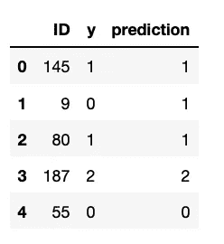

包含测试结果的数据帧

*代码 8* 还包含一个名为*showthematheta()，*的有用函数，它使用数据集的矢量 *X* 和 *y* ，所有标签的找到的θ矢量和在训练/测试期间计算的预测矢量*，产生应用于特定图像的所有最大θ的输出。*例如，键入:

```
showTheMaxTheta(X, y, all_thetas , 145, pred_train)
```

该函数将显示图像 145 的最大θ值:

```
Real outcome: 1
Max Theta: 0.9213422724776613
Predicted category: 1

          0
0  0.232627
1  0.921342
2  0.000085
```

这个图像的真实结果是 1，一个非典型痣，预测值是 1。这是因为标签 1 的最大θget 为 0.92，而标签 0 和标签 2 的最大θget 分别为 0.23 和 0.000085。

## 6.结论

一对一算法并不代表解决医学图像分类问题的最佳解决方案。这是一种基于多结果逻辑回归的算法，由于它被认为是一种广义线性模型，因此有许多限制。这意味着它的结果总是取决于输入和参数[【4】](https://sebastianraschka.com/faq/docs/logistic_regression_linear.html#why-is-logistic-regression-considered-a-linear-model)的总和，而不是乘积/商。为 PH2 数据集计算的性能显示了低准确度和低的 matthews 相关分数(使用 matthews_corrcoef: 0.59 的训练准确度:74.4，使用 matthews_corrcoef: 0.40 的测试准确度:60.0)。这是一个典型的欠拟合问题，可能是由于数据集中缺少信息。尽管如此，该算法能够捕捉普通痣和恶性病变之间的差异，这是一个很好的观点，因为这意味着数据集下面有一种信息，一对一可以检索。我个人认为这个算法的性能可以通过增加图片的数量来提高。毫无疑问，200 次观察对于任何一种预测模型来说都是非常少的。特征的数量远远高于观测值，这导致了一个被称为“T2 维度诅咒”的问题。最小化特征是有用的，尤其是当我们处理图像的时候。双变量分析将 16384 个特征减少到 30 个。这可能意味着表征整个数据集的特征比我们想象的要少。“一对所有”限制的进化结果是*神经网络*的应用，它可以克服逻辑回归带来的许多问题，这将是我下一篇文章的论点。

## 参考资料:

1.  [Andrew NG，机器学习| Coursera](https://www.coursera.org/learn/machine-learning)
2.  A.A. Adegun 和 S. Viriri，“基于深度学习的自动黑色素瘤检测系统”，载于 IEEE Access，第 8 卷，第 7160-7172 页，2020 年，doi:10.1109/Access。20207.686386866106
3.  克里斯·阿尔邦(Chris Albon)，用 Python 编写的机器学习食谱，O'Really，ISBN-13:978–1491989388。
4.  [机器学习常见问题解答:为什么逻辑回归被认为是线性模型？作者塞巴斯蒂安·拉什卡。](https://sebastianraschka.com/faq/docs/logistic_regression_linear.html#why-is-logistic-regression-considered-a-linear-model)