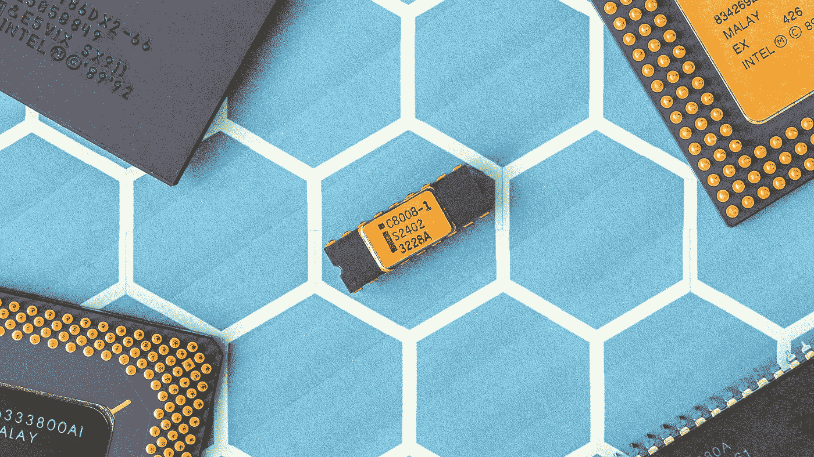
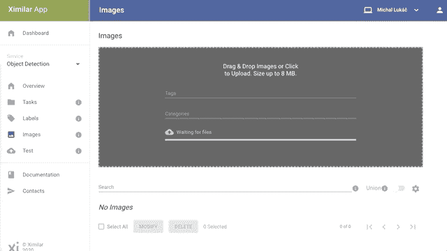
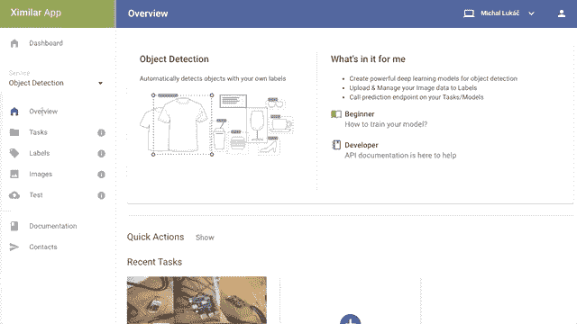

# 用 CNN 检测微控制器

> 原文：<https://towardsdatascience.com/detecting-microcontrollers-with-cnn-ced688a8a144?source=collection_archive---------51----------------------->

## 点击时的对象检测

## 根据 Kaggle 竞赛数据检测微控制器的简单教程

照片由来自[佩克斯](https://www.pexels.com/photo/black-and-yellow-electronic-chip-785418/?utm_content=attributionCopyText&utm_medium=referral&utm_source=pexels)的[乔纳斯·斯维德拉斯](https://www.pexels.com/@jonas-svidras?utm_content=attributionCopyText&utm_medium=referral&utm_source=pexels)拍摄

像 TensorFlow 或 PyTorch 这样的 tandart 库没有提供任何简单的方法来训练你的自定义对象检测模型。很多时候你需要安装一个大的库作为 Detectron 2 或者 Tensorflow 物体检测 API。不要误解我的意思，这些库功能强大，但通常需要大量的检查、调优和处理数据。这就是为什么我想向您展示一种更简单有效的方法，通过调用 Rest API 和一点点击来训练您的检测器。

这种方法有一些优势:你不需要成为机器学习专家，你的数据都在一个地方。

# 资料组

对于本教程，我从 Kaggle 选择一个小数据集来检测由[Gilbert Tanner](https://gilberttanner.com/)[[@ Medium](https://towardsdatascience.com/@gilberttanner)]开发的[微控制器](https://www.kaggle.com/tannergi/microcontroller-detection)。它包含大约 250 幅图像，包含四种类型的对象:

*   Arduino Nano
*   Heltec ESP32 Lora
*   ESP8266
*   树莓 Pi 3

我们将通过 API 上传 [Ximilar](https://www.ximilar.com/) 平台上的数据(带边框的图片)。边界框包含 4 个坐标，并定义微控制器的确切位置(矩形)。我们也可以通过 app.ximilar.com 拖放图像，并通过绘制手动创建边界框。

**创建任务和标签**

在我们上传数据之前，我们需要通过应用程序定义我们的神经网络模型。我们将创建任务和 4 个与该任务相关联的标签。

创建带有一些标签的新任务。作者图片

**选项 A:通过脚本上传数据**

如果您不想手动创建所有的边界框，您可以通过运行以下脚本来上传它们。只需更改标签 id 并从下载的数据集文件夹中运行该脚本。

**选项 B:用绘图框**拖动&放置

用前端绘制边界框。作者图片

# 火车

上传所有数据后，我们进入微控制器任务页面，点击 ***训练*** 按钮。培训可能需要 30 分钟到几个小时。想出去走走也可以注销应用:)。这真的需要一些时间，因为用于对象检测的神经网络是在我们的服务器上自动训练的。

如果你想了解所有这些背后的神经网络架构，你可以查看 Libor 的[帖子。](/new-approaches-to-object-detection-f5cbc925e00e)

# 检查结果

训练已经完成，现在我们可以在一些图像上测试它。同样，我们有两个使用 API 或 app 来获取结果的选项。

检查训练好的模型。作者图片

在我们的任务定义中，我们可以看到我们的模型用 IoU 0.75 实现了 mAP 0.85。这是一个不坏的结果！什么是地图度量？解释在另一篇文章中，所以你可以在这里阅读更多。简单地说，数字越高，结果越好。如果我们转到训练模型的细节，我们可以查看每个标签的地图。我们可以看到数据集很平衡(每个标签有图像，每个标签有对象)。

您可以使用 Python SDK 客户端(这是一个 REST/JSON 包装器库)连接到 API，并获得经过训练的检测模型的结果:

# 训练模型的技巧

这只是我们的第一个训练模型，所以结果不是最好的。我们可以通过上传更多的图片和重新训练模型来改善它。如果是这样，应用程序将训练一个新模型，而不删除旧模型。如果你想对你的型号进行比较或 A/B 测试，这是很好的选择。

你可以玩其他的选择。您可以编辑高级选项来控制图像分辨率和图像增强技术。**图像增强**是一种改变(稍微或更积极地)输入图像以创建更大数据集的技术，因此您的模型将在更多图像上更好地泛化。

您还可以上传图像并**将它们标记为测试**，这样您的模型将始终在这些标记的图像上评估结果。这些图像在训练过程中是看不到的，因此您的测试数据集独立于您的训练数据集，并且该数据集的地图编号更加可靠。

# 最后的话

目标检测或目标识别只是机器视觉领域中许多常见问题之一。它可以用于电子商务中检测时尚服装，用于医疗保健中检测肿瘤组织，用于汽车油漆划痕的保险检测，用于检测免费停车位，等等。