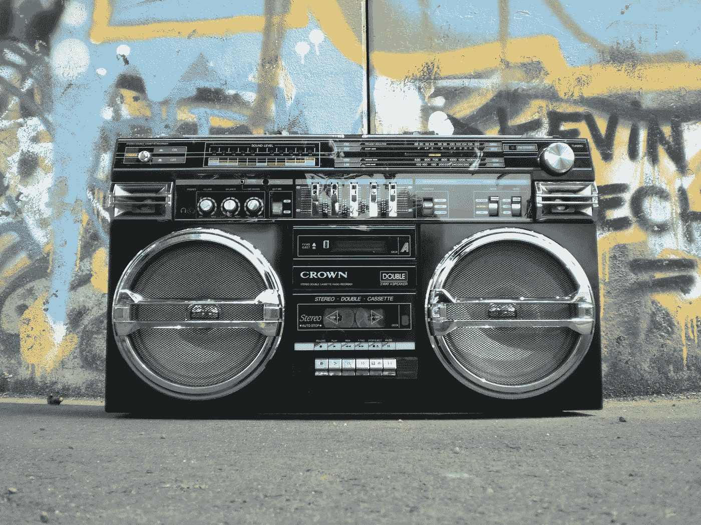
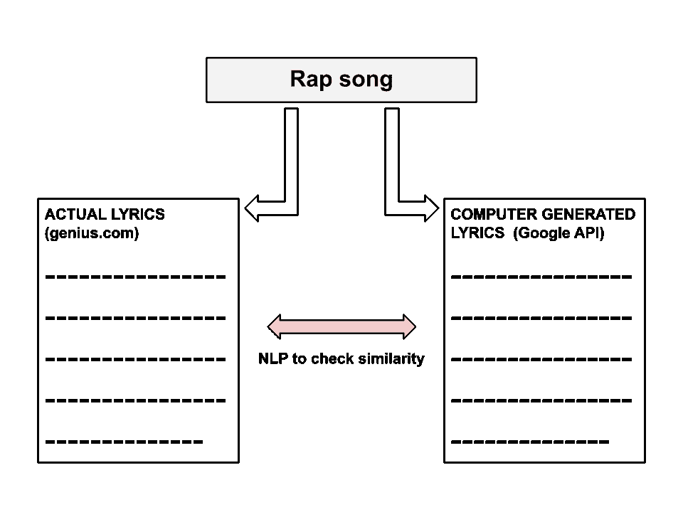
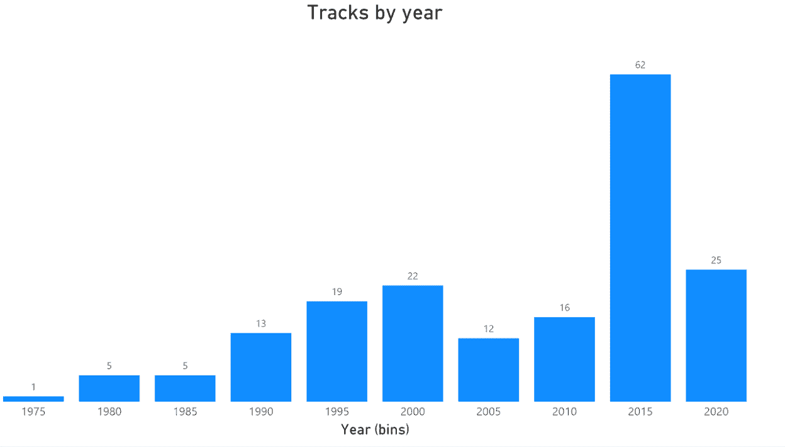
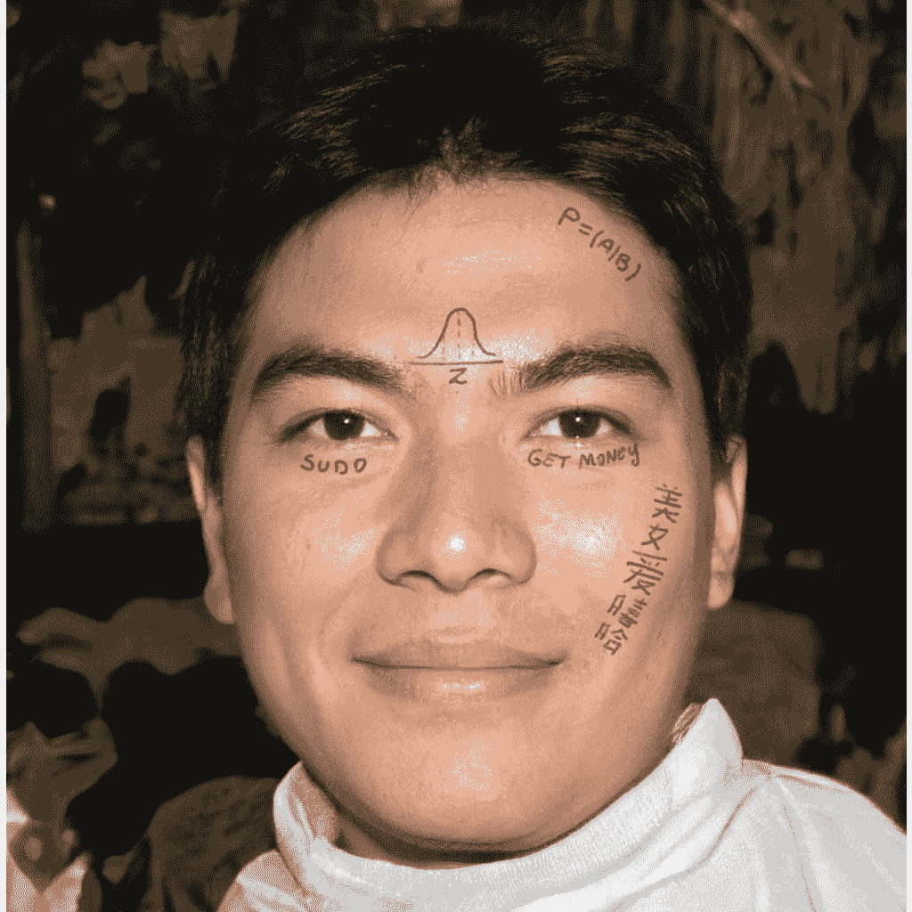
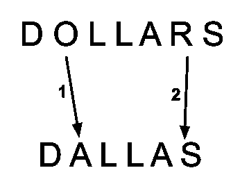
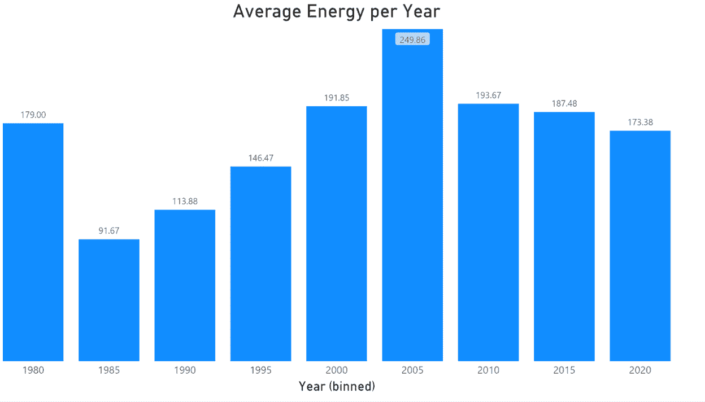
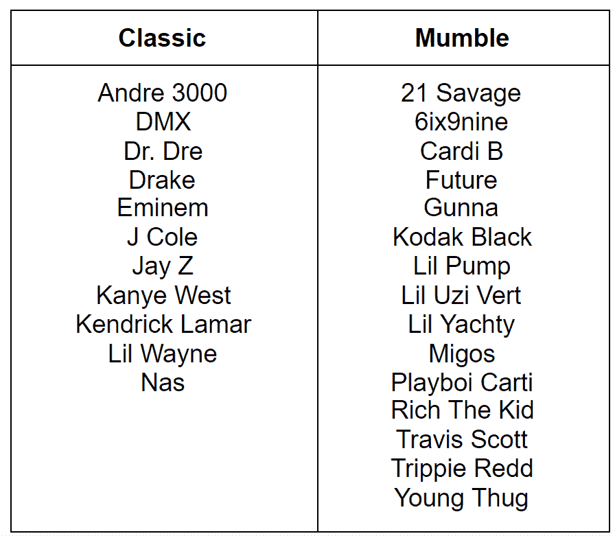
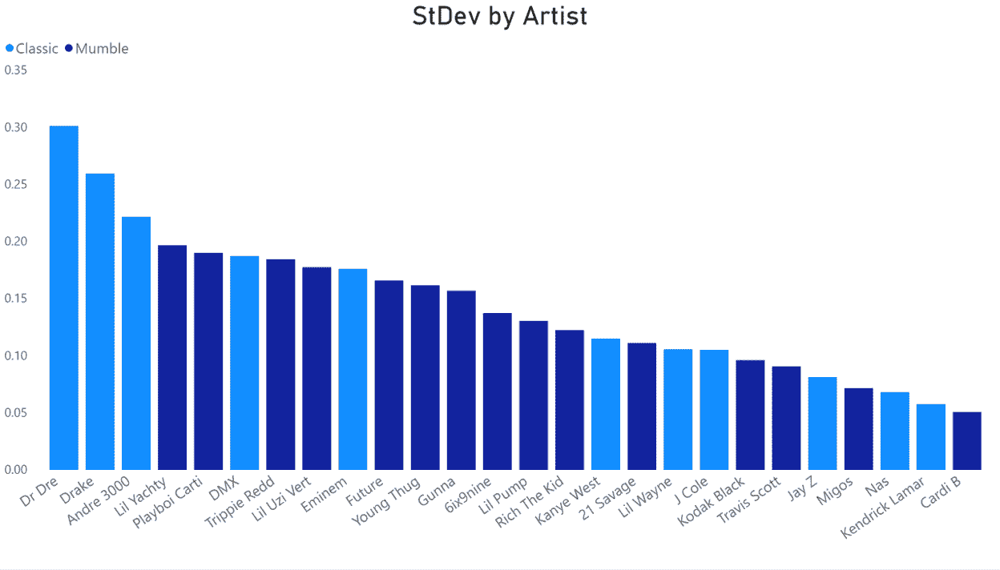
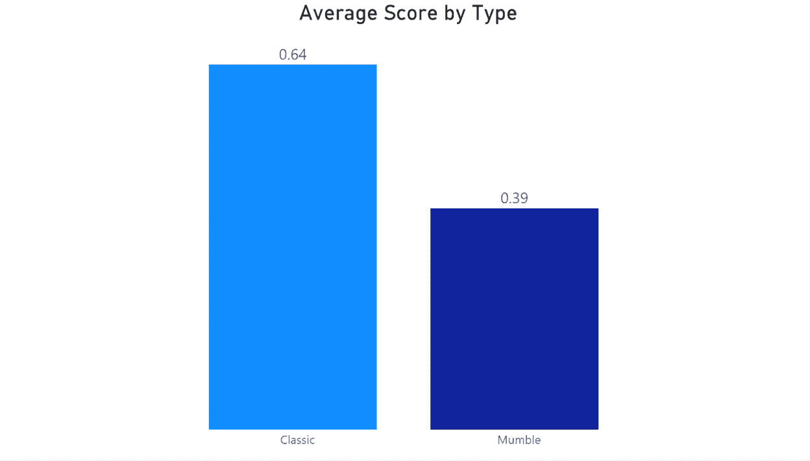
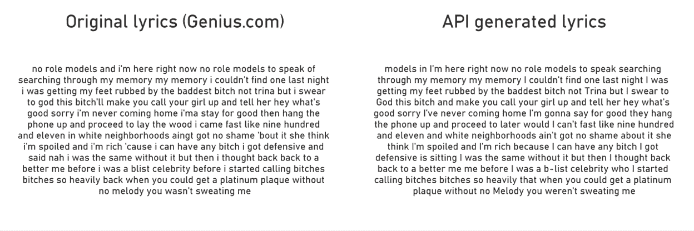

# 使用数据科学检测含糊说唱

> 原文：<https://towardsdatascience.com/detecting-mumble-rap-using-data-science-fd630c6f64a9?source=collection_archive---------17----------------------->

## [实践教程](https://towardsdatascience.com/tagged/hands-on-tutorials)

## 使用数据科学建立一个模型，客观地将说唱歌手归类为咕哝者。

资料来源:pexels.com

*警告:本文引用的说唱歌词可能包含露骨的语言。*

# 介绍

了解我的人都知道，我花了很多时间处理数据和听说唱音乐。自从在小学收到我的第一张 cd“大威利风格”的威尔·史密斯，我几乎每天都要听说唱几个小时。从小学到现在，我获得了包括数据和统计在内的许多领域的知识和经验，当然说唱的世界也在不断发展。在嘻哈音乐的近期历史中，出现了一个被称为“咕哝说唱”的新流派。

[城市词典](https://www.urbandictionary.com/define.php?term=Mumble%20Rap)将咕哝说唱定义为“一种听起来像中风患者试图发表演讲的音乐形式；往往无法理解，不合逻辑。”。在我看来，mumble rap 的一个很好的例子是 [Playboi Carti 的@ MEH](https://www.youtube.com/watch?v=nMDOSLEVdBw) ，其中 YouTube 的顶部评论是*“听起来不错，等不及英文版了。”。然而，并不是每个例子都如此清晰，一些说唱歌手根本不想与“咕哝”这个词联系在一起。那么，谁来决定哪些说唱歌手符合成为咕哝说唱歌手的标准呢？因为甚至维基百科[条目也将其描述为“定义宽松”，所以我决定打开我的数据工具箱来获得一个更客观的指标，看看你最喜欢的说唱歌手喃喃自语了多少。](https://en.wikipedia.org/wiki/Mumble_rap)*

# 如何测试曼波

我测试曼波的想法很简单:

*   选一首歌
*   把它输入语音到文本的转换器
*   将生成的文本与实际歌词进行比较

当然，和任何软件项目一样，事情并不像计划的那样顺利。我大约一年前开始从事这个项目，但在进行了一些初步测试后，语音到文本转换器(Google API)似乎真的很难适应背景中的节拍、乐器和其他声音。糟糕的结果和一大堆其他项目的想法结合在一起，让我决定放弃这个项目。

快进到 2020 年初，我在 Reddit 上看到一个帖子，有人创建了一个在线工具来从歌曲中提取人声。由于这是丢失的关键，我再次对完成这个项目抱有希望。确定咕哝量的基本概念保持不变:

项目设置

除了这次我会先用工具提取人声。

现在让我们更详细地了解一下我是如何获得数据并进行分析的。

# 获取数据

我在收集数据时遇到了各种各样的障碍。最初的想法很简单:下载歌曲，去掉人声，然后输入 API。然而，我很快发现，尤其是在说唱音乐的情况下，一整首歌往往是录音艺术家发音的糟糕表现。这主要是因为:

*   合唱或挂钩占据了歌曲的大部分，不应该算作说唱
*   大多数说唱歌曲都有其他艺术家的诗句

这意味着样本应该限于诗句。对于每首曲目，将使用一段歌词。因此，我不得不修剪所有的歌曲，并选择相应的歌词部分。总而言之，这个过程是这样的:

为了获得音轨，我写了一个简单的机器人，但是选择正确的诗句和复制粘贴相应的歌词是一项繁琐的手工工作。由于手动部分花费了大量的时间，我不得不限制我的样本。我采用了以下方法:

*   在网上搜索“[咕哝说唱歌手](https://en.wikipedia.org/wiki/List_of_mumble_rap_artists)
*   选择前 15 名(受欢迎程度，而非质量指标)
*   在 Spotify 上搜索艺术家时，选择前 5 首歌曲结果
*   (经典说唱重复)

这导致了 150 个轨道(15×5×2)。

当然，更多的说唱歌手和每位歌手的歌曲会产生更好的结果，但正如之前所说，数据收集是一项非常劳动密集型的任务，幸运的是，结果将显示大多数说唱歌手在不同的歌曲中相当一致。

一路走来，我意识到随着时间的推移，说唱音乐可能也变得越来越难以理解，因为俚语越来越多(例如“*让我兴奋不已”)*。所以我又添加了 30 首来自 Complex 的*“自 1979 年以来每年最好的说唱歌曲”。*此列表包含 30 多首曲目，但由于其中一些曲目与样本中已有的曲目重叠，因此只产生了 30 首新曲目，总共有 180 首曲目。我在 [Kaggle](https://www.kaggle.com/zhongtr0n/mumble-rap) 上分享了完整的表格。

在这里，您可以找到数据集中所有艺术家的概述和一些关键数字。

## 敲门者

按类别/类型选择所有艺术家。

## 轨道长度

## 按年份

# 准备数据

## 预处理

在开始预处理之前，我添加了一个额外的——虚构的——说唱歌手，我命名为“Lil Controlla”。“Lil Controlla”将作为一个控制组，到目前为止只发布了两首歌曲:

*   OneHunnid (API 生成的歌词与实际歌词相同)
*   不匹配(API 生成的歌词与实际歌词完全不匹配)

“Lil Controlla”将帮助我仔细检查模型的各种参数。

人工智能生成了虚构说唱歌手 Lil Controlla 的图片。(来源:[https://thispersondoesnotexist.com/](https://thispersondoesnotexist.com/))

对于预处理，对原始和 API 生成的歌词都应用了以下步骤:

*   删除所有标点符号
*   全部小写
*   删除 Genius.com 不需要的添加，如“[第 1 节]”
*   将俚语转换成英语(lil -> little，em -> them，…)
*   将数字转换成单词(21 个野人-> 21 个野人)

## 堵塞物

词干化是自然语言处理中的一种常用方法，用于将单词简化为词干，即词根形式的基础。例如，单词“ball”、“balling”、“baller”、“ballers”都将被简化为单词“ball”。对于这种分析，原始的 API 生成的歌词都被词干化。这是为了给语音到文本 API 更多的宽容。如果原来的歌词是“ballers”，但 API 捕捉到了“ballers”，人们可能会认为它不应该因此受到惩罚，因为你很容易就能从听音乐中分辨出来。通常，单词将被词干化为英语词典中没有的新单词，但这应该不是问题，因为 API 和原始变体都将被词干化为相同的基础。

在这里你可以找到预处理和词干化前后的一段诗的例子。这是来自 Genius.com 的版本。

**预处理前&炮泥:富小子—塞走**

*你联系不到我(什么？)太空跑车像 E.T. (E.T .)它是插头 tryna 打电话给我(skrrt，skrrt)我在清晨捕捉(插头)哦，在波浪上像一个 durag (durag) Pussy nigga 呼叫他的 boo back (pussy)插头走，古驰在我的鞋架上(古驰)在房子里走，炉子在哪里？直到我跑进塞子(直到我跑进)直到我跑进烂泥(到烂泥)我跑进了一些架子，我跑进了你的女孩(对你的女孩)为什么塞子向我示爱？(向我展示我的爱)我从一个配音演员(嗯？)*

**预处理后的&炮泥:富小子—塞走**

你够不到我什么样的空间妙招像 et et it' the plug tryna 叫我 skrrt skrrt 我在清晨醒来像 durag durag pussi nigga 叫你嗨 boo back pussi plug 走 gucci 在我的鞋架上 gucci 走在房子里炉子在那里打着转直到我碰到塞子直到我碰到直到我碰到泥巴 我做的泥跑进一些机架我做的跑进你的女孩'到你的女孩，而插头显示我的爱显示我的爱我做了从一个配音嗯

# 模糊分析

现在数据已经准备好了，是时候进行实际分析了。对技术方面不感兴趣的可以跳过这部分，直接看结果。

从这一部分开始，我与我的朋友 Frederik Caenepeel 博士一起工作，他是一位数学家，对编码、数据和 hip hop 有着共同的兴趣。在一次我们用披萨、嘻哈和啤酒进行编码的会议上，我告诉了他这个想法，经过头脑风暴，我们决定一起解决这个问题。弗雷德里克也应该为上述单调乏味的工作得到赞扬。

为了确定原始歌词和语音到文本版本之间的相似性，我们使用了不同度量和影响这些度量的因素的组合。

## 达默劳-莱文斯坦距离

第一个，也是最明显的，我们用来比较原始歌词和计算机生成歌词的算法是 Damerau-Levenshtein 距离。该算法的原理非常简单，因为它归结为计算使字符串 A 与字符串 b 相同所需的操作次数。该算法的出发点是有三种可能的方法来操作文本:

*   插入
*   删除
*   代替

Cardi B 的《我喜欢》以“现在我喜欢美元，我喜欢钻石”开头。然而转录"美元"作为达拉斯。使用 Damerau-Levenshtein，我们计算两种操纵:

第一步:替换(O → A)

第二步:删除

使用这种算法为每个诗句生成一个分数，分配相似性的定量描述。在应用这个算法之前，我们使用 Python 的 NLTK 删除了停用词。你可以在这里找到更多关于这个算法的信息。

## 探测法

虽然 Damerau-Levenshtein 对于许多 NLP 项目来说已经足够了，但是这个特殊的案例也可以使用不同的方法。NLP 项目主要关注拼写或意义，而在这种情况下，更多的是语音理解。目的是听你是否能听懂说唱歌手的话，而不一定是你抓住了这个词的确切意思或拼写。让我用一个例子来说明这一点:如果一个说唱歌手说单词“nice ”,而 API 将其捕获为“guys ”,则没有一个字母重叠。然而，从语音的角度来看，这两个词非常相似。出于这个原因，我们决定增加一层分析，通过声音来比较单词。

SoundEx 是一种常用的语音算法，通过声音来索引单词。维基百科将该算法描述为:

1.  保留名字的第一个字母，去掉所有其他出现的 a，e，I，o，u，y，h，w。
2.  用数字代替辅音如下(首字母后):
    b，f，p，v → 1 / c，g，j，k，q，s，x，z → 2 / d，t → 3/ l → 4 / m，n → 5 / r → 6
3.  如果原姓名中有两个或两个以上同号字母相邻(步骤 1 之前)，只保留首字母；同样，由“h”或“w”分隔的具有相同数字的两个字母被编码为单个数字，而由元音分隔的这种字母被编码两次。这条规则也适用于第一个字母。
4.  如果单词中的字母太少，无法分配三个数字，则添加零，直到有三个数字。如果你有四个或更多的数字，只保留前三个。

这个项目的问题是，API 不一定会抓取每个单词，这意味着 API 生成的文本几乎总是比原始歌词短。因此，不能简单地使用 SoundEx 进行一对一的单词分析。为了克服这个问题，我生成了两个 SoundEx 列表:一个用于 API 文本，一个用于原始歌词。从后者中减去前者，剩下的元素就是那些没有被捕获的元素。尽管这种方法并不完美(考虑到不同地方相似的发音单词可能会导致冲突)，但它确实很好地表明了使用语音作为度量标准的计算机生成的歌词的性能。

## 振幅

我们使用的第三个也是最后一个参数意外出现。正如数据收集中所描述的，这些歌曲是从 YouTube 上下载的，然后用在线工具进行了修整。该工具以波形音频格式(或简单地。wav)。事实证明，不同歌曲的质量有相当大的差异。虽然大多数曲目都是高质量的，但一些离群值的音频质量确实很差。将这些负面的异常值输入 API 会导致歌词的转录性能非常差。

对于人耳来说，并不总是容易听到差异，但通过可视化振幅，它变得非常清楚。基本思想是，较高的振幅导致较高的“音量”或响度。

这里你可以看到两个振幅变化很大的音轨的例子。

这种振幅差异的原因实际上很容易解释。记住，所有的歌曲都是从 YouTube 上下载的，音频质量是由上传者设定的。由于 YouTube 是一个相对现代的现象，本样本中的许多曲目来自 YouTube 出现之前的时代。与拥有唱片公司的现代艺术家上传尽可能高质量的歌曲不同，前几代人没有任何 YouTube 频道。他们的歌曲经常出现在 YouTube 上的唯一方式是由一些粉丝自己上传，通常是从 CD 上撕下来的。结果，轨道越老，质量越差的可能性越高，这表现在低振幅中。

为了用个位数表示质量，我用了功率，也就是每秒的能量。绘制每个时间段的平均功率时，您可以清楚地看到一段时间内的趋势。

不考虑 1975 年至 1980 年，其中只包含一个轨道，你可以看到质量大大提高，从 1995 年以后。尽管我们花费了大量的时间和精力来准备所有的曲目，但我们决定根据特定的标准放弃所有的曲目，因为糟糕的质量对转录性能的影响太大了。

我们提出的标准是:

*   仅 2000 年以后发行的曲目(与振幅密切相关)
*   追踪能量(振幅)至少为 50(去除异常值)
*   没有复杂的年度跟踪(随着时间的推移，我们决定放弃 2000 年的阈值)
*   仅剩余 3 首或更多曲目的艺术家

经过这一截，新的艺术家选择现在看起来像这样:

艺术家的最终选择。

## 组合参数

为了组合参数，我们考虑了许多不同的选项，包括更多的参数，如同一说唱歌手的方差、音轨长度、每秒字数、词汇丰富度等等。然而，考虑到这个(个人)项目的规模，不想过度设计，以及两个参数的满意结果，我们决定将其简化为一个非常简单的公式。

Mumble 得分= (DamLev 距离+ Soundex 得分)/ 2 *

**使用振幅作为先验标准。*

使用这个公式，我们获得了每个音轨的“模糊分数”,范围从 0 到 1，解释如下:

0:非常差的分数，曲目除了喃喃自语什么都没有。

1:满分，歌词都是完全可以理解的。

# 结果

现在方法已经过去了，让我们来看看结果吧！

在这个柱状图中，我们可以看到所有说唱歌手的概况和他们的平均分数(分数越高，意味着咕哝越少)。颜色编码用于识别维基百科(见简介)中提到的咕哝说唱歌手。这张图表证实了这一假设，并清楚地表明所谓的咕哝说唱歌手的歌词平均来说更难用语音到文本分析来转录。但是让我们更深入地了解一些细节。

## 说唱歌手的结果

在光谱的低端，我们可以找到喃喃自语。那些是得分最低的艺术家。同样，低分数意味着语音到文本算法很难将他们所说/敲击的单词与实际歌词匹配。Young Thug，Gunna 和 Playboi Carti 在底部，这符合预期，因为他们有时被认为是 mumble rap 的“海报男孩”。我个人也不觉得奇怪。如果你自己听了他们的一些曲目，试着自己转录一下，你就会明白低分从何而来。

当我们看到最高分时，这些名字也并不令人惊讶。德瑞医生、J·科尔斯、纳斯和德雷克都表达得很好，很容易理解。看到 J .科尔在顶端是特别有趣的，因为他是一个众所周知的含糊说唱评论家。

在中间，我们可以找到一些说唱歌手，他们被“误标”为含糊不清的说唱歌手或非含糊不清的说唱歌手。基本上，他们是媒体给他们贴上的标签与数据不完全相符的艺术家。例如，21 岁的萨维奇经常被归类为含糊不清的说唱歌手，但这个实验表明，他实际上表达得相当好。另一方面，像李尔·韦恩这样的人似乎表现不如预期。然而，0.5 分左右的分数应该被轻松地解释为样本仍然很小，并且还有许多其他变量在起作用。对结果的主要关注点应该放在极端情况上:最含糊的和最清晰的。

## 说唱歌手的可变性

鉴于每位艺术家的样本很少，研究他们得分的可变性就显得尤为重要。每个说唱歌手的标准差(更容易解释)是这样的。

简单来说，你可以说标准差越低，mumble 得分越适合作为说唱技巧的代表。

## 按类型分类的结果

在这个项目的开始，我使用维基百科作为一个来源来寻找哪些说唱歌手被贴上了含糊不清的说唱歌手的标签。使用这种分类，我们可以比较咕哝组和非咕哝组的平均分数:

这种差异是显而易见的，因为不咕哝或“经典”说唱歌手的平均表现明显高于咕哝者，证实了这一假设。

## 跟踪结果

最后，我们可以看看“微观层面”,实际上看到模型在最佳和最差赛道上的表现。先说其中一首最好的(也是个人最喜欢的)J·科尔的《无角色 Modelz》(评分 0.86)。

j·科尔——没有榜样

作为一个低评分曲目的例子，我选择了 Playboi Carti 的“@ MEH”和臭名昭著的 YouTube 评论*“听起来不错，等不及英文版了。”*(得分 0.09)。

Playboi Carti — @MEH

最后，我想展示一个“标签错误”的例子。换句话说，一首歌获得的分数远低于/高于你听自己演唱时的预期。这是 DMX 的经典之作《X Gon' Give It To Ya》。

DMX——X 会给你的

当听我们刮来的版本和从中移除乐器的版本时，我能够找到 API 性能差的原因之一；所有露骨的词都被审查了，这在音频中创造了大量的词间隙。看起来 API 在努力解决这个问题。此外，轨道的振幅也很低，这导致了较差的分数。

# 结论

当查看艺术家的结果时，我们可以将含糊或不含糊的标签归因于一些具有一定程度的信心的说唱歌手。例如，J·科尔显然处于正确的位置，与咕哝说唱保持距离，因为他的分数不仅很高，而且表现出一致性。其他作词人如纳斯、肯德里克·拉马尔和阿姆也不负盛名。在“口齿伶俐”的说唱歌手中，我们也可以看到像德瑞医生、Jay-Z、坎耶·韦斯特和德雷克这样的大牌。

另一方面，预期的咕哝者名不虚传，如 Playboi Carti，Gunna，Young Thug 和 Lil Pump。所以从现在开始，如果你听他们的音乐，却听不懂他们在说什么，要知道你并不孤单。从这一点上说，不仅仅是你，一个为理解人类声音而构建的计算机算法也和你一样在挣扎。

从整体上评价这个模型，我很高兴地说它表现得相当好。这些结果都符合你的预期，或者当你评价自己是一个“含糊不清”的人时，你会看到什么。我也对谷歌 API 的质量感到惊讶，即使它设法抓取了许多含糊不清的音轨，并正确转录了相当大的一部分。我们可以得出结论，该模型能够在含糊说唱和正常或“经典”说唱之间做出明智的区分。我甚至自信地说，60%的时候，它都有效…每次都有效！

最后，尽管整体表现良好，但仍有很大的改进空间。例如，像 DMX 和李尔·韦恩这样的说唱歌手得分远低于人们的预期。当考虑更多因素时(如露骨的语言或俚语)，分数可能会更准确。API 似乎也在速度上挣扎，这在阿姆的《哥斯拉》中表现得较低。这给我们带来了一些可以在“进一步研究”下进行改进的列表。

# 进一步研究

尽管我和我的朋友在这个项目上花了大量的时间，但仍然有巨大的改进空间。在这里，我列出了一些可以改进或可以进一步探索的东西。

## 更多数据

这可能是最重要的一条。在目前的项目中，我们每个艺术家只有大约 5 到 8 首歌曲，这是非常低的。由于提取、整理、转换和转录音频的任务非常耗时，我们受到资源的限制，无法进行更深入的研究。将每个艺术家的曲目数量增加到至少 20 首应该会给出更可靠的结果。其次，总体上包括更多的艺术家也是不错的。我们试图尽可能客观地选择“经典”说唱歌手(基于谷歌搜索结果)，但我们知道很多读者会不同意，因为他们最喜欢的说唱歌手不在名单中，而他们不喜欢的艺术家在名单中。总之，艺术家人均时间和艺术家总数都应该增加。

## 更高的数据质量

除了数据量，质量也可以提高。不幸的是，由于振幅太低，我们不得不移除许多音轨。YouTube 上的音频质量差别很大。理想情况下，应该从更好的来源抓取音轨，以保证所有音轨的高质量和同等质量。

## 重新思考公式

用于计算 mumble 分数的公式目前非常简单。我们认为可以通过增加一些参数来改善。比如，露骨的语言起了作用。有些曲目中的脏话被删掉了。因此，虽然这些词被写在原始歌词中，但它们永远不会被 API 拾取。另一个因素可能是每秒钟词汇和字数的丰富程度。想象一下，我们用了 Lil Pump 著名的“古驰帮”，与其他曲目相比，这是不公平的。如果 API 能够正确地选择它，那么对于相同的文本/单词，他的分数将会提高数倍。相反，如果 API 会错过它，他将被惩罚多次。应该考虑到词汇量的更大/更小的变化和每秒更高/更低的单词速率。

## 创建 Kaggle 笔记本

在写这篇文章的时候，我很快意识到这可能会变成一篇很长的阅读。正如你在我的其他帖子中看到的，我通常倾向于解释我的分析中的每一步，使读者能够完全复制这个过程。为了不使它太长，我没有详细介绍每一个步骤。因为我的代码中有 API 证书，所以我也没有使用公共笔记本(例如使用 Kaggle)。这样做将使其他人更容易在项目上合作，用更多的数据扩展它或改进分析。如前所述，我上传了数据，你可以在这里找到。

## 其他改进

如果你能想到其他的改进或改编，请随意在下面的评论中提出，这可能会引发讨论或激发我的后续项目。

# 技术堆栈

Ffmpeg、Acapella extractor、Mp3cut.net、Python (Matplotlib、Seaborn、nltk、SoundEx、SciPy、PyDub、NumPy、Pandas)和 Power BI。

关于我:我叫布鲁诺，是欧盟委员会的数据科学顾问。你可以通过我的网址与我联系:[https://www . zhongtron . me](https://www.zhongtron.me/)

*我的朋友 Frederik Caenepeel 博士为这个项目做出了贡献，也可以在*[*LinkedIn*](https://www.linkedin.com/in/frederik-caenepeel-78076514b/)*上找到。*