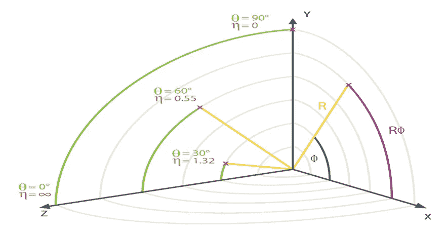
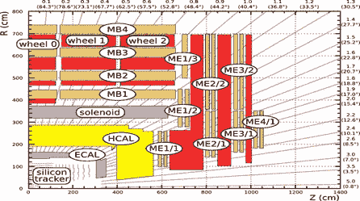
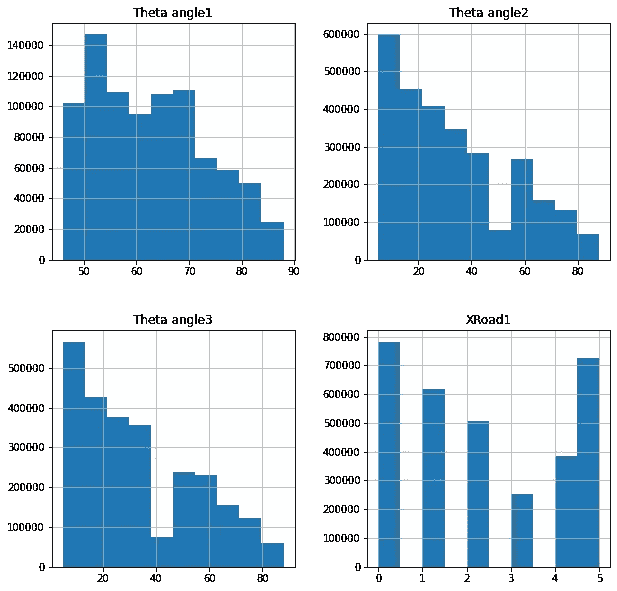
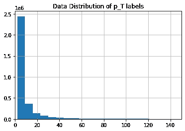
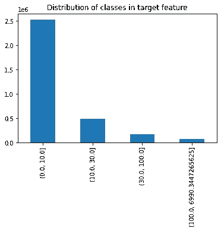
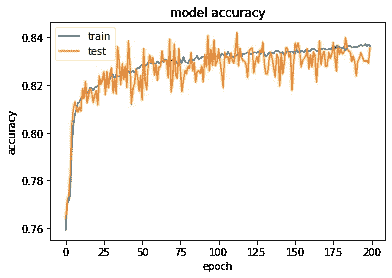
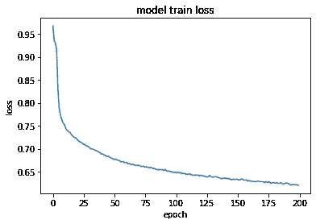
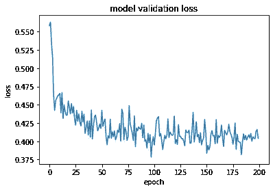
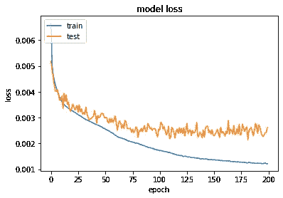

# 使用深度学习检测 CERN CMS 实验中的μ子动量

> 原文：<https://towardsdatascience.com/detecting-muon-momentum-in-the-cms-experiment-at-cern-using-deep-learning-934b0ef24586?source=collection_archive---------42----------------------->

## [理解大数据](https://towardsdatascience.com/tagged/making-sense-of-big-data)

图 CMS 束管的移除(图片由 Maximilien Brice/Julien Ordan/CERN 提供——来源: [CERN](https://home.cern/news/news/experiments/whats-store-cms-detector-over-next-two-years)

在欧洲核子研究中心 **CMS 实验**中**探测μ介子**是一项**重要的**任务。欧洲核子研究中心的 CMS 物理项目深入研究了许多物理实验，通常预期会产生μ子。例如，研究著名的希格斯玻色子粒子的一种方法是通过一个衰变通道，在那里希格斯玻色子衰变为四个μ子。

由于μ子可以穿透几米厚的铁而没有明显的能量损失，它们很难被 CMS 系统的任何一层阻止。因此，μ子探测器是最外面的，远离相互作用点。**当前μ子横向动量探测器**、**桶μ子轨迹探测器**使用查找表来估计μ子的**横向动量**。后者是使用伪快度η测量的**，伪快度η是与带电粒子从这些碰撞中出现的角度相关的空间量，方位角φ是碰撞路径与 z 轴形成的角度。(来源: [CMS 一级触发带有机器学习的μ子动量分配](http://www.infn.it/thesis/PDF/getfile.php?filename=12755-Diotalevi-magistrale.pdf) —托马索·迪奥塔列维)**

图 2:采用的坐标系

在这个水平上的μ介子的任何检测被称为**触发**。

# 问题描述

需要更加复杂的技术来**提高动量检测的精度**以降低触发率。由于瞬发μ子光谱遵循**指数分布**，精度上的任何**微小改进**都可以**显著减少触发**的数量，特别是通过减少被误归类为高动量μ子的低动量μ子的数量。

这就是**机器学习发挥作用的地方**。通过应用更智能的算法，如**神经网络、**，我们可以提高触发系统的精度，以准确检测μ子及其相应的横向动量。(来源: [CMS 一级触发带有机器学习的μ子动量分配](http://www.infn.it/thesis/PDF/getfile.php?filename=12755-Diotalevi-magistrale.pdf)——托马索·迪奥塔列维)

在下面的文章中，我们将应用**几种深度学习方法来准确预测μ介子动量**。我们将在 CMS 实验中使用来自阴极条室(CSC)的蒙特卡罗模拟数据。该数据集包含超过 300 万个利用皮媞亚产生的μ子事件。

# 探索数据集

我们检索的数据组织如下:

*   有 **87 个特征** : 84 个与探测器相关；3 个作为路径变量
*   CSC 内部有 **12 个探测器面**，每个探测器面有 **7 个特征** (12*7=84)

这些功能组织如下:

*   **0–11**:φ坐标
*   **12–23**:角坐标
*   **24–35**:弯曲角度
*   **36–47**:时间信息
*   **48–59**:环号
*   **60–71**:前/后击
*   **72–83**:面罩
*   **84–86**:X _ road
*   **87**:φ角度
*   **88** : Eta 角度
*   **89** : q/pt(横向μ子动量)——**目标标签**

在μ介子室内，有多个探测器站，如下图所示。这些探测器平面被组织在特定的室中。

图 3:CMS 象限的示意图(来源: [CERN 文件服务器](https://cds.cern.ch/record/1223872/plots))

然而，我们只关心 CSC 室中的**μ介子击中，因此只与 CSC 室相关的特征。**

让我们首先删除那些不需要的特性:

现在我们已经删除了这些要素，接下来我们可以将所有要素放入一个紧凑的 Pandas 数据框中，以便于以后进行数据分析。

# 探索性数据分析

让我们用熊猫的**描述**方法来看一下数据统计:

表 1:具有缺失值的要素的统计数据

快速查看会发现一些特征，如**φangle 1**、 **Theta angle1** 和 **Bend angle1** 有一些缺失值。让我们找出每个要素的空值的确切百分比:

图 4:缺失值分布

我们注意到**前/后 1** 、**φ角度 1** 、**θ角度 1** 、**弯曲角度 1** 、**时间 1** 和**环 1** 特征有超过 70%的缺失值！我们需要稍后删除这些特性，对于缺失值少于 25%的其他特性，我们将用每列的平均值填充缺失值。

接下来，我们将可视化所有特征的数据分布。

图 5:选定的特性直方图

我们注意到如上图所示，如果我们想要提高模型的学习速度，一些特征如 **Theta angle1** 、 **Theta angle2** 、 **Theta angle3** 和 **X Road1** 需要转换成正态分布(使用标准化)。

# 预处理用于训练的数据

## 将问题框定为分类任务

不要试图应用回归来预测μ子动量值( **q/pt** )，让我们首先尝试将动量分成 4 类:**0–10 GeV、10–30 GeV、30–100 GeV 和> 100 GeV** ，并因此将问题构建为分类任务。

为了对动量进行分组，我们将使用**目标特征的倒数的绝对值(pt/q)** 。让我们来看看这个新生成的要素的数据分布

图 6:pt/q 的数据分布

如图所示，很明显存在不同大小的不同组。让我们使用 Pandas 的 **cut 方法对数据进行聚类，并检查新生成的组分布。**

图 7:目标类的数据分布

现在我们已经成功地将标签分组，我们可以观察到**类不平衡**，因此每当我们开始训练我们的神经网络**以避免任何偏差**时，我们都需要平衡它们。

## 将数据集分为训练集和测试集

接下来，让我们将数据分为训练和测试数据，我们将使用 90%-10%的分割。重要的是**使测试集代表原始数据集中的目标类分布**。因此，我们将使用 Scikit-Learn 中的 **StratifiedShuffleSplit** 方法来使训练数据和测试数据都代表类的原始分布，而不是随机分割我们的原始数据集。

让我们检查新生成的集合中的类分布:

表 2:比较原始、训练和测试集之间的类分布

如上表所示，训练集和测试集都代表原始数据集。我们现在可以安全地进入预处理的最后一步:**准备管道**。

## 准备预处理管道

该管道将执行以下任务:

1.  删除缺失值超过 70%的列
2.  使用 Scikit-Learn **简单估算器**用相应的方法估算缺失值的其他列
3.  用 Scikit-Learn **标准定标器**将数据标准化
4.  将目标特征编码成四个**一个热编码特征**

以下是管道完整代码:

# 构建神经网络

我们将使用 **Tensorflow 的 Keras 库来构建我们的神经网络**。神经网络将有 **5 个隐藏层**，每层的神经元数量为 **512、256、128、64 和 32** 。我们还在网络中添加了**脱落层**以减少过度拟合。输出层将有 **4 个神经元**(与类的数量相同)，我们将对每个输出神经元应用 **softmax** 激活函数，以获得**每个类的概率**。

由于这是一个分类任务，我们选择的**损失函数**是**分类交叉熵，**和 **Adam** 将被用作优化器:

让我们为模型设置一些回调，包括一个**检查点回调**和**提前停止回调**，它们都将监控模型的**验证准确性**。我们将使用 **25%的验证分割**、**500**的批量，并将**训练 200 个周期**。现在我们终于可以开始训练了！

现在我们已经完成了模型的训练，让我们来看看它在训练时期的性能演变。

图 8:分类器度量在训练时期的演变

看起来我们在验证集上达到了 84%的准确率。令人印象深刻！但如果说我从机器学习中学到了什么的话，那就是**从来不依靠准确性，只依靠**和**来判断模型性能**。我们需要更深入地了解这个案例。

# 测试模型

让我们使用 **Scikit-Learn 的分类报告**来检查模型在训练集和测试集上的性能。它包括一系列重要的分类指标，包括**精确度、召回率和 f1 分数:**

表 3:列车数据评估报告

表 4:测试数据评估报告

令人印象深刻！似乎增加类别权重肯定会减少偏差，我们在测试数据上达到了 0.85 的**加权 f1 分数！**

# 回归实验

让我们尝试直接**预测每个μ子动量的 q/pT** 值，而不是将目标标签分成四组，因此将问题框架化为**回归**任务。我们**只改变了模型**的最后一层，用一个线性激活函数的输出神经元**代替了 softmax 的 4 个神经元。**

由于这是一个回归任务，我们将选择**均方误差**作为我们的**损失函数**，类似于分类任务，我们将使用 **Adam** 作为优化器。

让我们来看看回归模型在训练时期的性能演变:

图 8:模型训练的演变和训练时期的验证损失

让我们在训练集和测试集上检查模型的性能。我们将找到均方根误差，以便更好地了解这些值:

**训练数据的均方根误差为 0.046，测试数据的均方根误差为 0.047** 。一点都不差！与目标值相比，这些值似乎是相对可接受的，但肯定还有改进的空间。

# 未来方向

1.  我们发现**分类器**模型**在检测少数类**方面不太好。因此，我们需要寻找更多的技术来**使模型更少偏差**(例如**上采样少数类**或**下采样多数类**)。
2.  我们可以通过**网格搜索**调整**超参数**来进一步提高我们的回归模型的性能。

# 最后的想法

在这个项目中，我们尝试了几种**深度学习方法**来准确**预测μ介子动量**。首先，在**预处理**用于训练的数据之前，我们研究了**数据属性**。然后，我们训练**一个分类器来预测μ子动量类别**，并使用**多重分类度量**来评估分类器对新数据的性能。接下来，我们训练了一个**回归模型**来**预测μ子动量值**而不是它们的类别。这两种方法都相当成功，我们计划采用**更先进的技术来减少模型偏差并提高性能。**

*原载于 2020 年 11 月 14 日*[*【https://anisdismail.com】*](https://anisdismail.com/muon-mom-pred-blog.html)*。*