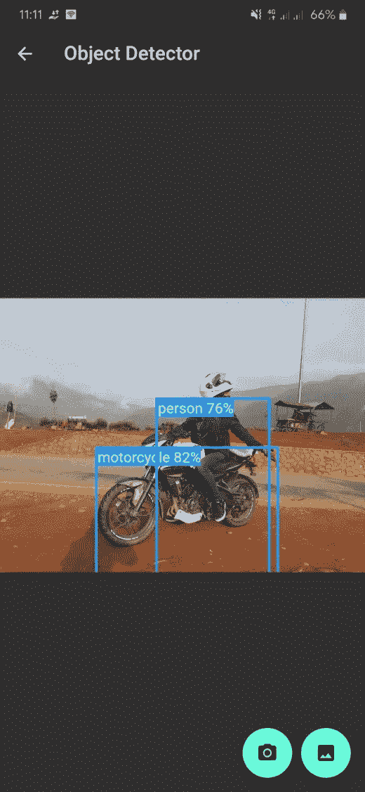
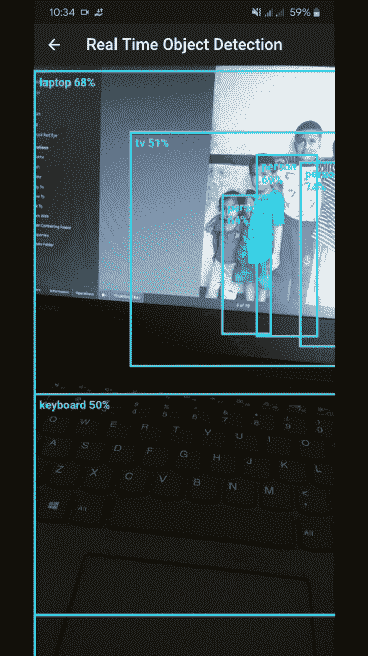

# 探测颤动中的物体

> 原文：<https://towardsdatascience.com/detecting-objects-in-flutter-4fe8cfccef14?source=collection_archive---------7----------------------->

## [实践教程](https://towardsdatascience.com/tagged/hands-on-tutorials)，全面的指南

## 使用 tflite 和 SSD-MobileNet


照片由[韦斯顿·麦金农](https://unsplash.com/@betteratf8?utm_source=medium&utm_medium=referral)在 [Unsplash](https://unsplash.com?utm_source=medium&utm_medium=referral) 上拍摄|只是一些:D 的物品

# 介绍

在本指南中，我们将使用 ***tflite*** 包和预训练的 SSD-MobileNet 模型在 Flutter 中开发一个应用程序，能够检测图像和实时摄像机流中的对象。这个应用程序能够离线检测对象。我们还将能够从应用程序中拍照，并将其输入到模型中进行检测。

[](https://github.com/rupakkarki27/object_detection) [## rupakkarki 27/对象检测

### 使用 Flutter 和 TensorFlow Lite 的对象检测应用程序。GitHub 是超过 5000 万开发者共同工作的家园…

github.com](https://github.com/rupakkarki27/object_detection) 

> *请注意，由于我繁忙的日程安排，我不再维护这个项目。最近版本的 Flutter 和 dependencies 中引入的突破性变化可能会破坏应用程序。但你可以自由选择回购，按照自己的方式改变事情。谢谢！*

# 设置项目

如果您还没有安装，安装程序会在您机器上跳动。[Flutter 网站上的这个](https://flutter.dev/docs/get-started/install)指南是一个很好的起点。设置 Flutter 后，在终端中输入以下命令创建一个新项目。

```
$ flutter create object_detection
$ cd object_detection
```

现在，您可以在您喜欢的编辑器中打开您的项目。

## 安装软件包

在您的 *pubspec.yaml* 文件中，在 *dependencies* 部分下添加以下内容以安装所需的包。

```
image_picker: ^0.6.7
tflite: ^1.1.1
camera: ^0.5.8+7
```

我们使用 *image_picker* 从图库中选取图像，使用 *tflite* 运行我们的模型，使用 *camera* 包控制相机。你可以在 [pub.dev](https://pub.dev/) 上读到更多关于他们的信息。

在您的应用程序级别 *build.gradl* e 文件(/android/app)中，在 android 块下添加以下行，以确保 Flutter 不会压缩您的模型或 *tflite* 包。

```
aaptOptions {
  noCompress 'tflite'
  noCompress 'lite'
}
```

## 模型

您可以从上面提到的 GitHub repo 或任何地方下载 SSD-MobileNet 模型及其标签，并将它们放在您的项目中。然后，在您的 *pubspec.yaml* 文件中添加您的资产。

```
assets:
  - assets/models/ssd_mobilenet.tflite
  - assets/models/labels.txt
```

# 初始化摄像机

该应用程序的主要功能是以这样一种方式创建的，即所有的摄像机在应用程序启动后立即初始化。然后，摄像机描述被传递给所有需要它的类。

初始化摄像机的主要功能

# 图像中的目标检测

为了检测图像中的对象，我们首先需要使用 *tflite* 包中的 *Tflite.loadModel* 方法加载模型。然后，我们需要从我们的图库中获取图像，或者通过启动相机从应用程序中拍摄一张图像。*相机*包提供了*获取图像*的方法，这两种方法都可以使用。

加载图像后，我们使用*TF lite . detectobjectonimage*方法将它输入到我们的模型中。该方法返回检测到的类别、置信度和兴趣点，这将帮助我们在对象周围绘制边界框。

各种操作的功能

## 绘制边界框

围绕检测到的对象绘制边界框的基本思想是使用来自模型的兴趣点和图像尺寸。

使用堆栈小部件，我们可以将边界框放在图像的顶部。在定位的小部件中，我们放置一个四周有边框的容器。我们还可以通过简单地添加一个文本小部件并将置信度转换为百分比，以百分比的形式显示检测到的类及其准确性。

边界框的代码

静态图像检测页面有两个浮动操作按钮。使用其中一个，我们可以直接从图库中挑选图像，并在上面运行我们的模型。使用另一个，一个相机被打开，我们可以拍照，并把它提供给我们的模型。



模型检测图像中的对象(图片由作者提供)

# 实时目标检测

实时检测对象有点类似于检测图像中的对象。视频流中的每一帧都被视为一幅图像，模型在其上运行。该模型每帧输出结果，边界框在图像流上被一遍又一遍地重画。

*相机*插件中的*相机控制器*对象有一个名为 *startImageStream* 的方法，可用于向我们的模型提供帧。在这个方法中，我们可以调用*TF lite . detectobjectonframe*方法，该方法获取相机流并在我们的模型中运行它。该方法的其余部分是相同的，即模型返回 detectedClass、confidence 和 poi，我们使用它们在相机流的顶部绘制边界框。

实时检测



实时检测(GIF 由作者提供)

# 结论

我们开发了一个能够使用 Flutter、 *tflite* 包和一个预训练模型来检测对象的应用程序。该应用程序并不完美，可能无法在所有图像上工作。我们可以通过训练我们自己的模型来改善这一点，该模型可以以更高的准确性检测更多的类，或者使用其他一些强大的模型。

尽管有这个障碍，该应用程序在图像和视频光照良好的情况下表现非常好。对于那些希望将机器学习和 Flutter 知识结合起来的人来说，这是一个非常好的项目。我们还可以使用谷歌的[可教机器](https://teachablemachine.withgoogle.com/)来训练模型对特定类型的图像进行分类或检测。

> *tflite* 插件目前只支持 SSD-MobileNet 和 YOLO 进行物体检测。

你可以在这里 查看项目回购 [**。如果有任何问题，请随时打开问题或创建一个公关。欢迎并鼓励任何反馈或建议。**](https://github.com/rupakkarki27/object_detection)

> 你也可以在这里 看看我的作品集 [**。**](http://www.rupakkarki.com.np)