# 利用深度学习从胸片中检测肺炎

> 原文：<https://towardsdatascience.com/detecting-pneumonia-from-chest-x-rays-with-deep-learning-6b83b4a77ee8?source=collection_archive---------38----------------------->

## 建立各种模型，并使用预先训练的模型从胸部 x 光诊断肺炎

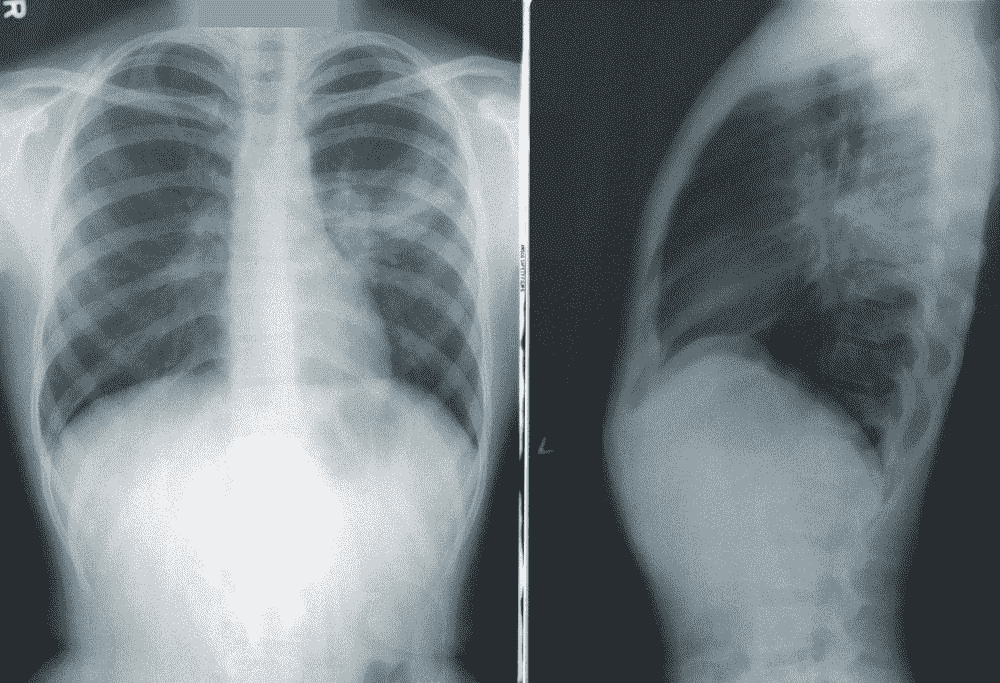

疾控中心在 [Unsplash](https://unsplash.com/photos/NMZdj2Zu36M) 拍摄的照片

***来自《走向数据科学》编辑的提示:*** *虽然我们允许独立作者根据我们的* [*规则和指导方针*](/questions-96667b06af5) *发表文章，但我们不认可每个作者的贡献。你不应该在没有寻求专业建议的情况下依赖一个作者的作品。详见我们的* [*读者术语*](/readers-terms-b5d780a700a4) *。*

2017 年有 256 万人死于肺炎。这些人中大约三分之一是不到 5 岁的儿童。世卫组织估计，这些过早死亡中有 45，000 例是由于家庭空气污染。随着诊断效率的提高，许多死亡可以减少。
这个项目的目标是创建各种机器学习和深度学习模型，以便在优化后，可以帮助放射科医生从胸部 x 光片中检测肺炎。

# 环境和工具

在整个项目中，我们将使用 python，因此建议您使用一些编辑器，如 Google Colaboratory，这些编辑器与 python 兼容，但也允许使用某些 python 包。

我们将使用 python 包:

*   Numpy
*   熊猫
*   Tensorflow(版本 1.x)
*   Sci-Kit Learn 和 Keras
*   Seaborn 和 Matplotlib

我们将使用其他包来下载与构建模型无关的文件和辅助函数。要获得完整的列表，请查看下面附加的代码。

# 项目和代码

既然我们已经有了所有的介绍，让我们开始吧。

我们将从导入一些关键包开始，我们将在整个项目中使用这些包。我们还将为项目下载数据(在这种情况下，胸部 x 光图像)。

你可以在 Github [上找到完整的代码。](https://github.com/shayaf84/Detecting-Pneumonia-)

在开始构建各种模型之前，我们必须分析并熟悉我们的数据。让我们下载一个名为“元数据”的文件，它为我们提供了关于数据的关键信息。之后，我们将使用 pandas 库创建一个数据框(本质上是一个表),它将提供关于我们数据集中前五幅图像的信息。

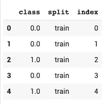

作者图片

表格中的每一行代表一幅胸部 x 光图像。您可以看到三列:类别、拆分和索引。级别为 0 或 1，0 表示肺部健康，1 表示肺部有肺炎。索引是图像的标签，它告诉我们正在查看数据集中的哪个图像。

关于分裂，当我们教计算机如何做某事(在这种情况下诊断肺炎)时，我们必须通过给图像加标签来训练它。但是，我们也要通过给计算机不同的以前没见过的图像来测试计算机，让计算机来决定肺部有没有肺炎。因此，拆分列描述了图像是用于训练计算机还是测试计算机。下面是我做的一个图表，用来帮助区分这两者。

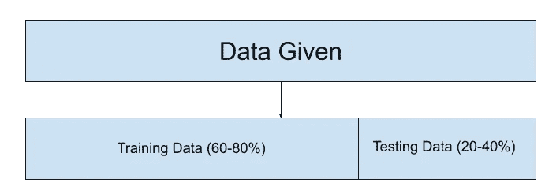

作者图片

现在，制作所给信息的图表，进一步分类每个类别中有多少张图片，并进行分割。我们将使用 pandas 方法“count”来显示该表，并且我们将使用 seaborn“count plot”来显示一个对数据进行分类的图表。

作者图片

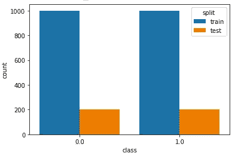

作者图片

如图表所示，1200 个肺是健康的，1200 个肺有肺炎。在这 1200 个中，一千个将用于训练模型，另一千个将用于测试模型。

现在我们已经完全了解了我们的数据属于哪一类，我们可以继续绘制一些图像，以查看胸部 x 射线将会是什么样子。

运行此功能，允许您绘制图像:

在这里，您可以通过运行下面的代码来调用该函数。它下载训练和测试数据(从我们之前定义的函数中)，并根据索引(与图像相关的数字)绘制图像。注意第 4 行的 1)。“数据”是图像，而“标签”部分是数字 0 或 1，表示患者是否患有肺炎。

我特别选择了一张健康的照片，和一张肺部有肺炎的照片。您可以随意使用索引来查看其他图像。

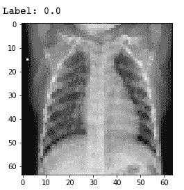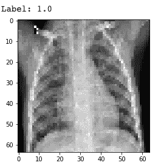

左图是健康的肺，右图是肺炎。作者提供的图片

# 简单的机器学习模型

现在，我们已经完成了对数据的检查和分析，我们可以继续构建一些机器学习模型。我们将从简单的开始，使用 K-最近邻和逻辑回归分类器。

## k-最近邻

K-最近邻的关键概念是，当我们看到一个未知的例子时，我们也会看到这个未知的最接近的例子，并预测它是同一个例子。

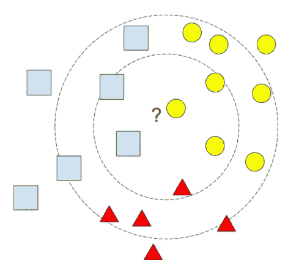

作者图片

上图显示了 K-最近邻分类器。例如，如果 k=1，与所讨论的形状最接近的(单个)形状是圆形。因此，如果 k=1，形状是圆形。然而，如果 k=3，与所讨论的形状最接近的 3 个形状是 2 个矩形和 1 个圆形。所以，如果 k=3，形状是长方形。

## 逻辑回归

逻辑回归用于预测概率，这些概率随后会变成一个类别(0–1)。在线性回归中，预测的 y 值可能会超过 0–1 范围(使用连续直线)。但是，在逻辑回归中，预测的 y 值不能超过 0–1 的范围，因为它呈“s”形。举例来说，请看下图。

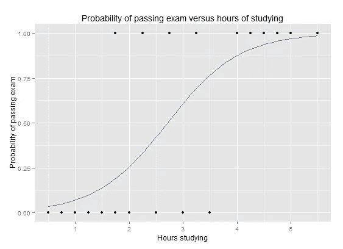

图片由 Michaelg2015 在[公共领域](https://en.wikipedia.org/wiki/Logistic_regression#/media/File:Exam_pass_logistic_curve.jpeg)发布

x 轴显示学生学习的小时数，y 轴显示他们是否通过了考试(0 或 1)。然而，逻辑曲线的 y 轴显示了他们是否通过考试的概率。如你所见，曲线预测学习少的人会不及格，而不是及格，反之亦然。

# 构建机器学习模型

我们将使用 sci-kit learn 库来构建这些模型，特别是 KNeighborsClassifier 和 LogisticRegression 方法。

建立机器学习模型的步骤是加载模型，拟合(或训练)模型，用模型预测病人是否患有肺炎，最后对模型进行评估。

正如您所看到的，在第 6 行和第 7 行，我们加载或初始化了模型。然后，在第 10 行和第 11 行，我们使用训练数据训练模型。对于预测，模型根据 test_data 预测 test _ labels 是什么。这就是为什么，为了检查准确性分数，我们基于 test_data 检查我们的预测如何。

现在，我们可以运行模型并检查准确性分数。请注意，您可以通过更改邻居的数量来提高 KNN 分类器的性能。

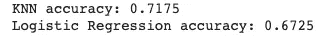

准确度分数

很明显，这些模型的准确度分数很低。因此，这些不是解决这个问题的最佳模型。所以，我们必须采取不同的方法。

# 卷积神经网络

卷积神经网络是一种特定类型的神经网络，用于查找图像之间的模式。我将简要描述 3 个关键部分:

1.  盘旋
2.  联营
3.  完全连接的层

## 盘旋

卷积核是一个权重矩阵，类似于全连接层的权重矩阵。通过将权重与图像输入中的相应像素值逐元素相乘，将卷积核应用于输入。这将有助于锐化图像。

迈克尔·普罗特克在[公共领域](https://commons.wikimedia.org/wiki/File:2D_Convolution_Animation.gif)发布的图片

## 联营

卷积层输出仍然太大，神经网络无法做出任何预测。我们可以通过汇集来减少它的规模。它将卷积层中的某些像素组合起来，并将其合并成一个像素。最大池化是最常见的池化示例之一，它将输出分成多个分块，并取每个分块的最大值。

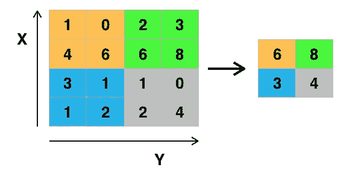

图片由 Aphex34 在[公共领域](http://en.wikipedia.org/wiki/Convolutional_neural_network#/media/File:Max_pooling.png)发布

## 完全连接的层

完全连接层将单个神经元中的每个神经元连接到下一层中的所有其他神经元。最后一层使用输出概率的激活函数，如 softmax 或 sigmoid，计算机将使用这些函数对图像进行分类。

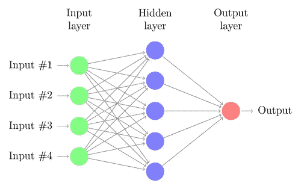

图片由 Kjell Magne Fauske 在[公共领域](https://texample.net/tikz/examples/neural-network/)发布

# 构建我们的卷积神经网络

我们将使用 Keras 库来构建我们的模型。在你建立你的模型之前，运行这两个函数，这将允许你绘制精确度和损失。

现在，我们已经运行了这些函数，让我们来构建模型。您必须了解一些关键组件，它们是:

*   **add(Conv2D())** :执行卷积的层。它需要三个参数。第一个是它执行卷积的次数，第二个是卷积的维数，第三个是激活函数。对于第一层，请确保也指定了输入形状。
*   **添加(MaxPooling2D()):** 执行最大池的层。它接受 1 个参数，即组合像素的尺寸。
*   **add(Flatten()):** 将图像展平成一维数组。
*   **add(Dense()):** 添加一个全连接层。它接受两个参数，该层中神经元的数量，以及该层的激活函数。
*   **add(Dropout():** 关闭一定数量的神经元，以减少过度拟合。接受一个参数，通常是一个介于 0 和 1 之间的数字，当转换成百分比时，就是前几层中被切断的神经元的百分比。
*   我们对每一层(除了输出层)的激活函数将是 **ReLU** 。对于我们的输出层，激活函数将是 **sigmoid** ，它输出我们的患者是否患有肺炎的概率。
*   我们的损失将是 **binary_crossentropy** ，我们将使用优化器 **RMSprop** ，定制为 1e-4 的学习速率和 1e-6 的衰减。

太好了！现在我们已经构建了模型，让我们运行它，看看它做得有多好。

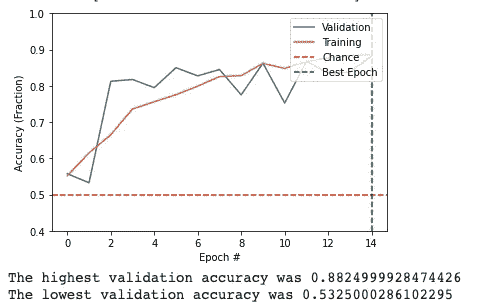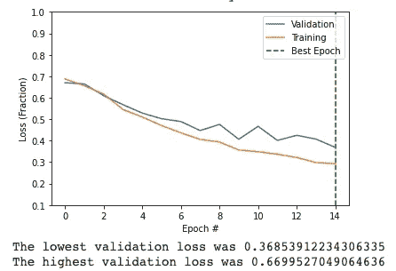

作者提供的图片

从上面的图中可以看出，我们的模型做得相当好。然而，它的表现还不够好，不能用于临床。您可以从这里继续修补模型，以提高准确性和减少损失。但是，确保避免过拟合(当计算机记忆训练数据时，因此它在测试数据上表现很差。

# 如何阅读图表

x 轴显示了历元的数量。只要 x 轴上有小数，就可以忽略它，因为只允许完整的历元(整数)。在 y 轴上，您有您正在测量的值。可能是损耗，精度等。黄线表示训练数据，而蓝线表示验证数据。绿线代表该指标的最佳时期。

# **迁移学习**

对于我们的迁移学习，我们将使用 VGG16。VGG16 是在“ImageNet”分类问题中使用的“专家”模型。在 ImageNet 中，参赛者被要求建立能够区分 1400 万个图像类别的模型，其中有超过 20，000 个类别可用。

VGG16 被允许研究这 1400 万张图像 74 次。然后，它能够比人类更好地猜测图像的真实标签。

我们将带着 VGG16，让它在我们的 x 射线上训练。希望他们在 ImageNet 问题上的经验将有助于区分肺炎和我们的 x 光片。

第一行将下载 VGG16 的卷积算法。然后我们将不得不声明它是可训练的，通过使用一个“for”循环，确保我们可以训练每一层。之后，我们必须添加和自定义完全连接的层，因为 VGG16 包含固定的卷积层。

现在，运行它，让我们看看它的表现如何！

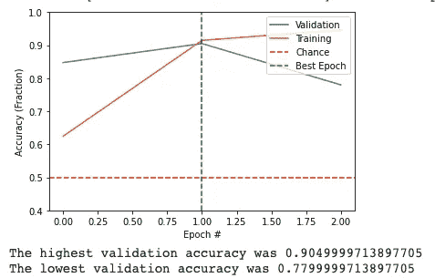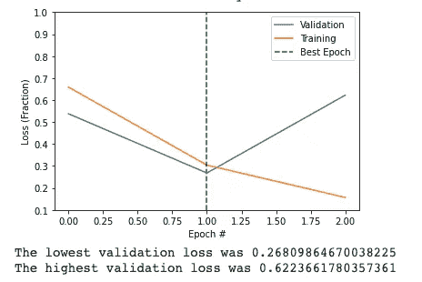

如您所见，我们的模型的性能随着 VGG16 的使用而显著提高。您还可以看到，模型在 1-2 个时期后开始过度拟合。这是因为 VGG16 是预先训练好的，这使得它更有效和准确，但同时，它也更容易过度拟合。

# **结论**

我们开始这个项目是通过分析我们学到的数据，并了解有多少图像患有肺炎或健康。我们还将数据集分为训练数据和测试数据。之后，我们构建了简单的机器学习模型，这些模型能够根据我们对其进行的训练做出明智的决策。最后，我们构建了卷积神经网络来提高模型的精度和效率。之后，我们使用一个预先训练好的模型作为我们的迁移学习来进一步优化我们的模型。现在，我把它留给你。你如何继续改进这个模型，使它能够用于医疗实践？也许你甚至可以在一些现场数据上运行它，并应用数据扩充。

# **参考文献**

[1]匿名，[分类](https://inspiritaischolars.teachable.com/courses/1040297/lectures/21877191)(未标明)，可教授

[2]无名氏，[肺炎](https://www.who.int/news-room/fact-sheets/detail/pneumonia) (2019)，世界卫生组织

[2] B. Dadonaite 和 M. Roser，[肺炎](https://ourworldindata.org/pneumonia#citation) (2019)，数据中的我们的世界

[3] C .阿奇，[利用卷积神经网络进行胸部 X 线肺炎检测](/chest-x-rays-pneumonia-detection-using-convolutional-neural-network-63d6ec2d1dee) (2020)，Medium.com

[4] R. Prabhu，[对卷积神经网络(CNN)的理解—深度学习](https://medium.com/@RaghavPrabhu/understanding-of-convolutional-neural-network-cnn-deep-learning-99760835f148) (2018)，Medium.com

感谢 Inspirit AI 教会了我所有的技术细节并提供了数据集。