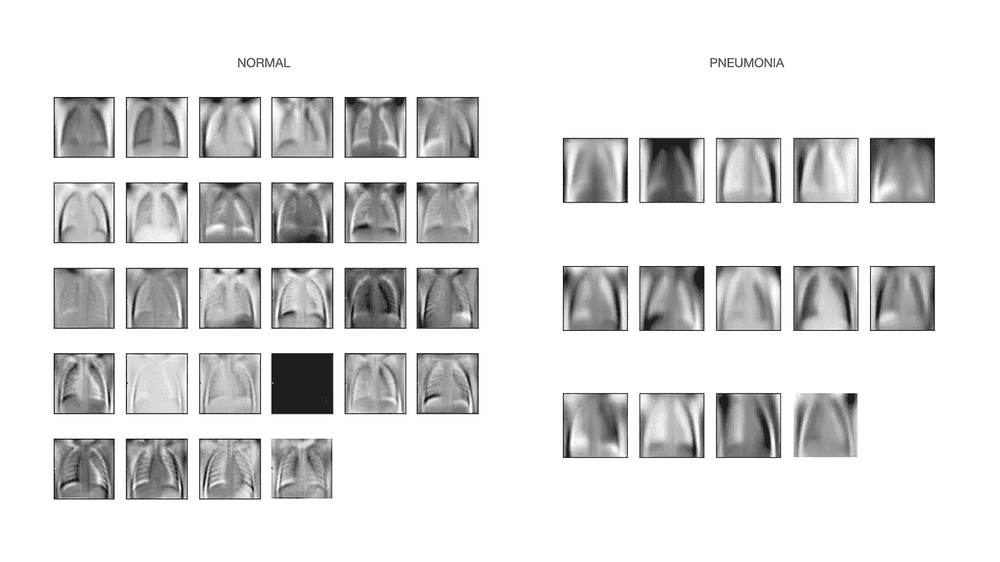
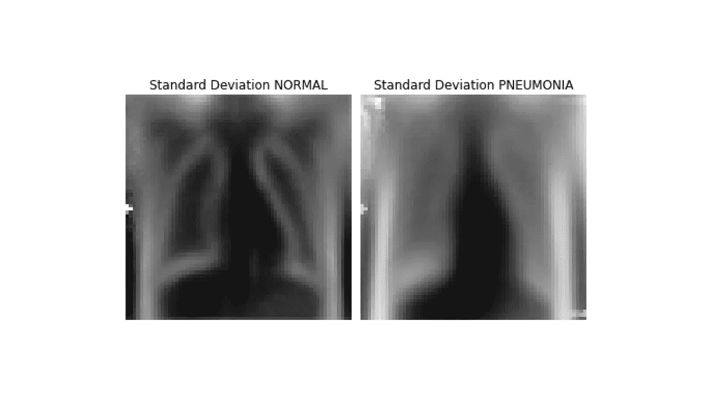
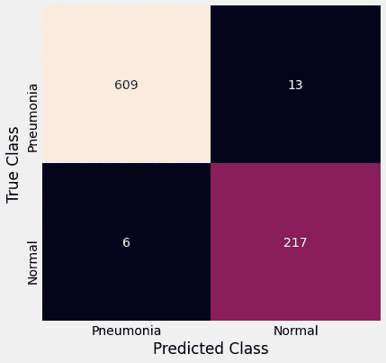

# 用 CNN 建立图像分类模型

> 原文：<https://towardsdatascience.com/detecting-pneumonia-using-convolutional-neural-network-599aea2d3fc9?source=collection_archive---------40----------------------->

## 用卷积神经网络检测肺炎



正常和肺炎 X 射线的特征图像

在这篇博客中，我将概述如何使用卷积神经网络建立一个简单的图像分类模型，以从胸部 X 射线图像中检测肺炎的存在。

肺炎是一种常见的感染，它使肺部的气囊发炎，导致呼吸困难和发烧等症状。尽管肺炎不难治疗，但及时诊断至关重要。如果没有适当的治疗，肺炎可能会致命，特别是在儿童和老年人中。胸部 x 光检查是诊断肺炎的一种负担得起的方法。开发一种能够从 X 射线图像中可靠地对肺炎进行分类的模型，可以减轻需求高的地区的医生的负担。

# 数据

Kermany 和他在 UCSD 的同事们利用深度学习，基于胸部 X 射线和光学相干断层扫描，主动识别疾病。我们使用他们研究中提供的胸部 x 光图像作为我们的数据集。

 [## 标记的光学相干断层扫描(OCT)和胸部 X 射线图像的大型数据集

### 确保下载该数据集的最新版本，以保持准确性。该数据集包含数千个…

data.mendeley.com](https://data.mendeley.com/datasets/rscbjbr9sj/3) 

# 数据结构

数据文件夹的结构如下。

```
DATA
│ 
├── train
│    ├── NORMAL
│    └── PNEUMONIA
│
├── test
│    ├── NORMAL
│    └── PNEUMONIA
│
└── validation
     ├── NORMAL
     └── PNEUMONIA
```

在删除没有适当编码的图像文件后，我们的数据集中有 5，639 个文件，我们将这些图像中的 15%用作验证集，另外 15%用作测试集。我们的最终训练集包括 1，076 个正常病例和 2，873 个肺炎病例。

# 数据探索

如果您对在图像数据上运行探索性数据分析的步骤感兴趣，请参见我以前的帖子。

[](/exploratory-data-analysis-ideas-for-image-classification-d3fc6bbfb2d2) [## 图像分类的探索性数据分析思路

### 图像数据的可视化模式

towardsdatascience.com](/exploratory-data-analysis-ideas-for-image-classification-d3fc6bbfb2d2) 

我们的探索性数据可视化显示，肺部炎症通常会阻碍心脏和胸腔的可见性，从而在肺部区域周围产生较大的可变性。

# 第一个模型

作为我们的基线模型，我们将构建一个简单的卷积神经网络，它在将图像调整为正方形矩阵并将所有像素值归一化为 0 到 1 的范围后接收图像。完整的步骤如下所示。

现在我将详细解释每个步骤。

## 1.缩放数据

`keras.image.ImageDataGenerator()`拍摄图像并根据参数创建增强数据。在这里，我们只是要求它将所有像素值重新调整为 0 到 1，而不指定任何其他增强参数。与`flow_from_directory`结合，生成器以指定的格式从目录中调用图像，然后创建重新缩放的数据。

## 2.构建模型架构

`keras.models.Sequential()`启动顺序模式。该模型将顺序处理添加的层。

`Conv2D`层是卷积层，它接收输入并通过指定数量的滤波器。内核大小指的是过滤器的尺寸。因此，在本例中，我们的 256*256*1 图像(1 表示通道数，RGB 图像有 3 个通道，而灰度图像有 1 个通道)中的每个连续 3*3 像素组将通过 32 个过滤器，生成 32 个大小为 256*256*1 的特征图。

因为 256 不能被 3 整除，所以`padding = ‘same'`用于在窗口周围添加相等的填充。

`activation = 'relu'`意味着我们将调整后的线性单位指定为激活函数。简单来说，我们是在告诉层把我们所有的负值都转换成 0。

然后，我们将卷积层的这些输出馈入池层。`MaxPooling2D`层通过仅保留卷积输出的每个 2*2 矩阵的最大值来提取卷积输出。现在，我们将有 32 个大小为 128*128*1 的特征地图。

现在，我们需要将这些四维输出缩小到一个数字，它可以告诉我们是将图像分类为肺炎还是正常。我们首先将层展平成一维，然后让它们通过越来越小的致密层。sigmoid 函数作为激活函数应用于最后一层，因为我们现在希望模型输出一个输出是否为肺炎的概率。

## 3.配置

我们已经定义了模型的架构。下一步是决定这个模型的目标，以及我们希望它如何实现。使用`model.compile`，我们告诉模型使用梯度下降来最小化二元交叉熵损失(对数损失，想想逻辑回归)。这里，我们使用 RMSprop 算法通过自适应降低学习速率来优化这个过程。在后来的模型中，我使用了 AMSGrad 算法，它对我们的问题表现得更好。

## 4.拟合数据

最后，我们完成了模型的构建。是时候拟合我们的训练数据了！默认情况下，每个时期将运行 32 个批次。我们设置`EarlyStopping`是为了防止过度拟合。如果我们的验证损失连续 5 个时期没有减少，该模型将停止运行。我将`restore_best_weights`设置为真，这样在这 5 个时期之后，它将恢复到最高的性能权重。它在我们之前创建的验证生成器上测试其性能。

## 5.估价

我们的第一个模型显示了 94%的准确性，预测了验证数据的类别，对数损失为 0.11。根据下图，我们可以看到培训损失有改进的空间，因此我们可以增加模型的复杂性。此外，验证损失似乎徘徊在 0.1 左右。我们可以尝试通过使用数据扩充来模仿添加更多数据，从而提高可推广性。


这里有一个完整的代码来绘制拟合模型的损失图和精度图。

# 模型 2

现在，我们将尝试实现数据扩充，并为我们的模型增加更多的复杂性。

## 数据扩充

这一次，我们向列车图像数据生成器添加了一些参数。因此，现在我们的生成器将通过对原始图像集应用指定范围内的不同旋转、亮度、剪切和缩放来为每批图像创建新图像。

## 模型复杂性

我们还通过增加三组卷积层和池层来增加模型的复杂性。建议随着图层的进展增加卷积过滤器的数量。这是因为当我们在这些层中移动时，我们试图提取更多的信息，因此需要更大的过滤器集。这个类比类似于我们的大脑处理视觉信息的方式。随着信号从我们的视网膜移动到视交叉，到丘脑，到初级视觉皮层，然后通过下颞叶皮层，神经元的感受野在每一步都变得更大，对复杂信息越来越敏感。

## 估价

我们的第二个模型显示了 97.3%的准确性，在验证集上的对数损失为 0.075。看来我们的调整确实改进了我们的模型！让我们在我们的测试集上测试它，以确保它们能很好地推广到看不见的数据。

# 最终性能



我们的模型以 97.8%的准确度预测了测试集中的 X 射线图像的类别。它成功地识别了 97.9%的肺炎病例。

# 结论

我们的模型表明，在给定数据集的情况下，使用卷积神经网络，它能够正确检测出接近 98%的肺炎病例。但尤其是对于生命受到威胁的医疗问题，即使只有 2%的漏诊病例也不应该简单地不予考虑。为了理解我们的模型的局限性，下一步重要的工作是对模型失败的地方进行详细的调查。