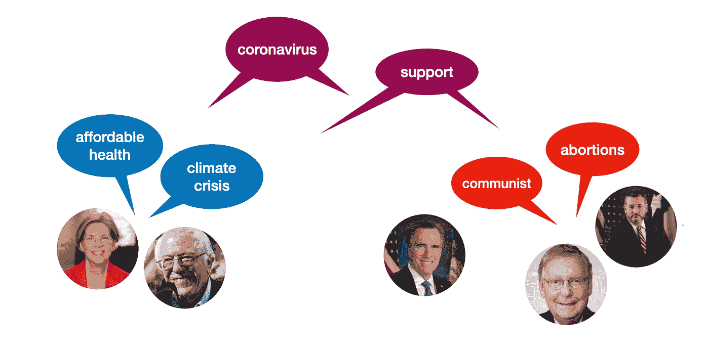
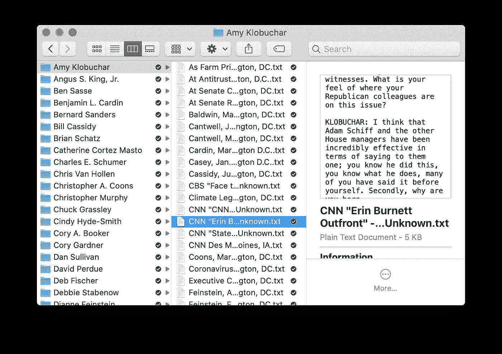
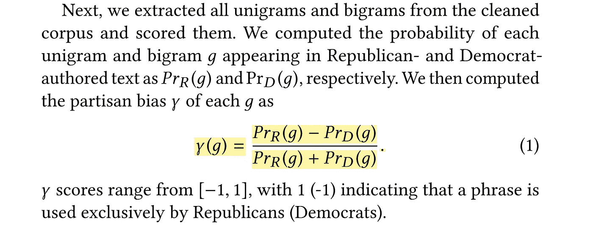

# 使用自然语言处理检测来自美国参议员的带有政治偏见的短语(教程)

> 原文：<https://towardsdatascience.com/detecting-politically-biased-phrases-from-u-s-senators-with-natural-language-processing-tutorial-d6273211d331?source=collection_archive---------70----------------------->

## 气候危机、劳动人民和负担得起的健康？还是共产主义者，自由主义者，堕胎？



早在 3 月份，我观察了 2020 年疫情选举前的投票模式，并将其与相对两党对医改法案的投票进行了比较。现在，新冠肺炎疫情已经开展了几个月，其他事件正在成为焦点——即反对警察暴行和种族不公正的示威游行。此外，我们离共和党和民主党全国代表大会只有几个月的时间，选举随后就要到来。那么，政治家们在谈论什么呢？

为了掌握这一点，我决定用 VoteSmart.org 的(我从 T4 的一篇研究论文中得到这个想法)来看看政治演讲，并看看党派短语。帖子将按如下方式进行:

1.  集合语料库
2.  提取常用短语
3.  衡量政治两极化短语

## 步骤 1:集合语料库

我从一个维护良好的数据集开始，这个数据集包含国会中的每个人，其中包含一个链接到他们的投票智能页面的 ID。为了便于阅读，我的目标是为每位立法者制作一个文件夹，其中包含他们所有发言的文本文件。我提到的研究论文使用了几种类型的演讲，但我包括了从 2020 年 1 月开始的所有类型的公开声明。

本教程将侧重于文本分析，但[你可以在这里找到抓取语料库的代码](https://github.com/jackbandy/partisan-phrases/blob/master/generate_corpus.py)。我用它从 VoteSmart 收集了超过 10，000 条独特的声明和演讲(我删除了推文和重复的声明)，不过如果你对它进行微调，并不仅仅包括参议员，你还可以收集更多。以下是伯尼·桑德斯三月份接受 CNN 采访时的一段文字样本:

```
COOPER: Now to our interview with Senator Bernie Sanders. He is campaigning in the Super Tuesday state of Minnesota.Senator Sanders, thanks for being with us. You just heard Mayor Buttigieg endorsing Vice President Biden. Klobuchar is expected to do the same tonight, as is Beto O'Rourke. How does the consolidation of the moderate vote affect your plans moving forward, especially since Senator Warren shows no signs of getting out?SEN. BERNIE SANDERS (D-VT), PRESIDENTIAL CANDIDATE: Well, Anderson, I think, as you know, from day one we have been taking on the establishment, whether it is the corporate establishment, you know, Wall Street, the drug companies, the insurance companies, the fossil fuel industry, or the political establishment.And let me be very clear, it is no surprise they do not want me to become president because our administration will transform this country to create an economy and a government that works for all of the people, not just the 1 percent. It will not be the same old same old....
```

这是有组织的语料库的样子:



## 步骤 2:提取常用短语

下一步是通过将文本分割成标记来提取短语。我使用了 [scikit-learn 的令牌矢量器](https://scikit-learn.org/stable/modules/generated/sklearn.feature_extraction.text.CountVectorizer.html)，因为它有一些很棒的内置特性。下面是设置一切看起来有多简单:

```
from sklearn.feature_extraction.text import CountVectorizer
from nltk.corpus import stopwordsnltk_stop_words = stopwords.words('english')tf_vectorizer = CountVectorizer(max_df=0.8, min_df=50,
    ngram_range = (1,2),
    binary=True,
    stop_words=nltk_stop_words)
```

停用词(即`nltk_stop_words`)有助于去除无信息的单词，常见的例子有“of”、“to”和“and”我使用 NLTK 的列表是因为 scikit 的内置列表有一些已知的问题。然后，`tf_vectorizer` (tf 代表“术语频率”)通过一些设置进行初始化:

*   `max_df=0.8`意味着排除出现在 80%或更多文档中的短语(类似于停用词，它们不太可能提供信息，因为它们太常见了)
*   `min_df=50`意味着该词必须在语料库中出现至少 50 次才能被纳入分析(我使用 50 次，因为我提到的研究论文也是如此，尽管您可以尝试不同的临界值)
*   `ngram_range=(1,2)`意味着包括一个单词和两个单词的短语(你可以很容易地将它设置为`(1,3)`来包括三元组/三个单词的短语
*   `binary=True`表示只计算一个单词在给定文档中出现的次数(即 0 或 1)，而不是精确计算它出现的次数(即 0 或 1 或 2 或 3 或…)
*   `stop_words=nltk_stop_words`插入前一行中设置的 NLTK 停用词表，这样就不包括“of”和“to”这样的词

使用文件 I/O 将文本放入列表后，`tf_vectorizer`可以将文本转换成只有一行的短语矩阵:

```
term_frequencies = tf_vectorizer.fit_transform(texts_list)
```

现在，`term_frequences`是一个矩阵，包含来自矢量器的每一项的计数。我们可以把它变成一个数据框架，让事情更直观，看到最常见的短语:

```
phrases_df = pd.DataFrame(data=tf_vectorizer.get_feature_names(),columns=['phrase'])phrases_df['total_occurrences']=term_frequencies.sum(axis=0).Tphrases_df.sort_values(by='total_occurrences',ascending=False).head(20).to_csv('top_20_overall.csv',index=False)
```

生成的 csv 文件如下所示:

## 步骤 3:衡量政治两极化短语

首先，我们需要将民主党和共和党撰写的文章分开，然后得到它们的词频矩阵。熊猫数据框架让这变得相当容易:

```
dem_tfs = tf_vectorizer.transform(texts_df[texts_df.party=='Democrat'].text.tolist())rep_tfs = tf_vectorizer.transform(texts_df[texts_df.party=='Republican'].text.tolist())
```

现在到了有趣的部分:找出哪些短语带有政治色彩。以下是解释这种方法的文章部分(关键公式突出显示):



你可能会注意到公式中只有两个变量:民主党人撰写的文本的短语概率和共和党人撰写的文本的短语概率。因此，为了计算党派偏见分数，我们只需要计算这两个概率，我将其简称为`p_dem`和`p_rep`。一旦我们有了这些，每个短语的偏差分数就是:

```
bias = (p_rep - p_dem) / (p_rep + p_dem)
```

我使用了一个基本的概率度量:包含一个短语的文档数除以文档总数。有一些更复杂的方法来衡量概率，但根据我对论文的阅读，这可能是作者所做的。

快到了！现在，我们只需要将偏见分数放入之前的`phrases_df`数据框架中，然后我们就可以轻松地查看一些常见的党派短语。当我第一次运行这个时，一些名字短语，如“参议员哈里斯”和“参议员帕蒂”是最具党派性的——一个抄本的人工制品。为了解决这个问题，我做了一个过滤器，以确保至少有三名参议员使用党派短语:

```
top_rep = phrases_df.sort_values(by='bias_score',ascending=False).head(100)top_rep['n_senators'] = top_rep.apply(lambda x: len(texts_df[texts_df.text.str.contains(x.phrase)].person.unique()),axis=1)top_rep = top_rep[top_rep.n_senators > 2]
```

现在，我们终于可以看到党派短语了！你会注意到他们与党派议程保持一致，例如，民主党人谈论气候危机和医疗保健，而共和党人谈论堕胎。

这里是最倾向于民主党的短语，以及我们计算的分数和概率。

和最倾向共和党的短语:

有了这些短语和它们的偏见分数，你可以衡量推特、演讲、文章等的政治偏见。通过计算党派短语的频率:如果一篇文章大量谈论未出生者、自由主义者和共产主义者，它可能倾向于共和党，而如果一篇文章谈论气候危机、劳动人民和可负担的健康，它可能倾向于民主党。

*感谢阅读！所有代码都是可用的，语料库也将很快可用，在这个资源库:*

[](https://github.com/jackbandy/partisan-phrases) [## 流氓/党派用语

### 分析美国参议员的党派短语。有助于 jackbandy/党派短语的发展，创造一个…

github.com](https://github.com/jackbandy/partisan-phrases)