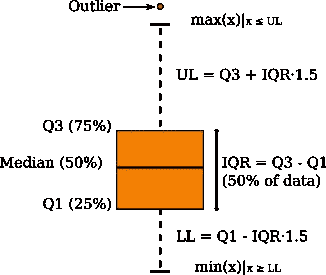

# 检测流数据中的实时和无监督异常:一个起点

> 原文：<https://towardsdatascience.com/detecting-real-time-and-unsupervised-anomalies-in-streaming-data-a-starting-point-760a4bacbdf8?source=collection_archive---------12----------------------->

图 1:智能设备生成实时数据，这些数据可能会出现异常，如果我们不检测并正确管理它们，就会导致我们做出错误的数据驱动型决策。图片来自 pixabay.com。

传感器通过收集各种系统中的数据来实现物联网( [*物联网*](https://en.wikipedia.org/wiki/Internet_of_things) )。数据通常以实时方式产生，然后我们可能会发现自己被迫进行实时处理(*流数据挖掘* [1】)。系统的行为并不总是恒定不变的，而是可能表现出一种不寻常的、明显不同于先前正常行为的行为( ***异常***【2】)。异常检测是有价值的，但在实践中，它可能会变成一项难以可靠执行的任务。

本文并不声称是方法和解决方案的详尽列表，但是对于那些第一次处理这个问题并且需要简单、可理解和可伸缩的解决方案的从业者来说，它确实是一个简单的切入点。异常可能存在于真实世界的应用中，例如欺诈预防、金融、能源需求或消耗、电子商务、网络安全、医疗诊断、社交媒体、预测性维护或故障检测等。本文分析了一些处理异常的算法。它们是 *Welford 的*算法，基于*四分位数*的解决方案，基于 *z-score* 度量的解决方案，以及基于机器学习的解决方案，称为*半空间树(HST)。*前 3 个解决方案基于统计指标/度量，而最后一个来自机器学习领域。

## 流媒体:游戏规则

与*批处理学习*相反，批处理学习【】中假设数据是静止的(历史数据是可用的)，并且模型不连续地将新信息集成到已经构建的模型中， ***流学习*** 对实时处理施加约束:

*   流中的实例(数据)在线到达(通常一次一个实例),并且最多可以被读取一次，这构成了处理数据流的最强约束，并且系统必须决定当前实例是应该被丢弃还是存档。
*   只有选定的过去实例可以通过将它们存储在内存中来访问，相对于数据流的大小，内存通常较小。当设计流学习算法时，我们必须考虑几个算法和统计因素。例如，我们必须面对这样一个事实，即由于我们不能存储所有的输入，我们不能撤销根据过去的数据做出的决策。
*   每个实例的处理时间必须小且恒定。
*   处理算法必须产生一个模型，该模型等同于由*批次*处理算法产生的模型。

这组约束是大多数现有的用于 *bacth* 处理的异常检测算法不适用于*流*应用的原因。

在大多数实际情况下，数据由一个连续的单变量数据集组成，其中关于异常的监督信息(有多少，在哪里)是不可用的。

## 威尔福德算法

Welford 的方法是一种可用的单程方法，用于计算运行方差或运行标准差。它可以通过查看 N 个和 N-1 个实例的平方差之和的差来导出。不需要为第二次传递存储数据[3]。为了将 Welford 的方法用于异常检测问题，我建议加入以下简单的修改。

> *我们创建一个上限(UL)和一个下限(LL)。当*在线平均消耗*(橙色实线)* *克服这些限制中的任何一个(或* X *乘以*在线标准偏差*，那么我们将该读数(实例)归类为异常。限值(黑色虚线)可计算如下:*
> 
> UP =在线平均消费+X *在线标准差
> 
> LL =在线平均消耗量-X *在线标准偏差

*X* 越高，我们假设的假阴性(FNs)就越多，而 *X* 越低，我们获得的假阳性(FPs)就越多。因此， *X* 的选择不是微不足道的，并且在该参数 *X* 与 FPs 和 FNs 之间存在权衡。然后，你需要定义 *X=1，2，3，4，…* 等等。取决于这个决定。如您所见，每次新实例到达时，*在线平均消耗*和限制都会在线更新。

**代码**:原方法的简单实现可以在[这里](https://gist.github.com/alexalemi/2151722)找到。

**注释**:读数=0 应视为异常与否。您还注意到，根据读数和 *X.* 的不同，LL 可能低于 0，如果这对于您的图表是个问题，可以很容易地调整这一事实。请注意，如果您获得许多连续的异常，您可能需要将它们视为唯一的异常，或者甚至视为“异常”周期。最后，我想提一下使用大小为 *w、*的滑动窗口的可能性，并计算它上面的所有指标。

## 基于四分位数的解决方案

箱线图是一种基于一组数字汇总来表示数据集分布的流行方法:最小值、第一个四分位数(Q1 **/** 第 25 个百分位数)、中值、第三个四分位数(Q3/75 个百分位数)和最大值。这种表示可以告诉您异常值及其值。

图 5:箱线图的元素。图片修改自[维基共享](https://es.wikipedia.org/wiki/Archivo:Boxplot.svg)。

**四分位距(IQR)** 从 Q1 到 Q3，我们可以计算最大值和最小值如下:

> 最大值=Q3+1.5*IQR
> 
> 最小值=Q3-1.5*IQR

(关于 boxplots 和 quartiles 的更多详细信息，我建议您查看以下文章:[https://towardsdatascience . com/understanding-box plots-5e 2 df 7 bcbd 51](/understanding-boxplots-5e2df7bcbd51))

然后，我们可以将所有高于最大值或低于最小值的点视为异常值。我们可以在线计算这些数字汇总。

**代码:**如你所见，这个解决方案很容易实现。对于懒惰的人来说，在已知的存储库或其他网站上有许多这种方法的可用实现。

**注意**:这里我们也可以使用前面提到的滑动窗口。

## 基于 z 分数度量的解决方案

标准分数或 z 分数( *z* )给出了一个数据实例离均值有多远的概念，即原始分数高于或低于总体均值多少个标准差。

> *实例* x *的 z 值可以计算为:*z =(x-μ)/σ

标准分数也可以通过在线方式计算。但这一次，我们使用了滑动窗口，然后被称为运行或移动 z 分数。给定此窗口大小 *w* ，移动 z 值将是每个实例偏离平均值的标准偏差数，其中平均值和标准偏差仅在之前的 *w* 实例中计算。

**代码:**如你所见，这个解决方案很容易实现。对于懒人来说，这个方法在众所周知的源代码库中有很多可用的实现。

## *半空间树*

半空间树(HST) [4]是一个快速的单类异常检测器，用于进化数据流。它只需要正常的数据进行训练，并且在异常情况及时扩散时工作良好。如果在时间窗口内将异常打包在一起，效果并不好。这种技术是随机 HST 的集合，其中每个树结构都是在没有任何数据的情况下构建的，这使得该技术非常高效，因为它在适应进化的数据流时不需要模型重构。

这种技术是增量训练的，并且使用滑动窗口 *w.* 其他相关参数是集合中的树的数量( *nt* )，以及用于声明异常的阈值( *th* )。任何高于此阈值的实例预测概率都将被声明为异常:分数越低，当前实例越有可能是异常的。要了解更多关于所有参数的信息，请查看下面的代码部分，或这篇[论文](https://www.ijcai.org/Proceedings/11/Papers/254.pdf)。

**代码:**这个解决方案可以在 [Creme](https://creme-ml.github.io/generated/creme.anomaly.HalfSpaceTrees.html#creme.anomaly.HalfSpaceTrees) 或者 [scikit-multiflow](https://scikit-multiflow.github.io/scikit-multiflow/_autosummary/skmultiflow.anomaly_detection.HalfSpaceTrees.html) 中找到，这两个框架都是用 Python 实现的。

## 其他方法

它也值得特别注意一些其他已知的方法，其中包括:

*   局部异常因素(LOF，见[此处](https://scikit-learn.org/stable/modules/generated/sklearn.neighbors.LocalOutlierFactor.html)更多细节)，
*   单变量参数方法，如 *Grubb* 检验(平均值可能是离群值的 mak)或 *Tietjen y Moore* 检验(可能会遭受淹没)，
*   不要忘记检查[5]，在那里已经进行了许多检测器之间的广泛比较。

## 结论

*   正如您已经意识到的，所有这些技术都需要调整一个或多个参数，这些参数会影响它们在 FPs 和 FNs 方面的性能(参见 [F1-score](https://en.wikipedia.org/wiki/F1_score) 性能指标)。
*   由于这是一个无人监管的场景，因此为了评估该技术的性能，以及正确地找到 FPs 和 FNs 之间的平衡，具有该领域的广泛知识是非常重要的。在任何情况下，他们的评价都是主观的，这就是领域知识至关重要的原因。
*   每种技术根据不同的标准发现异常，因此它们不一定与其分类相匹配(异常是/否)。但是我们可以找到相似之处，例如在基于度量的解决方案和 T2 的解决方案之间。
*   最后，您应该考虑将这些技术组合在一起的可能性，因为它们可以互补并检测不同类型的异常。

## 参考

[1] *比费特，a .，霍尔姆斯，g .，柯克比，r .，&普法林格，B. (2010)。Moa:海量在线分析。机器学习研究杂志，11(5 月)，1601–1604。*

[2]*钱德拉，v .，米塔尔，v .，T15 库马尔，V. (2008 年 12 月)。序列数据异常检测技术的比较评估。2008 年第八届 IEEE 数据挖掘国际会议(第 743-748 页)。IEEE。*

[3] *Knuth，D. E. (2014)。计算机编程艺术，第 2 卷:半数值算法。艾迪森-韦斯利专业版。*

[4] *S.C.Tan，K.M.Ting，和 T.F.Liu，“流数据的快速异常检测”，载于《国际人工智能联合会议论文集》, 2011 年，第 22 卷，第 1 期，第 1511-1516 页。*

[5] *艾哈迈德，s .，拉文，a .，波弟，&阿迦，Z. (2017)。流数据的无监督实时异常检测。神经计算，262，134–147。*