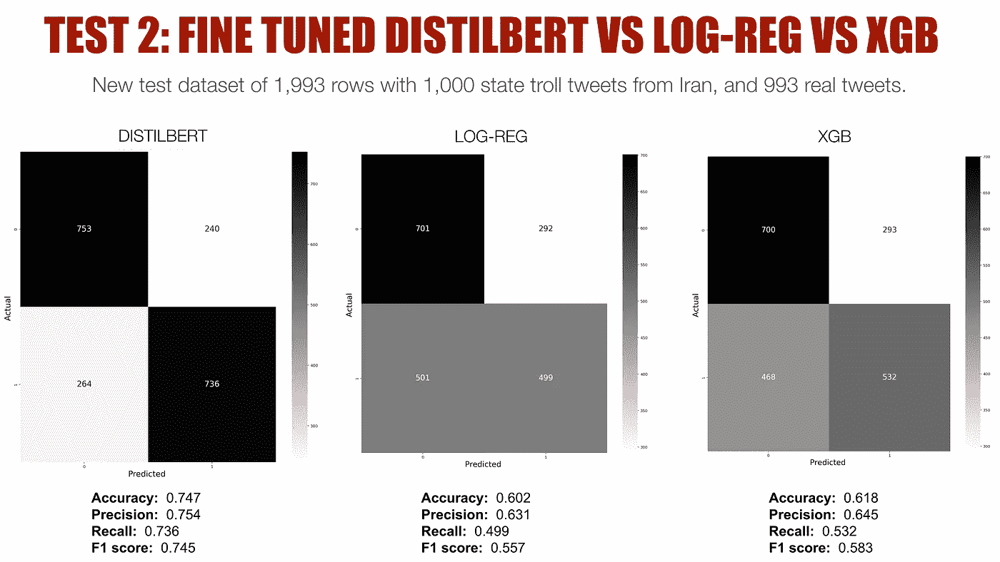

# 用变形金刚探测国家支持的推特巨魔

> 原文：<https://towardsdatascience.com/detecting-state-backed-twitter-trolls-with-transformers-5d7825945938?source=collection_archive---------63----------------------->

## 一个在定制数据集上微调 Distilbert 模型的实际用例，并针对更常用的模型(如逻辑回归和 XGBoost)测试其性能


web 应用程序插图作者:蔡金汉

随着 2020 年美国大选的临近，对国家行为者通过社交媒体和其他在线手段干预[选举的担忧再次成为人们关注的焦点。](https://www.nytimes.com/2020/09/10/us/politics/russian-hacking-microsoft-biden-trump.html)

Twitter 是俄罗斯用来[干涉 2016 年美国大选](https://en.wikipedia.org/wiki/Russian_interference_in_the_2016_United_States_elections)的一个主要平台，很少有人怀疑俄罗斯、中国和其他国家会再次转向这个平台，发起新的造谣运动。

这篇文章将概述如何通过使用自定义数据集微调 transformer 模型( [Distilbert](https://huggingface.co/transformers/model_doc/distilbert.html) )来构建 state troll tweets 检测器。这建立在我的早期项目[的基础上，使用“经典”的机器学习模型和简单的单词袋方法来检测 state troll 推文。](https://github.com/chuachinhon/twitter_state_trolls_cch)

我还将比较微调后的 Distilbert 模型与逻辑回归和 XGBoost 模型的结果，看看 transformer 模型在实际用例中是否真的表现得更好。

**剧透提示:**微调后的 transformer 模型的表现明显好于 Log-Reg 和 XGBoost 模型(当然，它们也不是没精打采的)，并且在面对来自第三国的 state troll 推文时表现得更好。请跳到第 4 部分查看结果。

# 1.基础事实、数据来源、模型和回购

首先:我如何确定谁的推文被认为是国家影响力运动的作品？在这种情况下，地面真相是由 Twitter 的选举诚信团队建立的。

该项目中使用的 state troll 推文是那些已经由 Twitter[识别并自 2018 年](https://transparency.twitter.com/en/reports/information-operations.html)以来逐步向公众发布的推文。我从 Twitter 上选择了六组 state troll 推文——中国和俄罗斯各三条——我对它们进行了清理、合并，并缩减到 [5 万行](https://github.com/chuachinhon/transformers_state_trolls_cch/blob/master/data/troll_50k.csv)。

我通过使用 [Tweepy](https://www.tweepy.org/) 收集 175 个账户，创建了一组等价的 [5 万行真实推文](https://github.com/chuachinhon/transformers_state_trolls_cch/blob/master/data/real_50k.csv)，这些账户由经过验证的用户和我亲自检查真实性的用户组成。由此产生的 100，000 行 state troll-plus-real tweets 的组合数据集被进一步分成通常的训练测试验证集，分别为 70:20:10 的标准比例。

完整的细节在我的[笔记本](https://github.com/chuachinhon/transformers_state_trolls_cch/tree/master/notebooks)里，为了简洁起见，我就不在这里重复了。此处提供完整回购[。微调是在一个 Colab Pro 账户上完成的，花了大约五个半小时。](https://github.com/chuachinhon/transformers_state_trolls_cch)

微调过的 Distilbert 模型对于 Github 来说太大了，但是我已经上传了一个[副本到 Dropbox](https://www.dropbox.com/sh/90h7ymog2oi5yn7/AACTuxmMTcso6aMxSmSiD8AVa) 上，供那些只想尝试这个模型的人使用。如果您希望创建一个更大的训练集，那么必须从 Twitter 下载包含 state troll tweets 的六个原始 CSV 文件。

# 2.数据准备

应该指出的是，数据清理和准备过程中的关键假设会影响结果。这些假设对于保持项目范围的实用性是必要的，但是如果您不同意这些假设，请同意根据您自己的首选清理规则对不同版本的数据进行切片。

我对这个项目的主要数据清理规则:

*   排除非英语推文，因为工作假设是目标受众是讲英语的。我还想防止模型根据语言做出预测。
*   排除转发。
*   排除文本清理后少于三个单词的推文。

出于实际原因，我还将最终的组合数据集保持在 100，000 行。我最初尝试用 600，000 行数据集对 Distilbert 进行微调，结果导致 Colab 笔记本反复崩溃和/或显示非常长且不切实际的运行时间。如果不能获得更多的计算/硬件，这个项目更雄心勃勃的版本是不切实际的。

# 3.使用自定义数据集微调 DISTILBERT 模型

对于这个项目，我选择了[无壳蒸馏模型](https://huggingface.co/distilbert-base-uncased)(更小，更容易管理)，并使用[拥抱脸的教练](https://huggingface.co/transformers/master/main_classes/trainer.html)来完成任务。在运行了太长时间的几次尝试后，我放弃了尝试进行[超参数搜索](https://huggingface.co/transformers/master/main_classes/trainer.html#transformers.Trainer.hyperparameter_search)，并希望在未来的某一天回到这个主题(查看这里的讨论)。

所涉及的步骤相当简单，如我的回购的[笔记本 2.0](https://github.com/chuachinhon/transformers_state_trolls_cch/blob/master/notebooks/2.0_finetune_distilbert_colab_cch.ipynb) 中所述。代码大部分基于拥抱脸[这里](https://huggingface.co/transformers/master/custom_datasets.html)和[这里](https://huggingface.co/transformers/master/main_classes/trainer.html)的优秀例子和文档。

微调的直接结果当然令人印象深刻:

```
'eval_accuracy': 0.9158421345191773,
 'eval_f1': 0.9163813100629625,
 'eval_precision': 0.9098486510199605,
 'eval_recall': 0.9230084557187361
```

我对验证集运行了一个快速测试——保留了 10，000 行，而模型根本没有看到*—*——优秀的分类指标几乎没有变化:

```
'eval_accuracy': 0.9179, 
'eval_f1': 0.9189935865811544, 
'eval_precision': 0.9178163184864012, 
'eval_recall': 0.9201738786801027
```

为了进行更彻底的比较和分析，我使用用于微调 Distilbert 模型的相同数据集训练了两个独立的逻辑回归和 XGB 分类器模型。让我们看看他们在同样的测试中表现如何。

# 4.微调 DISTILBERT 与 LOG-REG 和 XGB

腌制的 Log-Reg 和 XGB 模型可以在我的 repo 的[“pkl”文件夹](https://github.com/chuachinhon/transformers_state_trolls_cch/tree/master/pkl)中找到。我的笔记本详细记录了他们的优化过程，这里是，这里是。这里就不赘述了，只强调两个模型在训练和网格搜索中的得分都在 0.8 以上。虽然明显低于微调 Distilbert 模型的分数，但我认为这两个模型做得足够好，可以提供足够的比较。

下面的图表通过混淆矩阵显示了所有三个模型在验证集(10，000 行，包括 5，061 条 state troll 推文和 4，939 条真实推文)上的表现。


图片作者:蔡展汉

一眼看去，很明显，微调过的 Distilbert 模型(最左边)是表现最强的，比 Log-Reg 或 XGB 模型准确地挑选出了更多的状态 troll 和真实 tweets。更重要的是，Distilbert 模型的假阳性和假阴性数量大约是 log-reg 和 XGB 模型的一半。

因此，尽管这三个模型的性能指标似乎很接近，但通过混淆矩阵来看，它们的分类能力差距变得非常明显，这让我们更好地了解它们在分类成千上万条推文中的表现。

# 4.1 3 种型号的附加测试

所有三个模型都接受了来自中国和俄罗斯的真实推文和国家巨魔推文对半分的训练。事实上，我们并不知道 Twitter 上真人和巨魔的实际比例。更重要的是，state troll 推文可能来自任何国家，语气、语言和主题的变化可能会显著影响分类器将真实推文与来自国家支持的竞选活动的推文区分开来的能力。

如果暴露在来自第三国的国家巨魔推文中，这三个模型中的哪一个会保持得更好？为了找到答案，我通过三个模型运行了一个新的数据集——包括来自伊朗的 1000 条 troll 推文和来自美国用户的 993 条真实推文。这个新的数据集是从我在同一主题上做的[早期项目中创建的。](https://github.com/chuachinhon/twitter_state_trolls_cch)



图片作者:蔡展汉

正如所料，所有三个分类器在暴露于他们以前没有见过的伊朗国家巨魔推文时，他们的性能显著下降。

但在我看来，微调后的 Distilbert 模型仍然相当不错。与 Log-Reg 或 XGB 模型相比，它不仅正确地挑选出了更多的 troll 和真实推文，而且假阴性(模型认为是真实推文的 troll 推文)的数量也不是非常多。

这在 Log-Reg 模型中尤其成问题，该模型将一半(1000 条中的 501 条)的 troll 推文归类为真实推文，而实际上它们是由国家支持的运营商所为。XGB 模型在这方面稍好一些，但不是很好，假阴性的数量(468)明显高于假阳性的数量。

对于我在早期项目中训练的模型来说，这是一个特别明显的[问题，这意味着在一个特定的州演员的 troll 推文中训练的分类器非常善于发现来自所述州演员的新的、看不见的推文。但是，一旦来自另一个国家运营商的 troll tweets 被注入混合，分类器的性能就会显著下降。](/using-data-science-to-uncover-state-backed-trolls-on-twitter-dc04dc749d69)

微调后的 Distilbert 模型并没有完全克服这个问题，但它足够好地支持了一个可以更好地“概括”的模型的希望。如果你有足够的计算资源在一个更大的数据集上训练一个 transformer 模型，这个数据集包括迄今为止 Twitter 识别的所有国家的 state troll tweets，那么有理由认为，上述模型*可能*在我们在这篇文章中尝试的测试中做得更好。

不幸的是，这是一个假设，我将不得不在另一个时间进行测试。

# 5.结论

当然，对 Twitter 上国家影响力活动的检测不仅仅包括对推文的审查。国家巨魔通常会留下更大的泄露秘密的迹象，比如账户创建的(协调)日期，或者他们发推的时间。照片和迷因的使用越来越多，也使得检测过程变得更加棘手。

但是在他们的推文中发现趋势和隐藏的结构将继续是一个主要的关注领域。与更流行的或传统的分类器相比，微调的 transformer 模型在这项任务中表现得更好。

当然，在资源和时间方面有所取舍。对大多数用户来说，在一百万行 tweets 上微调 transformer 模型所需的硬件并不容易获得，更不用说这是否是处理这项任务的最有效方式了。

# 6.奖励部分:网络应用

我尝试将微调后的 Distilbert 模型作为一个简单的 web 应用程序的一部分进行部署，但很快发现免费托管帐户没有足够的磁盘空间来在托管模型的基础上安装 pytorch。

但是我已经将必要的文件上传到 repo，以便任何想在本地机器上尝试的人使用。只要确保从 Dropbox 下载微调后的模型[，并将其移动到“app”文件夹。](https://www.dropbox.com/sh/90h7ymog2oi5yn7/AACTuxmMTcso6aMxSmSiD8AVa)


Gif 作者:蔡钦汉

和往常一样，如果你在这篇文章或我之前的文章中发现了错误，请联系我:

*   推特:[蔡振鸿](https://medium.com/u/b3d8090c0aee?source=post_page-----aad7f2e1d0a0----------------------)
*   领英:【www.linkedin.com/in/chuachinhon 