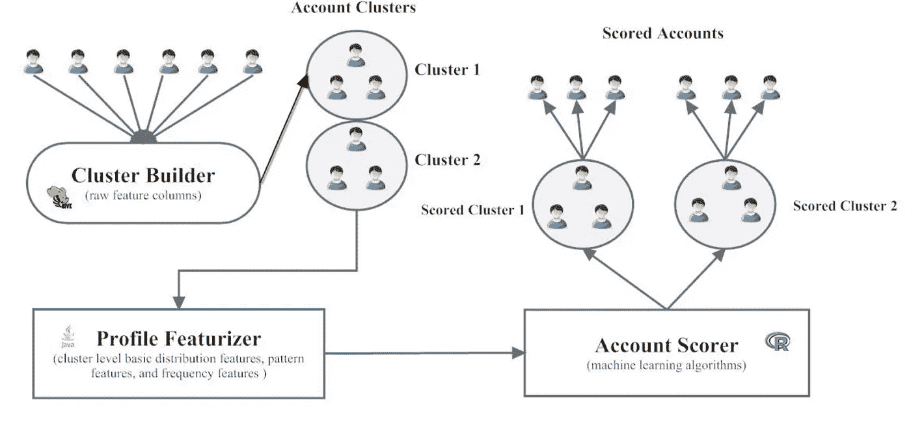

# 检测在线社交网络中的可疑账户

> 原文：<https://towardsdatascience.com/detecting-suspicious-accounts-in-online-social-networks-48eabf4c75b6?source=collection_archive---------38----------------------->

## 基于特征的分类方法

图片来源:[www.bluecoat.com/](https://www.bluecoat.com/)

近年来，社交媒体的覆盖范围和受欢迎程度大幅上升。许多社交媒体平台拥有数百万用户。就像他们说的，好的会带来坏的。除了吸引真正的订户，在线社交网络也吸引了不良行为者的注意。僵尸程序和恶意账户占据了用户群的很大一部分。幸运的是，就像真实用户一样，虚假用户也会在数据中留下痕迹，从而能够检测到这些不需要的和潜在危险的帐户。

在这篇文章中，我描述了不同的虚假用户场景，以及如何使用基于特征的分类技术来检测这些用户，正如研究论文中所解释的那样。

# 检测个人虚假账户

一般来说，人类的行为与假账户或机器人账户不同。如果这种行为差异可以在数字或分类属性中捕捉到，那么机器学习技术就可以应用于检测真假。这是检测恶意账户的基于特征的分类方法的本质。

在账户层面检测真实或虚假状态的洗钱过程有 3 个组成部分。

1.  **功能设计**

网络中的单个用户和用户组可以用两类特征来描述:

*   注册时或注册前后出现的属性-个人资料特征
*   随着时间发展的属性——与网络中其他用户的联系、活动或行为模式

根据检测假冒用户的时间敏感性，设计的功能可能来自上述一个或两个类别。如果限制虚假用户与真实用户的交互是至关重要的，那么仅使用简档特征的方法是有用的。

研究和调查有助于通过增加用户了解来更好地进行功能设计。

2.**功能选择**

在 OSN(在线社交网络)中，可能有大量属性与一个账户相关联——使用所有这些特征可能会变得计算量很大。在一些特征中可能存在冗余，或者一些特征可能不是用户状态的良好预测器。

特性选择解决了其中的一些问题。包装器和过滤器方法通常用于包括最佳预测器。为每个属性分配一个权重，所选择的属性是那些权重高于某个阈值的属性。

3.**模型训练和评估**

在分类任务中表现良好的一些算法——随机森林、决策树、支持向量机、朴素贝叶斯和神经网络。从特征选择步骤确定的加权属性可以应用于这些算法。常用的指标有精度、召回率和 F 值。

## 表演

对于所使用的数据集，考虑到 F-score 和精度，随机森林算法表现良好。随着权重的增加，其他算法也开始表现得更好。当使用权重高于 50%的特征时，考虑到精度，SVM 给出了最好的预测，而朴素贝叶斯在 F 分数度量中表现最好。

# 检测由同一代理创建的虚假账户群

在大规模的 OSN 中，一个坏演员可以创建几十到几千个恶意账户。像大多数虚假用户检测技术一样，对每个账户进行预测，可能不具有可扩展性或效率。在这种情况下，集群级检测是合乎需要的。

合法用户群显示出档案模式的多样性，而由单个参与者创建的虚假账户群显示出相似的属性分布和频率。因此，描述整个聚类的工程特征允许检测虚假账户的聚类。

预测每个用户的状态和一个组的状态的方法之间的主要区别是特征的级别——个体或集群。

接下来描述在集群上操作的基于分类的机器学习流水线。有 3 个主要组件。

群集检测 ML 管道

1.  **聚类生成器**

该组件获取帐户的原始列表，并构建帐户聚类及其原始特征。该模块有 3 个用户指定的参数 a)最小和最大集群大小 b)注册账户的时间跨度(例如，过去 24 小时)，以及 c)集群标准(例如，注册 IP 地址)。

该组件的输出是一个帐户表，其中每一行代表一个帐户，并包含用户名、组织、教育和帐户集群特有的集群标识符等特性。

集群生成器还使用个人帐户的假或真状态来将集群标记为假或真。阈值“x”决定分类标签—分类中的虚假帐户少于 x %,则它是真正的分类。

2.**个人资料特征化**

该模块将每个聚类的原始数据转换成代表该聚类的单个数字向量。它被实现为一组从原始特征中提取信息的函数。这些特征可以是

a)基本分布特征——每列的统计测量。数值特征的平均值或四分位数，类别特征的唯一值的数量

b)模式特征—将用户生成的文本映射到分类空间(例如电子邮件地址中的模式)

c)频率特征——每个特征值在所有单个账户中的频率，以及它们在这些频率上的分布。合法帐户的群集有一些高频率和一些低频率的数据，然而，恶意帐户的群集在它们的数据频率上显示较少的变化。

3.**账户计分器**

第三个组成部分是训练模型，并根据以前未见过的数据评估它们的性能。该模块可以在*训练模式*或*评估模式下运行。*输出为模型描述和评估指标(训练模式)或聚类得分(评估模式)，即由虚假账户组成的聚类的可能性。

## 绩效和评估指标

考虑的回归方法 1)具有 L1 正则化的逻辑回归 2)具有径向基函数核的支持向量机 3)随机森林

当考虑由 [AUC 和 95%精度的召回](https://machinelearningmastery.com/roc-curves-and-precision-recall-curves-for-classification-in-python/)测量的预测性能时，随机森林表现最佳。采用 RBF 核的 SVM 在 AUC 值方面也有不错的表现，但是它的召回@p95 不如 random forest。逻辑回归的性能最差，因为它是线性分类器，不能很好地模拟模式中的非线性。

# 基于特征的分类方法的考虑

用户行为模式很少是固定不变的，它们会随着时间的推移而发生变化，通常是对应用程序内外因素的反应。攻击者也一样！他们修改自己的内容和活动模式，以逃避检测。基于特征的技术易受此影响，必须定期进行多样化以跟上变化的模式。

使用分类器时，高维(非常大量的特征)数据可能导致计算成本增加。这可以通过使用降维或特征子集选择等特征降维技术来缓解。

# 结论

基于特征的分类方法是检测机器人和其他恶意用户的常用方法。它可以很好地扩展到大型 osn，并提供良好的性能。基于图形的技术也常用于检测虚假用户，但是基于特征的方法和简档属性允许早期检测。有许多分类算法可以迭代和调整性能。像 SVM 神经网络这样的组合可以进一步改善预测。总的来说，基于特征的分类提供了一个多样化的工具箱，可以调整并应用于多种情况。

[1]:埃拉扎布，艾哈迈德&马哈茂德，马哈茂德&赫夫尼，希沙姆。(2016).基于最小加权特征集的 Twitter 虚假账户检测。《国际计算机、电气、自动化、控制与信息工程杂志》2016 年第 10 卷第 1 期。

[2]:萧，曹&弗里曼，大卫&华，西奥多。(2015).*检测在线社交网络中的虚假账户群*。91–101.10.1145/2808769.2808779.

[3]:哈立德、萨拉&埃尔-塔齐、尼亚马特&莫赫塔尔、霍达。(2018).*检测社交媒体上的虚假账号*。3672–3681.10.1109/bigdata . 18666 . 186686866616