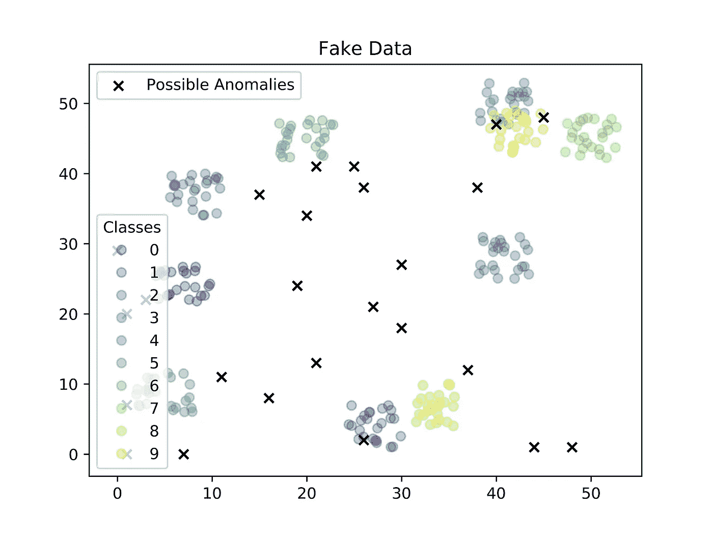
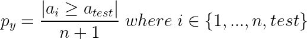
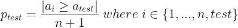
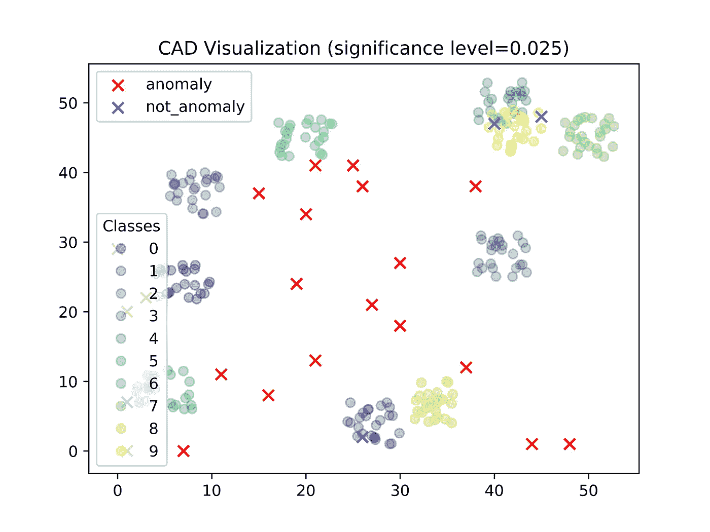

# 检测异常数据:共形异常检测

> 原文：<https://towardsdatascience.com/detecting-weird-data-conformal-anomaly-detection-20afb36c7bcd?source=collection_archive---------31----------------------->

## 共形预测和共形异常检测框架介绍(附代码)

怪异的数据很重要。通常在数据科学中，目标是发现数据的趋势。然而，考虑医生查看肿瘤图像、银行监控信用卡活动或使用摄像头反馈的无人驾驶汽车，在这些情况下，知道数据是否怪异或异常可能更重要。怪异数据更正式地称为*异常*，并且在数学上可以被认为是从用于生成训练数据的分布的尾端生成的数据。通俗地说，我们的模型没有准备好处理这些奇怪的数据，因为它从未被训练过这样做，导致模型错误地对待这些数据。最终结果是——医生可能看不到恶性肿瘤，欺诈性的信用卡活动可能不会被发现，无人驾驶汽车可能会做出错误的决定。接下来的挑战是检测和消除这些异常。

为了举例说明这一点，让我们考虑图 2**中显示的简单二维数据。**其中每个圆圈代表训练数据，并根据 10 个可能的类别进行着色。黑色十字是在 2D 平面上均匀随机生成的测试数据，其标签目前未知。一个模型如何知道哪些测试数据点应该被标记为异常并被丢弃，以及哪些可以被准确地分类？一种方法是使用聚类算法，并忽略距离每个聚类质心超过预定义异常阈值的新数据；然而，设置这些阈值需要微调，并经常导致许多假阳性异常检测[1]。相反，我们更喜欢一种超参数少且易于解释的方法，这种方法独立于数据集和手头的任务。

**图一。**上面的数据是随机构建的，用来说明训练数据(标记=圆圈)和测试数据(标记=十字)。在这个场景中，异常检测器的目标是将每个测试数据点分类为异常或不异常。

本文将描述一种相对新的、有效的、可扩展的方法，通过称为*共形异常检测(CAD)* 的过程来检测异常数据，该过程构建在*共形预测(CP)* 框架上。CP 适用于任何监督任务，其中每个数据由一个输入-输出对表示；然而，我们不需要测试输入的标签来确定它是否异常。此外，CP 和 CAD 具有与几乎任何算法家族(神经网络、SVM、决策树等)一起工作的优势。)和任何类型的任务(回归或分类)。CP 框架也有很好的统计解释，并且只有一个超参数，这使得它可以扩展到各种情况。除了介绍基本理论之外，本文还提供了执行 CAD 的代码。链接可以在下面的*【资源】* 中找到。对于 CP/CAD 的正式数学定义，我推荐查阅[1]。

## 这篇文章涵盖了什么

1.  共形预测(CP)框架
2.  共形异常检测(CAD)
3.  从这里去哪里

## 资源

1.  [**Google Colab 笔记本:**](https://colab.research.google.com/drive/1uRsj9GvF-MJrnEYvBczqSBDnJpTmFWAX?usp=sharing) 一个简单的 CAD 实现

# 第一节。保形预测

通常，回归或分类模型在给定输入的情况下预测单个输出，回归模型返回连续输出，而分类模型返回离散输出。乍一看，这似乎很奇怪，但是 CP 框架返回的不是单个值，而是一组看似合理的输出。例如，对于回归，输出是潜在值的范围，而对于分类，输出是所有可能标签的子集。您可能想知道这有什么用——我们不是对输出更不确定了吗？实际上，通过一些基本的假设，我们可以验证我们的测试输入的真实输出将落在预测的一组可信输出中，并具有预期的置信度。使用这个 CP 框架作为异常检测机制的基础，我们可以确定地确信是否将新的测试输入标记为异常。

那么做一个 CP 框架需要什么呢？该框架只需要三个特定的要素:一个训练数据集、一个显著性水平(ϵ)和一个为我们的每个输入产生不一致分数的不一致度量。我们将在简单分类示例的上下文中逐一查看这些组件。

## 成分 1:训练数据集

在监督任务中，训练数据只是输入-输出对，其中输入通常表示为具有 *m* 样本和 *n* 自变量或特征的 *m x n* 矩阵，输出通常表示为具有 *m* 样本和 *d* 因变量的 *m x d* 矩阵。我们的训练数据集由 250 个输入-输出对组成，每个输入有 2 个特征，每个标签都是集合{0，…，9}的成员。训练数据平均分布在 10 个类中，每个类有 25 个数据点。很简单。

## 成分 2:显著水平ϵ

显著性水平与统计显著性有直接的相似性，统计显著性通常被用作实验中确定是否拒绝零假设的阈值。为了理解 CP 框架上下文中的显著性水平，让我们首先考虑它是如何使用的。记住，CP 框架计算一组潜在的标签，而不是为一个新的测试输入产生一个单一的输出预测。假设训练数据和测试数据是*独立且同分布* (I.I.D .)，错误概率或我们测试数据的真实标签不在那组潜在标签中的概率等于显著性水平。因此，显著性水平允许我们将预测集解释为置信区间。*这就是我们(1-ϵ)%确信，给定我们的独立同分位数的假设，真正的标签在我们预测的集合中)*

如果你仔细观察，你可能会注意到在图 1 中。违反了测试数据和训练数据之间的 I.I.D 假设。然而，这个例子是用来说明不管这个假设如何，CP 仍然可以用来检测异常(尽管统计保证消失)。在现实生活中，假设测试数据和训练数据之间的 I.I.D .很少是准确的；然而，这种假设也很少被违反。提到 I.I.D .假设的要点是，它允许对我们的预测集进行统计保证。实际上，使用可交换性鞅[5]在线测试 I.I.D 假设是可能的，可交换性鞅[5]接受一系列 p 值而不是单个 p 值，并且仅由于一系列小 p 值而增长，这意味着大量奇怪的输入同时进入。如果测试分布与训练分布相同，这显然是不常见的。鞅可用于拒绝可交换性假设(也是 I.I.D .假设),并检测出大于某个阈值的异常[4]。

## 成分 3:不合格度量(NCM)和不合格分数(α)

不一致测量(NCM)是我们测量陌生感的方式。理论上，NCM 可以是给每个输入分配不符合分数 *α* 的任何实值函数。这甚至可以是一个简单地返回随机不符合分数的函数；然而，我们倾向于根据其*效率来评估 NCM，即*其返回小的、有区别的预测集的能力。当给定新的输入时，随机 NCM 可能会返回无信息的预测集。相反，我们更希望 NCM 能够有意义地测量物体之间的相似性和不相似性。

NCM 通过计算一个值来计算不合规分数，该值考虑了相对于其他输入子集的特定输入。该子集可以包括其余的训练数据和测试输入(即，除了所考虑的输入之外的一切)。我们将较大的不合规分数解释为更奇怪，即更有可能是异常。

可能的 NCM 的一个例子是 k-最近邻函数，它计算输入的 k-最近邻的平均距离(例如欧几里德距离)。例如，如果输入 1 到类 0 的 5 个最近邻的平均距离是 25，而输入 2 到类 0 的 5 个最近邻的平均距离是 100，我们会认为输入 2 比输入 1 对类 0 更陌生。通常，流行的 NCM 是到同一类中的 k 个最近邻居的平均距离与到不同类中的 k 个最近邻居的平均距离的比率，从而捕获类内和类间的相似性和不相似性。

## 计算 P 值

一旦选择了合适的 NCM，CP 框架就可以用于预测新测试输入的一组潜在标签。为此，CP 框架为每个可能的标签计算 p 值。p 值是具有至少与测试输入一样大的不符合性度量的训练输入的归一化比例。**情商。1** 显示了如何计算单个 p 值。

**方程式 1** 。对于每个可能的标签(k=10)，计算所有可能输入(n=250)和测试输入的不合格分数，并使用这些分数计算 p 值。在这个例子中，我们将得到 10 个 p 值。

最后，如果对应于每个 p 值的标签的 p 值大于或等于指定的显著性水平，则该标签被包括在预测集中。*换句话说* ***，*** *根据我们的共形分数*【1】*，如果我们的训练集的重要部分比我们的测试输入更陌生，则标签被添加到我们的预测集。*

## 共形预测的一些有用和无用的性质

已经提到的有用的性质是 CP 产生一个我们所处的置信区间(1-ϵ)%确信真正的标签存在于我们预测的集合中。另一个有用的属性是 CP 框架在 I.I.D 假设下*校准良好*，这意味着即使训练集用测试输入更新(即测试输入的真实标签被确定)并且收集了新的测试输入，这两个预测集的误差也将是独立的。因此，给定足够的测试输入，我们的错误率将接近ϵ.如果我们的训练数据足够大，并且 I.I.D .是真实的，大数定律告诉我们，真实的错误率可能已经被ϵ.精确地估计出来了

CP 框架的一个明显的缺点是，它必须为每个新的测试输入重新计算保形分数，这可能是耗时的，尤其是如果我们的不符合性度量是复杂的。一种解决方法是使用归纳保形预测(ICP)框架，该框架使用单独的训练集(称为校准数据集)，不需要对每个新输入进行重新计算，对于大型数据集更实用。

# 第二节。共形异常检测(CAD)

共形异常检测(CAD)建立在 CP 框架上，可用于执行异常检测。如果您遵循了上一节的内容，CAD 应该很容易理解。我们来看算法。

## **共形异常检测(CAD)算法**

*输入/输出:***CAD 算法的输入是显著性水平ϵ和一组输入，包括训练集和新的测试输入。输出是一个布尔变量，指示测试输入是否异常。**

1.  **NCM 为每个输入分配一个非一致性分数，该非一致性分数是该输入与其余输入之间相似性的度量。**
2.  **CAD 为我们的测试输入计算一个 p 值，它是大于或等于我们的测试输入( **Eq)的不合格分数的数量的标准化比例。2** )。**
3.  **如果计算的 p 值小于我们的显著性水平ϵ.，则测试输入被标记为异常*换句话说，如果一个输入比我们训练集的一个重要部分更奇怪，那么它就被标记为异常。***

****

****方程式 2。**计算 CAD 的 p 值。**

****情商。2** 对 **Eq 来说应该很熟悉。1** 用于计算 CP 框架的 p 值。CP 中的 p 值和 CAD 中的 p 值之间的主要区别在于，CP 生成一组 p 值，每个 p 值对应一个可能的标签，而 CAD 只为每个测试输入提供一个 p 值。**

## ****回到例子****

**让我们回顾一下之前的分类示例。让我们假设ϵ为 0.025，并考虑我们的训练数据集有 250 个输入输出对。让我们选择其中一个黑叉作为新的测试输入。我们可以使用 10 个最近的邻居为 251 个输入中的每一个分配一个不符合分数。为此，我们可以计算一个 *251 x 251* 距离矩阵，并对行进行排序，使得最近的距离在第一列(该距离矩阵的第一列被忽略，因为它将始终为 0，因为欧几里德度量总是产生非负值，并且当两个输入相同时为 0)。然后，我们通过计算距离矩阵每一行中接下来的 10 个元素的平均值，来计算一个大小为 *251 x 1* 的不合格分数数组。然后，我们对这个平均 k-最近邻数组中的元素大于我们的测试输入的不一致性分数的次数进行求和。接下来，通过将总和除以 251 来计算我们的归一化 p 值。最后，如果 p 值小于 0.025，则测试输入被视为异常。**

****图二。**显示了使用具有该特定参数化的 CAD 来确定我们的假测试数据是否异常的结果。根据 CAD，红叉被视为异常，蓝叉被视为有效输入。**

****

****图二。**CAD 算法发现 21/25 的假输入被认为是异常——那些被标记为符合(非异常)的输入是直观的。**

**幸运的是，我们可以看到**图 2** 中的结果。有道理。CAD 倾向于将所有远离类簇的测试输入标记为异常，而将所有位于类簇中的测试输入标记为有效测试数据。对于更高维的数据，尽管我们不能在不执行降维的情况下可视化结果，但是同样的原理也适用。**

## **CAD 的有用属性**

**CAD 优于典型异常检测技术的原因有很多。与许多异常检测技术不同，CAD 只有一个阈值超参数ϵ，它代表统计显著性水平，而不是异常阈值。在实践中，指定置信度阈值而不是异常阈值减少了执行异常检测所需的假阳性和微调的数量。其次，CAD 可以被解释为一个零假设测试，其中ϵ控制异常检测器的灵敏度。也就是说，如果我们可以合理地假设训练输入和测试输入是同分布的，那么ϵ就是应该拒绝零假设的比率，即期望 CAD 将随机生成的测试输入标记为异常的比率。这在实践中很有用，因为对于安全相关的任务，如信用卡欺诈检测或自动驾驶应用，我们可以增加ϵ以提高 CAD 的灵敏度。因为它是建立在 CP 框架上的，所以当不能假定 I.I.D .时，同样的限制也适用。在这种情况下，鞅可以用来测试独立同分布，并从 p 值序列中确定异常[5]。**

# **第三节。从这里去哪里**

**希望您发现这次讨论内容丰富且有趣。如果您想了解更多，有几篇研究论文继续研究异常检测中使用的 CP 框架。已经提到的是比 CP 框架更有效的非正式共形预测(ICP)框架。但是，ICP 的一个缺点是，它可能无法生成与 CP 一样准确的预测集，并且它需要将训练数据分成校准和训练数据集，如果数据有限，这可能会很困难。一篇解释使用 CP 和 ICP 框架进行异常检测的论文可以在[这里](https://link.springer.com/content/pdf/10.1007/s10472-013-9381-7.pdf) [1]找到。此外，虽然我没有真正深入研究，但对于高维数据，通常使用一个模型来产生共形分数，如这篇使用神经网络产生共形分数的[论文](http://Papadopoulos, Harris, Volodya Vovk, and Alex Gammermam. "Conformal prediction with neural networks." 19th IEEE International Conference on Tools with Artificial Intelligence (ICTAI 2007). Vol. 2\. IEEE, 2007.)或这篇在医疗诊断背景下使用随机森林的论文【3】。这就是为什么保形预测如此有用的一个原因——只要你能提取有意义的不合规分数，它就可以与任何类型的模型一起使用。**

**我的母校范德比尔特大学写的另一篇伟大的[论文](https://arxiv.org/abs/2001.10494)对变分自动编码器(VAE)的潜在空间进行了采样，不仅为给定的测试输入提供了一个 p 值，还提供了几个用于鞅测试的 p 值[4]。我强烈建议你去看看那本书，因为它也对 CP/ICP 做了很好的、简洁的解释。**

**感谢您的阅读！像往常一样，对于任何问题或顾虑，请随时在下面留下评论。我所有文章的目标都是帮助人们理解和使用这项技术，所以我很乐意帮忙。干杯！**

****引文****

**[1]拉克萨马尔、里卡德和约兰·福尔克曼。"感应共形异常探测用于异常子轨迹的连续探测."*数学与人工智能年鉴*74.1–2(2015):67–94。**

**[2]帕帕多普洛斯、哈里斯、沃洛佳·沃夫克和亚历克斯·甘默尔曼。"用神经网络进行保形预测."第 19 届 IEEE 人工智能工具国际会议(ICTAI 2007 年)。第二卷。IEEE，2007 年。**

**[3] Devetyarov 和 I. Nouretdinov。"基于医学诊断的随机森林分类器学习的可靠预测."第六届 IFIP 工作组会议记录。第 12 卷。**

**[4]蔡、和谢诺丰·库特苏科斯。"学习型信息物理系统中的实时非分布检测."arXiv 预印本 arXiv:2001.10494 (2020)。**

**[5] Fedorova，Valentina 等，“在线测试可交换性的插件鞅” *arXiv 预印本 arXiv:1204.3251* (2012)。**