# 利用多普勒雷达径向速度探测风切变

> 原文：<https://towardsdatascience.com/detecting-wind-shear-using-radial-velocity-of-doppler-radar-e10e4ae440?source=collection_archive---------45----------------------->

## 推导公式，选择最佳有限差分和源代码

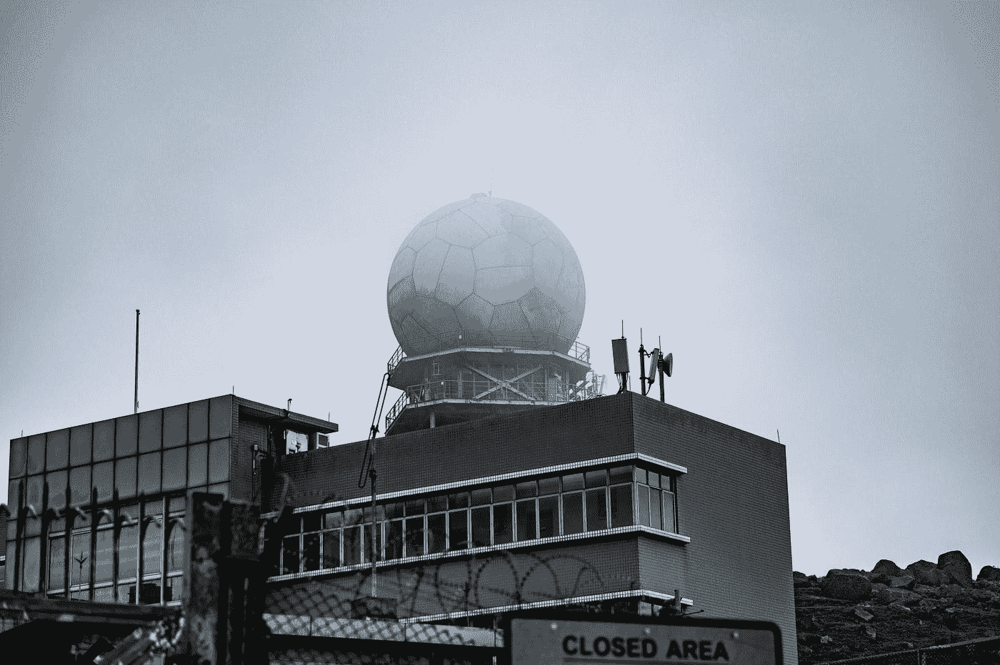

照片由 [Kelvin Yan](https://unsplash.com/@kelvinyan?utm_source=medium&utm_medium=referral) 在 [Unsplash](https://unsplash.com?utm_source=medium&utm_medium=referral) 上拍摄

风切变是速度和/或方向突然改变的风。**我在之前的** [**帖子**](https://medium.com/@genomexyz/what-we-currently-know-about-low-level-wind-shear-ecbfbedf9cdd) 中已经讨论了很多关于风切变的内容。能够探测风切变的众多工具之一是多普勒雷达。多普勒雷达利用多普勒效应来计算周围的风。但是**我们将得到的只是一个径向速度(标量，远离将导致< 0 值，而另一方面对于靠近的风将具有> 0 速度)，而不是作为笛卡尔矢量的风**(南北、东西和上下分量)。通常的风切变公式是矢量运算。那么我们如何使用雷达来探测或计算风切变呢？我们将在这里讨论它。我们将使用众多风切变雷达产品之一，`HSHEAR`。

## `**HSHEAR**` **产品**

遗憾的是我们无法获得实际的风矢量，但我们仍然可以通过径向速度监测风的变化来检测风切变。风切变的本质是变化，记住。当我们说“风的变化”时，我们指的是空间的变化。

在数学中，如何表达空间的变化？它是

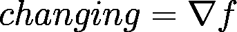

或者“状态”的梯度(在每一维度)。我们所说的水平剪切(HSHEAR)乘积的量纲当然是水平量纲(南北和东西)，而“状态”是径向速度(`Vr`)，所以方程变成

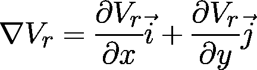

现在我们得到了每个维度的变化。**我们想知道的是变化的幅度或者说风的变化有多大。很简单，就是向量的长度。**

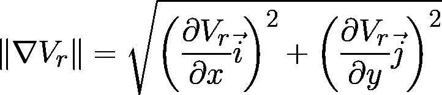

单位向量可以被抵消，因为我们平方了它。所以更简单的形式是

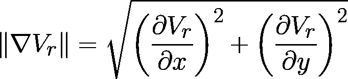

由此我们得到了许多风切变雷达产品的公式`HSHEAR`，1。

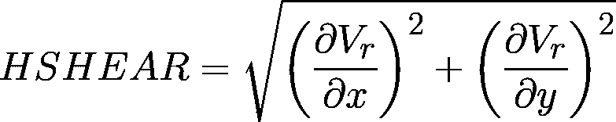

## 数值解

基本上，我们都知道，计算机甚至不能解决最基本的微分方程。所以我们必须把我们的`HSHEAR`公式转换成数字形式。**最简单的方法是使用有限差分**。有 3 种有限差分:

**前进差**

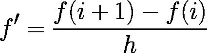

**向后差异**

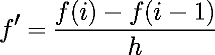

**中枢差异**

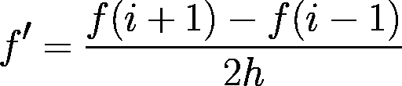

其中`i`是维度中`f`(状态)的指标数据，`h`是维度的分辨率。想象我们有网格形式的`f`。

**我们会选择什么？**当然是误差最小的公式。而且是**中央差！**为什么？所以基本上，你可以从泰勒级数得到所有的有限差分，截断误差最小的是中心差分。证明？就当练习自己试试吧。我不会在这里详细说明，因为会有相当多的方程弹出。

让我们用中心差分代替之前`HSHEAR`公式中的所有微分方程。

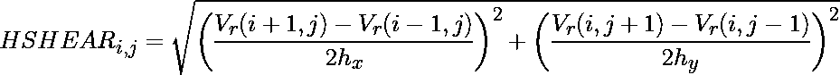

这里`i`和`j`分别是 x 和 y 维度上的索引。`hx`和`hy`是`x`(东西)和`y`(南北)维度的分辨率。

## 源代码

**事实上，如果你不在乎这是如何运作的，你可以跳过所有的解释，只看这一部分。是的，最重要的部分，给我看看代码！基于我们的数值解，这里是代码**

关于示例数据，您可以在这里下载[。](https://drive.google.com/file/d/1cBePy9wQ5CY2K6BzEt4a8eiZGQLv1DkX/view?usp=sharing)

上面这个脚本的结果会是这样的。

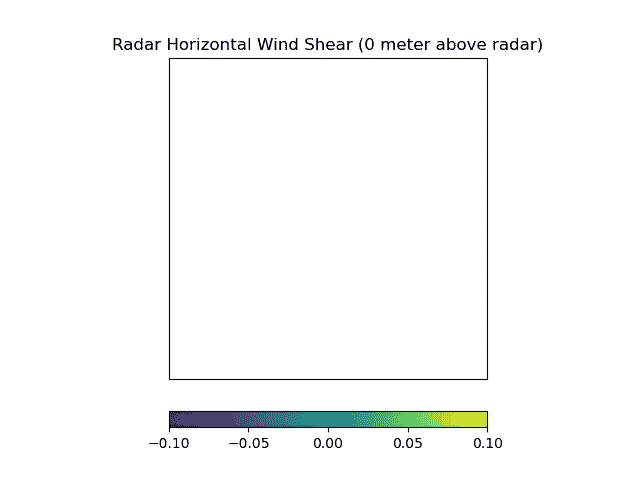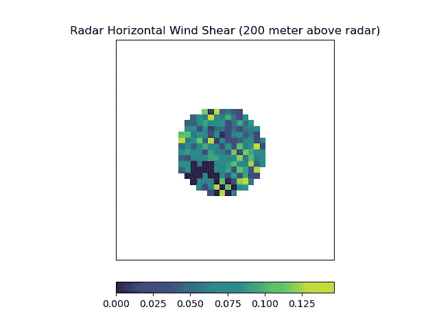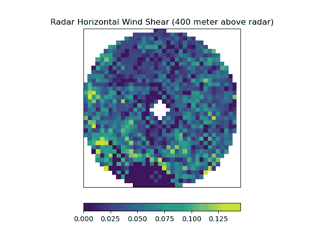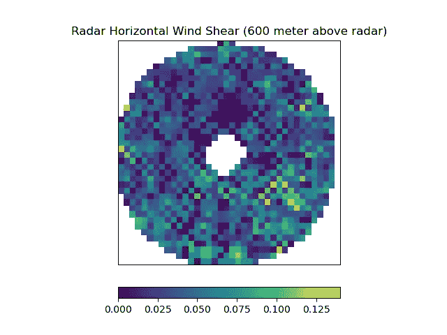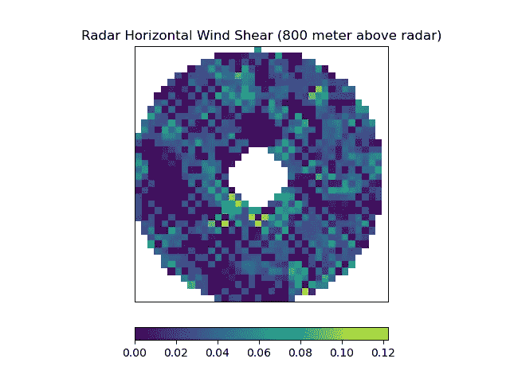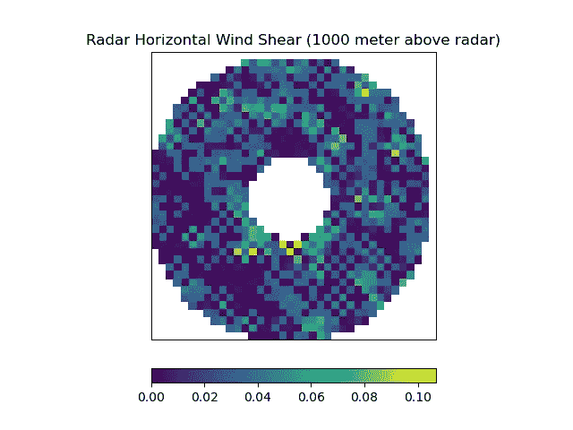

在上面的图中，通常没有风切变发生。你可以看到这个情节从无到有，逐渐变成一个点，然后看起来像一个甜甜圈。这是雷达扫描方案的效果。这就是我们在雷达数据中所说的“沉默锥”。我想(如果我有心情的话)我们会讨论天气雷达是如何工作的。就目前而言，这就足够了。

所有关于雷达的代码和资料，包括我们以前的代码和数据，都可以在我的 GitHub 知识库[这里](https://github.com/genomexyz/radar-stuff/tree/master)访问。再见！