# 使用 CNN 和类激活图从胸部 X 射线扫描检测新冠肺炎存在的尝试

> 原文：<https://towardsdatascience.com/detection-of-covid-19-presence-from-chest-x-ray-scans-using-cnn-class-activation-maps-c1ab0d7c294b?source=collection_archive---------12----------------------->

***作者:Souradip Chakraborty***

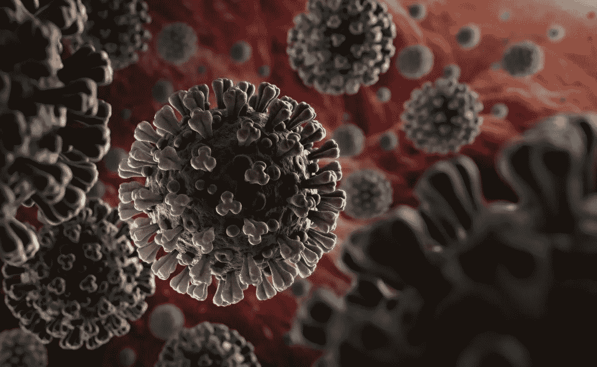

**图 1:冠状病毒病 2019，** [**来源**](https://images.app.goo.gl/UAqdgDz7mQ5o7poa6)

**冠状病毒病 2019** ( **新冠肺炎**)是由[严重急性呼吸综合征冠状病毒 2](https://en.wikipedia.org/wiki/Severe_acute_respiratory_syndrome_coronavirus_2) 引起的高度传染性疾病。这种疾病于 2019 年 12 月首次起源于中国武汉，自那以来，它已经在全球范围内传播，影响了超过 200 个国家。影响如此之大，以至于 T21 世界卫生组织(世卫组织)宣布正在进行的新冠肺炎疫情为国际关注的突发公共卫生事件

截至 2020 年 4 月 1 日的*日，全球超过 *200* 个国家共有 *873，767* 例确诊病例，其中 *645，708* 例活跃病例， **43，288** 例死亡病例(来源: [**维基百科**](https://en.wikipedia.org/wiki/2019%E2%80%9320_coronavirus_pandemic_by_country_and_territory) )。*

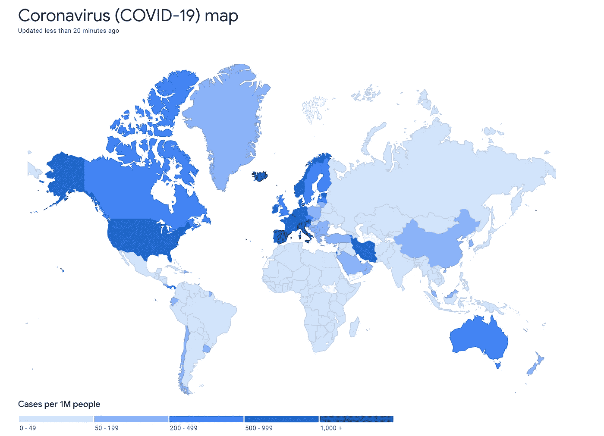

**图 2:冠状病毒(新冠肺炎)地图。** [**来源**](https://google.com/covid19-map/?hl=en)

各国政府正在努力关闭边境，实施接触者追踪，识别和接纳受影响者，隔离可能的病例，但在大多数国家，受病毒影响的人数呈指数增长，不幸的是，预计在大量临床试验后开发和应用药物/疫苗之前，这一数字还会增加。

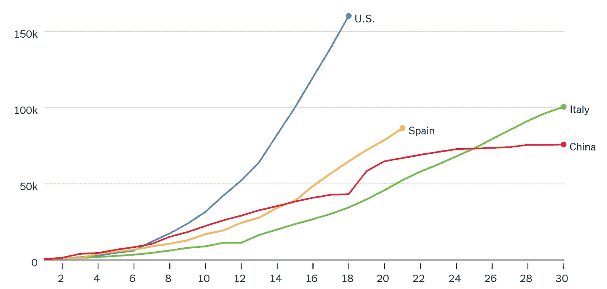

**图 3a:冠状病毒在几个国家的传播速度。** [**来源**](https://www.nytimes.com/2020/03/31/opinion/coronavirus-cases-united-states.html)

虽然研究表明，社会距离可以显著减少传播和平坦的曲线，如图 3a 所示，但这是可持续的吗？好吧，我把答案留给你们大家。

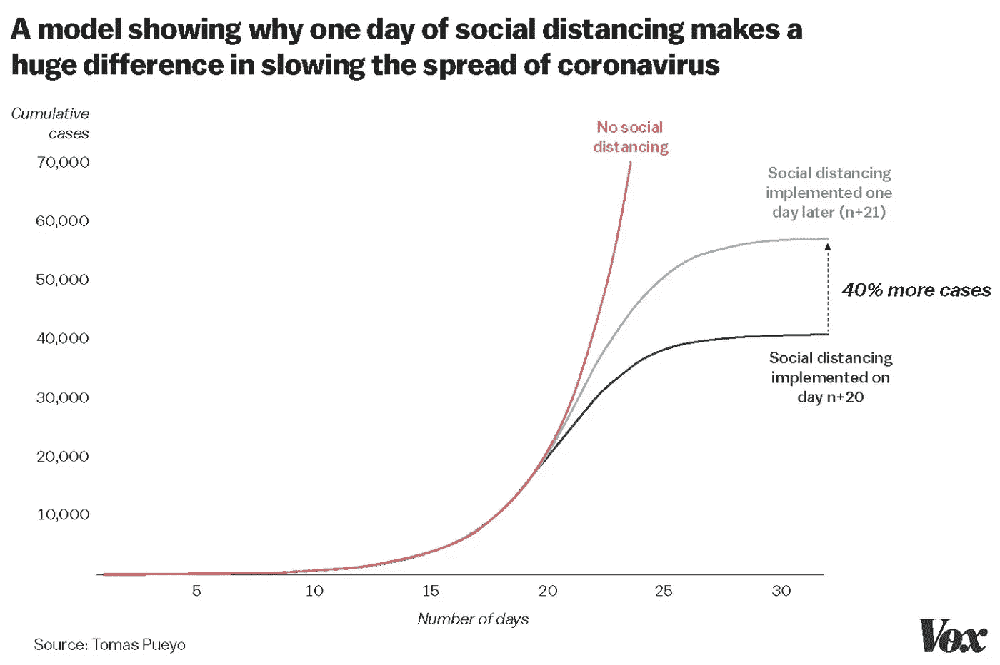

图 3b:社会距离对冠状病毒传播的影响。 [**来源**](https://www.vox.com/2020/3/15/21180342/coronavirus-covid-19-us-social-distancing)

因此，在这种特殊的情况下，需要做的一件主要事情是*多重测试*，并且大多数国家已经开始这样做，这样才能了解真实情况并做出适当的决定。

但我们可以理解，这些测试非常关键，应该绝对精确地进行，这肯定需要时间。*这可能非常危险，因为如果被感染的人没有及时被隔离，他们会感染其他人，这可能导致指数增长，如图 3b* 。特别是在像印度这样人口密度极高的国家，这可能是造成灾难的原因。

标准的**新冠肺炎**测试被称为 ***PCR(聚合酶链式反应)*** 测试，用于寻找特定感染的抗体的存在。但是这个测试有一些问题。 ***病原实验室检测*** 是诊断的金标准，但费时且假阴性结果显著，如本文 [***论文***](https://www.medrxiv.org/content/10.1101/2020.02.14.20023028v4) 所述。

此外，*的 ***大规模实施*** 新冠肺炎测试对于许多发展中的&不发达国家来说是负担不起的，因此，如果我们能够使用 ***人工智能&机器学习*** *并利用历史数据**来进行一些并行的诊断/测试程序，将会非常有帮助。这也有助于在过程中选择主要测试的项目。**

**迫切需要快速准确的诊断方法来对抗这种疾病。在最近由*王帅等人发表的论文“ [***中，一种深度学习算法使用 CT 图像来筛选冠状病毒疾病(新冠肺炎)***](https://www.medrxiv.org/content/10.1101/2020.02.14.20023028v4) ”。al* 他们已经使用*深度学习*从*计算机断层扫描*(图像)中提取新冠肺炎的图形特征，以便在病原测试之前提供临床诊断，从而为疾病控制节省关键时间。**

*这项研究利用初始卷积神经网络(CNN)对**1119 次 CT 扫描**进行迁移学习。模型的内部和外部验证精度分别记录在 **89.5%** 和 **79.3%** 。*

*在我的实验中，我进行了类似的分析，但是是在胸部 X 射线图像上，主要原因是对人们来说，获得 CXRs(T21)比获得 CT 扫描更容易，特别是在农村和偏远地区。还会有更多的潜在数据可用。*

*现在来看看我用过的数据集。于是，**[**约瑟夫·保罗·寇恩**](https://josephpcohen.com/w/) ( [*蒙特娄大学博士后*](https://josephpcohen.com/w/) )，最近开源了一个[](https://github.com/ieee8023/covid-chestxray-dataset)**数据库，里面有患有 ***【新冠肺炎】*** 疾病患者的胸部 x 光照片。所使用的数据集是一个开源数据集，包括来自公开研究的 ***新冠肺炎*** 图像，以及不同肺炎致病疾病(如 SARS、链球菌和肺囊虫)的肺部图像。*****

*****因此，数据集由 ***新冠肺炎 X 射线*** 扫描图像以及进行扫描时的角度组成。原来最常用的视图是 ***后前视图*** 并且我考虑了**新冠肺炎 PA** 视图 ***X 射线*** 扫描用于我的分析。*****

*****现在，我还使用了 [**Kaggle 的胸部 x 光**](https://www.kaggle.com/paultimothymooney/chest-xray-pneumonia) 竞赛数据集来提取健康患者和肺炎患者的 x 光，并对每个类别的 100 张图像进行了采样，以与**新冠肺炎**的可用图像进行平衡。(*不过我会在这部分下功夫，改进方法*)。*****

## *******从 X 射线中检测新冠肺炎存在的卷积神经网络方法:*******

*****让我们看一下数据集的类级分布。*****

*****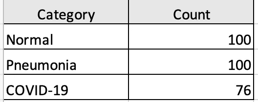*****

*******图 4:数据集的分类分布*******

*****所以，在我的方法中，我在三个分类问题上运行了卷积神经网络*****

1.  *******对正常与新冠肺炎病例进行分类。【2 类问题】*******
2.  *******肺炎 vs 新冠肺炎病例分类。【2 类问题】*******
3.  *******分类正常 vs 新冠肺炎 vs 肺炎病例。【3 类问题】*******

> *****我在一些分析中看到，人们将正常和肺炎病例结合在一起，我认为这不合适，因为模型将试图忽略这两个类别之间的组间差异，因此获得的准确性将不是真正的衡量标准。*****

*****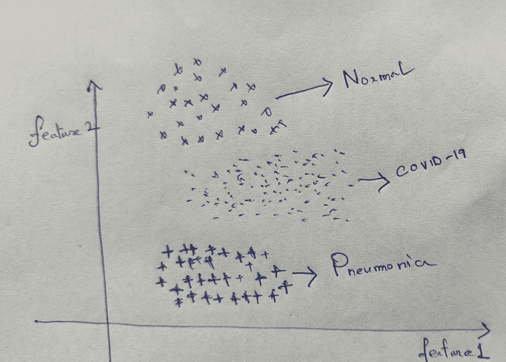*****

*******图 5:将两个不同的类别合并为一个类别可能会产生误导。** [**来源**](https://arxiv.org/pdf/1610.02391.pdf)*****

> *****所以，这是我上述假设的一个简单说明(只是为了解释)。假设“特征 1”和“特征 2”代表潜在空间，在潜在空间中，CNN 将图像投射到潜在空间中，并且属于三个类别中的每一个的图像已经在图像中被标记。*****
> 
> *******可以看出，它们目前是线性可分的，但如果我们将“正常”和“肺炎”这两个类别合并为一个类别，则可分性消失，结果可能会产生误导。因此，如果我们要合并类，就需要进行某些验证。*******
> 
> *****虽然有人可能会说投影会解决这个问题，但这并不成立，因为我们使用的是迁移学习。*****

*****反正在我的分析中，重点是既要减少**的假阳性。让我们来分析一下。我已经使用转移学习与 **VGG-16 模型**和微调最后几层。*******

```
*******vgg_pretrained_model = VGG16(weights="imagenet", 
                             include_top= False,
                             input_tensor=Input(shape=(224, 224,3)))new_model = vgg_pretrained_model.output
new_model = AveragePooling2D(pool_size=(4, 4))(new_model)
new_model = Flatten(name="flatten")(new_model)
new_model = Dense(64, activation="relu")(new_model)
new_model = Dropout(0.4)(new_model)
new_model = Dense(2, activation="softmax")(new_model)
model = Model(inputs=vgg_pretrained_model.input, outputs=new_model)*******
```

*******我们模型的最终参数如下所示。该模型已经使用 ***Kaggle GPU 进行了训练。**********

```
******Total params: 14,747,650
Trainable params: 2,392,770
Non-trainable params: 12,354,880******
```

********案例 1:正常 vs 新冠肺炎分类结果********

******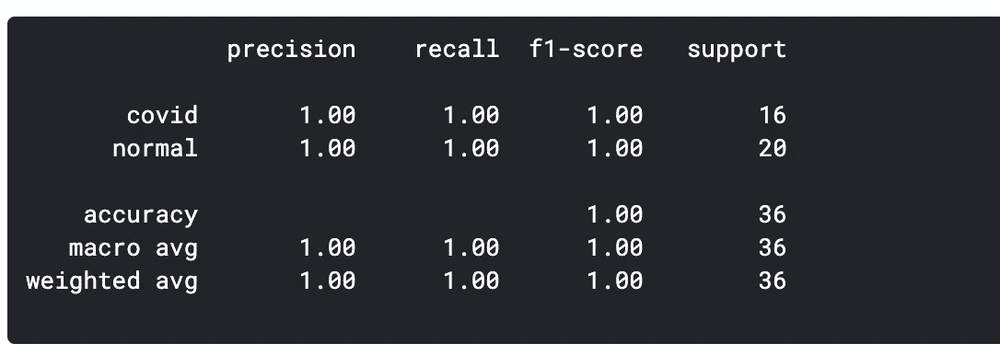************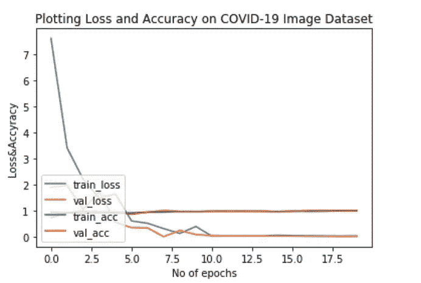******

********图 6:新冠肺炎与正常模型的分类报告********

******可以清楚地看到，该模型几乎可以以 100%的准确率和召回率区分这两种情况。现在，为了有更多的理解，我使用了基于梯度的类激活图的概念，以便找到图像中最重要的部分，这有助于模型进行如此精确的分类。******

******现在要了解更多关于***【GRAD-CAM】***如何工作，请参考 [***论文***](https://arxiv.org/pdf/1610.02391.pdf) 。我可能会在我未来的博客中详细介绍它们。******

******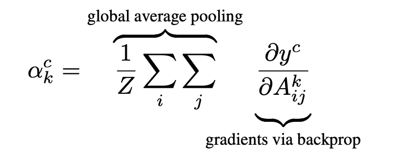******

********图 7:基于梯度的类激活图********

******绘制 Grad-CAM 热图的代码如下所示。为了看得更清楚，我做了一些修改。******

```
****def get_class_activation_map(ind,path,files) :

    img_path =  path + files[ind]
    img = cv2.imread(img_path)
    img = cv2.cvtColor(img, cv2.COLOR_BGR2RGB)
    img = cv2.resize(img, (224, 224))
    img = np.expand_dims(img,axis=0)

    predict = model.predict(img)
    target_class = np.argmax(predict[0])
    last_conv = model.get_layer('block5_conv3')
    grads =K.gradients(model.output[:,target_class],last_conv.output)[0]
    pooled_grads = K.mean(grads,axis=(0,1,2))
    iterate = K.function([model.input],[pooled_grads,last_conv.output[0]])
    pooled_grads_value,conv_layer_output = iterate([img])

    for i in range(512):
        conv_layer_output[:,:,i] *= pooled_grads_value[i]

    heatmap = np.mean(conv_layer_output,axis=-1)

    for x in range(heatmap.shape[0]):
        for y in range(heatmap.shape[1]):
            heatmap[x,y] = np.max(heatmap[x,y],0)
    heatmap = np.maximum(heatmap,0)
    heatmap /= np.max(heatmap)
    plt.imshow(heatmap)img_gray = cv2.cvtColor(img[0], cv2.COLOR_BGR2GRAY)
    upsample = cv2.resize(heatmap, (224,224))

    output_path_gradcam = '/kaggle/working/' + files[ind] + 'gradcam.jpeg'
    plt.imsave(output_path_gradcam,upsample * img_gray)****
```

********正常患者的分类激活图输出:********

******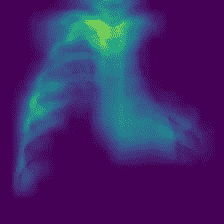************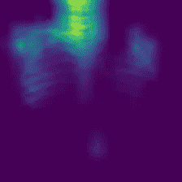************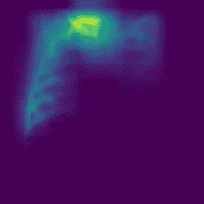

**图 8:正常患者的 Grad-CAM 热图******** 

******因此，我们可以看到，该模型更侧重于突出显示的部分，以识别和分类他们为正常/健康的患者。******

********新冠肺炎患者的分类激活图输出:********

******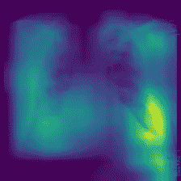************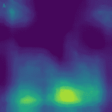

图 9:新冠肺炎患者的 Grad-CAM 热图****** 

******同样，突出显示的部分朝向图像的右端部分，这表明该部分可能是确定患者是否患有*新冠肺炎的重要特征，或者可能是 ***新冠肺炎已经影响了*** 部分中的患者。这可以通过临床记录进行验证。*******

********病例 2:肺炎 vs 新冠肺炎分类结果********

******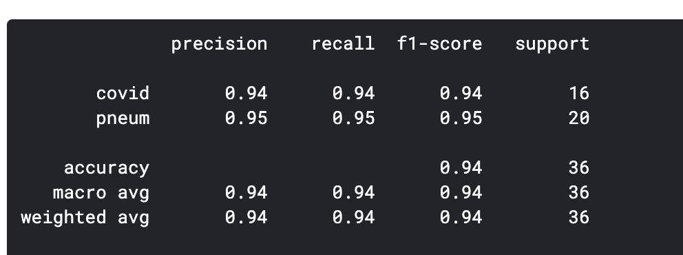************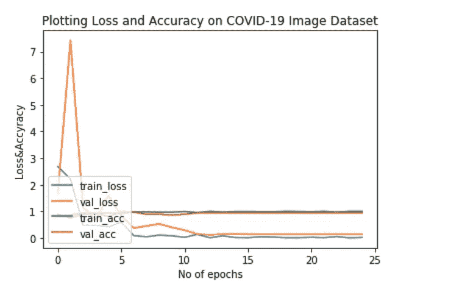******

********图 10:新冠肺炎 vs 肺炎模型分类报告********

********肺炎患者的分类激活图输出:********

******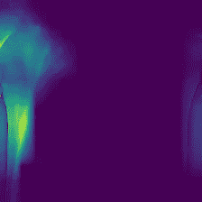************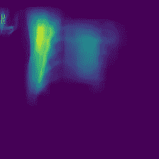************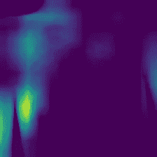

**图 11:肺炎患者 Grad-CAM 热图******** 

********病例 3:肺炎 vs 新冠肺炎 vs 正常分类结果********

******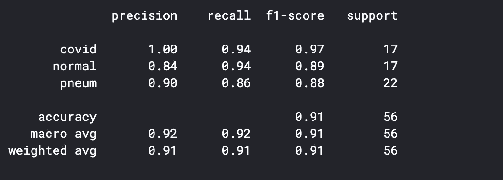************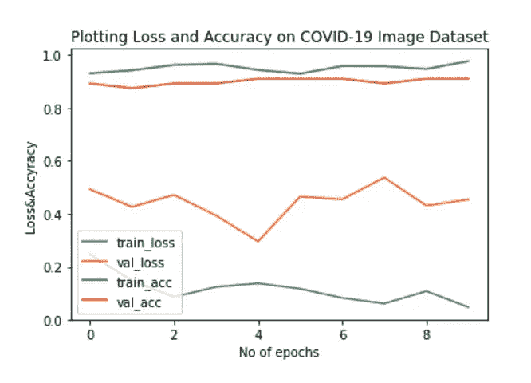******

********图 12:新冠肺炎 vs 肺炎 vs 正常模型的分类报告********

******在这三种情况下，即使数据集很小，模型的表现也非常好。此外，建立三个不同模型的目的也是为了检查**模型与 ***【新冠肺炎】*** 病例检测的一致性**。在这三种情况下，测试数据中的*案例的准确率和召回率都明显较高。*******

> *********话虽如此，但这仅仅是对一些图像进行的实验，并未经过外部卫生组织或医生的验证/检查。还没有基于这种方法的临床研究来验证它。该模型已被用作概念验证，不能从该结果中得出任何结论/推断。** *******

*****但是，这种方法有巨大的潜力，可以成为一种优秀的方法来拥有高效、快速的 ***诊断系统*** ，这正是当前所需要的。以下列出了主要优势:*****

******优点**:****

****优点已经从这个 [**来源**](https://github.com/ieee8023/covid-chestxray-dataset) 中提到了。****

1.  *****运送测试或样本是 PCR 测试的缺点之一，而 x 光机可以解决这个问题。*****
2.  *****如果放射科医生&医生受到影响，AI 可以生成初步诊断，以了解患者是否受到影响。*****

# ******结论**:****

*******因此，作为总结，我想重申一下我自己，分析是在有限的数据集上进行的，结果是初步的，不能从中推断出任何结论。该方法尚未进行临床试验/医学验证。*******

****我计划用更多的 X 射线扫描来增加我的模型的稳健性，这样模型就可以推广了。此外，与健康人群的数量相比，COVID 病例的数量将会更少(尽管是指数增长),因此将会出现阶层失衡。我想改进我的采样技术，建立一个可以处理类别不平衡的模型，为此我需要更多的数据。****

****此外，当前的方法是基于微调 I ***mageNet 权重*** ，但是如果我们能够专门为此目的建立一个模型，结果将更加可信和可推广。****

****因此，如果您有库可接受的新冠肺炎患者的 X 射线扫描图像， [***请将***](https://josephpcohen.com/w/) 贡献给 [***库***](https://github.com/ieee8023/covid-chestxray-dataset) ，因为它将在这些关键时刻有所帮助。****

****一个好消息是**麻省理工**已经发布了一个 [***数据库***](https://www.technologyreview.com/s/615399/coronavirus-neural-network-can-help-spot-covid-19-in-chest-x-ray-pneumonia/) 包含了 ***新冠肺炎*** 受影响患者的 x 光照片。因此，作为下一步，我将尝试将这些数据整合到我的建模方法中，并检查结果。****

****此外，我将根据**梯度**值对 ***类激活图输出*** 进行处理，并使用临床记录对其进行验证。****

*******注意——我不是来自医学领域/生物学背景，所做的实验是为了证明概念。*******

*******编者注:*** [*走向数据科学*](http://towardsdatascience.com/) *是一份以数据科学和机器学习研究为主的中型刊物。我们不是健康专家或流行病学家，本文的观点不应被解释为专业建议。想了解更多关于疫情冠状病毒的信息，可以点击* [*这里*](https://www.who.int/emergencies/diseases/novel-coronavirus-2019/situation-reports) *。*****

****保持安全和快乐阅读:)****

****[](https://www.linkedin.com/in/souradip-chakraborty/) [## Souradip Chakraborty -数据科学家-沃尔玛印度实验室| LinkedIn

### 我是一名有抱负的统计学家和机器学习科学家。我探索机器学习、深度学习和…

www.linkedin.com](https://www.linkedin.com/in/souradip-chakraborty/) [](https://developers.google.com/community/experts/directory/profile/profile-souradip_chakraborty) [## 专家|谷歌开发者

### 机器学习我是 Souradip Chakraborty，目前在沃尔玛实验室担任统计分析师(研究)

developers.google.com](https://developers.google.com/community/experts/directory/profile/profile-souradip_chakraborty) 

## 参考资料:

1.  [https://github.com/ieee8023/covid-chestxray-dataset](https://github.com/ieee8023/covid-chestxray-dataset)
2.  由*艾尔顿·圣华金撰写的类似的精彩博客:*[https://towardsdatascience . com/using-deep-learning-to-detect-ncov-19-from-x-ray-images-1a 89701 D1 ACD](/using-deep-learning-to-detect-ncov-19-from-x-ray-images-1a89701d1acd)
3.  [https://github . com/harsh Casper/Brihaspati/blob/master/新冠肺炎/COVID19-XRay.ipynb](https://github.com/HarshCasper/Brihaspati/blob/master/COVID-19/COVID19-XRay.ipynb)
4.  论文“Grad-CAM:通过基于梯度的定位从深度网络进行视觉解释”。
5.  [https://www . ka ggle . com/paultimothymooney/胸部 x 光-肺炎](https://www.kaggle.com/paultimothymooney/chest-xray-pneumonia)
6.  【https://www.kaggle.com/michtyson/covid-19-xray-dl#1\. -数据准备****