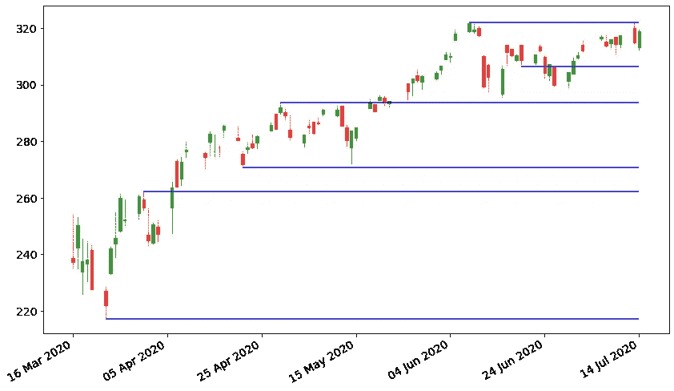
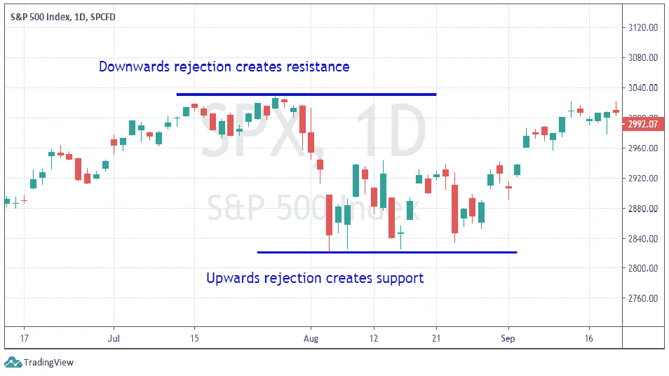
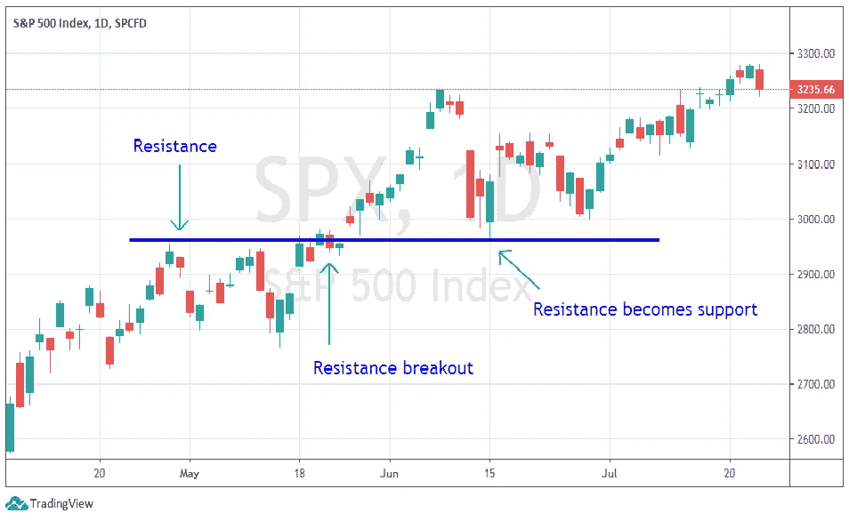
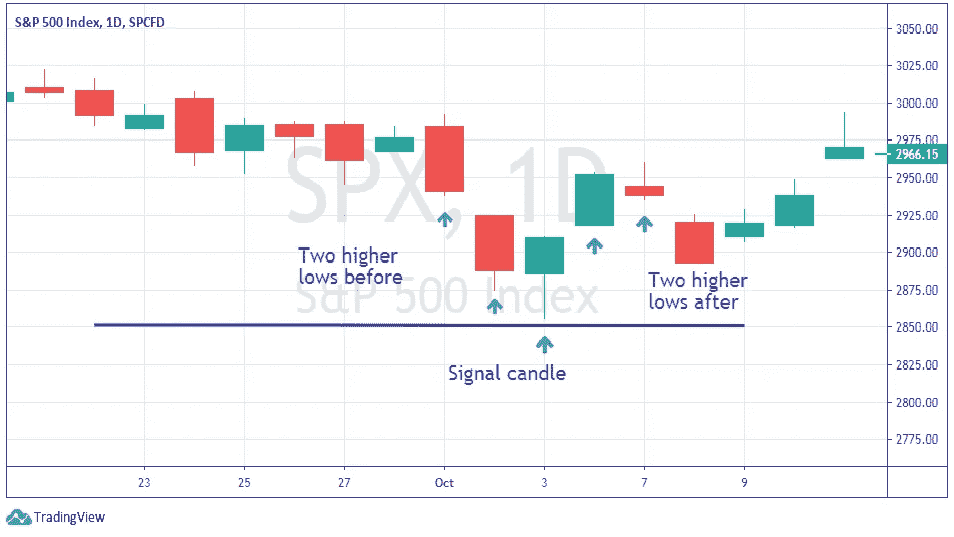
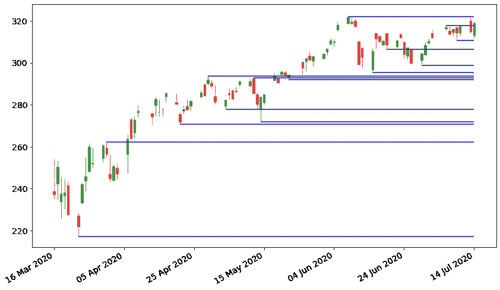

# Python 中价格支持和阻力位的检测

> 原文：<https://towardsdatascience.com/detection-of-price-support-and-resistance-levels-in-python-baedc44c34c9?source=collection_archive---------0----------------------->

## Python 中寻找价格支撑位和阻力位的算法



算法交易是交易和统计的一个迷人领域，量化交易者经常希望自动化的最有用的交易技术之一是价格行为，这是在不使用衍生指标如振荡器或移动平均线的情况下对价格运动的分析。

在这篇文章中，我将介绍一种自动检测价格行为的两个重要工具的算法，这两个工具是支撑和阻力。

# 什么是支撑和阻力？

支撑和阻力通常被称为“关键水平”。它们是股价反转的价格水平。如果价格上涨，然后反转其向下移动的趋势，它所达到的最高点被称为*阻力*。如果价格已经下降，然后开始上升，最低价格值被称为*支持*。

这些价格水平确定了供给和需求区域，交易者在这些区域增加了交易量，并表现出一定的兴趣。这就是为什么，一旦价格接近关键水平，交易者必须睁大眼睛，看看会发生什么。



支撑和阻力示例

关键能级非常重要，因为在这些反转能级附近可能会发生许多有趣的事件。例如，市场可以再次反弹，让均值回归策略获胜，或者它可以突破关键水平，这对突破交易者来说更好。

有一个经验法则是，一个关键水平被测试的次数越多(即市场在它附近反弹了很多次)，这个水平的重要性就越高。

另一个经验法则是，一旦阻力位被突破，它会自动成为支撑位。反之亦然，一个被打破的支撑位变成了阻力位。



反抗变成了支持

# 级别或区域？

在这篇文章中，我将关键水平称为价格水平，但有一些交易者说关键水平是区域，而不是水平。发生这种情况是因为波动性让一切都变得更嘈杂，所以供需区从来没有那么清晰。这就是为什么，在现实生活的交易中，你应该总是考虑围绕关键水平的某种包络线，大致与波动性一样宽(例如，平均真实范围，标准差)。为了简单起见，在本文中，我将把关键价格水平视为固定价格水平，而不是更广泛的区域。

# 如何识别关键级别

关键水平是拒绝点，所以我们必须检查市场是否达到了一定的水平，然后拒绝向相反的方向移动。

一个好主意是使用蜡烛图，检查每根蜡烛的高低价格。如果一根蜡烛线的低点比前一根低，下一根蜡烛线的低点，这是一个支撑。这种特殊的价格行为模式被称为*摆动*。不幸的是，由于市场波动和噪音，这种模式经常显示出一些缺陷，这就是为什么我们可以使用一种更好的模式，称为*分形*。

# 分形

分形是由 5 根蜡烛组成的烛台图案。第三根蜡烛的价格最低，前面的蜡烛价格越来越低，后面的蜡烛价格越来越低。根据这种模式，第三根蜡烛线的低点是支撑位。同样的概念也适用于阻力位，第三根蜡烛线是五根蜡烛线中最高的。



使用分形的支持识别

分形非常有用，因为它们消除了一些由摆动显示的噪声，并以更高的精度识别关键水平。这就是为什么我要在我的算法中使用它们。

# Python 中的自动检测

让我们看一个使用标准普尔 500 数据的 Python 示例。我的笔记本可以在 GitHub 上找到这里:[https://GitHub . com/gianlucamalato/machine learning/blob/master/Support _ and _ resistance . ipynb](https://github.com/gianlucamalato/machinelearning/blob/master/Support_and_resistance.ipynb)

对于所有的烛台图表代码，我使用了一些在这里找到的代码:[https://saralgyaan . com/posts/python-烛台图表-matplotlib-tutorial-chapter-11/](https://saralgyaan.com/posts/python-candlestick-chart-matplotlib-tutorial-chapter-11/)

我们先安装 *yfinance* 和 *mpl_finance* 库。

```
!pip install yfinance
!pip install mpl_finance
```

让我们导入一些有用的库并初始化绘图环境。

```
import pandas as pd
import numpy as np
import yfinance
from mpl_finance import candlestick_ohlc
import matplotlib.dates as mpl_dates
import matplotlib.pyplot as pltplt.rcParams['figure.figsize'] = [12, 7]
plt.rc('font', size=14)
```

现在我们可以下载标准普尔 500 日报的数据。

```
name = 'SPY'
ticker = yfinance.Ticker(name)
df = ticker.history(interval="1d",start="2020-03-15", end="2020-07-15")df['Date'] = pd.to_datetime(df.index)
df['Date'] = df['Date'].apply(mpl_dates.date2num)
df = df.loc[:,['Date', 'Open', 'High', 'Low', 'Close']]
```

让我们不要创建两个识别 4 蜡烛分形的函数。

```
def isSupport(df,i):
  support = df['Low'][i] < df['Low'][i-1]  and df['Low'][i] < df['Low'][i+1] and df['Low'][i+1] < df['Low'][i+2] and df['Low'][i-1] < df['Low'][i-2] return supportdef isResistance(df,i):
  resistance = df['High'][i] > df['High'][i-1]  and df['High'][i] > df['High'][i+1] and df['High'][i+1] > df['High'][i+2] and df['High'][i-1] > df['High'][i-2] return resistance
```

最后，让我们创建一个包含我们找到的级别的列表。每个级别都是一个元组，其第一个元素是信号蜡烛线的指数，第二个元素是价格值。

```
levels = []
for i in range(2,df.shape[0]-2):
  if isSupport(df,i):
    levels.append((i,df['Low'][i]))
  elif isResistance(df,i):
    levels.append((i,df['High'][i]))
```

我们现在可以定义一个将价格和关键水平绘制在一起的函数。

```
def plot_all():
  fig, ax = plt.subplots() candlestick_ohlc(ax,df.values,width=0.6, \
                   colorup='green', colordown='red', alpha=0.8) date_format = mpl_dates.DateFormatter('%d %b %Y')
  ax.xaxis.set_major_formatter(date_format)
  fig.autofmt_xdate() fig.tight_layout() for level in levels:
    plt.hlines(level[1],xmin=df['Date'][level[0]],\
               xmax=max(df['Date']),colors='blue')
  fig.show()
```

最后，我们可以绘制结果。



如您所见，我们已经能够检测出主要的剔除水平，但仍有一些噪声。有些级别高于其他级别，但本质上是同一级别。

我们可以通过修改检测关键电平的函数来清除这种噪声。如果一个级别接近另一个级别，它将被丢弃。那么，我们必须决定“近”是什么意思。如果一个级别与另一个级别之间的距离小于图表中的平均蜡烛线大小(即蜡烛线中最高价和最低价之间的平均差值)，我们可以说这个级别接近另一个级别。这将给我们一个波动性的粗略估计。

```
s =  np.mean(df['High'] - df['Low'])
```

让我们定义一个函数，给定一个价格值，如果它接近某个先前发现的关键级别，则返回 False。

```
def isFarFromLevel(l):
   return np.sum([abs(l-x) < s  for x in levels]) == 0
```

现在我们可以使用这个函数作为过滤器来扫描价格历史，寻找关键水平。

```
levels = []
for i in range(2,df.shape[0]-2):
  if isSupport(df,i):
    l = df['Low'][i] if isFarFromLevel(l):
      levels.append((i,l)) elif isResistance(df,i):
    l = df['High'][i] if isFarFromLevel(l):
      levels.append((i,l))
```

最后，我们可以再次策划一切。


现在级别更清楚了，它们彼此不重叠，我们可以很容易地看到，有时价格在每个级别上不止一次地跳跃。

# 结论

自动化价格水平对定量交易者非常有用，可以消除一些市场噪音，使图表更加清晰。关键水平可用于均值回归策略(即当价格从支撑位反弹时买入)或突破策略(即当价格突破阻力位时买入)。

***注来自《走向数据科学》的编辑:*** *虽然我们允许独立作者根据我们的* [*规则和指导方针*](/questions-96667b06af5) *发表文章，但我们不认可每个作者的贡献。你不应该在没有寻求专业建议的情况下依赖一个作者的作品。详见我们的* [*读者术语*](/readers-terms-b5d780a700a4) *。*